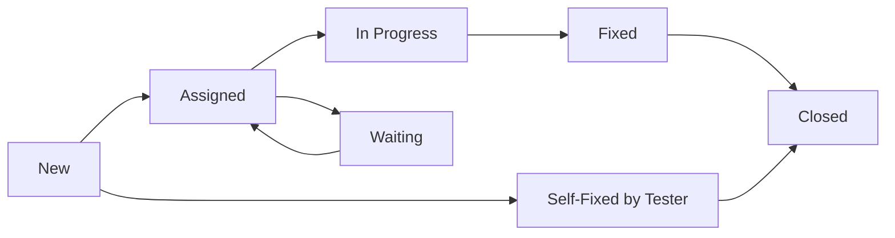
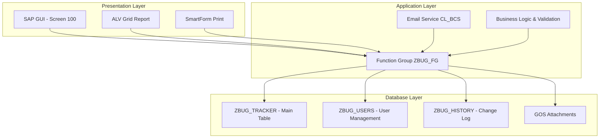

# SAP Bug Tracking Management System

> **Custom Add-on for SAP ERP | Dự án Đồ Án ABAP**

Một hệ thống quản lý lỗi tập trung (Centralized Bug Tracking System) được xây dựng hoàn toàn bằng ABAP trên nền tảng SAP ERP. Dự án mô phỏng quy trình quản lý lỗi nội bộ trong môi trường doanh nghiệp, không sử dụng công cụ bên ngoài như Jira hay Redmine.

**🎯 Mục tiêu dự án:**

- Xây dựng giải pháp quản lý lỗi tập trung trong SAP
- Áp dụng kiến thức ABAP vào bài toán thực tế
- Hiểu rõ quy trình xử lý lỗi trong môi trường doanh nghiệp
- Thực hành phát triển ứng dụng theo chuẩn SAP

---

## 📖 Mục Lục

- [Tổng quan dự án](#-tổng-quan-dự-án)
- [Tính năng chính](#-tính-năng-chính)
- [Vai trò người dùng](#-vai-trò-người-dùng)
- [Quy trình xử lý lỗi](#-quy-trình-xử-lý-lỗi)
- [Kiến trúc hệ thống](#-kiến-trúc-hệ-thống)
- [Kế hoạch triển khai](#-kế-hoạch-triển-khai)
- [Tài liệu tham khảo](#-tài-liệu-tham-khảo)

---

## 🚀 Tổng quan dự án

### Thông tin cơ bản

- **Loại dự án:** Custom SAP Development (Z-Solution)
- **Công nghệ:** ABAP, SAP GUI, ALV Grid, SmartForms, SAPconnect
- **Kiến trúc:** 3-Tier Architecture (Presentation/Application/Database)
- **Hệ thống:** SAP S40 (FU - Functional Unit), Instance 00, Client 324
- **Thời gian:** 8 tuần (01/02/2026 - 29/03/2026)
- **Go-live:** 29/03/2026 (Demo Day & Final Presentation)

### Đặc điểm nổi bật

- **On-Stack Solution:** Chạy hoàn toàn trên SAP, không cần phần mềm bên thứ ba
- **Centralized Data:** Toàn bộ dữ liệu lưu trữ tập trung trong SAP Database
- **Role-based Access:** Phân quyền theo vai trò (Tester, Developer, Manager)
- **Automated Workflow:** Tự động gửi email, phân công lỗi, theo dõi trạng thái
- **Enterprise-grade:** Tuân thủ chuẩn SAP về bảo mật và hiệu suất

---

## 🌟 Tính năng chính

### 5 Chức năng cốt lõi

| STT   | Chức năng               | Mô tả                                                     | Công nghệ                                       |
| ----- | ----------------------- | --------------------------------------------------------- | ----------------------------------------------- |
| **1** | **Ghi nhận lỗi**        | Form nhập liệu với validation đầy đủ, tự động sinh Bug ID | T-code `ZBUG_CREATE`, Module Pool, Number Range |
| **2** | **Thông báo tự động**   | Gửi email alert cho Developer team ngay khi có lỗi mới    | SAPconnect (SMTP), Class `CL_BCS`               |
| **3** | **Báo cáo & Thống kê**  | Danh sách lỗi với filter, sort, export Excel, dashboard   | ALV Grid Display, SQL Aggregation               |
| **4** | **In ấn biên bản**      | Xuất PDF theo mẫu chuẩn với logo công ty và chữ ký        | SmartForms (`ZBUG_FORM`)                        |
| **5** | **Đính kèm bằng chứng** | Upload file Excel chứa screenshot, log, document          | GOS (Generic Object Services)                   |

### Tính năng mở rộng

- **Auto-assign:** Tự động phân công lỗi cho Developer dựa trên Module và Workload
- **User Management:** Quản lý tài khoản Tester, Developer, Manager
- **History Log:** Ghi nhận mọi thay đổi của bug (ai thay đổi, thay đổi gì, khi nào)
- **Role-based Permissions:** Phân quyền chi tiết theo vai trò người dùng
- **Dashboard Analytics:** Thống kê hiệu suất Tester/Developer, theo dõi KPI

---

## 👥 Vai trò người dùng

### 3 Nhóm người dùng chính

| Vai trò          | Quyền hạn                                | Chức năng chính                                                                                                                         |
| ---------------- | ---------------------------------------- | --------------------------------------------------------------------------------------------------------------------------------------- |
| **🧪 Tester**    | Tạo bug, tự sửa lỗi cấu hình, verify fix | • Ghi nhận bug từ User • Upload Report attachment • Tự xử lý lỗi cấu hình và đóng bug • Verify fix và upload Verify attachment |
| **👨‍💻 Developer** | Sửa lỗi code, upload bằng chứng fix      | • Nhận bug được phân công • Sửa lỗi liên quan đến code • Upload Fix attachment • Có thể từ chối và yêu cầu re-assign           |
| **👨‍💼 Manager**   | Quản lý toàn hệ thống, phân công bug     | • Phân công bug thủ công • Thiết lập auto-assign rules • Quản lý user accounts • Theo dõi hiệu suất và KPI                     |

---

## 🔄 Quy trình xử lý lỗi

### Vòng đời Bug (Bug Lifecycle)

**Trạng thái Bug:**

- **New (1):** Bug mới được tạo
- **Waiting (W):** Chờ Manager phân công (khi không có Dev rảnh)
- **Assigned (2):** Đã phân công cho Developer
- **In Progress (3):** Developer đang xử lý
- **Fixed (4):** Developer đã sửa xong, chờ verify
- **Closed (5):** Hoàn tất (đã verify hoặc tự sửa)

### Quy tắc nghiệp vụ

- **Auto-assign:** Hệ thống tự động phân công cho Dev ít bug nhất trong cùng Module
- **Self-fix:** Tester có thể tự sửa lỗi cấu hình và đóng bug
- **Re-assign:** Developer có thể từ chối và yêu cầu chuyển cho người khác
- **File Lock:** Sau khi đóng bug, không được xóa file đính kèm

---

## 🏗 Kiến trúc hệ thống

### 3-Tier Architecture

### Database Schema

**Bảng chính: ZBUG_TRACKER**

| Field      | Type   | Length | Key | Mô tả                            |
| ---------- | ------ | ------ | --- | -------------------------------- |
| MANDT      | CLNT   | 3      | ✓   | Client ID                        |
| BUG_ID     | CHAR   | 10     | ✓   | Auto-generated (BUG0000001)      |
| TITLE      | CHAR   | 100    |     | Tiêu đề lỗi (≥10 ký tự)          |
| DESC_TEXT  | STRING | -      |     | Mô tả chi tiết (không giới hạn)  |
| MODULE     | CHAR   | 20     |     | SAP Module (MM, SD, FI, ABAP...) |
| BUG_TYPE   | CHAR   | 1      |     | C=Code, F=Configuration          |
| PRIORITY   | CHAR   | 1      |     | H=High, M=Medium, L=Low          |
| STATUS     | CHAR   | 1      |     | 1/W/2/3/4/5                      |
| REPORTER   | CHAR   | 12     |     | Người báo lỗi                    |
| DEV_ID     | CHAR   | 12     |     | Developer được phân công         |
| CREATED_AT | DATS   | 8      |     | Ngày tạo                         |
| CLOSED_AT  | DATS   | 8      |     | Ngày đóng                        |

---

## 📅 Kế hoạch triển khai

### Timeline 8 tuần (01/02/2026 - 29/03/2026)

| Phase  | Thời gian | Nội dung            | Deliverables                                    |
| ------ | --------- | ------------------- | ----------------------------------------------- |
| **P1** | Tuần 1    | Setup & Thiết kế    | Package ZBUGTRACK, Database schema, Tech specs  |
| **P2** | Tuần 2-3  | Phát triển Core     | T-code ZBUG_CREATE, CRUD functions, Email setup |
| **P3** | Tuần 4-5  | Báo cáo & In ấn     | ALV report, SmartForm, Dashboard                |
| **P4** | Tuần 6    | Đóng gói & Tối ưu   | Code review, Performance tuning, Transport      |
| **P5** | Tuần 7-8  | Kiểm thử & Bàn giao | UAT, Bug fixes, User training                   |

**🎯 Go-live:** 29/03/2026 (Demo Day & Final Presentation)

---

## 📚 Tài liệu tham khảo

### 📋 Tài liệu kỹ thuật

| Tài liệu                  | Mô tả                                                    | Đường dẫn                                                                 |
| ------------------------- | -------------------------------------------------------- | ------------------------------------------------------------------------- |
| **🚀 Implementation Guide** | **HƯỚNG DẪN TRIỂN KHAI HOÀN CHỈNH** - Roadmap 8 tuần từ A-Z | [**IMPLEMENTATION_GUIDE.md**](documentation/IMPLEMENTATION_GUIDE.md) |
| **📄 Requirements**       | Phân tích yêu cầu nghiệp vụ chi tiết, 10 chức năng chính | [requirements.md](documentation/requirements/requirements.md)             |
| **🛠 Technical Proposal** | Thiết kế kỹ thuật, database schema, workflow             | [techical-proposal.md](documentation/requirements/techical-proposal.md)   |
| **🌍 SAP Overview**       | Kiến thức nền tảng về ERP, SAP, ABAP                     | [sap-overview.md](documentation/requirements/sap-overview.md)             |
| **📘 Developer Guide**    | Hướng dẫn setup môi trường và phát triển từng phase      | [developer-guide.md](documentation/guides/developer-guide.md)             |
| **📋 Extra Requirements** | Yêu cầu bổ sung về phân quyền, workflow, file đính kèm   | [extra-requirements.md](documentation/requirements/extra-requirements.md) |

### 📊 Báo cáo dự án

| Báo cáo                         | Nội dung                                 | Đường dẫn                                                          |
| ------------------------------- | ---------------------------------------- | ------------------------------------------------------------------ |
| **📈 Client Report (Jan 2026)** | Báo cáo kỹ thuật đầy đủ, kế hoạch 8 tuần | [client-report.md](reports/2026/01-jan/client-report.md)           |
| **🔍 Review Report (Feb 2026)** | Đánh giá kỹ thuật, phạm vi chức năng     | [review-report.md](reports/2026/02-feb/01-review/review-report.md) |
| **📝 Changelog**                | Lịch sử thay đổi và cập nhật dự án       | [CHANGELOG.md](./CHANGELOG.md)                                     |

### 🎯 Thông tin hệ thống

**SAP System Information:**

- **System ID:** S40 (FU - Functional Unit)
- **Client:** 324
- **Application Server:** S40Z, Instance 00
- **SAP Logon:** 770, Network: EBS_SAP
- **Package:** ZBUGTRACK, Transport Layer: ZBT1

**Development Accounts đã cấp:**

- **DEV-118** (Pass: Qwer123@): Quản lý lỗi
- **DEV-089** (Pass: @Anhtuoi123): Ghi nhận lỗi (SE11, SE38, SE80, SE93)
- **DEV-242** (Pass: 12345678): Email configuration (SCOT, SOST)
- **DEV-061** (Pass: @57Dt766): ALV Grid & SmartForms
- **DEV-237** (Pass: toiyeufpt): GOS attachments

---

## 🚀 Bắt đầu dự án

### Yêu cầu tiên quyết

1. ✅ SAP GUI 770 đã cài đặt
2. ✅ Kết nối SAP S40 đã cấu hình
3. ✅ Các account Development đã được cấp đủ quyền và Developer Key
4. ✅ Permissions đã được cấp đầy đủ

### Bước tiếp theo

1. 📖 Đọc [Developer Guide](documentation/guides/developer-guide.md) để setup môi trường
2. 📋 Tham khảo [Requirements](documentation/requirements/requirements.md) để hiểu chi tiết nghiệp vụ
3. 🛠 Bắt đầu Phase 1: Tạo Package và Database Schema
4. 📧 Liên hệ SAP Basis team để confirm SMTP configuration

---

## 📞 Liên hệ & Hỗ trợ

- **Project Manager:** [Thông tin liên hệ]
- **SAP Basis Team:** [Thông tin hệ thống]
- **Business Users:** [Stakeholders]

**📅 Lịch họp:** Weekly review mỗi thứ 6 hàng tuần  
**🎯 Demo Day:** 29/03/2026 - Final Presentation
