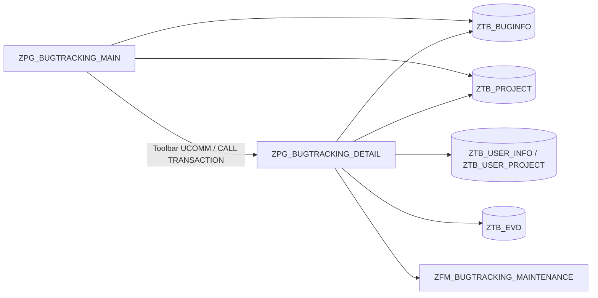

# ZPG_BUGTRACKING_MAIN & ZPG_BUGTRACKING_DETAIL

---

## 1. Tổng quan

### 1.1 Hai program và vai trò

| Program | Vai trò |
|---------|--------|
| `ZPG_BUGTRACKING_MAIN` | Entry “dashboard”: 2 ALV (bugs + projects), selection screen, toolbar; điều hướng tới màn hình chi tiết. |
| `ZPG_BUGTRACKING_DETAIL` | Module pool chi tiết: maintain `ZTB_BUGINFO` / `ZTB_PROJECT`, longtext (`SAVE_TEXT`), upload/chứng từ (`ZTB_EVD`, `ZFM_BUGTRACKING_MAINTENANCE`). |

### 1.2 Liên kết dữ liệu & UI



### 1.3 Thứ tự nội dung báo cáo

1. **§2 — Source:** MAIN (`TOP` → `PBO` → `PAI` → `F00` → `F01` → dynpro), sau đó DETAIL (`TOP` → `PBO`/`PAI` → `F01` → FM → dynpro).
2. **§3 — Bổ sung:** Phần thiếu trong export + **code dự đoán** (minh họa, không phải copy SAP).
3. **§4 — Hình ảnh:** SE11, GUI status, text elements.

### 1.4 Ghi chú kỹ thuật (tóm tắt)

1. **Hotspot:** Trong **F00**, `on_hotspot_click_01` **rỗng**; mở chi tiết thực tế qua **PAI** (`DISPLAY`/`CHANGE`/…) + `CALL TRANSACTION`. Chi tiết và code mẫu xem **§3**.

2. **`can_not_fix`:** Khai báo trong **DETAIL TOP**; dùng trong `save_editor` / `save_bug` để chặn ghi khi status 4/5 và text không đổi.

3. **Message class:** `zmsg_sap09_bugtrack` phải có trong hệ thống **SE91**.

4. **Chứng từ / `ZTB_EVD`:** FM gọi màn 2160; luồng ghi binary có thể nằm ngoài file export — xem **§3** và trace trên hệ thống.

5. **GUI status 100 / 200 / 300:** Khác nhau về toolbar và phím (Menu Painter); đối chiếu **§4**.

---

## 2. Source code

Mỗi phần gồm **Trong SAP**, **Nghiệp vụ** và khối mã. Cấu trúc bảng (`ZTB_*`) tra cứu thêm tại **mục 4 — ảnh SE11**.

### Include TOP — `ZPG_BUGTRACKING_MAIN_TOP`

**Trong SAP:** Include **TOP**: `TABLES`, `TYPE-POOLS vrm`, `DATA` global (internal table project/bug/user-project, biến ALV `cl_gui_alv_grid`, container, field catalog, layout, variant), selection screen (`SELECTION-SCREEN`), type `gty_ex_project` + `gt_ex_project` cho export.

**Nghiệp vụ:** Định nghĩa **bộ nhớ làm việc** của MAIN: danh sách bug/project hiển thị trên ALV, cấu hình lưới, và điều kiện lọc trên selection — nền cho refresh, drill-down, export.

```abap
*&---------------------------------------------------------------------*
*& Include          ZPG_BUGTRACKING_MAIN_TOP
*&---------------------------------------------------------------------*
*&---------------------------------------------------------------------*
*&  TABLE
*&---------------------------------------------------------------------*
INCLUDE <icon>.
" -----------------------------------------------------------------------
" Tables
" -----------------------------------------------------------------------
TABLES sscrfields ##NEEDED.
TABLES : ztb_buginfo,
         ztb_user_info,
         ztb_project.

TYPE-POOLS vrm.
*&---------------------------------------------------------------------*
*&  DATA
*&---------------------------------------------------------------------*
DATA gt_project            TYPE TABLE OF ztb_project.
DATA gt_user_info          TYPE TABLE OF ztb_user_info.
DATA gt_buginfo            TYPE TABLE OF ztb_buginfo.
DATA gt_use_project        TYPE TABLE OF ztb_user_project.


DATA w_num                 TYPE c LENGTH 1                     VALUE 1.
DATA l_num                 TYPE c LENGTH 1                     VALUE 1.
DATA m_num                 TYPE c LENGTH 1                     VALUE 1.
DATA w_count               TYPE i.

" == ALV Grid Variable
" == ALV Variable
DATA ok_code               LIKE sy-ucomm.
DATA w_ucomm               TYPE sy-ucomm.
DATA g_container           TYPE scrfname                       VALUE 'GRID01'.
DATA grid1                 TYPE REF TO cl_gui_alv_grid.
DATA g_custom_container    TYPE REF TO cl_gui_custom_container.
DATA gs_variant_01         TYPE disvariant.
DATA gs_layout_01          TYPE lvc_s_layo.
DATA gt_outtab_01          TYPE TABLE OF alv_t_t2 WITH HEADER LINE.
DATA gt_fieldcat_01        TYPE lvc_t_fcat. " ITH HEADER LINE.

DATA g_container_02        TYPE scrfname                       VALUE 'GRID02'.
DATA grid2                 TYPE REF TO cl_gui_alv_grid.
DATA g_custom_container_02 TYPE REF TO cl_gui_custom_container.
DATA gs_variant_02         TYPE disvariant.
DATA gs_layout_02          TYPE lvc_s_layo.
DATA gt_fieldcat_02        TYPE lvc_t_fcat.

DATA gt_index_rows         TYPE lvc_t_row.
DATA g_selected_row        LIKE lvc_s_row.
DATA g_row_index           TYPE lvc_index.
DATA g_row_index02         TYPE lvc_index.

DATA ls_stbl               TYPE lvc_s_stbl.

DATA gv_pointer            TYPE REF TO data.
DATA gs_fieldcat           TYPE lvc_s_fcat.
FIELD-SYMBOLS <fs_fcat> TYPE lvc_t_fcat.

DATA g_error          TYPE c LENGTH 1.
DATA gv_error         TYPE abap_bool.


DATA editor_container TYPE REF TO cl_gui_custom_container.
DATA text_editor      TYPE REF TO cl_gui_textedit.

CONSTANTS line_length TYPE i VALUE 132.

DATA gt_elines(line_length) TYPE c OCCURS 0.
DATA gs_elines              TYPE c LENGTH line_length.
DATA gv_line                TYPE c LENGTH line_length.
DATA gt_line                TYPE STANDARD TABLE OF tline.
DATA gs_line                TYPE tline.
DATA gv_name                TYPE tdobname.
DATA gv_answer              TYPE c LENGTH 1.
DATA gv_question            TYPE c LENGTH 400.
DATA s_status           TYPE RANGE OF ztb_buginfo-bug_status.
DATA s_psts          TYPE RANGE OF ztb_project-project_status.

" ---------------------------------------------------------------------
" DATA: Search help.
" ---------------------------------------------------------------------
DATA it_rtntab    LIKE ddshretval OCCURS 0 WITH HEADER LINE.

*&---------------------------------------------------------------------*
*&  INTERNAL TABLE
*&---------------------------------------------------------------------*
TYPES: BEGIN OF gty_ex_project,
         project_id      TYPE char255,
         project_name    TYPE char255,
         description     TYPE char255,
         start_date      TYPE char255,
         end_date        TYPE char255,
         project_manager TYPE char255,
         project_status  TYPE char255,
         note            TYPE char255,
         user_id         TYPE char255,
         USER_NAME       TYPE char255,
         EMAIL_ADDRESS   TYPE char255,
         ROLE            TYPE char255,
       END OF gty_ex_project.

DATA gt_ex_project TYPE TABLE OF gty_ex_project.

" -----------------------------------------------------------------------
" SELECTION-SCREEN
" -----------------------------------------------------------------------

SELECTION-SCREEN BEGIN OF BLOCK b1 WITH FRAME TITLE TEXT-002.
  SELECTION-SCREEN BEGIN OF LINE.
    SELECTION-SCREEN POSITION 2.

    PARAMETERS p_check2 RADIOBUTTON GROUP r1 USER-COMMAND ucomm.
*SELECTION-SCREEN POSITION 18.
    SELECTION-SCREEN COMMENT (18) TEXT-006 FOR FIELD p_check2.

    PARAMETERS p_check1 RADIOBUTTON GROUP r1 DEFAULT 'X'.
    SELECTION-SCREEN COMMENT (18) TEXT-007 FOR FIELD p_check1.

  SELECTION-SCREEN END OF LINE.
SELECTION-SCREEN END OF BLOCK b1.

SELECTION-SCREEN BEGIN OF BLOCK b2 WITH FRAME TITLE TEXT-003.
  PARAMETERS p_up RADIOBUTTON GROUP r2 MODIF ID gr1 DEFAULT 'X' USER-COMMAND ucomm.
  PARAMETERS p_disp RADIOBUTTON GROUP r2 MODIF ID gr1.
SELECTION-SCREEN END OF BLOCK b2.

SELECTION-SCREEN BEGIN OF BLOCK b3 WITH FRAME TITLE TEXT-004.
  PARAMETERS p_fname LIKE rlgrap-filename MODIF ID gr2.
SELECTION-SCREEN END OF BLOCK b3.

SELECTION-SCREEN BEGIN OF BLOCK b4 WITH FRAME TITLE TEXT-001.

  SELECT-OPTIONS: s_prjid  FOR ztb_project-project_id      NO INTERVALS MODIF ID gr4,
                  s_mnger  FOR ztb_project-project_manager NO INTERVALS MODIF ID gr4,
                  s_start  FOR ztb_project-start_date      NO-EXTENSION MODIF ID gr4,
                  s_end    FOR ztb_project-end_date        NO-EXTENSION MODIF ID gr4.
  PARAMETERS:
                  p_psts TYPE ztb_project-project_status AS LISTBOX VISIBLE LENGTH 25 MODIF ID gr4. " project status
  SELECT-OPTIONS:
                  s_prjidb  FOR ztb_project-project_id     NO INTERVALS MODIF ID gr3.
  PARAMETERS:
                  p_status TYPE ZTB_BUGINFO-BUG_STATUS AS LISTBOX VISIBLE LENGTH 25 MODIF ID gr3.

  SELECT-OPTIONS:
                  s_bugid  FOR ztb_buginfo-bug_id          NO INTERVALS MODIF ID gr3,
                  s_rep    FOR ztb_user_info-user_id       NO INTERVALS MODIF ID gr3,
                  s_dev    FOR ztb_user_info-user_id       NO INTERVALS MODIF ID gr3,
                  s_dcre   FOR ztb_buginfo-erdat           NO-EXTENSION MODIF ID gr3,
                  s_deadln FOR ztb_buginfo-deadline        NO-EXTENSION MODIF ID gr3.

SELECTION-SCREEN END OF BLOCK b4.

SELECTION-SCREEN FUNCTION KEY 1.
SELECTION-SCREEN FUNCTION KEY 2.
SELECTION-SCREEN FUNCTION KEY 3.
```

### Include PBO — `ZPG_BUGTRACKING_MAIN_PBO`

**Trong SAP:** **PBO**: `MODULE ... OUTPUT` — `SET PF-STATUS` / `SET TITLEBAR`, `PERFORM` dựng ALV (`alv_grid1_display`, `alv_grid2_display`), `initialize_alv_var_*`, `output_screen` (icon selection).

**Nghiệp vụ:** Trước khi user thấy dữ liệu: bật toolbar/tiêu đề đúng nhánh (bug list vs project list), khởi tạo hai lưới backlog và portfolio.

```abap
*&---------------------------------------------------------------------*
*& Include          ZPG_BUGTRACKING_MAIN_PBO
*&---------------------------------------------------------------------*
*&---------------------------------------------------------------------*
*&      Module  PBO  OUTPUT
*&---------------------------------------------------------------------*
*       text
*----------------------------------------------------------------------*
MODULE pbo OUTPUT.
  SET PF-STATUS '100'.
  SET TITLEBAR  'TITLE_100'.
  PERFORM alv_grid1_display.
ENDMODULE.
*&---------------------------------------------------------------------*
*&      Module  PBO_01  OUTPUT
*&---------------------------------------------------------------------*
*       text
*----------------------------------------------------------------------*
MODULE pbo_01 OUTPUT.
  SET PF-STATUS '200'.
  SET TITLEBAR  'TITLE_200'.
  PERFORM alv_grid2_display.
ENDMODULE.
*&---------------------------------------------------------------------*
*&      Form  INITIALIZE_ALV_VAR
*&---------------------------------------------------------------------*
*       text
*----------------------------------------------------------------------*
*      <--P_GS_VARIANT_01  text
*      <--P_GS_LAYOUT_01  text
*----------------------------------------------------------------------*
FORM initialize_alv_var_01 CHANGING p_gs_variant_01
                                    p_gs_layout_01.

  gs_layout_01-sel_mode   = 'A'.
  gs_layout_01-zebra      = 'X'.
  gs_layout_01-box_fname  =  'GT_TICKET' .
  gs_layout_01-cwidth_opt = 'X'. " Optimize cell width
  gs_variant_01-report = sy-repid.
  gs_variant_01-handle = 'ALV1'.
ENDFORM.                    " INITIALIZE_ALV_VAR

*&---------------------------------------------------------------------*
*&      Form  INITIALIZE_ALV_VAR_02
*&---------------------------------------------------------------------*
*       text
*----------------------------------------------------------------------*
*      <--P_GS_VARIANT_02  text
*      <--P_GS_LAYOUT_02  text
*----------------------------------------------------------------------*
FORM initialize_alv_var_02 CHANGING p_gs_variant_02
                                    p_gs_layout_02.

  gs_layout_02-sel_mode   = 'A'.
  gs_layout_02-zebra      = 'X'.
  gs_layout_02-box_fname  = 'GT_PROJECT'.
  gs_layout_02-cwidth_opt = 'X'.
  gs_variant_02-report = sy-repid.
  gs_variant_02-handle = 'ALV2'.
ENDFORM.

*&---------------------------------------------------------------------*
*&      Form  OUTPUT_SCREEN
*&---------------------------------------------------------------------*
*       text
*----------------------------------------------------------------------*
*  -->  p1        text
*  <--  p2        text
*----------------------------------------------------------------------*
FORM output_screen.
  " TODO: variable is assigned but never used (ABAP cleaner)
  DATA l_ernam LIKE sy-uname.

  CLEAR sscrfields.
  IF p_check2 = 'X'.

    IF p_up = 'X'.
      CALL FUNCTION 'ICON_CREATE'
        EXPORTING
          name   = 'ICON_EXPORT'
          text   = TEXT-010              " excel down
        IMPORTING
          result = sscrfields-functxt_01
        EXCEPTIONS
          OTHERS = 0.
    ENDIF.

    IF w_num = 1.
      CLEAR l_ernam. " s_ernam, s_ernam[], s_status, s_status[].

      PERFORM init_date.
      w_num += 1.
      m_num = 1.
      l_num = 1.

    ENDIF.

  ELSE.
    CALL FUNCTION 'ICON_CREATE'
      EXPORTING
        name   = 'ICON_EXPORT'
        text   = TEXT-012              " excel down
      IMPORTING
        result = sscrfields-functxt_01
      EXCEPTIONS
        OTHERS = 0.

    CALL FUNCTION 'ICON_CREATE'
      EXPORTING
        name   = 'ICON_PROTOCOL'
        text   = TEXT-013              " excel down
      IMPORTING
        result = sscrfields-functxt_02
      EXCEPTIONS
        OTHERS = 0.

    CALL FUNCTION 'ICON_CREATE'
      EXPORTING
        name   = 'ICON_OTHER_OBJECT'
        text   = TEXT-014              " excel down
      IMPORTING
        result = sscrfields-functxt_03
      EXCEPTIONS
        OTHERS = 0.

    IF m_num = 1.
      CLEAR: " s_ernam, s_ernam[],
             " s_erdat, s_erdat[],
              p_status,
              p_psts,
              s_psts,
              s_psts[],
              s_status,
              s_status[].

      PERFORM init_date.

      m_num += 1.
      l_num = 1.
      w_num = 1.
    ENDIF.

  ENDIF.

  LOOP AT SCREEN.

    IF p_check2 = 'X'.

      IF p_up = 'X'.
        IF screen-group1 = 'GR4' OR screen-group1 = 'GR3' OR screen-group1 = 'GR5'.
          screen-active = '0'.
        ENDIF.
      ELSE.
        IF screen-group1 = 'GR2' OR screen-group1 = 'GR3'.
          screen-active = '0'.
        ENDIF.
      ENDIF.

    ELSEIF p_check1 = 'X'.

      IF screen-group1 = 'GR1' OR screen-group1 = 'GR2' OR screen-group1 = 'GR4'.
        screen-active = '0'.
      ENDIF.
    ELSE.
      IF    screen-group1 = 'GR1' OR screen-group1 = 'GR2'
         OR screen-group1 = 'GR3' OR screen-group1 = 'GR4' OR screen-group1 = 'GR5'.
        screen-active = '0'.
      ENDIF.
    ENDIF.

    MODIFY SCREEN.

  ENDLOOP.

ENDFORM.

*&---------------------------------------------------------------------*
*&      Form  INIT_CHECK
*&---------------------------------------------------------------------*
*       text
*----------------------------------------------------------------------*
*  -->  p1        text
*  <--  p2        text
*----------------------------------------------------------------------*
FORM init_check.

*  IF p_check2 = abap_true .
*    PERFORM check_file_name.
*  ENDIF.

* PERFORM check_valid_project.
* PERFORM check_valid_bug.
* PERFORM check_valid_manager.
* PERFORM check_reporter.
* PERFORM check_developer.
ENDFORM.
*&---------------------------------------------------------------------*
*& Form check_file_name
*&---------------------------------------------------------------------*
*& text
*&---------------------------------------------------------------------*
*& -->  p1        text
*& <--  p2        text
*&---------------------------------------------------------------------*
FORM check_file_name .

  DATA: lv_exists TYPE abap_bool,
        filename  TYPE string.

  IF p_fname CS '\:*?"<>|'.
    MESSAGE s000 WITH 'Invalid characters in file name.' DISPLAY LIKE 'E' ##NO_TEXT.
    LEAVE LIST-PROCESSING.
  ENDIF.


  IF p_fname IS INITIAL  .
    MESSAGE s070 DISPLAY LIKE 'E'.
    LEAVE LIST-PROCESSING.
  ENDIF.

  IF p_fname IS NOT INITIAL.

    filename = p_fname.

    IF p_fname CP '*PROJECT_*.xlsx'.
      CALL METHOD cl_gui_frontend_services=>file_exist
        EXPORTING
          file   = filename
        RECEIVING
          result = lv_exists
        EXCEPTIONS
          OTHERS = 1.

      IF lv_exists = abap_false.
        MESSAGE s000 WITH 'File does not exist on your local system.' DISPLAY LIKE 'E'        ##NO_TEXT.
        LEAVE LIST-PROCESSING.
      ENDIF.

    ELSE.
      MESSAGE s000 WITH 'File must have name PROJECT_.xlsx' DISPLAY LIKE 'E'           ##NO_TEXT.
      LEAVE LIST-PROCESSING.
    ENDIF.
  ENDIF.

  CLEAR: lv_exists, filename.
ENDFORM.
*&---------------------------------------------------------------------*
*& Form check_valid_project
*&---------------------------------------------------------------------*
*& text
*&---------------------------------------------------------------------*
*& -->  p1        text
*& <--  p2        text
*&---------------------------------------------------------------------*
FORM check_valid_project .

  DATA: lt_prjid   TYPE STANDARD TABLE OF ztb_project-project_id,
        lt_invalid TYPE STANDARD TABLE OF string,
        lv_msg     TYPE string.

  SELECT DISTINCT project_id                            "#EC CI_NOWHERE
  FROM ztb_project
  INTO TABLE lt_prjid.

  IF s_prjid IS NOT INITIAL.
    "check tung name trong select-option
    LOOP AT s_prjid INTO DATA(ls_name).
      READ TABLE lt_prjid WITH TABLE KEY table_line = ls_name-low TRANSPORTING NO FIELDS.
      "nam nào ko có b? vào bang invalid
      IF sy-subrc <> 0.
        APPEND ls_name-low TO lt_invalid.
      ENDIF.
    ENDLOOP.

    IF lt_invalid IS NOT INITIAL.
      LOOP AT lt_invalid INTO DATA(lv_invalid).
        CONCATENATE lv_msg lv_invalid ', ' INTO lv_msg SEPARATED BY space.
      ENDLOOP.
      SHIFT lv_msg RIGHT DELETING TRAILING ', '.
      "Project ID(s) does not exist:
      MESSAGE e002(zmsg_sap09_bugtrack) WITH TEXT-e03 lv_msg.
    ENDIF.
  ELSEIF s_prjidb IS NOT INITIAL.
    LOOP AT s_prjidb INTO DATA(ls_namedb).
      READ TABLE lt_prjid WITH TABLE KEY table_line = ls_namedb-low TRANSPORTING NO FIELDS.
      "nam nào ko có b? vào bang invalid
      IF sy-subrc <> 0.
        APPEND ls_namedb-low TO lt_invalid.
      ENDIF.
    ENDLOOP.

    IF lt_invalid IS NOT INITIAL.
      LOOP AT lt_invalid INTO DATA(lv_invaliddb).
        CONCATENATE lv_msg lv_invaliddb ', ' INTO lv_msg SEPARATED BY space.
      ENDLOOP.
      SHIFT lv_msg RIGHT DELETING TRAILING ', '.
      "Project ID(s) does not exist:
      MESSAGE e002(zmsg_sap09_bugtrack) WITH TEXT-e03 lv_msg.
    ENDIF.
  ENDIF.


  CLEAR: lt_prjid, lt_invalid, lv_msg, ls_name, ls_namedb, lv_invaliddb.
ENDFORM.
*&---------------------------------------------------------------------*
*& Form check_valid_bug
*&---------------------------------------------------------------------*
*& text
*&---------------------------------------------------------------------*
*& -->  p1        text
*& <--  p2        text
*&---------------------------------------------------------------------*
FORM check_valid_bug .
  DATA: lt_bugid   TYPE STANDARD TABLE OF ztb_buginfo-bug_id,
        lt_invalid TYPE STANDARD TABLE OF string,
        lv_msg     TYPE string.

  SELECT DISTINCT bug_id                                "#EC CI_NOWHERE
  FROM ztb_buginfo
  INTO TABLE lt_bugid.

  "check tung name trong select-option
  LOOP AT s_bugid INTO DATA(ls_id).
    READ TABLE lt_bugid WITH TABLE KEY table_line = ls_id-low TRANSPORTING NO FIELDS.
    "nam nào ko có b? vào bang invalid
    IF sy-subrc <> 0.
      APPEND ls_id-low TO lt_invalid.
    ENDIF.
  ENDLOOP.

  IF lt_invalid IS NOT INITIAL.
    LOOP AT lt_invalid INTO DATA(lv_invalid).
      CONCATENATE lv_msg lv_invalid ', ' INTO lv_msg SEPARATED BY space.
    ENDLOOP.
    SHIFT lv_msg RIGHT DELETING TRAILING ', '.
    "'Bug Id(s) does not exist:'
    MESSAGE e002(zmsg_sap09_bugtrack) WITH TEXT-e02 lv_msg.
*    ##NO_TEXT.
  ENDIF.

  CLEAR: lt_bugid, lt_invalid, lv_msg, ls_id.
ENDFORM.
*&---------------------------------------------------------------------*
*& Form check_valid_manager
*&---------------------------------------------------------------------*
*& text
*&---------------------------------------------------------------------*
*& -->  p1        text
*& <--  p2        text
*&---------------------------------------------------------------------*
FORM check_valid_manager .
  DATA: lt_prjmngr TYPE STANDARD TABLE OF ztb_project-project_manager,
        lt_prjmngr_norm TYPE STANDARD TABLE OF string,
        lt_invalid TYPE STANDARD TABLE OF string,
        lv_msg     TYPE string.

  SELECT DISTINCT project_manager                       "#EC CI_NOWHERE
  FROM ztb_project
  INTO TABLE lt_prjmngr.

  " Chuẩn hóa dữ liệu trong DB (uppercase + trim)
  LOOP AT lt_prjmngr INTO DATA(lv_raw_pm).
    DATA(lv_clean_pm) = to_upper( condense( lv_raw_pm ) ). "condense = trim
    APPEND lv_clean_pm TO lt_prjmngr_norm.
  ENDLOOP.

  "check tung name trong select-option
  LOOP AT s_mnger INTO DATA(ls_pm).
    DATA(lv_input_pm) = to_upper( condense( ls_pm-low ) ).

    READ TABLE lt_prjmngr_norm WITH TABLE KEY table_line = lv_input_pm TRANSPORTING NO FIELDS.
    IF sy-subrc <> 0.
      APPEND ls_pm-low TO lt_invalid. " giữ nguyên tên user nhập để show ra
    ENDIF.
  ENDLOOP.

  IF lt_invalid IS NOT INITIAL.
    LOOP AT lt_invalid INTO DATA(lv_invalid).
      CONCATENATE lv_msg lv_invalid ', ' INTO lv_msg SEPARATED BY space.
    ENDLOOP.
    SHIFT lv_msg RIGHT DELETING TRAILING ', '.
    "'Project Manager(s) does not exist:'
    MESSAGE e002(zmsg_sap09_bugtrack) WITH TEXT-e04 lv_msg.
*    ##NO_TEXT.
  ENDIF.

  CLEAR: lt_prjmngr, lt_invalid, lv_msg, ls_pm, lv_raw_pm, lv_clean_pm, lv_input_pm, lt_prjmngr_norm.
ENDFORM.
*&---------------------------------------------------------------------*
*& Form check_reporter
*&---------------------------------------------------------------------*
*& text
*&---------------------------------------------------------------------*
*& -->  p1        text
*& <--  p2        text
*&---------------------------------------------------------------------*
FORM check_reporter .
  DATA: lt_reporter TYPE STANDARD TABLE OF ztb_buginfo-func_pic,
        lt_invalid  TYPE STANDARD TABLE OF string,
        lv_msg      TYPE string.

  SELECT DISTINCT user_id                               "#EC CI_NOWHERE
  FROM ztb_user_info
  INTO TABLE lt_reporter.

  "check tung name trong select-option
  LOOP AT s_rep INTO DATA(ls_rep).
    READ TABLE lt_reporter WITH TABLE KEY table_line = ls_rep-low TRANSPORTING NO FIELDS.
    "nam nào ko có b? vào bang invalid
    IF sy-subrc <> 0.
      APPEND ls_rep-low TO lt_invalid.
    ENDIF.
  ENDLOOP.

  IF lt_invalid IS NOT INITIAL.
    LOOP AT lt_invalid INTO DATA(lv_invalid).
      CONCATENATE lv_msg lv_invalid ', ' INTO lv_msg SEPARATED BY space.
    ENDLOOP.
    SHIFT lv_msg RIGHT DELETING TRAILING ', '.
    "Reporter(s) does not exist:
    MESSAGE e002(zmsg_sap09_bugtrack) WITH TEXT-e05 lv_msg.
  ENDIF.

  CLEAR: lt_reporter, lt_invalid, lv_msg, ls_rep, lv_invalid.
ENDFORM.
*&---------------------------------------------------------------------*
*& Form check_developer
*&---------------------------------------------------------------------*
*& text
*&---------------------------------------------------------------------*
*& -->  p1        text
*& <--  p2        text
*&---------------------------------------------------------------------*
FORM check_developer .
  DATA: lt_developer TYPE STANDARD TABLE OF ztb_buginfo-abap_pic,
        lt_invalid   TYPE STANDARD TABLE OF string,
        lv_msg       TYPE string.

  SELECT DISTINCT abap_pic                              "#EC CI_NOWHERE
  FROM ztb_buginfo
  INTO TABLE lt_developer.

  "check tung name trong select-option
  LOOP AT s_dev INTO DATA(ls_dev).
    READ TABLE lt_developer WITH TABLE KEY table_line = ls_dev-low TRANSPORTING NO FIELDS.
    "nam nào ko có b? vào bang invalid
    IF sy-subrc <> 0.
      APPEND ls_dev-low TO lt_invalid.
    ENDIF.
  ENDLOOP.

  IF lt_invalid IS NOT INITIAL.
    LOOP AT lt_invalid INTO DATA(lv_invalid).
      CONCATENATE lv_msg lv_invalid ', ' INTO lv_msg SEPARATED BY space.
    ENDLOOP.
    SHIFT lv_msg RIGHT DELETING TRAILING ', '.
    "Developer(s) does not exist:
    MESSAGE e002(zmsg_sap09_bugtrack) WITH TEXT-e06 lv_msg.
  ENDIF.

  CLEAR: lt_developer, lt_invalid, lv_msg, ls_dev, lv_invalid.
ENDFORM.
```

### Include PAI — `ZPG_BUGTRACKING_MAIN_PAI`

**Trong SAP:** **PAI**: đọc `ok_code`, `cl_gui_cfw=>dispatch`, xử lý `BACK`/`EXIT`/`REFRESH`/`DISPLAY`/`CHANGE`/`CREATE`/…, đọc dòng chọn trên ALV, `SET PARAMETER ID` + `CALL TRANSACTION` sang `ZBUG_TRACKING_DETAIL`, kiểm tra role trên một số lệnh.

**Nghiệp vụ:** Điều khiển từ danh sách: làm mới, mở ticket (một dòng), tạo/sửa/xóa theo quyền — **luồng chính sang màn chi tiết** là qua **UCOMM + CALL TRANSACTION**; hotspot xem **§1.4** và **§3**.

```abap
*&---------------------------------------------------------------------*
*& Include          ZPG_BUGTRACKING_MAIN_PAI
*&---------------------------------------------------------------------*
*&---------------------------------------------------------------------*
*&      Module  USER_COMMAND_0100  INPUT
*&---------------------------------------------------------------------*
*       text
*----------------------------------------------------------------------*
MODULE user_command_0100 INPUT.

  w_ucomm = ok_code.
  CLEAR ok_code.

  CASE w_ucomm.
    WHEN 'REFRESH'.
      PERFORM refresh_data.
  ENDCASE.

ENDMODULE.

*&---------------------------------------------------------------------*
*&      Module  PAI  INPUT
*&---------------------------------------------------------------------*
*       text
*----------------------------------------------------------------------*
MODULE pai INPUT.
  cl_gui_cfw=>dispatch( ).

  CASE ok_code.
    WHEN 'BACK' OR 'CANC'.
      SET SCREEN 0.
      CLEAR ok_code.
    WHEN 'EXIT'.
      LEAVE PROGRAM.
    WHEN 'DISPLAY'.
      grid1->get_selected_rows( IMPORTING et_index_rows = gt_index_rows ).
      IF gt_index_rows[] IS NOT INITIAL.
        " multi selection
        DESCRIBE TABLE gt_index_rows LINES w_count.

        IF w_count <> 1.
          MESSAGE s063 DISPLAY LIKE 'E'  .
          CLEAR w_count.
          RETURN.
        ELSE.

          LOOP AT gt_index_rows INTO g_selected_row.

            READ TABLE gt_buginfo INDEX g_selected_row-index INTO DATA(ls_bug).

            SET PARAMETER ID 'PRO_ID' FIELD ls_bug-project_id   ##EXISTS.
            SET PARAMETER ID 'BUG_ID' FIELD ls_bug-bug_id       ##EXISTS.
            SET PARAMETER ID 'TRANS' FIELD 'ISS_D'              ##EXISTS.

            CALL TRANSACTION 'ZBUG_TRACKING_DETAIL' AND SKIP FIRST SCREEN. "#EC CI_CALLTA

            PERFORM refresh_data.
            CLEAR ls_bug.

          ENDLOOP.

          CLEAR w_count.

        ENDIF.

      ELSE.

        MESSAGE s064 DISPLAY LIKE 'E' .
        RETURN.
      ENDIF.

*      ENDIF.

    WHEN 'CHANGE'.

      SELECT SINGLE user_id, role
        FROM ztb_user_info
        INTO @DATA(ls_user_info)
        WHERE user_id = @sy-uname.

      IF sy-subrc = 0.
        IF ls_user_info-role <> '1' AND ls_user_info-role <> '2'.
          MESSAGE s050(zmsg_sap09_bugtrack) DISPLAY LIKE 'E'.
          RETURN.
        ENDIF.
      ENDIF.

      "=>check project(chi duoc change BUG ID khi project co status Inprocess )
      grid1->get_selected_rows( IMPORTING et_index_rows = gt_index_rows ).

      IF gt_index_rows[] IS NOT INITIAL.
        DESCRIBE TABLE gt_index_rows LINES w_count.
        IF w_count <> 1.
          MESSAGE s063  DISPLAY LIKE 'E'.
          CLEAR w_count.
          RETURN.
        ELSE.
          LOOP AT gt_index_rows INTO g_selected_row.
            READ TABLE gt_buginfo INDEX g_selected_row-index INTO DATA(ls_bug2).

            "Check user co thuoc project hay khong moi co quyen change
            SELECT COUNT( * ) UP TO 1 ROWS FROM ztb_user_project
              WHERE user_id = sy-uname.
            IF sy-subrc <> 0.
              MESSAGE s065  DISPLAY LIKE 'E'  .
              RETURN.
            ENDIF.

            IF ls_bug2-bug_status = TEXT-t02 AND ls_bug2-aenam <> sy-uname.
              MESSAGE s050(zmsg_sap09_bugtrack) DISPLAY LIKE 'E'.
              RETURN.
            ENDIF.

            IF ls_bug2-bug_status = TEXT-t01 AND ls_bug2-aenam <> sy-uname.
              MESSAGE s050(zmsg_sap09_bugtrack) DISPLAY LIKE 'E'  .
              RETURN.
            ENDIF.
            SET PARAMETER ID 'PRO_ID' FIELD ls_bug2-project_id ##EXISTS.
            SET PARAMETER ID 'BUG_ID' FIELD ls_bug2-bug_id     ##EXISTS.
            SET PARAMETER ID 'TRANS' FIELD 'ISS_C'             ##EXISTS.

            CALL TRANSACTION 'ZBUG_TRACKING_DETAIL' AND SKIP FIRST SCREEN.
            PERFORM refresh_data.
            CLEAR ls_bug2-bug_id.
          ENDLOOP.
          CLEAR w_count.
        ENDIF.
      ELSE.
        MESSAGE s064 DISPLAY LIKE 'E' .
        RETURN.
      ENDIF.

    WHEN 'CREATE'.
      SELECT SINGLE user_id, role
              FROM ztb_user_info
              INTO @DATA(ls_user_info1)
              WHERE user_id = @sy-uname.
*      READ TABLE gt_user_info INTO DATA(ls_user_info1) WITH KEY user_id = sy-uname.

      IF sy-subrc = 0.
        IF ls_user_info1-role <> '2'.
          MESSAGE s056(zmsg_sap09_bugtrack) DISPLAY LIKE 'E'.
          RETURN.
        ENDIF.
      ENDIF.


*      Check user co thuoc project hay khong moi co quyen change
      SELECT COUNT( * ) UP TO 1 ROWS FROM ztb_user_project
        WHERE user_id = sy-uname.
      IF sy-subrc <> 0.
        MESSAGE s065 DISPLAY LIKE 'E'.
        RETURN.
      ENDIF.

      "=>check s_prjidb-low nhap 1 value neu nhap nhieu xuat msg
      IF lines( s_prjidb[] ) > 1.
        MESSAGE s066 DISPLAY LIKE 'E' .
        RETURN.
      ENDIF.
      "=>check project(chi duoc tao BUG ID khi project co status Inprocess )
      SELECT COUNT( * ) UP TO 1 ROWS FROM ztb_project
        WHERE project_id IN s_prjidb
        AND project_status = '2'.
      IF sy-subrc <> 0.
        MESSAGE s067 DISPLAY LIKE 'E' .
        RETURN.
      ENDIF.

      SET PARAMETER ID 'PRO_ID' FIELD s_prjidb-low ##EXISTS.
      SET PARAMETER ID 'TRANS' FIELD 'ISS_X'       ##EXISTS.

      CALL TRANSACTION 'ZBUG_TRACKING_DETAIL' AND SKIP FIRST SCREEN. "#EC CI_CALLTA
      PERFORM refresh_data.
    WHEN 'DELETE_BUG'.

      CLEAR: gv_answer, gv_question.

      SELECT SINGLE user_id, role
        FROM ztb_user_info
        INTO @DATA(ls_user_info2)
        WHERE user_id = @sy-uname.

      IF sy-subrc = 0.
        IF ls_user_info2-role <> '2'.
          MESSAGE s062(zmsg_sap09_bugtrack) DISPLAY LIKE 'E'.
          RETURN.
        ENDIF.
      ENDIF.

      gv_question = TEXT-q02.
      PERFORM call_popup_confirm USING gv_question.
      IF gv_answer = '1'.

        grid1->get_selected_rows( IMPORTING et_index_rows = gt_index_rows ).

        IF gt_index_rows[] IS NOT INITIAL.
          DESCRIBE TABLE gt_index_rows LINES w_count.
          IF w_count <> 1.
            MESSAGE e063 .
            CLEAR w_count.
          ELSE.
            LOOP AT gt_index_rows INTO g_selected_row.
              READ TABLE gt_buginfo INDEX g_selected_row-index INTO DATA(ls_bug3).

              IF ls_bug3-bug_status <> TEXT-t03.
                MESSAGE s060(zmsg_sap09_bugtrack) DISPLAY LIKE 'E'.
                RETURN.
              ENDIF.
              ls_bug3-is_del = 'X'.
            ENDLOOP.

            UPDATE ztb_buginfo SET is_del = 'X' WHERE bug_id = ls_bug3-bug_id.
            IF sy-subrc = 0.
              MESSAGE s058.
            ENDIF.
            PERFORM refresh_data.
            CLEAR w_count.
          ENDIF.
        ELSE.
          MESSAGE s064 DISPLAY LIKE 'E' .
          RETURN.
        ENDIF.
      ELSE.
        MESSAGE w057.
      ENDIF.

  ENDCASE.

ENDMODULE.
*&---------------------------------------------------------------------*
*&      Module  PAI_01  INPUT
*&---------------------------------------------------------------------*
*       text
*----------------------------------------------------------------------*
MODULE pai_01 INPUT.
  cl_gui_cfw=>dispatch( ).

  CLEAR : gt_index_rows,
          gt_index_rows[].

  CASE ok_code.
    WHEN 'BACK' OR 'CANC'.
      SET SCREEN 0.
      CLEAR ok_code.
    WHEN 'EXIT'.
      LEAVE PROGRAM.
    WHEN 'DISPLAY'.

      " Check the currently selected line.

      grid2->get_selected_rows( IMPORTING et_index_rows = gt_index_rows ).

      IF gt_index_rows[] IS NOT INITIAL.
        DESCRIBE TABLE gt_index_rows LINES w_count.
        IF w_count <> 1.
          MESSAGE s063 DISPLAY LIKE 'E' .
          CLEAR w_count.

        ELSE.

          LOOP AT gt_index_rows INTO g_selected_row.

            READ TABLE gt_project INDEX g_selected_row-index INTO DATA(ls_project).

            SET PARAMETER ID 'PRO_ID' FIELD ls_project-project_id       ##EXISTS.
            SET PARAMETER ID 'TRANS' FIELD 'PRO_D'                      ##EXISTS.
            CALL TRANSACTION 'ZBUG_TRACKING_DETAIL' AND SKIP FIRST SCREEN. "#EC CI_CALLTA

            PERFORM refresh_data2.

            CLEAR ls_project-project_id.

          ENDLOOP.

          CLEAR w_count.

        ENDIF.

      ELSE.

        MESSAGE e064.

      ENDIF.

    WHEN 'CHANGE'.
      "=>check project(chi change status project : done khi tat ca bug id status done  )
      grid2->get_selected_rows( IMPORTING et_index_rows = gt_index_rows ).

      IF gt_index_rows[] IS NOT INITIAL.

        DESCRIBE TABLE gt_index_rows LINES w_count.

        IF w_count <> 1.

          MESSAGE e063.

          CLEAR w_count.

        ELSE.

          LOOP AT gt_index_rows INTO g_selected_row.

            READ TABLE gt_project INDEX g_selected_row-index INTO DATA(ls_project2).

            "=> check user(chi user(PM) upload project moi co quyen sua project do )
            SELECT SINGLE user_name, role
              FROM ztb_user_info
              WHERE user_id = @sy-uname
              INTO @DATA(lv_username).

            IF to_upper( ls_project2-project_manager ) <> to_upper( lv_username-user_name ) OR lv_username-role <> '3'.
              MESSAGE s068  DISPLAY LIKE 'E'.
              RETURN.
            ENDIF.

            SET PARAMETER ID 'PRO_ID' FIELD ls_project2-project_id ##EXISTS.
            SET PARAMETER ID 'TRANS' FIELD 'PRO_C'                 ##EXISTS.
            CALL TRANSACTION 'ZBUG_TRACKING_DETAIL' AND SKIP FIRST SCREEN. "#EC CI_CALLTA

            PERFORM refresh_data2.
            CLEAR  ls_project2.

          ENDLOOP.

          CLEAR w_count.

        ENDIF.

      ELSE.

        MESSAGE e064 .

      ENDIF.
    WHEN 'DELETE_PRO'.
      grid2->get_selected_rows( IMPORTING et_index_rows = gt_index_rows ).

      IF gt_index_rows[] IS NOT INITIAL.
        DESCRIBE TABLE gt_index_rows LINES w_count.
        IF w_count <> 1.
          MESSAGE e063.
          CLEAR w_count.
        ELSE.
          CLEAR: gv_answer, gv_question.

          gv_question = TEXT-q02.
          PERFORM call_popup_confirm USING gv_question.
          IF gv_answer = '1'.
            LOOP AT gt_index_rows INTO g_selected_row.


              READ TABLE gt_project INDEX g_selected_row-index INTO DATA(ls_project3).
              "=> check user(chi user(PM) upload project moi co quyen sua project do )
              SELECT SINGLE user_name, role
                FROM ztb_user_info
                WHERE user_id = @sy-uname
                INTO @DATA(lv_username1).

*              IF to_upper( ls_project2-project_manager ) <> to_upper( lv_username-user_name ) OR lv_username-role <> '3'.
*                MESSAGE s068  DISPLAY LIKE 'E'.
*                RETURN.
*              ENDIF.
              IF lv_username1-role <> '3'.
                MESSAGE s068  DISPLAY LIKE 'E'.
                RETURN.
              ENDIF.
              IF ls_project3-project_status = TEXT-t03 OR ls_project3-project_status = TEXT-t04.
                ls_project3-is_del = 'X'.
              ELSE.
                MESSAGE s061(zmsg_sap09_bugtrack) DISPLAY LIKE 'E'.
                RETURN.
              ENDIF.

            ENDLOOP.

            UPDATE ztb_project SET is_del = 'X' WHERE project_id = ls_project3-project_id.
            IF sy-subrc = 0.
              MESSAGE s059.
            ENDIF.
            PERFORM refresh_data2.
            CLEAR w_count.
          ELSE.
            MESSAGE w057.
          ENDIF.
        ENDIF.
      ELSE.
        MESSAGE e064.         .
      ENDIF.
*      ELSE.
*        MESSAGE w057.
*      ENDIF.
  ENDCASE.
ENDMODULE.
*&---------------------------------------------------------------------*
*&      Module  PAI_03  INPUT
*&---------------------------------------------------------------------*
*       text
*----------------------------------------------------------------------*
MODULE pai_03 INPUT.
  CASE ok_code.
    WHEN 'BACK' OR 'CANC'.
      SET SCREEN 0.
      CLEAR ok_code.
    WHEN 'EXIT'.
      LEAVE PROGRAM.
    WHEN 'SAVE'.
      PERFORM save_project.
  ENDCASE.


ENDMODULE.
*&---------------------------------------------------------------------*
*& Form F4_functional
*&---------------------------------------------------------------------*
*& text
*&---------------------------------------------------------------------*
*& -->  p1        text
*& <--  p2        text
*&---------------------------------------------------------------------*
FORM f4_functional .
  SELECT user_id, user_name, email_address
  FROM ztb_user_info
  INTO TABLE @DATA(lt_functional)
  WHERE role = '2'. " Role tester

  CALL FUNCTION 'F4IF_INT_TABLE_VALUE_REQUEST'
    EXPORTING
      retfield        = 'USER_ID' "this field must meet field in structure  tb_cbu_m
      dynpprog        = sy-repid " current program
      dynpnr          = sy-dynnr " 1000
      dynprofield     = 'S_REP-LOW' "dynpro field
      window_title    = TEXT-w06
      value_org       = 'S'
    TABLES
      value_tab       = lt_functional
    EXCEPTIONS
      parameter_error = 1
      no_values_found = 2
      OTHERS          = 3.

  IF sy-subrc <> 0.
    MESSAGE ID sy-msgid TYPE sy-msgty NUMBER sy-msgno
       WITH sy-msgv1 sy-msgv2 sy-msgv3 sy-msgv4.
  ENDIF.
  CLEAR lt_functional.

ENDFORM.
*&---------------------------------------------------------------------*
*& Form F4_developer
*&---------------------------------------------------------------------*
*& text
*&---------------------------------------------------------------------*
*& -->  p1        text
*& <--  p2        text
*&---------------------------------------------------------------------*
FORM f4_developer .
  SELECT user_id, user_name, email_address
    FROM ztb_user_info
    INTO TABLE @DATA(lt_developer)
    WHERE role = '1'. " Role developer

  CALL FUNCTION 'F4IF_INT_TABLE_VALUE_REQUEST'
    EXPORTING
      retfield        = 'USER_ID' "this field must meet field in structure  tb_cbu_m
      dynpprog        = sy-repid " current program
      dynpnr          = sy-dynnr " 1000
      dynprofield     = 'S_DEV-LOW' "dynpro field
      window_title    = TEXT-w03
      value_org       = 'S'
    TABLES
      value_tab       = lt_developer
    EXCEPTIONS
      parameter_error = 1
      no_values_found = 2
      OTHERS          = 3.

  IF sy-subrc <> 0.
    MESSAGE ID sy-msgid TYPE sy-msgty NUMBER sy-msgno
       WITH sy-msgv1 sy-msgv2 sy-msgv3 sy-msgv4.
  ENDIF.
  CLEAR lt_developer.
ENDFORM.
```

### Include F00 — class cục bộ & khung ALV (`ZPG_BUGTRACKING_MAIN_F00`)

**Trong SAP:** Local class `lcl_event_handler_01` với `on_hotspot_click_01`; **`METHOD on_hotspot_click_01` hiện để trống** trong source export. `alv_grid1_display` / `grid2`, `set_gs_fcat`, `refresh_data`, `SET HANDLER ... FOR grid1`.

**Nghiệp vụ:** Cấu hình cột ALV và gắn handler hotspot — nhưng **chưa có logic nghiệp vụ trong hotspot**; mở chi tiết thực tế qua **nút DISPLAY/CHANGE** trong PAI (đã chọn dòng).

```abap
*&---------------------------------------------------------------------*
*& Include          ZPG_BUGTRACKING_MAIN_F00
*&---------------------------------------------------------------------*
*&---------------------------------------------------------------------*
*&  CLASS
*&---------------------------------------------------------------------*
CLASS lcl_event_handler_01 DEFINITION.
  PUBLIC SECTION.
    METHODS on_hotspot_click_01 FOR EVENT hotspot_click  OF cl_gui_alv_grid
      IMPORTING e_row_id e_column_id es_row_no.
ENDCLASS.
*&---------------------------------------------------------------------*
*&  DATA
*&---------------------------------------------------------------------*
DATA go_event_handler_01 TYPE REF TO lcl_event_handler_01.

CLASS lcl_event_handler_01 IMPLEMENTATION.
  METHOD on_hotspot_click_01.
  ENDMETHOD.
ENDCLASS.
*&---------------------------------------------------------------------*
*& Form alv_grid1_display
*&---------------------------------------------------------------------*
*& text
*&---------------------------------------------------------------------*
FORM alv_grid1_display.
  " Customer Container Object"

  DATA ls_toolb       TYPE ui_func.
  DATA gt_excl_func01 TYPE ui_functions.

  IF g_custom_container IS INITIAL.

* Create event handler
*    CREATE OBJECT go_event_handler_01.
    go_event_handler_01 = NEW lcl_event_handler_01( ).
    g_custom_container = NEW #( container_name = g_container ).

    " ALV Control Instance"
    grid1 = NEW #( i_parent = g_custom_container ).

    PERFORM initialize_alv_var_01 CHANGING gs_variant_01
                                           gs_layout_01.

    PERFORM set_gs_fcat TABLES gt_fieldcat_01.

    ls_toolb = cl_gui_alv_grid=>mc_fc_call_crbatch.
    APPEND ls_toolb TO gt_excl_func01.

    grid1->set_table_for_first_display( EXPORTING is_variant           = gs_variant_01
                                                  i_save               = 'A'
                                                  is_layout            = gs_layout_01
                                                  it_toolbar_excluding = gt_excl_func01
                                        CHANGING  it_outtab            = gt_buginfo
                                                  it_fieldcatalog      = gt_fieldcat_01[] ).

    SET HANDLER go_event_handler_01->on_hotspot_click_01 FOR grid1.

  ENDIF.

  cl_gui_control=>set_focus( control = grid1 ).

ENDFORM.

*&---------------------------------------------------------------------*
*& Form alv_grid2_display
*&---------------------------------------------------------------------*
*& text
*&---------------------------------------------------------------------*
FORM alv_grid2_display.
  DATA ls_toolb_02    TYPE ui_func.
  DATA gt_excl_func02 TYPE ui_functions.

  IF g_custom_container_02 IS NOT INITIAL.
    RETURN.
  ENDIF.

  g_custom_container_02 = NEW #( container_name = g_container_02 ).

  grid2 = NEW #( i_parent = g_custom_container_02 ).

  PERFORM initialize_alv_var_02 CHANGING gs_variant_02
                                         gs_layout_02.

  PERFORM set_gs_fcat1 TABLES gt_fieldcat_02.

  ls_toolb_02 = cl_gui_alv_grid=>mc_fc_call_crbatch.
  APPEND ls_toolb_02 TO gt_excl_func02.

  grid2->set_table_for_first_display( EXPORTING is_variant           = gs_variant_02
                                                i_save               = 'A'
                                                is_layout            = gs_layout_02
                                                it_toolbar_excluding = gt_excl_func02
                                      CHANGING  it_outtab            = gt_project
                                                it_fieldcatalog      = gt_fieldcat_02[] ).
ENDFORM.

*&---------------------------------------------------------------------*
*&      Form  SET_GS_FCAT
*&---------------------------------------------------------------------*
FORM set_gs_fcat TABLES pt_fieldcat TYPE lvc_t_fcat.
  GET REFERENCE OF gt_fieldcat_01 INTO gv_pointer.
  ASSIGN gv_pointer->* TO <fs_fcat>.

  PERFORM makt_fieldcat USING 'S'
                              'KEY'
                              'X'.
  PERFORM makt_fieldcat USING ' '
                              'FIX_COLUMN'
                              'X'.
  PERFORM makt_fieldcat USING ' '
                              'FIELDNAME'
                              'BUG_ID'.
  PERFORM makt_fieldcat USING ' '
                              'COLTEXT'
                              'BUG ID'.
  PERFORM makt_fieldcat USING 'E'
                              'F4AVAILABL'
                              ' '.

  PERFORM makt_fieldcat USING 'S'
                              'KEY'
                              ' '.
  PERFORM makt_fieldcat USING ' '
                              'FIX_COLUMN'
                              ' '                       ##NO_TEXT.
  PERFORM makt_fieldcat USING ' '
                              'FIELDNAME'
                              'BUG_TYPE'                ##NO_TEXT.
  PERFORM makt_fieldcat USING ' '
                              'COLTEXT'
                              'Type Of Bug'             ##NO_TEXT.
*  PERFORM makt_fieldcat USING ' '
*                              'HOTSPOT'
*                              'X'                        ##NO_TEXT.
  PERFORM makt_fieldcat USING 'E'
                              'F4AVAILABL'
                              ' '                        ##NO_TEXT.

  PERFORM makt_fieldcat USING 'S'
                              'KEY'
                              ' '                        ##NO_TEXT.
  PERFORM makt_fieldcat USING ' '
                              'FIX_COLUMN'
                              ' '                        ##NO_TEXT.
  PERFORM makt_fieldcat USING ' '
                              'FIELDNAME'
                              'PRIORITY'                ##NO_TEXT.
  PERFORM makt_fieldcat USING ' '
                              'COLTEXT'
                              'Priority Of Bug'         ##NO_TEXT.
*  PERFORM makt_fieldcat USING ' '
*                              'HOTSPOT'
*                              'X'                       ##NO_TEXT.
  PERFORM makt_fieldcat USING 'E'
                              'F4AVAILABL'
                              ' '                       ##NO_TEXT.

  PERFORM makt_fieldcat USING 'S'
                              'KEY'
                              ' '                       ##NO_TEXT.
  PERFORM makt_fieldcat USING ' '
                              'FIX_COLUMN'
                              ' '                       ##NO_TEXT.
  PERFORM makt_fieldcat USING ' '
                              'FIELDNAME'
                              'DEADLINE'               ##NO_TEXT.
  PERFORM makt_fieldcat USING ' '
                              'COLTEXT'
                              'Deadline Date'               ##NO_TEXT.
  PERFORM makt_fieldcat USING ' '
                              'EMPHASIZE'
                              'C500'                  ##NO_TEXT.
*  PERFORM makt_fieldcat USING ' '
*                              'HOTSPOT'
*                              'X'                     ##NO_TEXT.
  PERFORM makt_fieldcat USING 'E'
                              'F4AVAILABL'
                              ' '                     ##NO_TEXT.

  PERFORM makt_fieldcat USING 'S'
                              'KEY'
                              ' '                     ##NO_TEXT.
  PERFORM makt_fieldcat USING ' '
                              'FIX_COLUMN'
                              ' '                     ##NO_TEXT.
  PERFORM makt_fieldcat USING ' '
                              'FIELDNAME'
                              'BUG_STATUS'            ##NO_TEXT  .
  PERFORM makt_fieldcat USING ' '
                              'COLTEXT'
                              'Bug Status'           ##NO_TEXT.

  PERFORM makt_fieldcat USING 'E'
                              'F4AVAILABL'
                              ' '                  ##NO_TEXT.

  PERFORM makt_fieldcat USING 'S'
                              'KEY'
                              ' '                 ##NO_TEXT.
  PERFORM makt_fieldcat USING ' '
                              'FIX_COLUMN'
                              ' '                 ##NO_TEXT.
  PERFORM makt_fieldcat USING ' '
                              'FIELDNAME'
                              'FUNC_PIC'          ##NO_TEXT.
  PERFORM makt_fieldcat USING ' '
                              'COLTEXT'
                              'Functionalist'     ##NO_TEXT.
  PERFORM makt_fieldcat USING 'E'
                            'F4AVAILABL'
                            ' '                  ##NO_TEXT.
*  PERFORM makt_fieldcat USING ' '
*                              'HOTSPOT'
*                              'X'                 ##NO_TEXT.

  PERFORM makt_fieldcat USING 'S'
                              'KEY'
                              ' '                 ##NO_TEXT.
  PERFORM makt_fieldcat USING ' '
                              'FIX_COLUMN'
                              ' '                 ##NO_TEXT.
  PERFORM makt_fieldcat USING ' '
                              'FIELDNAME'
                              'ABAP_PIC'          ##NO_TEXT.
  PERFORM makt_fieldcat USING ' '
                              'COLTEXT'
                              'Developer'         ##NO_TEXT.
  PERFORM makt_fieldcat USING 'E'
                            'F4AVAILABL'
                            ' '                  ##NO_TEXT.

  PERFORM makt_fieldcat USING 'S'
                              'KEY'
                              ' '                ##NO_TEXT.
  PERFORM makt_fieldcat USING ' '
                              'FIX_COLUMN'
                              ' '                 ##NO_TEXT.
  PERFORM makt_fieldcat USING ' '
                              'FIELDNAME'
                              'START_DATE'            ##NO_TEXT.
  PERFORM makt_fieldcat USING ' '
                              'COLTEXT'
                              'Created On'       ##NO_TEXT.
  PERFORM makt_fieldcat USING 'E'
                            'F4AVAILABL'
                            ' '                  ##NO_TEXT.

  PERFORM makt_fieldcat USING 'S'
                              'KEY'
                              ' '                 ##NO_TEXT.
  PERFORM makt_fieldcat USING ' '
                              'FIX_COLUMN'
                              ' '                ##NO_TEXT.
  PERFORM makt_fieldcat USING ' '
                              'FIELDNAME'
                              'AEDAT'               ##NO_TEXT.
  PERFORM makt_fieldcat USING ' '
                              'COLTEXT'
                              'Last Changed On'      ##NO_TEXT.
  PERFORM makt_fieldcat USING 'E'
                            'F4AVAILABL'
                            ' '                  ##NO_TEXT.
ENDFORM.

*&---------------------------------------------------------------------*
*&      Form  SET_GS_FCAT1
*&---------------------------------------------------------------------*
*       text
*----------------------------------------------------------------------*
*      -->P_GT_FIELDCAT_02  text
*----------------------------------------------------------------------*
FORM set_gs_fcat1 TABLES pt_fieldcat TYPE lvc_t_fcat.
  GET REFERENCE OF gt_fieldcat_02 INTO gv_pointer.
  ASSIGN gv_pointer->* TO <fs_fcat>.

  PERFORM makt_fieldcat USING 'S'
                              'KEY'
                              'X'                  ##NO_TEXT.
  PERFORM makt_fieldcat USING ' '
                              'FIX_COLUMN'
                              'X'                  ##NO_TEXT.
  PERFORM makt_fieldcat USING ' '
                              'FIELDNAME'
                              'PROJECT_ID'         ##NO_TEXT.
  PERFORM makt_fieldcat USING ' '
                              'COLTEXT'
                              'Project ID'         ##NO_TEXT.
  PERFORM makt_fieldcat USING 'E'
                              'F4AVAILABL'
                              ' '                  ##NO_TEXT.

  PERFORM makt_fieldcat USING 'S'
                              'KEY'
                              ''                  ##NO_TEXT.
  PERFORM makt_fieldcat USING ' '
                              'FIX_COLUMN'
                              'X'                ##NO_TEXT.
  PERFORM makt_fieldcat USING ' '
                              'FIELDNAME'
                              'PROJECT_NAME'     ##NO_TEXT.
  PERFORM makt_fieldcat USING ' '
                              'COLTEXT'
                              'Project Name'     ##NO_TEXT.
  PERFORM makt_fieldcat USING 'E'
                              'F4AVAILABL'
                              ' '               ##NO_TEXT.

  PERFORM makt_fieldcat USING 'S'
                              'KEY'
                              ' '              ##NO_TEXT.
  PERFORM makt_fieldcat USING ' '
                              'FIX_COLUMN'
                              ' '             ##NO_TEXT.
  PERFORM makt_fieldcat USING ' '
                              'FIELDNAME'
                              'DESCRIPTION'   ##NO_TEXT.
  PERFORM makt_fieldcat USING ' '
                              'COLTEXT'
                              'Description'   ##NO_TEXT.
  PERFORM makt_fieldcat USING 'E'
                              'F4AVAILABL'
                              ' '            ##NO_TEXT.

  PERFORM makt_fieldcat USING 'S'
                              'KEY'
                              ' '              ##NO_TEXT.
  PERFORM makt_fieldcat USING ' '
                              'FIX_COLUMN'
                              ' '              ##NO_TEXT.
  PERFORM makt_fieldcat USING ' '
                              'FIELDNAME'
                              'PROJECT_MANAGER'  ##NO_TEXT.
  PERFORM makt_fieldcat USING ' '
                              'COLTEXT'
                              'Project Manager'  ##NO_TEXT.
  PERFORM makt_fieldcat USING 'E'
                              'F4AVAILABL'
                              ' '               ##NO_TEXT.

  PERFORM makt_fieldcat USING 'S'
                              'KEY'
                              ' '              ##NO_TEXT.
  PERFORM makt_fieldcat USING ' '
                              'FIX_COLUMN'
                              ' '               ##NO_TEXT.
  PERFORM makt_fieldcat USING ' '
                              'FIELDNAME'
                              'START_DATE'      ##NO_TEXT.
  PERFORM makt_fieldcat USING ' '
                              'COLTEXT'
                              'Start Date'      ##NO_TEXT.
  PERFORM makt_fieldcat USING 'E'
                              'F4AVAILABL'
                              ' '                ##NO_TEXT.

  PERFORM makt_fieldcat USING 'S'
                              'KEY'
                              ' '              ##NO_TEXT.
  PERFORM makt_fieldcat USING ' '
                              'FIX_COLUMN'
                              ' '              ##NO_TEXT.
  PERFORM makt_fieldcat USING ' '
                              'FIELDNAME'
                              'END_DATE'       ##NO_TEXT.
  PERFORM makt_fieldcat USING ' '
                              'COLTEXT'
                              'End Date'               ##NO_TEXT.
  PERFORM makt_fieldcat USING 'E'
                              'F4AVAILABL'
                              ' '                      ##NO_TEXT.

  PERFORM makt_fieldcat USING 'S'
                              'KEY'
                              ' '                  ##NO_TEXT.
  PERFORM makt_fieldcat USING ' '
                              'FIX_COLUMN'
                              ' '                  ##NO_TEXT.
  PERFORM makt_fieldcat USING ' '
                              'FIELDNAME'
                              'PROJECT_STATUS'     ##NO_TEXT.
  PERFORM makt_fieldcat USING ' '
                              'COLTEXT' "COLTEXT
                              'Status'             ##NO_TEXT.
  PERFORM makt_fieldcat USING 'E'
                              'F4AVAILABL'
                              ' '                  ##NO_TEXT.

  PERFORM makt_fieldcat USING 'S'
                              'KEY'
                              ' '                  ##NO_TEXT.
  PERFORM makt_fieldcat USING ' '
                              'FIX_COLUMN'
                              ' '                  ##NO_TEXT.
  PERFORM makt_fieldcat USING ' '
                              'FIELDNAME'
                              'NOTE'              ##NO_TEXT.
  PERFORM makt_fieldcat USING ' '
                              'COLTEXT'
                              'NOTE'              ##NO_TEXT.
  PERFORM makt_fieldcat USING 'E'
                              'F4AVAILABL'
                              ' '                ##NO_TEXT.
ENDFORM.

*&---------------------------------------------------------------------*
*&      Form  makt_fieldcat
*&---------------------------------------------------------------------*
FORM makt_fieldcat USING p_gub
                         p_fname
                         p_con.

  DATA lv_col TYPE c LENGTH 40.

  FIELD-SYMBOLS <fs>.

  IF p_gub = 'S'.
    CLEAR gs_fieldcat.
  ENDIF.

  CONCATENATE 'GS_FIELDCAT-' p_fname INTO lv_col.
  ASSIGN (lv_col) TO <fs>.
  <fs> = p_con.

  IF p_gub = 'E'.
    APPEND gs_fieldcat TO <fs_fcat>.
  ENDIF.
ENDFORM.

*&---------------------------------------------------------------------*
*&      Form  REFRESH_DATA
*&---------------------------------------------------------------------*
*       text
*----------------------------------------------------------------------*
*  -->  p1        text
*  <--  p2        text
*----------------------------------------------------------------------*
FORM refresh_data.
*  CLEAR : gt_ticket.

  DATA ls_stable TYPE lvc_s_stbl.

  IF p_check1 = 'X'.
    PERFORM select_data1.
  ENDIF.

  PERFORM modify_data1.

  ls_stable-row = 'X'.
  ls_stable-col = 'X'.

  grid1->refresh_table_display( is_stable = ls_stable ).

  cl_gui_cfw=>flush( ).
ENDFORM.

*&---------------------------------------------------------------------*
*&      Form  REFRESH_DATA2
*&---------------------------------------------------------------------*
*       text
*----------------------------------------------------------------------*
*  -->  p1        text
*  <--  p2        text
*----------------------------------------------------------------------*
FORM refresh_data2.
  DATA ls_stable TYPE lvc_s_stbl.

  CLEAR gt_project.
  PERFORM select_data2.

  ls_stable-row = 'X'.
  ls_stable-col = 'X'.
  grid2->refresh_table_display( is_stable = ls_stable ).

  cl_gui_cfw=>flush( ).
ENDFORM.

*&---------------------------------------------------------------------*
*& Form sel_screen
*&---------------------------------------------------------------------*
*& text
*&---------------------------------------------------------------------*
FORM sel_screen.
  CASE sy-ucomm.
      " - excel sheet download
    WHEN 'FC01'.
      PERFORM excute_download.
      EXIT.
    WHEN 'FC02'.
      PERFORM excute_download.
      EXIT.
    WHEN 'FC03'.
      PERFORM excute_download.
      EXIT.
  ENDCASE.

ENDFORM.
```

### Include F01 — nghiệp vụ & chọn dữ liệu (`ZPG_BUGTRACKING_MAIN_F01`)

**Trong SAP:** Các `FORM`: `select_data*`, `modify_data*`, F4 project (`F4IF_INT_TABLE_VALUE_REQUEST`), download/export, điền internal table cho ALV theo selection.

**Nghiệp vụ:** Nạp và làm sạch tập bug/project **theo filter** user chọn; hỗ trợ export (Excel) để theo dõi ngoài SAP.

```abap
*&---------------------------------------------------------------------*
*& Include          ZPG_BUGTRACKING_MAIN_F01
*&---------------------------------------------------------------------*
*&---------------------------------------------------------------------*
*&      Form  INIT_DATE
*&---------------------------------------------------------------------*
*       text
*----------------------------------------------------------------------*
*  -->  p1        text
*  <--  p2        text
*----------------------------------------------------------------------*
FORM init_date.
  " data default .

  " TODO: variable is assigned but only used in commented-out code (ABAP cleaner)
  DATA l_date1 LIKE sy-datum.
  " TODO: variable is assigned but only used in commented-out code (ABAP cleaner)
  DATA l_date2 LIKE sy-datum.
*  DATA l_ernam LIKE sy-uname.

  l_date1 = sy-datum - 7.
  l_date2 = sy-datum.

ENDFORM.

*&---------------------------------------------------------------------*
*&      Form  SERCH_REQMOD
*&---------------------------------------------------------------------*
*       text
*----------------------------------------------------------------------*
*  -->  p1        text
*  <--  p2        text
*----------------------------------------------------------------------*
FORM search_proj.

  TYPES: BEGIN OF lty_proj,
           project_id   TYPE ztb_project-project_id,
           project_name TYPE ztb_project-project_name,
         END OF lty_proj.

  DATA: lt_proj TYPE TABLE OF lty_proj.

  CLEAR : it_rtntab,
          it_rtntab[].

  SELECT project_id, project_name
    FROM ztb_project
    WHERE is_del IS INITIAL
    INTO TABLE @lt_proj.

  CALL FUNCTION 'F4IF_INT_TABLE_VALUE_REQUEST'
    EXPORTING
      retfield     = 'PROJECT_ID'
      dynpprog     = sy-cprog
      dynpnr       = sy-dynnr
      window_title = 'Project' ##NO_TEXT
      value_org    = 'S'
    TABLES
      value_tab    = lt_proj
      return_tab   = it_rtntab.

  READ TABLE it_rtntab INDEX 1.
  IF sy-subrc = 0.
    READ TABLE lt_proj INTO DATA(ls_proj)
    WITH KEY project_id = it_rtntab-fieldval.
    IF sy-subrc = 0.
      s_prjid-low = ls_proj-project_id.
    ENDIF.
  ENDIF.
ENDFORM.                    " SEARCH_REQMOD

*&---------------------------------------------------------------------*
*&      Form  SERCH_STATUSCD
*&---------------------------------------------------------------------*
*       text
*----------------------------------------------------------------------*
*  -->  p1        text
*  <--  p2        text
*----------------------------------------------------------------------*
FORM search_statuscd.

ENDFORM.

*&---------------------------------------------------------------------*
*&      Form  SELECT_DATA1
*&---------------------------------------------------------------------*
*       text
*----------------------------------------------------------------------*
*  -->  p1        text
*  <--  p2        text
*----------------------------------------------------------------------*
FORM select_data1.

  IF p_check1 = abap_true AND s_prjidb[] IS INITIAL.
    MESSAGE s069 DISPLAY LIKE 'E'  .
    STOP.
  ENDIF.
  " truong hop parameter co du lieu thi gán vào range
  IF p_status IS NOT INITIAL.
    APPEND VALUE #( sign = 'I'
                    option = 'EQ'
                    low = p_status ) TO s_status.
  ENDIF.

  SELECT
    bug_id, project_id, tr_code,
     start_date, deadline, abap_pic, func_pic,
    user_request, effor_all, cncl_reason, is_del ,erdat
    ,erzet ,ernam ,aedat ,aezet ,aenam,
     CASE bug_type
       WHEN '1' THEN 'Dump'                  ##NO_TEXT
       WHEN '2' THEN 'Very High'             ##NO_TEXT
      WHEN '3' THEN 'High'                   ##NO_TEXT
      WHEN '4' THEN 'Normal'                 ##NO_TEXT
      WHEN '5' THEN 'Minor'                  ##NO_TEXT
     END AS bug_type,
     CASE bug_status
      WHEN '1' THEN 'Opening'                           ##NO_TEXT
      WHEN '2' THEN 'In Process by ABAP'                ##NO_TEXT
      WHEN '3' THEN 'In Process by Functional'          ##NO_TEXT
      WHEN '4' THEN 'Pending by ABAP'                   ##NO_TEXT
      WHEN '5' THEN 'Pending by Functional'             ##NO_TEXT
      WHEN '6' THEN 'Fixed'                             ##NO_TEXT
      WHEN '7' THEN 'Resolve'                           ##NO_TEXT
     END AS bug_status,

     CASE priority
       WHEN '1' THEN 'High'                           ##NO_TEXT
       WHEN '2' THEN 'Medium'                         ##NO_TEXT
       WHEN '3' THEN 'Low'                            ##NO_TEXT
     END AS priority

     FROM ztb_buginfo
     WHERE project_id IN @s_prjidb
       AND bug_status IN @s_status
       AND bug_id     IN @s_bugid
       AND abap_pic   IN @s_dev
       AND func_pic   IN @s_rep
       AND deadline   IN @s_deadln
       AND start_date IN @s_dcre
       AND is_del IS INITIAL
       INTO CORRESPONDING FIELDS OF TABLE @gt_buginfo.

  SORT gt_buginfo BY bug_id.

  SELECT SINGLE user_id                                     "#EC WARNOK
    INTO @DATA(lv_user)
    FROM ztb_user_project
    WHERE user_id = @sy-uname AND project_id IN @s_prjidb.

  IF lv_user IS INITIAL.
    MESSAGE s000 WITH 'You do not have permissions for this project.' DISPLAY LIKE 'E'   ##NO_TEXT.
    LEAVE LIST-PROCESSING.
  ENDIF.


ENDFORM.

*&---------------------------------------------------------------------*
*&      Form  SELECT_DATA2
*&---------------------------------------------------------------------*
*       text
*----------------------------------------------------------------------*
*  -->  p1        text
*  <--  p2        text
*----------------------------------------------------------------------*
FORM select_data2.

  DATA: lt_projects_raw TYPE STANDARD TABLE OF ztb_project,
        lv_input_pm     TYPE string,
        lv_proj_pm      TYPE string.
  " truong hop parameter co du lieu thi gán vào range
  IF p_psts IS NOT INITIAL.
    APPEND VALUE #( sign = 'I'
                    option = 'EQ'
                    low = p_psts ) TO s_psts.
  ENDIF.

  " Bước 1: SELECT theo các điều kiện chuẩn, trừ project_manager
  SELECT * FROM ztb_project
    WHERE project_id     IN @s_prjid
      AND start_date     IN @s_start
      AND end_date       IN @s_end
      AND project_status IN @s_psts
      AND is_del         IS INITIAL
    INTO TABLE @lt_projects_raw.

  " Bước 2: Nếu không lọc theo project_manager → dùng luôn toàn bộ kết quả
  IF s_mnger[] IS INITIAL.
    gt_project = lt_projects_raw.
  ELSE.
    " Lọc lại với project_manager (bỏ phân biệt chữ hoa/thường)
    LOOP AT lt_projects_raw INTO DATA(ls_proj).
      LOOP AT s_mnger INTO DATA(ls_pm).
        lv_input_pm = to_upper( condense( ls_pm-low ) ).
        lv_proj_pm  = to_upper( condense( ls_proj-project_manager ) ).

        IF lv_input_pm = lv_proj_pm.
          APPEND ls_proj TO gt_project.
          EXIT. "đã match rồi, không cần so với các giá trị khác
        ENDIF.
      ENDLOOP.
    ENDLOOP.
  ENDIF.

  IF sy-subrc <> 0.
    g_error = abap_true.
    MESSAGE s000 WITH 'data does not exist.' DISPLAY LIKE 'E'         ##NO_TEXT.
    LEAVE LIST-PROCESSING.
  ELSE.
    LOOP AT gt_project INTO DATA(ls_project).
      " Kiểm tra và ánh xạ Project Status
      CASE ls_project-project_status.
        WHEN '1'.
          ls_project-project_status =  'Opening'        ##NO_TEXT.
        WHEN '2'.
          ls_project-project_status = 'In process'      ##NO_TEXT.
        WHEN  '3'.
          ls_project-project_status = 'Done'            ##NO_TEXT.
        WHEN '4' .
          ls_project-project_status = 'Cancel'          ##NO_TEXT .
        WHEN OTHERS.
          MESSAGE 'Invalid Project Status' TYPE 'S' DISPLAY LIKE 'E'         ##NO_TEXT.
      ENDCASE.
      MODIFY gt_project FROM ls_project.
    ENDLOOP.


  ENDIF.
  SORT gt_project BY project_id.
ENDFORM.

*&---------------------------------------------------------------------*
*& Form make_upload_data
*&---------------------------------------------------------------------*
*& text
*&---------------------------------------------------------------------*
*& -->  p1        text
*& <--  p2        text
*&---------------------------------------------------------------------*
FORM make_upload_data.
  "---Insert

  DATA ls_tab_raw_data TYPE truxs_t_text_data.
  DATA ls_user_info    TYPE ztb_user_info.
  DATA ls_project      TYPE ztb_project.
  DATA ls_user_project TYPE ztb_user_project.

  TYPE-POOLS truxs.

*  DATA: gt_error_msgs TYPE TABLE OF ty_error_msg,
*        gs_error_msg  TYPE ty_error_msg.

*  CLEAR gt_template_data.
*  REFRESH gt_template_data.

  IF p_fname IS INITIAL.
    MESSAGE s000 WITH 'Please choose file to upload' DISPLAY LIKE 'E' ##NO_TEXT.
  ENDIF.


  " Read Excel file
  CALL FUNCTION 'TEXT_CONVERT_XLS_TO_SAP'
    EXPORTING
      i_line_header        = '1'
      i_tab_raw_data       = ls_tab_raw_data
      i_filename           = p_fname
    TABLES
      i_tab_converted_data = gt_ex_project
    EXCEPTIONS ##FM_SUBRC_OK
      conversion_failed    = 01.

  LOOP AT gt_ex_project INTO FINAL(ls_group)
       GROUP BY ( project_id = ls_group-project_id  )
       INTO FINAL(ls_group_project).

    LOOP AT GROUP ls_group_project INTO DATA(ls_project_g).

      CALL FUNCTION 'CONVERT_DATE_TO_INTERNAL'
        EXPORTING
          date_external            = ls_project_g-start_date
        IMPORTING
          date_internal            = ls_project_g-start_date
        EXCEPTIONS
          date_external_is_invalid = 1
          OTHERS                   = 2.
      IF sy-subrc <> 0.
        MESSAGE s000 WITH 'Invalid Start Date' DISPLAY LIKE 'E' ##NO_TEXT.
        LEAVE LIST-PROCESSING.
      ENDIF.

      CALL FUNCTION 'CONVERT_DATE_TO_INTERNAL'
        EXPORTING
          date_external            = ls_project_g-end_date
        IMPORTING
          date_internal            = ls_project_g-end_date
        EXCEPTIONS
          date_external_is_invalid = 1
          OTHERS                   = 2.
      IF sy-subrc <> 0.
        MESSAGE s000 WITH 'Invalid End Date' DISPLAY LIKE 'E' ##NO_TEXT.
        LEAVE LIST-PROCESSING.
      ENDIF.

      MOVE-CORRESPONDING ls_project_g TO ls_user_info.
      MOVE-CORRESPONDING ls_project_g TO ls_project.
      MOVE-CORRESPONDING ls_project_g TO ls_user_project.

      gt_user_info = VALUE #( BASE gt_user_info
                              ( ls_user_info ) ).
      CLEAR ls_user_info.


      gt_use_project = VALUE #( BASE gt_use_project
                             ( ls_user_project ) ).

      CLEAR ls_user_project.

    ENDLOOP.

    gt_project = VALUE #( BASE gt_project
                          ( ls_project ) ).

    CLEAR ls_project.


  ENDLOOP.

  IF sy-subrc <> 0.
    MESSAGE s007(zmsg_214) DISPLAY LIKE 'E'.
    RETURN.
  ENDIF.
  "---Insert
ENDFORM.

*&---------------------------------------------------------------------*
*& Form check_upload
*&---------------------------------------------------------------------*
*& text
*&---------------------------------------------------------------------*
*& -->  p1        text
*& <--  p2        text
*&---------------------------------------------------------------------*
FORM check_upload.
  "->loi buoc nao thi return msg luon
  " Check data da ton tai chua
  SELECT COUNT( * )
    FROM ztb_project
    INTO @DATA(lv_checkprjdp)
    FOR ALL ENTRIES IN @gt_project
    WHERE project_id = @gt_project-project_id.
  IF sy-subrc = 0.
    MESSAGE s000 WITH 'This project have been added' DISPLAY LIKE 'E' ##NO_TEXT.
    LEAVE LIST-PROCESSING.
  ENDIF.

  LOOP AT gt_project INTO DATA(ls_project).

    FINAL(lv_first_project_id) = gt_project[ 1 ]-project_id.
    IF ls_project-project_id <> lv_first_project_id.
      MESSAGE s000 WITH 'Upload only one project at a time'  DISPLAY LIKE 'E' ##NO_TEXT.
      LEAVE LIST-PROCESSING.
    ENDIF.

    " Kiểm tra và ánh xạ Project Status
    CASE ls_project-project_status.
      WHEN 'Opening'.
        ls_project-project_status = '1'.
      WHEN OTHERS.
        MESSAGE s000 WITH 'Status of project must be Opening' DISPLAY LIKE 'E'       ##NO_TEXT.
        LEAVE LIST-PROCESSING.
    ENDCASE.

    IF ls_project-start_date IS INITIAL OR ls_project-end_date IS INITIAL.
      MESSAGE s000 WITH 'Date fields cannot be empty'  DISPLAY LIKE 'E'                   ##NO_TEXT.
      LEAVE LIST-PROCESSING.
    ENDIF.
    MODIFY gt_project FROM ls_project.

*    " check input data
    IF    ls_project-project_id      IS INITIAL
       OR ls_project-project_status  IS INITIAL
       OR ls_project-start_date      IS INITIAL
       OR ls_project-end_date        IS INITIAL
       OR ls_project-project_name    IS INITIAL
       OR ls_project-project_manager IS INITIAL.
      MESSAGE s000 WITH 'Mandatory fields are missing'  DISPLAY LIKE 'E'     ##NO_TEXT.
      LEAVE LIST-PROCESSING.
    ENDIF.

*    "check start date , end date
    IF ls_project-start_date > ls_project-end_date.
      MESSAGE s000 WITH 'Start date cannot be after end date'  DISPLAY LIKE 'E'          ##NO_TEXT.
      LEAVE LIST-PROCESSING.
    ENDIF.
  ENDLOOP.

  LOOP AT gt_user_info INTO DATA(ls_user_info).
    " Kiểm tra và ánh xạ Role
    CASE ls_user_info-role.
      WHEN 'Developer'.
        ls_user_info-role = '1'.
      WHEN 'Functional'.
        ls_user_info-role = '2'.
      WHEN 'Project Manager'.
        ls_user_info-role = '3'.
      WHEN OTHERS.
        MESSAGE s000 WITH 'Invalid User Role'  DISPLAY LIKE 'E' ##NO_TEXT.
        LEAVE LIST-PROCESSING.
    ENDCASE.
    MODIFY gt_user_info FROM ls_user_info.
  ENDLOOP.
ENDFORM.

*&---------------------------------------------------------------------*
*& Form save_data
*&---------------------------------------------------------------------*
*& text
*&---------------------------------------------------------------------*
*& -->  p1        text
*& <--  p2        text
*&---------------------------------------------------------------------*
FORM save_data.
  LOOP AT gt_project ASSIGNING FIELD-SYMBOL(<fs_project>).
    <fs_project>-aedat = sy-datum.
    <fs_project>-aenam = sy-uname.
    <fs_project>-aezet = sy-uzeit.
    <fs_project>-erdat = sy-datum.
    <fs_project>-ernam = sy-uname.
    <fs_project>-erzet = sy-uzeit.
  ENDLOOP.

  MODIFY ztb_project FROM TABLE gt_project.

  LOOP AT gt_user_info ASSIGNING FIELD-SYMBOL(<fs_user_infor>).
    <fs_user_infor>-aedat = sy-datum.
    <fs_user_infor>-aenam = sy-uname.
    <fs_user_infor>-aezet = sy-uzeit.
    <fs_user_infor>-erdat = sy-datum.
    <fs_user_infor>-ernam = sy-uname.
    <fs_user_infor>-erzet = sy-uzeit.
  ENDLOOP.

  MODIFY ztb_user_info FROM TABLE gt_user_info.

  LOOP AT gt_use_project ASSIGNING FIELD-SYMBOL(<fs_user_project>).
    <fs_user_project>-aedat = sy-datum.
    <fs_user_project>-aenam = sy-uname.
    <fs_user_project>-aezet = sy-uzeit.
    <fs_user_project>-erdat = sy-datum.
    <fs_user_project>-ernam = sy-uname.
    <fs_user_project>-erzet = sy-uzeit.

    INSERT ztb_user_project FROM <fs_user_project>.
  ENDLOOP.

  COMMIT WORK.

  MESSAGE s000 WITH 'Upload project successfully' ##NO_TEXT.
ENDFORM.

FORM call_popup_confirm USING pv_question TYPE c.
  CALL FUNCTION 'POPUP_TO_CONFIRM'
    EXPORTING
      titlebar              = TEXT-w01 "'Warning Message'
*     DIAGNOSE_OBJECT       = ' '
*     text_question         = TEXT-q01 "Are you sure you want to update this report ?
      text_question         = pv_question
      text_button_1         = TEXT-a01 " confirm
      text_button_2         = TEXT-a02 " cancel
      default_button        = '2'
      display_cancel_button = ''
    IMPORTING
      answer                = gv_answer
    EXCEPTIONS
      text_not_found        = 1
      OTHERS                = 2.
  IF sy-subrc <> 0.
    " Implement suitable error handling here
  ENDIF.
ENDFORM.

FORM save_project.
*  CLEAR: gv_answer, gv_question.
*
*  gv_question = TEXT-q01.
*  PERFORM call_popup_confirm USING gv_question.
*
*  IF gv_answer = '1'.
*    CLEAR gt_elines.
*
*    CALL METHOD text_editor->get_text_as_r3table
**        EXPORTING
**          only_when_modified     = false            " get text only when modified
*      IMPORTING
*        table                  = gt_elines                 " text as R/3 table
**       is_modified            =                  " modify status of text
*      EXCEPTIONS
*        error_dp               = 1                " Error while retrieving text table via DataProvider control!
*        error_cntl_call_method = 2                " Error while retrieving a property from TextEdit control
*        error_dp_create        = 3                " Error while creating DataProvider Control
*        potential_data_loss    = 4                " Potential data loss: use get_text_as_stream instead
*        OTHERS                 = 5.
*    IF sy-subrc <> 0.
**       MESSAGE ID SY-MSGID TYPE SY-MSGTY NUMBER SY-MSGNO
**         WITH SY-MSGV1 SY-MSGV2 SY-MSGV3 SY-MSGV4.
*    ENDIF.
*
*    CLEAR: ls_prjidect-note.
*    LOOP AT gt_elines INTO DATA(ls_line).
*      CONCATENATE ls_prjidect-note ls_line INTO ls_prjidect-note.
*      CLEAR ls_line.
*    ENDLOOP.
*
*    LOOP AT gt_elines INTO gv_line.
*      gs_line-tdformat = '*'.
*      gs_line-tdline = gv_line.
*      APPEND gs_line TO gt_line.
*      CLEAR: gs_line, gv_line.
*    ENDLOOP.
*
*    gv_name = ls_prjidect-project_id.
*
*    CALL FUNCTION 'CREATE_TEXT'
*      EXPORTING
*        fid       = 'ZPRJ'                " Text ID of the text to be created
*        flanguage = sy-langu               " Language of the text to be created
*        fname     = gv_name               " Name of the text to be created
*        fobject   = 'ZPROJECT'               " Object of the text to be created
**       save_direct = 'X'
**       fformat   = '*'
*      TABLES
*        flines    = gt_line                " Lines of the text to be created
*      EXCEPTIONS
*        no_init   = 1                " Creation of text did not work
*        no_save   = 2                " Saving of the text did not work
*        OTHERS    = 3.
*    IF sy-subrc <> 0.
**       MESSAGE ID SY-MSGID TYPE SY-MSGTY NUMBER SY-MSGNO
**         WITH SY-MSGV1 SY-MSGV2 SY-MSGV3 SY-MSGV4.
*    ENDIF.
*
*    MODIFY ztb_project FROM ls_prjidect.
*    MESSAGE 'Update note successfully' TYPE 'S'.
*
*    SET SCREEN 0.
*    CLEAR ok_code.
*  ELSE.
*    MESSAGE 'Not Save' TYPE 'S' DISPLAY LIKE 'E'.
*  ENDIF.
ENDFORM.

*&---------------------------------------------------------------------*
*&      Form  GET_FILEPATH
*&---------------------------------------------------------------------*
*& text
*&---------------------------------------------------------------------*
FORM get_filepath USING pv_file.
  DATA lv_def_path TYPE string.
  DATA lt_files    TYPE filetable.
  DATA lv_rc       TYPE i.
  DATA ls_files    TYPE file_table.

  cl_gui_frontend_services=>directory_get_current( CHANGING current_directory = lv_def_path ).

  CLEAR: lt_files[],
         lt_files,
         lv_rc.
  cl_gui_frontend_services=>file_open_dialog( EXPORTING default_extension = '*.xls;*.xlsx'
                                                        initial_directory = lv_def_path "'c:\'
                                              CHANGING  file_table        = lt_files
                                                        rc                = lv_rc ).

  READ TABLE lt_files INTO ls_files INDEX 1.

  IF sy-subrc = 0.
    pv_file = ls_files-filename.
  ENDIF.
ENDFORM.

*&---------------------------------------------------------------------*
*& Form check_user
*&---------------------------------------------------------------------*
*& text
*&---------------------------------------------------------------------*
*& -->  p1        text
*& <--  p2        text
*&---------------------------------------------------------------------*
FORM check_user.

  IF p_check2 = 'X' AND p_up = 'X'.

    SELECT COUNT( * ) UP TO 1 ROWS
      FROM ztb_user_info
     WHERE user_id = sy-uname
      AND role = '3'.

    IF sy-subrc <> 0.
      g_error = abap_true.
      MESSAGE s000 WITH 'Only project managers can upload projects.' DISPLAY LIKE 'E'  ##NO_TEXT.
      LEAVE LIST-PROCESSING.
    ENDIF.

    SELECT COUNT( * ) UP TO 1 ROWS
      FROM ztb_project
     WHERE project_manager = sy-uname
       AND project_status = '3' .
  ENDIF.

  IF sy-subrc = 0.
    g_error = abap_true.
    MESSAGE s000 WITH 'Close the current project to create a new one.' DISPLAY LIKE 'E'     ##NO_TEXT.
    LEAVE LIST-PROCESSING.
  ENDIF.
ENDFORM.

*&---------------------------------------------------------------------*
*&      Form  EXCUTE_DOWNLOAD
*&---------------------------------------------------------------------*
*& text
*&---------------------------------------------------------------------*
FORM excute_download.
  DATA ls_wdata     TYPE wwwdatatab.
  DATA lv_fname     TYPE string." VALUE 'ZTEMPLATE_PROJECT'. "<= TEMPLATE NAME
  DATA lv_filename  TYPE string.
  DATA lv_extension TYPE string.
  DATA lv_size      TYPE string.
  DATA lv_filesize  TYPE i.
  DATA lt_wmime     LIKE w3mime OCCURS 100 WITH HEADER LINE.

  DATA lv_path      TYPE string.
  DATA lv_fullpath  TYPE string.

  IF p_check2 = abap_true.
    lv_fname     = 'ZTEMPLATE_PROJECT'.
  ELSE.
    IF sy-ucomm = 'FC01'.
      lv_fname     = 'ZTEMPLATE_TESTCASE'.
    ELSEIF sy-ucomm = 'FC02'.
      lv_fname     = 'ZTEMPLATE_CONFIRM'.
    ELSEIF sy-ucomm = 'FC03'.
      lv_fname     = 'ZTEMPLATE_BUGPROOF'.
    ENDIF.
  ENDIF.
  SELECT SINGLE * FROM wwwdata                              "#EC WARNOK
    INTO CORRESPONDING FIELDS OF @ls_wdata
    WHERE relid = 'MI'
      AND objid = @lv_fname.
  IF sy-subrc <> 0.
    MESSAGE i000(swww) WITH lv_fname.
  ELSE.

*    concatenate ls_wdata-objid ls_wdata-text
*           into lv_filename separated by space.
    lv_filename = ls_wdata-text.

    SELECT SINGLE value INTO lv_extension
      FROM wwwparams
      WHERE relid = ls_wdata-relid
        AND objid = ls_wdata-objid
        AND name  = 'fileextension'.
    REPLACE ALL OCCURRENCES OF `.` IN lv_extension WITH ``.

    SELECT SINGLE value INTO lv_size
      FROM wwwparams
      WHERE relid = ls_wdata-relid
        AND objid = ls_wdata-objid
        AND name  = 'filesize'.

    lv_filesize = lv_size.

    CALL FUNCTION 'WWWDATA_IMPORT'
      EXPORTING
        key               = ls_wdata
      TABLES
        mime              = lt_wmime
      EXCEPTIONS
        wrong_object_type = 1
        import_error      = 2
        OTHERS            = 3.
    IF sy-subrc <> 0.
      MESSAGE i000(swww) WITH lv_fname.
      EXIT.
    ENDIF.

    cl_gui_frontend_services=>file_save_dialog( EXPORTING window_title      = 'Save as'      ##NO_TEXT
*                                                          file_filter       = cl_gui_frontend_services=>FILETYPE_EXCEL
                                                          default_extension = lv_extension
                                                          default_file_name = lv_filename
                                                CHANGING  filename          = lv_filename
                                                          path              = lv_path
                                                          fullpath          = lv_fullpath ).

    IF lv_fullpath IS INITIAL.
      RETURN.
    ENDIF.

    CALL FUNCTION 'GUI_DOWNLOAD'
      EXPORTING
        filename     = lv_fullpath
        filetype     = 'BIN'
        bin_filesize = lv_filesize
      TABLES
        data_tab     = lt_wmime.

    cl_gui_frontend_services=>execute( EXPORTING  document               = lv_fullpath
                                       EXCEPTIONS  cntl_error             = 1   ##SUBRC_OK
                                                  error_no_gui           = 2
                                                  bad_parameter          = 3
                                                  file_not_found         = 4
                                                  path_not_found         = 5
                                                  file_extension_unknown = 6
                                                  error_execute_failed   = 7
                                                  synchronous_failed     = 8
                                                  not_supported_by_gui   = 9
                                                  OTHERS                 = 10 ).
    IF sy-subrc <> 0.

    ENDIF.
  ENDIF.
ENDFORM.
*&---------------------------------------------------------------------*
*& Form modify_data1
*&---------------------------------------------------------------------*
*& text
*&---------------------------------------------------------------------*
*& -->  p1        text
*& <--  p2        text
*&---------------------------------------------------------------------*
FORM modify_data1 .

ENDFORM.
*&---------------------------------------------------------------------*
*& Form search_projdb
*&---------------------------------------------------------------------*
*& text
*&---------------------------------------------------------------------*
*& -->  p1        text
*& <--  p2        text
*&---------------------------------------------------------------------*
FORM search_projdb .

  TYPES: BEGIN OF lty_proj,
           project_id   TYPE ztb_project-project_id,
           project_name TYPE ztb_project-project_name,
         END OF lty_proj.

  DATA: lt_proj TYPE TABLE OF lty_proj.

  CLEAR : it_rtntab,
          it_rtntab[].

  SELECT project_id, project_name
    FROM ztb_project
    WHERE is_del IS INITIAL
    INTO TABLE @lt_proj.

  CALL FUNCTION 'F4IF_INT_TABLE_VALUE_REQUEST'
    EXPORTING
      retfield     = 'PROJECT_ID'
      dynpprog     = sy-cprog
      dynpnr       = sy-dynnr
      window_title = 'Project' ##NO_TEXT
      value_org    = 'S'
    TABLES
      value_tab    = lt_proj
      return_tab   = it_rtntab.

  READ TABLE it_rtntab INDEX 1.
  IF sy-subrc = 0.
    READ TABLE lt_proj INTO DATA(ls_proj)
    WITH KEY project_id = it_rtntab-fieldval.
    IF sy-subrc = 0.
      s_prjidb-low = ls_proj-project_id.
    ENDIF.
  ENDIF.
ENDFORM.
```

### Dynpro 1000 — flow logic (export SE51)

**Trong SAP:** Flow logic màn hình 1000: `MODULE` PBO/PAI, `FIELD`, `CHAIN`.

**Nghiệp vụ:** Bước màn hình đầu (selection/container) — thứ tự kiểm tra trước khi vào ALV.

```abap
PROCESS BEFORE OUTPUT.

MODULE %_INIT_PBO.

MODULE %_PBO_REPORT.

MODULE %_PF_STATUS.

MODULE %_S_PRJID.

MODULE %_S_MNGER.

MODULE %_S_START.

MODULE %_S_END.

MODULE %_S_PRJIDB.

MODULE %_S_BUGID.

MODULE %_S_REP.

MODULE %_S_DEV.

MODULE %_S_DCRE.

MODULE %_S_DEADLN.

MODULE %_END_OF_PBO.

PROCESS AFTER INPUT.

  MODULE %_BACK AT EXIT-COMMAND.

  MODULE %_INIT_PAI.

CHAIN.
  FIELD P_CHECK2.
  FIELD P_CHECK1.
    MODULE %_RADIOBUTTON_GROUP_R1                            .
ENDCHAIN.


CHAIN.
  FIELD P_CHECK2.
  FIELD P_CHECK1.
    MODULE %_BLOCK_1000000.
ENDCHAIN.

CHAIN.
  FIELD P_UP    .
  FIELD P_DISP  .
    MODULE %_RADIOBUTTON_GROUP_R2                            .
ENDCHAIN.


CHAIN.
  FIELD P_UP    .
  FIELD P_DISP  .
    MODULE %_BLOCK_1000009.
ENDCHAIN.

FIELD !P_FNAME MODULE %_P_FNAME .


CHAIN.
  FIELD P_FNAME .
    MODULE %_BLOCK_1000013.
ENDCHAIN.

CHAIN.
  FIELD  S_PRJID-LOW.
  MODULE %_S_PRJID.
ENDCHAIN.

CHAIN.
  FIELD  S_MNGER-LOW.
  MODULE %_S_MNGER.
ENDCHAIN.

CHAIN.
  FIELD  S_START-LOW.
  FIELD  S_START-HIGH.
  MODULE %_S_START.
ENDCHAIN.

CHAIN.
  FIELD  S_END-LOW.
  FIELD  S_END-HIGH.
  MODULE %_S_END.
ENDCHAIN.

FIELD !P_PSTS MODULE %_P_PSTS .

CHAIN.
  FIELD  S_PRJIDB-LOW.
  MODULE %_S_PRJIDB.
ENDCHAIN.

FIELD !P_STATUS MODULE %_P_STATUS .

CHAIN.
  FIELD  S_BUGID-LOW.
  MODULE %_S_BUGID.
ENDCHAIN.

CHAIN.
  FIELD  S_REP-LOW.
  MODULE %_S_REP.
ENDCHAIN.

CHAIN.
  FIELD  S_DEV-LOW.
  MODULE %_S_DEV.
ENDCHAIN.

CHAIN.
  FIELD  S_DCRE-LOW.
  FIELD  S_DCRE-HIGH.
  MODULE %_S_DCRE.
ENDCHAIN.

CHAIN.
  FIELD  S_DEADLN-LOW.
  FIELD  S_DEADLN-HIGH.
  MODULE %_S_DEADLN.
ENDCHAIN.


CHAIN.
  FIELD  S_PRJID-LOW.
  FIELD  S_MNGER-LOW.
  FIELD  S_START-LOW.
  FIELD  S_START-HIGH.
  FIELD  S_END-LOW.
  FIELD  S_END-HIGH.
  FIELD P_PSTS .
  FIELD  S_PRJIDB-LOW.
  FIELD P_STATUS .
  FIELD  S_BUGID-LOW.
  FIELD  S_REP-LOW.
  FIELD  S_DEV-LOW.
  FIELD  S_DCRE-LOW.
  FIELD  S_DCRE-HIGH.
  FIELD  S_DEADLN-LOW.
  FIELD  S_DEADLN-HIGH.
    MODULE %_BLOCK_1000016.
ENDCHAIN.

CHAIN.
  FIELD P_CHECK2.
  FIELD P_CHECK1.
  FIELD P_UP    .
  FIELD P_DISP  .
  FIELD P_FNAME .
  FIELD  S_PRJID-LOW.
  FIELD  S_MNGER-LOW.
  FIELD  S_START-LOW.
  FIELD  S_START-HIGH.
  FIELD  S_END-LOW.
  FIELD  S_END-HIGH.
  FIELD P_PSTS .
  FIELD  S_PRJIDB-LOW.
  FIELD P_STATUS .
  FIELD  S_BUGID-LOW.
  FIELD  S_REP-LOW.
  FIELD  S_DEV-LOW.
  FIELD  S_DCRE-LOW.
  FIELD  S_DCRE-HIGH.
  FIELD  S_DEADLN-LOW.
  FIELD  S_DEADLN-HIGH.
  MODULE %_END_OF_SCREEN.
  MODULE %_OK_CODE_1000.
ENDCHAIN.

PROCESS ON VALUE-REQUEST.
  FIELD P_FNAME MODULE %_P_FNAME_VAL .
  FIELD S_PRJID-LOW MODULE %_S_PRJID-LOW_VAL .
  FIELD S_PRJIDB-LOW MODULE %_S_PRJIDB-LOW_VAL .
  FIELD S_REP-LOW MODULE %_S_REP-LOW_VAL .
  FIELD S_DEV-LOW MODULE %_S_DEV-LOW_VAL .
```

### Dynpro 0100 — flow logic

**Trong SAP:** Flow 0100: `USER_COMMAND_0100`, PBO/PAI.

**Nghiệp vụ:** Một bước tương tác trên MAIN (thường gắn grid bug).

```abap
*---------------------*
PROCESS BEFORE OUTPUT.
*---------------------*
  MODULE pbo.

*---------------------*
PROCESS AFTER INPUT.
*---------------------*
  MODULE pai.
  MODULE user_command_0100.
```

### Dynpro 0200 — flow logic

**Trong SAP:** Flow 0200: PBO/PAI cho dynpro thứ hai (ví dụ grid project).

**Nghiệp vụ:** Tách vùng backlog vs portfolio nếu được thiết kế tách dynpro.

```abap
*---------------------*
PROCESS BEFORE OUTPUT.
*---------------------*
  MODULE pbo_01.

*---------------------*
PROCESS AFTER INPUT.
*---------------------*
  MODULE pai_01.
```

### Include TOP — `ZPG_BUGTRACKING_DETAIL_TOP`

**Trong SAP:** Global cho DETAIL: `w_project_id`, `w_bug_id`, `w_ok`, editor `cl_gui_textedit`, longtext, **`DATA can_not_fix TYPE boolean`** (dùng trong `save_editor` để chặn nhánh lưu khi status 4/5 và text không đổi).

**Nghiệp vụ:** Giữ ngữ cảnh **một ticket / một project**, chế độ tạo-sửa-xem, và cờ **`can_not_fix`** để đồng bộ với rule “không cho sửa note” ở một số trạng thái.

```abap
*&---------------------------------------------------------------------*
*& Include ZPG_BUGTRACKING_DETAIL_TOP
*&
*&---------------------------------------------------------------------*

" -TABLES-----------------------------------------

TABLES : ztb_project,
         ztb_user_info,
         ztb_buginfo,
         thead.
" -TYPE---------------------------------------

" drop down list

TYPE-POOLS : vrm, icon.

" -CONSTANTS-----------------------------------------

" trans. func. parameter

CONSTANTS c_imp3                     TYPE c LENGTH 6 VALUE 'client'.
CONSTANTS c_imp4                     TYPE c LENGTH 2 VALUE 'U1'.
" search help

" -DATA-----------------------------------------

DATA save_ok             LIKE sy-ucomm.
DATA ok_code             LIKE sy-ucomm.
DATA fcode               TYPE TABLE OF sy-ucomm.
DATA fcode_301           TYPE TABLE OF sy-ucomm.
DATA w_screen            TYPE c LENGTH 5.                          " zbc01 : SAP parameter
DATA w_droptext          LIKE t100-text.                           " drop msg text.
DATA w_bug_id            LIKE ztb_buginfo-bug_id.
DATA w_project_id        LIKE ztb_project-project_id.              " project id(screen)
DATA f_popup_check       TYPE c LENGTH 1.
DATA w_editor            TYPE c LENGTH 10.                         " editor name
DATA w_ok                TYPE c LENGTH 1.                          "(N) new, (C) change, (D) display
DATA w_status            TYPE c LENGTH 1.                          " screen status / c:next step, d:current step
DATA: f_flg_auth       TYPE c LENGTH 1,                            " check_auth
      gv_question(400) TYPE c,
      gv_answer        TYPE c.
" search help

DATA sctsc_types_all     TYPE c LENGTH 15 VALUE 'CDEFGKMOPQRSTWX'.

" trans func. parameter

DATA w_addparam_add      LIKE sxpgcolist-parameters.

DATA w_addparam_imp      LIKE sxpgcolist-parameters.

" dropdown list

DATA list                TYPE vrm_values.
DATA value               LIKE LINE OF list.

*DATA : l_statuscd(3).

" Long text

DATA gv_editor_container TYPE REF TO cl_gui_custom_container.

DATA gv_editor           TYPE REF TO cl_gui_textedit.

DATA gs_project          TYPE ztb_project.

DATA gs_user_project     TYPE ztb_user_info.
DATA gt_bug              TYPE STANDARD TABLE OF ztb_buginfo.                                        " table cuối cùng dùng để hiển thị .
DATA gt_delete_bug         TYPE STANDARD TABLE OF ztb_buginfo.                                        " table dùng để lưu ý trị trước khi pass domain .

" work area declare
DATA gs_bug              TYPE ztb_buginfo.                         " work area để lưu dữ liệu 1 dòng
DATA gs_bug_row          TYPE ztb_buginfo.                         " work area để lưu dữ liệu 1 dòng thay dôi
DATA gs_bug_row_org      TYPE ztb_buginfo.                         " work area để lưu dữ liệu 1 dòng ban dau

" -INTERNAL TABLE ------------------------------------

DATA gt_project          TYPE TABLE OF ztb_project.
DATA gt_user_project     TYPE TABLE OF ztb_user_info.
DATA gs_user_info        TYPE ztb_user_info.
DATA gt_resolve_bug      TYPE TABLE of ztb_buginfo-bug_status.
" object list

DATA   BEGIN OF it_user_project OCCURS 0.
INCLUDE STRUCTURE ztb_user_info.
DATA : END OF it_user_project.

" -TABLE CONTROL-----------------------------------------

CONTROLS : tc_300 TYPE TABLEVIEW USING SCREEN 200,
           tc_301 TYPE TABLEVIEW USING SCREEN 300.

" ---Tab Strip-----------------------------------------

CONTROLS tabrmk TYPE TABSTRIP.
DATA number TYPE c LENGTH 4.
" ---Long text-----------------------------------------

" long text

TYPES : BEGIN OF types_sa,
          text TYPE c LENGTH 132,
        END OF types_sa.

DATA ttype   TYPE TABLE OF types_sa.
DATA ttype_1 TYPE TABLE OF types_sa.
DATA ttype_org   TYPE TABLE OF types_sa.
DATA   BEGIN OF it_tline OCCURS 0.
INCLUDE STRUCTURE tline.
DATA : END OF it_tline.

DATA : BEGIN OF text_tab OCCURS 20,
         text TYPE c LENGTH 132,
       END OF text_tab.

DATA : BEGIN OF wa_text,
         text TYPE c LENGTH 132,
       END OF wa_text.

" Additional Data

DATA time_type TYPE c LENGTH 4.

DATA fnam      TYPE char40.
DATA fval      TYPE char40.

DATA: l_weekday     TYPE char10,
      w_theadnum(3).

DATA  BEGIN OF messtab OCCURS 0.
INCLUDE STRUCTURE bdcmsgcoll.

DATA: END OF messtab,
message1 TYPE c LENGTH 80.

DATA: can_not_fix TYPE boolean.

DATA: is_check TYPE boolean.
```

### Include PBO — `ZPG_BUGTRACKING_DETAIL_PBO`

**Trong SAP:** `MODULE ... OUTPUT`: `SET PF-STATUS`, `SET TITLEBAR`, `GET PARAMETER ID` (PRO_ID, BUG_ID, TRANS) khi vào màn hình; title theo `w_ok`; `EXCLUDING` function code.

**Nghiệp vụ:** Đảm bảo user thấy **đúng chế độ** và **đúng bug/project** truyền từ MAIN; ẩn nút không hợp lệ theo trạng thái.

```abap
*&---------------------------------------------------------------------*
*&  Include           ZPG_BUGTRACKING_DETAIL_PBO
*&---------------------------------------------------------------------*
*&---------------------------------------------------------------------*
*&      Module  STATUS_0100  OUTPUT
*&---------------------------------------------------------------------*
" text
" -----------------------------------------------------------------------

MODULE status_0100 OUTPUT.

  SET PF-STATUS 'STATUS_100'.
  SET TITLEBAR  'TITLE_100'.
  " Get the parameter only at the beginning

  IF w_project_id = ' '.
    GET PARAMETER ID 'BUG_ID' FIELD w_bug_id.
    GET PARAMETER ID 'TRANS'  FIELD w_screen.
    GET PARAMETER ID 'PRO_ID' FIELD w_project_id.
  ENDIF.

  SET PARAMETER ID 'CTS'   FIELD space.
  SET PARAMETER ID 'TRANS' FIELD space.
  SET PARAMETER ID 'PRO_ID' FIELD space.

ENDMODULE.

*&---------------------------------------------------------------------*
*&      Module  STATUS_0300  OUTPUT
*&---------------------------------------------------------------------*
" text
" -----------------------------------------------------------------------

MODULE status_0300 OUTPUT.

  IF w_ok = 'N'.
    SET TITLEBAR 'TITLE_300' WITH TEXT-t03.
  ELSEIF w_ok = 'C'.
    SET TITLEBAR 'TITLE_300' WITH TEXT-t01.
  ELSEIF w_ok = 'D'.
    SET TITLEBAR 'TITLE_300' WITH TEXT-t02.
  ENDIF.

  SET PF-STATUS 'STATUS_300' EXCLUDING fcode.

ENDMODULE.

*&---------------------------------------------------------------------*
*&      Module  STATUS_0302  OUTPUT
*&---------------------------------------------------------------------*
" text
" -----------------------------------------------------------------------

MODULE status_0200 OUTPUT.

  IF w_ok = 'C'.
    SET TITLEBAR 'TITLE_200' WITH TEXT-t01.
  ELSEIF w_ok = 'D'.
    SET TITLEBAR 'TITLE_200' WITH TEXT-t02.
  ENDIF.

  SET PF-STATUS 'STATUS_200' EXCLUDING fcode.

ENDMODULE.                 " STATUS_0300  OUTPUT
*&---------------------------------------------------------------------*
*&      Module  MODIFY_SCREEN 200  OUTPUT
*&---------------------------------------------------------------------*
"
" -----------------------------------------------------------------------
MODULE modify_screen_200 OUTPUT.
  DATA: lt_exclude200 TYPE ui_functions.

  IF w_ok = 'D'.

    APPEND 'SAVE' TO lt_exclude200.

    SET PF-STATUS 'STATUS_200' EXCLUDING lt_exclude200.

    LOOP AT SCREEN.

      IF    screen-name = 'GS_PROJECT-PROJECT_ID'
         OR screen-name = 'GS_PROJECT-PROJECT_NAME'
         OR screen-name = 'GS_PROJECT-DESCRIPTION'
         OR screen-name = 'GS_PROJECT-PROJECT_MANAGER'
         OR screen-name = 'GS_PROJECT-PROJECT_STATUS'
         OR screen-name = 'GS_PROJECT-END_DATE'
         OR screen-name = 'GS_PROJECT-START_DATE'.
        screen-input = 0.
      ENDIF.

      MODIFY SCREEN.

    ENDLOOP.

  ELSE.

    LOOP AT SCREEN.

      IF screen-name = 'GS_PROJECT-PROJECT_STATUS'.
        IF gs_project-project_status = '3' OR gs_project-project_status = '4'.
          screen-input = 0.
        ELSE.
            screen-input = 1.
        ENDIF.

      ENDIF.
      MODIFY SCREEN.

    ENDLOOP.

  ENDIF.

  number = '0340'.
  tabrmk-activetab = 'T_RE4'.

ENDMODULE.                 " MODIFY_SCREEN  OUTPUT

*&---------------------------------------------------------------------*
*&      Module  MODIFY_SCREEN  OUTPUT
*&---------------------------------------------------------------------*
MODULE modify_screen OUTPUT.

  DATA: lt_exclude TYPE ui_functions.


  PERFORM get_user_role .

  SELECT SINGLE bug_status
    FROM ztb_buginfo
    INTO @DATA(lv_bugstatus)
    WHERE bug_id = @gs_bug_row-bug_id.

  IF w_ok = 'C' AND lv_bugstatus <> '7'.
    LOOP AT SCREEN.

      IF screen-name = 'GS_BUG_ROW-BUG_TYPE'
        OR screen-name = 'GS_BUG_ROW-BUG_STATUS'
        OR screen-name = 'GS_BUG_ROW-PRIORITY'.
        screen-input = 1.
      ENDIF.

      MODIFY SCREEN.

    ENDLOOP.

    LOOP AT SCREEN.
      IF sy-subrc = 0.
        IF gs_user_info-role = '2' .
          IF screen-name = 'GS_BUG_ROW-FUNC_PIC'.
            screen-input = 1.
          ENDIF.
        ENDIF.

        IF gs_user_info-role = '1'.
          IF screen-name = 'GS_BUG_ROW-ABAP_PIC'.
            screen-input = 1.
          ENDIF.

          IF screen-name = 'GS_BUG_ROW-BUG_TYPE'
        OR screen-name = 'GS_BUG_ROW-PRIORITY'
        OR screen-name = 'GS_BUG_ROW-DEADLINE'.
            screen-input = 0.
          ENDIF.
        ENDIF.
      ENDIF.

      MODIFY SCREEN.
    ENDLOOP.
  ENDIF.


  IF w_ok = 'C' AND  lv_bugstatus = '7'.

    LOOP AT SCREEN.

      IF screen-name = 'GS_BUG_ROW-BUG_TYPE'
        OR screen-name = 'GS_BUG_ROW-BUG_STATUS'
        OR screen-name = 'GS_BUG_ROW-PRIORITY'
        OR screen-name = 'GS_BUG_ROW-DEADLINE'
        OR screen-name = 'GS_BUG_ROW-START_DATE'
        OR screen-name = 'C_EDITOR1'
        OR screen-name = 'C_EDITOR2'.
        screen-input = 0.
      ENDIF.

      IF is_check = abap_true.
        IF screen-name = 'GS_BUG_ROW-BUG_TYPE'
          OR screen-name = 'GS_BUG_ROW-BUG_STATUS'
          OR screen-name = 'GS_BUG_ROW-PRIORITY'
          OR screen-name = 'GS_BUG_ROW-DEADLINE'
          OR screen-name = 'GS_BUG_ROW-FUNC_PIC'.
          screen-input = 1.
        ENDIF.
      ENDIF.

      MODIFY SCREEN.

    ENDLOOP.
  ENDIF.

  IF w_ok = 'D'.

    APPEND 'SAVE' TO lt_exclude.

    SET PF-STATUS 'STATUS_300' EXCLUDING lt_exclude.

    LOOP AT SCREEN.

      IF    screen-name = 'GS_BUG_ROW-BUG_ID'
*         OR screen-name = 'GS_BUG_ROW-TR_CODE'
         OR screen-name = 'GS_BUG_ROW-BUG_TYPE'
         OR screen-name = 'GS_BUG_ROW-BUG_STATUS'
         OR screen-name = 'GS_BUG_ROW-PRIORITY'
         OR screen-name = 'GS_BUG_ROW-REPORTER'
         OR screen-name = 'GS_BUG_ROW-DEVELOPER'
         OR screen-name = 'GS_BUG_ROW-DEADLINE'
         OR screen-name = 'GS_BUG_ROW-START_DATE'
         OR screen-name = 'GS_BUG_ROW-USER_REQUEST'
         OR screen-name = 'GS_BUG_ROW-EFFOR_ALL'.
        screen-input = 0.
      ENDIF.

      MODIFY SCREEN.

    ENDLOOP.

  ELSEIF w_ok = 'X'.

    LOOP AT SCREEN.

      IF
         screen-name = 'GS_BUG_ROW-BUG_TYPE'
        OR screen-name = 'GS_BUG_ROW-PRIORITY'
         OR screen-name = 'GS_BUG_ROW-DEADLINE'
         OR screen-name = 'GS_BUG_ROW-STARTDATE'.
        screen-input = 1.
      ENDIF.

      IF screen-name = 'GS_BUG_ROW-TR_CODE'
        OR screen-name = 'GS_BUG_ROW-FUNC_PIC'
        OR screen-name = 'GS_BUG_ROW-ABAP_PIC'
        OR screen-name = '%#AUTOTEXT023'
        OR screen-name = '%#AUTOTEXT026'
        OR screen-name = '%#AUTOTEXT011'
        OR screen-name = 'TAB1'
        OR screen-name = 'TAB3'
        OR screen-name = '%#AUTOTEXT027'
        OR screen-name = '%#AUTOTEXT028'
        OR screen-name = 'GS_BUG_ROW-USER_REQUEST'
        OR screen-name = 'GS_BUG_ROW-EFFOR_ALL'.

        screen-invisible = 1.
      ENDIF.

      MODIFY SCREEN.

    ENDLOOP.
  ENDIF.

  IF number IS INITIAL.
    number = '0320'.
    tabrmk-activetab = 'T_RE2'.
  ENDIF.

ENDMODULE.                 " MODIFY_SCREEN  300 OUTPUT

*&---------------------------------------------------------------------*
*&      Module  CREATE_EDITOR  OUTPUT
*&---------------------------------------------------------------------*
" text
" -----------------------------------------------------------------------

MODULE create_editor OUTPUT.


  CASE number.

    WHEN '0310'.
      w_editor = 'C_EDITOR1'.
    WHEN '0320'.
      w_editor = 'C_EDITOR2'.
    WHEN '0330'.
      w_editor = 'C_EDITOR3'.
    WHEN '0340'.
      w_editor = 'C_EDITOR4'.

  ENDCASE.

  IF gv_editor_container IS NOT INITIAL.
    gv_editor_container->free( EXCEPTIONS cntl_system_error = 1
                                          cntl_error        = 2 ).

  ENDIF.

  CREATE OBJECT gv_editor_container
    EXPORTING
      container_name              = w_editor
    EXCEPTIONS
      cntl_error                  = 1
      cntl_system_error           = 2
      create_error                = 3
      lifetime_error              = 4
      lifetime_dynpro_dynpro_link = 5.

  CREATE OBJECT gv_editor
    EXPORTING
      parent                     = gv_editor_container
      wordwrap_mode              = cl_gui_textedit=>wordwrap_at_windowborder
      wordwrap_to_linebreak_mode = cl_gui_textedit=>true
    EXCEPTIONS
      OTHERS                     = 1.


  IF w_ok = 'D'.
    gv_editor->set_readonly_mode( readonly_mode = 1 ). "mode dissplay
  ELSE.
    gv_editor->set_readonly_mode( readonly_mode = 0 ). "mode Change
  ENDIF.

  IF w_ok = 'C'.
    SELECT SINGLE role
      FROM ztb_user_info
      WHERE user_id = @sy-uname
      INTO @DATA(lv_role).

    IF lv_role = '1' AND number = '0320'.
      gv_editor->set_readonly_mode( readonly_mode = 1 ).
    ELSEIF lv_role = '2' AND number = '0310'.
      gv_editor->set_readonly_mode( readonly_mode = 1 ).
    ENDIF.

    IF gs_project-project_status = '3' OR gs_project-project_status = '4'.
      gv_editor->set_readonly_mode( readonly_mode = 1 ).
    ENDIF.
  ENDIF.

    SELECT SINGLE bug_status
    FROM ztb_buginfo
    INTO @DATA(lv_checkstatus)
    WHERE bug_id = @gs_bug_row-bug_id.

  IF lv_checkstatus = '7'.
    gv_editor->set_readonly_mode( readonly_mode = 1 ). "mode dissplay
  ENDIF.

*  IF ttype_1[] IS NOT INITIAL.
*    PERFORM read_editor_new.
*  ELSE.
  PERFORM read_editor.
*  ENDIF.

  gv_editor->set_text_as_r3table( EXPORTING  table  =  ttype
                                  EXCEPTIONS OTHERS = 1 ).

  gv_editor->set_toolbar_mode( toolbar_mode = 0 ).
  gv_editor->set_statusbar_mode( statusbar_mode = 0 ).

*  CLEAR : ttype,
*          ttype[].
ENDMODULE.

*&---------------------------------------------------------------------*
*&      Module  READ_EDITOR  OUTPUT
*&---------------------------------------------------------------------*
*       text
*----------------------------------------------------------------------*

FORM read_editor.

  CLEAR : thead,
          it_tline,
          it_tline[].

  DATA l_theadnum TYPE c LENGTH 3.

  thead-tdobject = 'BUG_NOTE_1'.
  thead-tdspras  = sy-langu.

  CASE number.
    WHEN '0310'.
      thead-tdid     = 'Z002'.
      w_theadnum     = '011'.
      thead-tdname   = w_project_id && w_bug_id &&'DEV'.
    WHEN '0320'.
      thead-tdid     = 'Z003'.
      w_theadnum     = '012'.
      thead-tdname   = w_project_id && w_bug_id &&'FUNC'.
    WHEN '0330'.
      thead-tdid     = 'Z004'.
      w_theadnum     = '013'.
      thead-tdname   = w_project_id && w_bug_id &&'CONF'.
    WHEN '0340'.
      thead-tdid     = 'Z001'.
      w_theadnum     = '014'.
      thead-tdname   = w_project_id.
  ENDCASE.

  CALL FUNCTION 'READ_TEXT'
    EXPORTING
      client                  = sy-mandt
      id                      = thead-tdid
      language                = sy-langu
      name                    = thead-tdname
      object                  = thead-tdobject
    TABLES
      lines                   = it_tline
    EXCEPTIONS
      id                      = 1
      language                = 2
      name                    = 3
      not_found               = 4
      object                  = 5
      reference_check         = 6
      wrong_access_to_archive = 7
      OTHERS                  = 8.

  CLEAR : text_tab,
          ttype.

  REFRESH : text_tab, ttype.

  LOOP AT it_tline.

    text_tab = it_tline-tdline.

    APPEND text_tab.

  ENDLOOP.

  LOOP AT text_tab.
    APPEND text_tab TO ttype.
  ENDLOOP.

  ttype_org = ttype.

   IF number = '0340'  and text_tab IS INITIAL .

    text_tab = gs_project-note.
    APPEND text_tab.

    LOOP AT text_tab.
      APPEND text_tab TO ttype.
    ENDLOOP.
  ENDIF.


ENDFORM.
*&---------------------------------------------------------------------*
*&      Module  MOVE_ITAB_TO_CTL_301  OUTPUT
*&---------------------------------------------------------------------*

MODULE move_itab_to_ctl_301 OUTPUT.

  DATA l_sysclient3 TYPE c LENGTH 8.
  CLEAR l_sysclient3.

  READ TABLE it_user_project INDEX tc_300-current_line.

ENDMODULE.
```

### Include PAI — `ZPG_BUGTRACKING_DETAIL_PAI`

**Trong SAP:** `MODULE ... INPUT`: user command, điều hướng dynpro/subscreen, gọi FORM lưu, popup xác nhận khi thoát có thay đổi.

**Nghiệp vụ:** Thực hiện **lưu / hủy / chuyển bước** trên ticket; đồng bộ với rule nghiệp vụ trong `save_bug`, `save_prj`.

```abap
*&---------------------------------------------------------------------*
*&  Include           ZPG_BUGTRACKING_DETAIL_PAI
*&---------------------------------------------------------------------*
*&---------------------------------------------------------------------*
*&      Module  EXIT_COMMAND  INPUT
*&---------------------------------------------------------------------*
*       EXIT, CANCEL
*----------------------------------------------------------------------*

MODULE exit_command INPUT.

  CASE sy-ucomm.

    WHEN 'CANC' OR 'BACK' OR 'EXIT'.
      IF w_ok = 'D'.
        LEAVE PROGRAM.
      ELSE.
        PERFORM check_backprj.
      ENDIF.


  ENDCASE.

ENDMODULE.

*&---------------------------------------------------------------------*
*&      Module  USER_COMMAND_0100  INPUT
*&---------------------------------------------------------------------*
" text
" -----------------------------------------------------------------------

MODULE user_command_0100 INPUT.

  CLEAR : save_ok,
          w_ok,
          number,
          fcode,
          f_flg_auth.

  CLEAR ttype_1.

  save_ok = ok_code.

  CLEAR ok_code.

  CASE w_screen.

    WHEN 'ISS_D'.
      save_ok = 'ISS_D'.
    WHEN 'ISS_C'.
      save_ok = 'ISS_C'.
    WHEN 'ISS_X'.
      save_ok = 'ISS_X'.
    WHEN 'PRO_D'.
      save_ok = 'PRO_D'.
    WHEN 'PRO_C'.
      save_ok = 'PRO_C'.
    WHEN OTHERS.

  ENDCASE.

  CLEAR w_screen.

  CASE save_ok.

    WHEN 'BACK'.

      LEAVE TO SCREEN 0.

    WHEN 'PRO_D'.

      w_ok = 'D'.

      PERFORM get_project.

      PERFORM get_user.

      CALL SCREEN 200.

    WHEN 'PRO_C'.

      w_ok = 'C'.

*      PERFORM check_user USING save_ok w_ok.

      PERFORM get_project.

      PERFORM get_user.

*      PERFORM check_auth.

      CALL SCREEN 200.

    WHEN 'ISS_D'.

      w_ok = 'D'.             " Display

      PERFORM get_bug.

      PERFORM get_user.

      CALL SCREEN 300.
    WHEN 'ISS_C'.

      w_ok = 'C'.             " Change

*      PERFORM check_user USING save_ok w_ok.

      PERFORM get_bug.
      IF gs_bug_row-bug_status = '7'.
        w_ok = 'D'.
      ENDIF.
      PERFORM get_user.

      CALL SCREEN 300.
    WHEN 'ISS_X'.

      w_ok = 'X'.             " Create

*      PERFORM check_user USING save_ok w_ok.

      PERFORM check_prjstatus.

      PERFORM create_bug_id.

      CALL SCREEN 300.

  ENDCASE.

ENDMODULE.

*&---------------------------------------------------------------------*
*&      Module  USER_COMMAND_0200  INPUT
*&---------------------------------------------------------------------*
" text
" -----------------------------------------------------------------------

MODULE user_command_0200 INPUT.

  CASE ok_code.

    WHEN 'BACK' OR 'CANCEL' OR 'EXIT'.
      IF w_ok = 'D'.
        LEAVE PROGRAM.
      ELSE.
        PERFORM check_backprj.
        ""Popup xac nhan thoat khi dang change data

      ENDIF.

    WHEN 'SAVE'.
      IF w_ok <> 'D'.
        PERFORM save_prj.
      ENDIF.

  ENDCASE.

  tabrmk-activetab = 'T_RE4'.
  number = '0340'.
ENDMODULE.

*&---------------------------------------------------------------------*
*&      Module  USER_COMMAND_0300  INPUT
*&---------------------------------------------------------------------*
" text
" -----------------------------------------------------------------------

MODULE user_command_0300 INPUT.

  CASE ok_code.
    WHEN 'BACK' OR 'CANCEL' OR 'EXIT'.
      PERFORM check_back.


    WHEN 'ZTSDMS'.

      DATA g_repid TYPE sy-repid.

      g_repid = sy-repid.

      PERFORM call_dms_module.
    WHEN 'T_RE'.

      tabrmk-activetab = 'T_RE'.
      number = '0310'.

    WHEN 'T_RE2'.

      tabrmk-activetab = 'T_RE2'.

      number = '0320'.

    WHEN 'T_RE3'.

      tabrmk-activetab = 'T_RE3'.

      number = '0330'.
    WHEN 'SENDMAIL'.
      PERFORM send_mail.

    WHEN 'SAVE'.
      PERFORM save_bug.

  ENDCASE.

ENDMODULE.

*&---------------------------------------------------------------------*
*&      Module  MODIFY_IT  INPUT
*&---------------------------------------------------------------------*

MODULE modify_it INPUT.

ENDMODULE.

*&---------------------------------------------------------------------*

*&      Module  USER_COMMAND_0310  INPUT

*&---------------------------------------------------------------------*

" text

" -----------------------------------------------------------------------

MODULE user_command_0310 INPUT.

ENDMODULE.

*&---------------------------------------------------------------------*
*&      Module  F4_DATE  INPUT
*&---------------------------------------------------------------------*
*       text
*----------------------------------------------------------------------*
MODULE f4_date INPUT.

  DATA: lv_selected_date TYPE dats.
  CALL FUNCTION 'F4_DATE'
    EXPORTING
      date_for_first_month         = sy-datum
      display                      = ' '
    IMPORTING
      select_date                  = lv_selected_date
    EXCEPTIONS
      calendar_buffer_not_loadable = 1
      date_after_range             = 2
      date_before_range            = 3
      date_invalid                 = 4
      OTHERS                       = 8.

  IF sy-subrc = 0.

    gs_bug_row-deadline = lv_selected_date.
    CLEAR lv_selected_date.
  ELSE.

    MESSAGE ID sy-msgid TYPE 'E' NUMBER sy-msgno
      WITH sy-msgv1 sy-msgv2 sy-msgv3 sy-msgv4.
  ENDIF.

ENDMODULE.

*&---------------------------------------------------------------------*
*&      Module  F4_STARTDATE  INPUT
*&---------------------------------------------------------------------*
*       text
*----------------------------------------------------------------------*
MODULE f4_startdate INPUT.

  DATA: lv_selected_strdate TYPE dats.
  CALL FUNCTION 'F4_DATE'
    EXPORTING
      date_for_first_month         = sy-datum
      display                      = ' '
    IMPORTING
      select_date                  = lv_selected_strdate
    EXCEPTIONS
      calendar_buffer_not_loadable = 1
      date_after_range             = 2
      date_before_range            = 3
      date_invalid                 = 4
      OTHERS                       = 8.

  IF sy-subrc = 0.

    gs_bug_row-start_date = lv_selected_strdate.
    CLEAR lv_selected_strdate.
  ELSE.

    MESSAGE ID sy-msgid TYPE 'E' NUMBER sy-msgno
      WITH sy-msgv1 sy-msgv2 sy-msgv3 sy-msgv4.
  ENDIF.

ENDMODULE.

*&---------------------------------------------------------------------*
*&      Module  CHECK_DATE  INPUT
*&---------------------------------------------------------------------*
*       text
*----------------------------------------------------------------------*
MODULE check_date INPUT.

  IF gs_bug_row-start_date IS NOT INITIAL AND  gs_bug_row-deadline IS NOT INITIAL
     AND gs_bug_row-start_date > gs_bug_row-deadline.
    MESSAGE e049.
  ENDIF. .
ENDMODULE.
*&---------------------------------------------------------------------*
*&      Module  CHECK_BUG_TYPE  INPUT
*&---------------------------------------------------------------------*
*       text
*----------------------------------------------------------------------*
MODULE check_bug_type INPUT.

*  IF gs_bug_row-priority IS NOT INITIAL.
*    IF ( gs_bug_row-bug_type = '1' OR gs_bug_row-bug_type = '2'
*      OR gs_bug_row-bug_type = '3' ) AND ( gs_bug_row-priority = '2' OR gs_bug_row-priority = '3' ).
*      MESSAGE e047.
**        RETURN.
*    ENDIF.
*  ENDIF.

ENDMODULE.
*&---------------------------------------------------------------------*
*&      Module  CHECK_STATUS  INPUT
*&---------------------------------------------------------------------*
*       text
*----------------------------------------------------------------------*
MODULE check_status INPUT.
  "Du an done or cancel ko duoc chinh status
  SELECT SINGLE project_status FROM ztb_project
    WHERE project_id = @w_project_id
    INTO @DATA(lv_status).

  IF lv_status = '3'.

  ENDIF.

ENDMODULE.
*&---------------------------------------------------------------------*
*&      Module  BUG_STATUS  INPUT
*&---------------------------------------------------------------------*
*       text
*----------------------------------------------------------------------*
MODULE bug_status INPUT.

ENDMODULE.
*&---------------------------------------------------------------------*
*&      Module  F4HELP_DEV  INPUT
*&---------------------------------------------------------------------*
*       text
*----------------------------------------------------------------------*
MODULE f4help_dev INPUT.
  SELECT user_id, user_name, email_address
  FROM ztb_user_info
  INTO TABLE @DATA(lt_dev1)
  WHERE role = '1'. " Role developer


  CALL FUNCTION 'F4IF_INT_TABLE_VALUE_REQUEST'
    EXPORTING
      retfield        = 'USER_ID' "this field must meet field in structure  tb_cbu_m
      dynpprog        = sy-repid " current program
      dynpnr          = sy-dynnr " 1000
      dynprofield     = 'GS_BUG_ROW-ABAP_PIC' "dynpro field
      window_title    = TEXT-w03
      value_org       = 'S'
    TABLES
      value_tab       = lt_dev1
    EXCEPTIONS
      parameter_error = 1
      no_values_found = 2
      OTHERS          = 3.

  IF sy-subrc <> 0.
    MESSAGE ID sy-msgid TYPE sy-msgty NUMBER sy-msgno
       WITH sy-msgv1 sy-msgv2 sy-msgv3 sy-msgv4.
  ENDIF.
  CLEAR lt_dev1.
ENDMODULE.

MODULE f4help_func INPUT.
  SELECT user_id, user_name, email_address
  FROM ztb_user_info
  INTO TABLE @DATA(lt_func1)
  WHERE role = '2'. " Role developer


  CALL FUNCTION 'F4IF_INT_TABLE_VALUE_REQUEST'
    EXPORTING
      retfield        = 'USER_ID' "this field must meet field in structure  tb_cbu_m
      dynpprog        = sy-repid " current program
      dynpnr          = sy-dynnr " 1000
      dynprofield     = 'GS_BUG_ROW-FUNC_PIC' "dynpro field
      window_title    = TEXT-w03
      value_org       = 'S'
    TABLES
      value_tab       = lt_func1
    EXCEPTIONS
      parameter_error = 1
      no_values_found = 2
      OTHERS          = 3.

  IF sy-subrc <> 0.
    MESSAGE ID sy-msgid TYPE sy-msgty NUMBER sy-msgno
       WITH sy-msgv1 sy-msgv2 sy-msgv3 sy-msgv4.
  ENDIF.
  CLEAR lt_func1.
ENDMODULE.
```

### Include F01 — nghiệp vụ chính (`ZPG_BUGTRACKING_DETAIL_F01`)

**Trong SAP:** `save_editor` + `SAVE_TEXT`; `save_bug` / `save_prj`; validate PIC vs `ztb_user_info-role`; kiểm tra `ztb_evd` (BUGPROOF/TESTCASE/CONFIRM); rule priority vs bug type; `check_prjstatus`; `ZFM_BUGTRACKING_MAINTENANCE`; `POPUP_TO_CONFIRM`; `SUBMIT` SmartForms. **Không thấy trong export này** đoạn ghi trực tiếp `RAWSTRING` vào DB — có thể nằm trong FM hoặc màn hình chuẩn SAP.

**Nghiệp vụ:** Luật vòng đời bug: chứng từ bắt buộc theo bước, gán Dev/Func, longtext theo vai trò, đóng project khi không còn bug mở — phần lõi QA/Dev/Func.

```abap
*&---------------------------------------------------------------------*
*&  Include           ZPG_BUGTRACKING_DETAIL_F01
*&---------------------------------------------------------------------*


*&---------------------------------------------------------------------*
*&      Form  SAVE_EDITOR
*&---------------------------------------------------------------------*
" text
" -----------------------------------------------------------------------
" -->  p1        text
" <--  p2        text
" -----------------------------------------------------------------------

FORM save_editor.
  CLEAR   : text_tab, it_tline.

  REFRESH : text_tab, it_tline.

  gv_editor->get_text_as_r3table( IMPORTING  table  =  ttype
                                  EXCEPTIONS OTHERS = 1 ).

  CLEAR: can_not_fix.
  IF gs_bug_row-bug_status = '4' OR gs_bug_row-bug_status = '5'.
    IF ttype_org = ttype.
      MESSAGE s052 DISPLAY LIKE 'E'.
      can_not_fix = abap_true.
      RETURN.
    ENDIF.
  ENDIF.

  LOOP AT ttype INTO wa_text.
    MOVE-CORRESPONDING wa_text TO text_tab.
    APPEND text_tab.
  ENDLOOP.

  LOOP AT text_tab.

    it_tline-tdline   = text_tab-text.
    it_tline-tdformat = '/'.
    AT FIRST. it_tline-tdformat = '*'. ENDAT.
    APPEND it_tline.

  ENDLOOP.


  thead-tdspras  = sy-langu.
  thead-tdobject = 'BUG_NOTE_1'.

  CASE number.

    WHEN '0310'.
      thead-tdid     = 'Z002'.
      w_theadnum     = '011'.
      thead-tdname   = w_project_id && w_bug_id &&'DEV'.
    WHEN '0320'.

      thead-tdid     = 'Z003'.
      w_theadnum     = '012'.
      thead-tdname   = w_project_id && w_bug_id &&'FUNC'.
    WHEN '0330'.
      thead-tdid     = 'Z004'.
      w_theadnum     = '013'.
      thead-tdname   = w_project_id && w_bug_id &&'CONF'.
    WHEN '0340'.
      thead-tdid     = 'Z001'.
      w_theadnum     = '014'.
      thead-tdname   = w_project_id.
  ENDCASE.

  CALL FUNCTION 'SAVE_TEXT'
    EXPORTING
*     client          = sy-mandt
      header          = thead
      savemode_direct = 'X'
    TABLES
      lines           = it_tline
    EXCEPTIONS
      id              = 1
      language        = 2
      name            = 3
      object          = 4
      OTHERS          = 5.

  IF sy-subrc <> 0.

    MESSAGE ID sy-msgid TYPE 'E' NUMBER sy-msgno
            WITH sy-msgv1 sy-msgv2 sy-msgv3 sy-msgv4.

  ENDIF.
ENDFORM.

*&---------------------------------------------------------------------*
*& Form get_project
*&---------------------------------------------------------------------*
*& text
*&---------------------------------------------------------------------*
*& -->  p1        text
*& <--  p2        text
*&---------------------------------------------------------------------*

FORM get_project.
  CLEAR gs_project.

  SELECT SINGLE * INTO gs_project
    FROM ztb_project
    WHERE project_id = w_project_id.

  IF text_tab IS INITIAL .
    text_tab = gs_project-note.
    APPEND text_tab.

    LOOP AT text_tab.
      APPEND text_tab TO ttype.
    ENDLOOP.
  ENDIF.

ENDFORM.

*&---------------------------------------------------------------------*
*& Form get_user
*&---------------------------------------------------------------------*
*& text
*&---------------------------------------------------------------------*
*& -->  p1        text
*& <--  p2        text
*&---------------------------------------------------------------------*

FORM get_user.

  SELECT b~user_id,
         b~user_name,
         b~email_address,
          CASE b~role
           WHEN '1' THEN 'Developer'
           WHEN '2' THEN 'Fucntional'
           WHEN '3' THEN 'Project Manager'
          END AS role
    INTO CORRESPONDING FIELDS OF TABLE @it_user_project
      FROM ztb_user_project AS a
      INNER JOIN ztb_user_info AS b
        ON a~user_id = b~user_id
    WHERE project_id = @w_project_id.

  SORT it_user_project BY user_id.

ENDFORM.

*&---------------------------------------------------------------------*
*& Form get_Bug
*&---------------------------------------------------------------------*
*& text
*&---------------------------------------------------------------------*
*& -->  p1        text
*& <--  p2        text
*&---------------------------------------------------------------------*
FORM get_bug.
  CLEAR gt_bug.

  " get bug
  SELECT SINGLE * FROM ztb_buginfo
    WHERE project_id = @w_project_id
      AND bug_id     = @w_bug_id
    INTO @gs_bug_row.
ENDFORM.
*&---------------------------------------------------------------------*
*& Form Create_bug ID
*&---------------------------------------------------------------------*

FORM create_bug_id .
  DATA: lv_bugid TYPE ztb_buginfo-bug_id,
        lv_num   TYPE i.

  SELECT COUNT(*)
    FROM ztb_buginfo
    WHERE project_id = @w_project_id
    INTO @lv_num.
  lv_num = lv_num + 1.
  lv_bugid = |{ w_project_id }_{ lv_num }|.
  w_bug_id = lv_bugid.
  gs_bug_row-bug_id = lv_bugid.
  gs_bug_row-project_id = w_project_id.
  gs_bug_row-bug_status = '1'.
  gs_bug_row-start_date = sy-datum.
  CLEAR: lv_num, lv_bugid.
ENDFORM.
*&---------------------------------------------------------------------*
*& Form SAVE_PRJ
*&---------------------------------------------------------------------*
*& text
*&---------------------------------------------------------------------*
*& -->  p1        text
*& <--  p2        text
*&---------------------------------------------------------------------*
FORM save_prj .

  TYPES: BEGIN OF ty_result,
           project_id TYPE ztb_project-project_id,
           prjstatus  TYPE ztb_project-project_status,
           user_name  TYPE ztb_user_project-user_id,
         END OF ty_result.
  DATA: lt_result TYPE TABLE OF ty_result,
        ls_result TYPE ty_result
        .
  SELECT a~project_id,
         a~project_status,
         b~user_id
    INTO TABLE @lt_result
    FROM ztb_project AS a
    INNER JOIN ztb_user_project AS b
      ON a~project_id = b~project_id
    WHERE a~project_id <> @gs_project-project_id
      AND a~project_status = '2'
      AND EXISTS (
        SELECT 1 FROM ztb_user_project AS up
         WHERE up~project_id = @gs_project-project_id
           AND up~user_id = b~user_id
      ).
*  PERFORM get_delete_bug.
*  IF gt_delete_bug IS NOT INITIAL.
*    DELETE ztb_buginfo FROM TABLE gt_delete_bug.
*    IF sy-subrc = 0.
*      COMMIT WORK.
*    ENDIF.
*  ENDIF.

  PERFORM get_resolve_bug.

  IF lt_result IS NOT INITIAL AND gs_project-project_status = 2.
    MESSAGE s000 WITH 'Employee cannot do many project at same time' DISPLAY LIKE 'E'.
    RETURN.
  ELSEIF gt_resolve_bug IS NOT INITIAL AND gs_project-project_status = 3.
    MESSAGE s000 WITH 'This project still has unresolved issues.' DISPLAY LIKE 'E'.
    PERFORM get_project.
    PERFORM get_user.
    COMMIT WORK.
    RETURN.
  ELSE.
    PERFORM save_editor.
    gs_project-note = text_tab.
    gs_project-aedat = sy-datum.
    gs_project-aezet = sy-uzeit.
    gs_project-aenam = sy-uname.
    MODIFY ztb_project FROM gs_project.

    IF sy-subrc = 0.
      COMMIT WORK.
      MESSAGE 'Save Project Successfully' TYPE 'S'.
    ENDIF.
  ENDIF.


ENDFORM.
*&---------------------------------------------------------------------*
*& Form get_resolve_bug
*&---------------------------------------------------------------------*
*& text
*&---------------------------------------------------------------------*
*& -->  p1        text
*& <--  p2        text
*&---------------------------------------------------------------------*
FORM get_resolve_bug .
  SELECT bug_status
        INTO TABLE @gt_resolve_bug
        FROM ztb_buginfo
        WHERE project_id = @gs_project-project_id
         AND bug_status <> '7'
         AND is_del <> 'X'.
ENDFORM.
*&---------------------------------------------------------------------*
*& Form get_delete_bug
*&---------------------------------------------------------------------*
*& text
*&---------------------------------------------------------------------*
*& -->  p1        text
*& <--  p2        text
*&---------------------------------------------------------------------*
FORM get_delete_bug .
  SELECT *
        INTO TABLE @gt_delete_bug
        FROM ztb_buginfo
        WHERE project_id = @gs_project-project_id
         AND bug_status = '1'
         AND is_del = 'X'.
ENDFORM.
*&---------------------------------------------------------------------*
*& Form SAVE_BUG
*&---------------------------------------------------------------------*
*& text
*&---------------------------------------------------------------------*
*& -->  p1        text
*& <--  p2        text
*&---------------------------------------------------------------------*
FORM save_bug .
  IF w_ok = 'X'.

    SELECT SINGLE file_name
   FROM ztb_evd
   INTO @DATA(lv_file)
   WHERE bug_id = @gs_bug_row-bug_id
    AND cnam = @sy-uname
    AND file_name LIKE '%BUGPROOF%'.

    IF gs_bug_row-priority IS NOT INITIAL.
      IF ( gs_bug_row-bug_type = '1' OR gs_bug_row-bug_type = '2'
        OR gs_bug_row-bug_type = '3' ) AND ( gs_bug_row-priority = '2' OR gs_bug_row-priority = '3' ).
        "If bug type is Dump or Very High or High. POB must be High!!
        MESSAGE s047(zmsg_sap09_bugtrack) DISPLAY LIKE 'E'.
        RETURN.
      ENDIF.
    ENDIF.

    IF lv_file IS INITIAL.
      MESSAGE s000 WITH 'Upload your BUGPROOF_ file before create, please !!' DISPLAY LIKE 'E'.
      RETURN.
    ENDIF.

    PERFORM save_editor.
    gs_bug_row-aedat = sy-datum.
    gs_bug_row-aenam = sy-uname.
    gs_bug_row-aezet = sy-uzeit.
    gs_bug_row-ernam = sy-uname.
    gs_bug_row-erzet = sy-uzeit.
    MODIFY ztb_buginfo FROM gs_bug_row.
    COMMIT WORK.
    IF sy-subrc = 0.
      MESSAGE s017.
    ENDIF.
  ENDIF.


  IF w_ok = 'C'.

    IF gs_bug_row-abap_pic IS NOT INITIAL.
      SELECT SINGLE *
        FROM ztb_user_info
        WHERE user_id = @gs_bug_row-abap_pic
        AND role = '1'
        INTO @DATA(ls_dev).
      IF ls_dev IS INITIAL.
        "Developer does not exist!!
        MESSAGE s046(zmsg_sap09_bugtrack) DISPLAY LIKE 'E'.
        CLEAR ls_dev.
        RETURN.
      ENDIF.
    ENDIF.

    IF gs_bug_row-func_pic IS NOT INITIAL.
      SELECT SINGLE *
        FROM ztb_user_info
        WHERE user_id = @gs_bug_row-func_pic
        AND role = '2'
        INTO @DATA(ls_func).
      IF ls_func IS INITIAL.
        "Functional does not exist!!
        MESSAGE s051(zmsg_sap09_bugtrack) DISPLAY LIKE 'E'.
        CLEAR ls_func.
        RETURN.
      ENDIF.
    ENDIF.

    CLEAR is_check.

    " When status is in process by Abap, then Developer field is required
    IF gs_bug_row-bug_status = '2' AND gs_bug_row-abap_pic IS INITIAL.
      MESSAGE s054(zmsg_sap09_bugtrack) DISPLAY LIKE 'E'.
      RETURN.
    ENDIF.

    " When status is in process by Functional, then Functional field is required
    IF gs_bug_row-bug_status = '3' AND gs_bug_row-func_pic IS INITIAL.
      MESSAGE s055(zmsg_sap09_bugtrack) DISPLAY LIKE 'E'.
      RETURN.
    ENDIF.

    " When status is Resolve, then Functional field is required
    IF gs_bug_row-bug_status = '7' AND gs_bug_row-func_pic IS INITIAL.
      MESSAGE s055(zmsg_sap09_bugtrack) DISPLAY LIKE 'E'.
      is_check = abap_true.
      RETURN.
    ENDIF.

    IF gs_bug_row-priority IS NOT INITIAL.
      IF ( gs_bug_row-bug_type = '1' OR gs_bug_row-bug_type = '2'
        OR gs_bug_row-bug_type = '3' ) AND ( gs_bug_row-priority = '2' OR gs_bug_row-priority = '3' ).
        "If bug type is Dump or Very High or High. POB must be High!!
        MESSAGE s047(zmsg_sap09_bugtrack) DISPLAY LIKE 'E'.
        RETURN.
      ENDIF.
    ENDIF.

    IF gs_bug_row-bug_status = '6' AND gs_bug_row-abap_pic = sy-uname.
      SELECT SINGLE file_name
   FROM ztb_evd
   INTO @DATA(lv_filedev)
   WHERE docno NOT LIKE '%1%'
    AND bug_id = @gs_bug_row-bug_id
    AND cnam = @sy-uname
    AND file_name LIKE '%TESTCASE%'.

      IF lv_filedev IS INITIAL.
        is_check = abap_true.
        MESSAGE s000 WITH 'Upload your TESTCASE_ file before update, please !!' DISPLAY LIKE 'E'.
        RETURN.
      ENDIF.
    ENDIF.
    IF gs_bug_row-bug_status = '7' AND gs_bug_row-func_pic = sy-uname.
      SELECT SINGLE file_name
   FROM ztb_evd
   INTO @DATA(lv_filefunc)
   WHERE docno NOT LIKE '%1%'
    AND bug_id = @gs_bug_row-bug_id
    AND cnam = @sy-uname
    AND file_name LIKE '%CONFIRM%'.

      IF lv_filefunc IS INITIAL.
        is_check = abap_true.
        MESSAGE s000 WITH 'Upload your CONFIRM_ file before update, please !!' DISPLAY LIKE 'E'.
        RETURN.
      ENDIF.
    ENDIF.

    SELECT SINGLE user_id
       FROM ztb_user_info
       INTO @DATA(lv_checkfunc)
       WHERE user_id = @sy-uname
         AND role = '2'.
    IF gs_bug_row-bug_status = '7' AND lv_checkfunc IS INITIAL.
      MESSAGE s000 WITH 'Just Functionalist can check Resolve' DISPLAY LIKE 'E'.
      RETURN.
    ENDIF.
    PERFORM save_editor.
    IF can_not_fix <> abap_true.
      gs_bug_row-aedat = sy-datum.
      gs_bug_row-aezet = sy-uzeit.
      gs_bug_row-aenam = sy-uname.

      MODIFY ztb_buginfo FROM gs_bug_row.
      IF sy-subrc = 0.
        COMMIT WORK.
        MESSAGE s017.
      ENDIF.
    ENDIF.

  ENDIF.
ENDFORM.
*&---------------------------------------------------------------------*
*&      Module  CHECK_PIC_ABAP  INPUT
*&---------------------------------------------------------------------*
*       text
*----------------------------------------------------------------------*
MODULE check_pic_abap INPUT.

ENDMODULE.
*&---------------------------------------------------------------------*
*&      Module  CHECK_PIC_FUNC  INPUT
*&---------------------------------------------------------------------*
*       text
*----------------------------------------------------------------------*
MODULE check_pic_func INPUT.

ENDMODULE.
*&---------------------------------------------------------------------*
*& Form get_user_role
*&---------------------------------------------------------------------*
*& text
*&---------------------------------------------------------------------*
*& -->  p1        text
*& <--  p2        text
*&---------------------------------------------------------------------*
FORM get_user_role .
  SELECT SINGLE user_id role
    FROM ztb_user_info
    INTO CORRESPONDING FIELDS OF gs_user_info
    WHERE user_id = sy-uname.
ENDFORM.

*&---------------------------------------------------------------------*
*&      Form  CHECK_LONGTEXT
*&---------------------------------------------------------------------*
" text
" -----------------------------------------------------------------------
" -->  p1        text
" <--  p2        text
" -----------------------------------------------------------------------

FORM check_longtext.

*  CALL METHOD gv_editor->get_text_as_r3table
*    IMPORTING
*      table  = ttype
*    EXCEPTIONS
  " OTHERS = 1.
*

*  IF ttype[] IS INITIAL.
*    MESSAGE e156.
*  ENDIF.

ENDFORM.


*&---------------------------------------------------------------------*
*&      Form  CALL_DMS_MODULE
*&---------------------------------------------------------------------*
" text
" -----------------------------------------------------------------------
" -->  p1        text
" <--  p2        text
" -----------------------------------------------------------------------

FORM call_dms_module.
  DATA l_prj_id TYPE ztt_evd-project_id.
  DATA l_bug_id TYPE ztt_evd-bug_id.
  DATA l_bukrs  TYPE bukrs.

  DATA l_docty  TYPE char02.

  l_prj_id = gs_bug_row-project_id.
  l_bug_id = gs_bug_row-bug_id.
  GET PARAMETER ID 'BUK' FIELD l_bukrs.

  IF l_bukrs IS INITIAL.
    l_bukrs = '1000'.

  ENDIF.

  l_docty = 'CT'.

  CALL FUNCTION 'ZFM_BUGTRACKING_MAINTENANCE'
    EXPORTING
      i_imexi  = 'E'
      i_docty  = l_docty
      i_prj_id = l_prj_id
      i_bug_id = l_bug_id
      i_action = w_ok.

ENDFORM.
*&---------------------------------------------------------------------*
*& Form check_back
*&---------------------------------------------------------------------*

FORM check_back .
  SELECT SINGLE *
    FROM ztb_buginfo
    WHERE bug_id = @gs_bug_row-bug_id
    INTO @DATA(lv_bugcheck).
  IF w_ok = 'C' AND lv_bugcheck <> gs_bug_row.
    gv_question = TEXT-q02.
    PERFORM call_popup_confirm USING gv_question.
    IF gv_answer = 1.
      PERFORM save_bug.
      IF sy-subrc = 0.
        LEAVE PROGRAM.
      ENDIF.
    ELSE.
      LEAVE PROGRAM.
    ENDIF.
    CLEAR: gv_question, gv_answer.
  ELSEIF  w_ok = 'X' AND lv_bugcheck IS INITIAL.
    gv_question = TEXT-q02.
    PERFORM call_popup_confirm USING gv_question.
    IF gv_answer = 1.
      PERFORM save_bug.
      IF sy-subrc = 0.
        LEAVE PROGRAM.
      ENDIF.
    ELSE.
      PERFORM delete_filecreate.
      LEAVE PROGRAM.
    ENDIF.
    CLEAR: gv_question, gv_answer.
  ELSE.
    LEAVE PROGRAM.
  ENDIF.
ENDFORM.

*&---------------------------------------------------------------------*
*& Form call_popup_confirm
*&---------------------------------------------------------------------*
*& text
*&---------------------------------------------------------------------*
*& -->  p1        text
*& <--  p2        text
*&---------------------------------------------------------------------*
FORM call_popup_confirm USING pv_question TYPE c.
  CALL FUNCTION 'POPUP_TO_CONFIRM'
    EXPORTING
      titlebar              = TEXT-w01 "'Warning Message'
*     DIAGNOSE_OBJECT       = ' '
      text_question         = pv_question
      text_button_1         = TEXT-a01 "confirm
      text_button_2         = TEXT-a02 "cancel
      default_button        = '2'
      display_cancel_button = ''
    IMPORTING
      answer                = gv_answer
    EXCEPTIONS
      text_not_found        = 1
      OTHERS                = 2.
  IF sy-subrc <> 0.
* Implement suitable error handling here
  ENDIF.
ENDFORM.
*&---------------------------------------------------------------------*
*& Form check_prjstatus
*&---------------------------------------------------------------------*
*& text
*&---------------------------------------------------------------------*
*& -->  p1        text
*& <--  p2        text
*&---------------------------------------------------------------------*
FORM check_prjstatus .
  PERFORM get_project.
  IF gs_project-project_status = '3' OR
     gs_project-project_status = '4'.
    MESSAGE e000 WITH 'This project status is done or cancel can not create bug ticket'.
    CALL SCREEN 0100.
  ENDIF.
ENDFORM.
*&---------------------------------------------------------------------*
*& Form check_user
*&---------------------------------------------------------------------*
*& text
*&---------------------------------------------------------------------*
*&      --> SAVE_OK
*&      --> W_OK
*&---------------------------------------------------------------------*
FORM check_user  USING    u_save_ok
                          u_ok.
*
*  SELECT SINGLE a~user_id, b~role
*    INTO @DATA(ls_curuser)
*    FROM ztb_user_project AS a
*    LEFT JOIN ztb_user_info AS b
*    ON a~user_id = b~user_id
*    WHERE a~user_id = @sy-uname
*    AND   a~project_id = @w_project_id.
*
*  IF sy-subrc <> 0.
*    MESSAGE e056.
*  ENDIF.
*
*  CASE u_save_ok.
*
*    WHEN 'PRO_C'.
*
*      IF u_ok = 'C'.
*        IF ls_curuser-role <> '3'.
*          MESSAGE e056.
*        ENDIF.
*      ENDIF.
*    WHEN 'ISS_C'.
*
*      IF w_ok = 'C'.
*        IF ls_curuser-role = '3'.
*          MESSAGE e056.
*        ENDIF.
*      ENDIF.             " Change
*
*    WHEN 'ISS_X'.
*
*      IF w_ok = 'X'.
*        IF ls_curuser-role <> '2'.
*          MESSAGE e056.
*        ENDIF.
*      ENDIF.            " Create
*
*  ENDCASE.
ENDFORM.
*&---------------------------------------------------------------------*
*& Form Delete_fileCreate
*&---------------------------------------------------------------------*
FORM delete_filecreate .

  DELETE FROM ztb_evd WHERE bug_id = gs_bug_row-bug_id.

ENDFORM.
*&---------------------------------------------------------------------*
*& Form Check_backPrj
*&---------------------------------------------------------------------*
FORM check_backprj .

  SELECT SINGLE *
     FROM ztb_project
     WHERE project_id = @gs_project-project_id
     INTO @DATA(lv_prjcheck).
  IF lv_prjcheck <> gs_project.
    gv_question = TEXT-q02.
    PERFORM call_popup_confirm USING gv_question.
    IF gv_answer = 1.
      PERFORM save_prj.
      IF sy-subrc = 0.
        LEAVE PROGRAM.
      ENDIF.
    ELSE.
      LEAVE PROGRAM.
    ENDIF.
    CLEAR: gv_question, gv_answer.
  ELSE.
    LEAVE PROGRAM.
  ENDIF.

ENDFORM.
*&---------------------------------------------------------------------*
*& Form send_mail
*&---------------------------------------------------------------------*
*& text
*&---------------------------------------------------------------------*
*& -->  p1        text
*& <--  p2        text
*&---------------------------------------------------------------------*
FORM send_mail .
  IF ttype_org <> ttype.
    MESSAGE s000 WITH 'Note issue have not save yet.' DISPLAY LIKE 'E'.
  ELSEIF ttype_org IS INITIAL.
    MESSAGE s000 WITH 'Note is initial.' DISPLAY LIKE 'E'.
    RETURN.
  ELSE.
    PERFORM get_user_role.
    IF gs_user_info-user_id IS NOT INITIAL.
      SUBMIT zpg_bugtracking_smartforms WITH p_prjid   = w_project_id
                                        WITH p_bugid   = w_bug_id
                                        WITH p_sender  = gs_user_info-user_id
      AND RETURN.
    ELSE.
      MESSAGE s000 WITH 'No Sender Found.' DISPLAY LIKE 'E'.
    ENDIF.
  ENDIF.
ENDFORM.
```

### Function module — `ZFM_BUGTRACKING_MAINTENANCE`

**Trong SAP:** Interface FM (`i_imexi`, `i_docty`, `i_prj_id`, `i_bug_id`, `i_action`) — wrapper DMS/chứng từ; chi tiết ghi blob thường **không nằm trong file export** này.

**Nghiệp vụ:** Nghiệp vụ: đính kèm/minh chứng theo bug & project; cần kiểm tra trong SE37 + hệ thống file thật để biết luồng lưu binary.

```abap
FUNCTION zfm_bugtracking_maintenance.
*"----------------------------------------------------------------------
*"*"Local Interface:
*"  IMPORTING
*"     VALUE(I_IMEXI) TYPE  CHAR01 OPTIONAL
*"     VALUE(I_DOCTY) TYPE  CHAR02 OPTIONAL
*"     REFERENCE(I_PRJ_ID) TYPE  ZE_PROJECTID
*"     REFERENCE(I_BUG_ID) TYPE  ZE_BUGID
*"     VALUE(I_AMDSQ) TYPE  NUM02 OPTIONAL
*"     REFERENCE(I_ACTION) TYPE  CHAR01 OPTIONAL
*"----------------------------------------------------------------------
*  CLEAR: zbctdmk.

  CLEAR: ztt_evd, gv_act.
  g_dokar = i_docty.

  ztt_evd-project_id = i_prj_id.
  ztt_evd-bug_id     = i_bug_id.

  gv_act = i_action.

  PERFORM get_dms_header_data.

  CLEAR ok-code.

  CALL SCREEN 2160 STARTING AT 01 01.

ENDFUNCTION.
```

### DETAIL — dynpro 0100 flow

**Trong SAP:** PBO/PAI DETAIL cho 0100.

**Nghiệp vụ:** Bước vào luồng chi tiết.

```abap
PROCESS BEFORE OUTPUT.
  MODULE status_0100.

PROCESS AFTER INPUT.
  MODULE exit_command AT EXIT-COMMAND.
  MODULE user_command_0100.
```

### DETAIL — dynpro 0200 flow

**Trong SAP:** PBO/PAI 0200.

**Nghiệp vụ:** Nhánh nhập liệu / bước trung gian.

```abap
PROCESS BEFORE OUTPUT.
  MODULE status_0200.
* OBJECT TABLE CONTROL
  LOOP AT it_user_project WITH CONTROL tc_300.
  ENDLOOP.

  MODULE modify_screen_200.
  CALL SUBSCREEN sub INCLUDING sy-repid number.

*"PAI
PROCESS AFTER INPUT.
  MODULE exit_command AT EXIT-COMMAND.
  CHAIN.
    FIELD :  gs_project-project_id,
             gs_project-project_name,
             gs_project-description,
             gs_project-project_manager,
             gs_project-start_date,
             gs_project-end_date,
             gs_project-project_status MODULE check_status ON REQUEST.
             MODULE modify_it ON CHAIN-REQUEST.
  ENDCHAIN.

  LOOP AT it_user_project.
  ENDLOOP.
  MODULE user_command_0200.
```

### DETAIL — dynpro 0300 flow

**Trong SAP:** PBO/PAI 0300; title theo `w_ok`.

**Nghiệp vụ:** Màn tổng hợp theo chế độ create/change/display.

```abap
PROCESS BEFORE OUTPUT.
  MODULE status_0300.
  MODULE set_list.

  MODULE modify_screen.
  CALL SUBSCREEN sub INCLUDING sy-repid number.

*"PAI
PROCESS AFTER INPUT.
  MODULE exit_command AT EXIT-COMMAND.
  CHAIN.
    FIELD :  gs_bug_row-bug_id       ,
             gs_bug_row-start_date   MODULE check_date ON REQUEST,
             gs_bug_row-bug_type     MODULE check_bug_type  ON REQUEST,
             gs_bug_row-bug_status   MODULE bug_status  ON REQUEST,
             gs_bug_row-priority     ,
             gs_bug_row-abap_pic     MODULE check_pic_abap  ON REQUEST,
             gs_bug_row-func_pic     MODULE check_pic_func  ON REQUEST,
             gs_bug_row-deadline     MODULE check_date      ON REQUEST.
*             gs_bug_row-erdat
      MODULE modify_it ON CHAIN-REQUEST.
  ENDCHAIN.

  MODULE user_command_0300.

PROCESS ON VALUE-REQUEST.
  FIELD  gs_bug_row-deadline     MODULE f4_date.
  FIELD  gs_bug_row-start_date   MODULE f4_startdate.
  FIELD gs_bug_row-ABAP_PIC      MODULE f4help_dev.
  FIELD gs_bug_row-FUNC_PIC      MODULE f4help_func.
```

### DETAIL — dynpro 0310 flow

**Trong SAP:** Subscreen ghi chú (longtext `Z002` / DEV trong code).

**Nghiệp vụ:** Ghi chú nhánh Developer.

```abap
PROCESS BEFORE OUTPUT.
  MODULE create_editor.
*
PROCESS AFTER INPUT.
  MODULE user_command_0310.
```

### DETAIL — dynpro 0320 flow

**Trong SAP:** Subscreen `Z003` / Functional.

**Nghiệp vụ:** Ghi chú Functional.

```abap
PROCESS BEFORE OUTPUT.
 MODULE create_editor.
*
PROCESS AFTER INPUT.
 MODULE exit_command AT EXIT-COMMAND.
 MODULE USER_COMMAND_0310.
```

### DETAIL — dynpro 0330 flow

**Trong SAP:** Subscreen `Z004` / CONF.

**Nghiệp vụ:** Bước xác nhận / chứng từ CONFIRM.

```abap
PROCESS BEFORE OUTPUT.
  MODULE create_editor.
*
PROCESS AFTER INPUT.
  "MODULE exit_command AT EXIT-COMMAND.=> subscreen khong can exit
  MODULE user_command_0310.
```

### DETAIL — dynpro 0340 flow

**Trong SAP:** Subscreen `Z001` / note cấp project.

**Nghiệp vụ:** Ghi chú tổng quan theo project.

```abap
PROCESS BEFORE OUTPUT.
 MODULE create_editor.
* MODULE read_editor.
*
PROCESS AFTER INPUT.
 MODULE exit_command AT EXIT-COMMAND.
 MODULE USER_COMMAND_0310.
```

## 3. Phần thiếu trong bản export & code dự đoán

> **Quy ước:** Các đoạn `abap` trong mục này là **code dự đoán / minh họa** để lấp chỗ logic **không có hoặc không đủ** trong file đã export — **không** phải copy từ repository SAP của bạn. Khi chỉnh sửa thật, cần đối chiếu cú pháp phiên bản ABAP và test trên dev.

### 3.1 Hotspot ALV — `METHOD on_hotspot_click_01` (thiếu thân method)

**Đã có trong export:** Trong `ZPG_BUGTRACKING_MAIN_F00`, handler được `SET HANDLER ... FOR grid1`, nhưng `METHOD on_hotspot_click_01. ENDMETHOD.` **rỗng**.

**Thiếu:** Logic tương đương nhánh **`WHEN 'DISPLAY'`** trong `MODULE pai` (đọc dòng ALV → `SET PARAMETER` → `CALL TRANSACTION 'ZBUG_TRACKING_DETAIL'`).

**Code dự đoán** (mirror logic PAI, một dòng được chọn từ event hotspot — kiểm tra `e_column_id` nếu chỉ muốn cột `BUG_ID`):

```abap
METHOD on_hotspot_click_01.
  DATA ls_bug TYPE ztb_buginfo.

  " es_row_no-row_id = chỉ số dòng trong grid (kiểu LVC)
  READ TABLE gt_buginfo INDEX es_row_no-row_id INTO ls_bug.
  IF sy-subrc <> 0.
    RETURN.
  ENDIF.

  SET PARAMETER ID 'PRO_ID' FIELD ls_bug-project_id ##EXISTS.
  SET PARAMETER ID 'BUG_ID' FIELD ls_bug-bug_id     ##EXISTS.
  SET PARAMETER ID 'TRANS' FIELD 'ISS_D'             ##EXISTS.

  CALL TRANSACTION 'ZBUG_TRACKING_DETAIL' AND SKIP FIRST SCREEN. "#EC CI_CALLTA
  PERFORM refresh_data.
ENDMETHOD.
```

**Ghi chú:** Có thể cần `cl_gui_cfw=>flush` trước/sau tùy timing ALV; nếu multi-row selection khác với hotspot, hành vi vẫn phụ thuộc field catalog (cột có `hotspot`).

---

### 3.2 Điều hướng mở Detail — **đã có đủ** trong PAI (không thiếu)

Luồng **`DISPLAY` / `CHANGE` / `CREATE`** trong `ZPG_BUGTRACKING_MAIN_PAI` đã có **`CALL TRANSACTION 'ZBUG_TRACKING_DETAIL'`** + `SET PARAMETER`. Phần này **không cần** code dự đoán — chỉ cần biết hotspot **không** thay thế PAI nếu chưa implement §3.1.

---

### 3.3 `ZFM_BUGTRACKING_MAINTENANCE` — gọi màn hình 2160; **thiếu** phần ghi `ZTB_EVD` / binary

**Đã có trong export:** FM gán `ztt_evd-project_id`, `bug_id`, `gv_act`, `PERFORM get_dms_header_data`, rồi `CALL SCREEN 2160`. **Không** có trong file này đoạn `INSERT`/`MODIFY` bảng `ZTB_EVD` hay gán `RAWSTRING`.

**Thiếu:** Toàn bộ PBO/PAI của **dynpro 2160** và chỗ **chuyển file upload → DB** (thường sau user chọn file hoặc từ control container).

**Code dự đoán** — ví dụ ghi một dòng chứng từ sau khi đã có nội dung nhị phân (tên field/khóa cần khớp SE11 thật):

```abap
" Minh họa: ghi bảng ZTB_EVD sau khi đã có lv_xstring / lv_docno / tên file
DATA ls_evd TYPE ztb_evd.

ls_evd-project_id = i_prj_id.
ls_evd-bug_id     = i_bug_id.
ls_evd-docno      = lv_docno.          " sinh theo quy tắc DMS / số chứng từ
ls_evd-file_name  = lv_filename.
ls_evd-mimet      = lv_mimetype.
ls_evd-content    = lv_xstring.        " RAWSTRING / xstring — kiểu DDIC thật
ls_evd-cnam       = sy-uname.
ls_evd-cdat       = sy-datum.
ls_evd-ctme       = sy-uzeit.

INSERT ztb_evd FROM ls_evd.
IF sy-subrc = 0.
  COMMIT WORK.
ENDIF.
```

**Ghi chú:** Trên hệ thống thật, có thể dùng API DMS / `BDS` / class wrapper thay vì `INSERT` trực tiếp; phần đó **thiếu trong export** và phải trace trong **Screen 2160** + include của nó.

---

### 3.4 Message class `zmsg_sap09_bugtrack`

**Thiếu trong repo:** Object message **SE91** (không có file source message class trong folder phẳng).

**Không có code dự đoán** — cần tạo message class trong SAP hoặc copy từ hệ thống nguồn. Nếu thiếu, mọi `MESSAGE ... ID 'ZMSG_SAP09_BUGTRACK'` / `MESSAGE-ID` trên program sẽ dump hoặc short dump tùy ngữ cảnh.

---

### 3.5 File Dictionary `Dictionary Structures/*.txt`

**Thiếu:** Báo cáo này **không** đính kèm text export DDIC đầy đủ; **không sinh code DDIC dự đoán**. Tra **ảnh SE11 (mục 4)** hoặc transaction SE11 trên hệ thống.

---

## 4. Hình ảnh

### ZPG_BUGTRACKING_DETAIL__GUI Status__STATUS_100


GUI status DETAIL (**STATUS_100**): toolbar và phím chức năng cho dynpro đầu tiên của module pool chi tiết (Save, Back, … tùy cấu hình thực tế trong hệ thống).

### ZPG_BUGTRACKING_DETAIL__GUI Status__STATUS_200


GUI status DETAIL (**STATUS_200**): cho nhánh màn hình/diễn giải thứ hai (ví dụ bug vs project).

### ZPG_BUGTRACKING_DETAIL__GUI Status__STATUS_300


GUI status DETAIL (**STATUS_300**): trạng thái UI thứ ba (thường gắn với các màn hình subscreen 030x/0310–0340).

### ZPG_BUGTRACKING_DETAIL__Text Elements__Text Symbols


Text elements / Text symbols của **DETAIL**: mã `TEXT-xxx` dùng trong `MESSAGE`, tiêu đề popup (`POPUP_TO_CONFIRM`), v.v. Giúp trace message hiển thị cho user.

### ZPG_BUGTRACKING_DETAIL__ZTB_EVD


SE11 — bảng transparent **ZTB_EVD** (“Table Attach Evidence”): khóa `PROJECT_ID` + `BUG_ID` + `DOCNO`, metadata file (`FILE_NAME`, `MIMET`, …), nội dung nhị phân `RAWSTRING`. Liên kết với logic validate upload (BUGPROOF/TESTCASE/CONFIRM) và DMS trong `ZPG_BUGTRACKING_DETAIL_F01`.

### ZPG_BUGTRACKING_MAIN__Dictionary Structures__ZTB_BUGINFO


SE11 — bảng **ZTB_BUGINFO**: master bug theo `MANDT` + `BUG_ID` + `PROJECT_ID`; type/status/priority, PIC, soft delete `IS_DEL`, include audit `ZTSTT001`. Là bảng trung tâm mà MAIN (ALV) và DETAIL (maintain) cùng thao tác.

### ZPG_BUGTRACKING_MAIN__Dictionary Structures__ZTB_PROJECT


SE11 — bảng **ZTB_PROJECT**: project header (tên, mô tả, PM, ngày, status, note, `IS_DEL`, audit). Là parent của bug qua `PROJECT_ID`; DETAIL có form lưu project và longtext/note.

### ZPG_BUGTRACKING_MAIN__Dictionary Structures__ZTB_USER_INFO


SE11 — cấu trúc/bảng user **ZTB_USER_INFO** (screenshot): dùng cho kiểm tra role Developer/Functional/PM khi gán PIC và phân quyền thao tác.

### ZPG_BUGTRACKING_MAIN__Dictionary Structures__ZTB_USER_PROJECT


SE11 — **ZTB_USER_PROJECT**: gán user vào project; join với `ZTB_USER_INFO` trong các form như `get_user` (DETAIL).

### ZPG_BUGTRACKING_MAIN__GUI Status__100


Menu Painter / GUI status cho **ZPG_BUGTRACKING_MAIN**: toolbar Issue/Bug List (Refresh, Create, Change, Display, Delete) và phím nóng (ví dụ F5 Refresh, F6 Delete). Liên kết với `sy-ucomm` trong PAI và luồng mở DETAIL.

### ZPG_BUGTRACKING_MAIN__GUI Status__200


GUI status **200** của MAIN: cấu hình toolbar/phím chức năng cho màn hình/dynpro tương ứng (thường là nhánh Project list hoặc màn hình phụ). Đối chiếu với `Screens/*.txt` và PBO/PAI.

### ZPG_BUGTRACKING_MAIN__GUI Status__300


GUI status **300** của MAIN: tương tự — định nghĩa nút và F-key cho trạng thái UI thứ ba của chương trình chính.

### ZPG_BUGTRACKING_MAIN__Text Elements__List Headings


List headings của MAIN: tiêu đề báo cáo/list (nếu dùng classical list) hoặc heading ALV/list output.

### ZPG_BUGTRACKING_MAIN__Text Elements__Selection Texts


Selection texts (màn hình lựa chọn) của MAIN: nhãn hiển thị cho các parameter/select-option trên selection screen.

### ZPG_BUGTRACKING_MAIN__Text Elements__Text Symbols


Text symbols của **MAIN**: đồng vai trò — map mã text với chuỗi hiển thị trên selection/listing.

### ZPG_BUGTRACKING_MAIN__Type Groups__ICON


Hộp thoại chọn program cho **ICON** (type group): ảnh minh họa môi trường F4/gợi ý icon trong hệ thống; tham chiếu kỹ thuật, ít logic nghiệp vụ trực tiếp.

### ZPG_BUGTRACKING_MAIN__ZPG_BUGTRACKING_DETAI


Ảnh chụp ABAP Editor (module pool) **ZPG_BUGTRACKING_DETAIL**: khai báo `PROGRAM ... MESSAGE-ID zmsg_sap09_bugtrack` và các `INCLUDE` TOP / PBO / PAI / F01. Dùng để hiểu **cấu trúc tách file** của chương trình chi tiết và liên kết với các include `.txt` trong folder phẳng.
