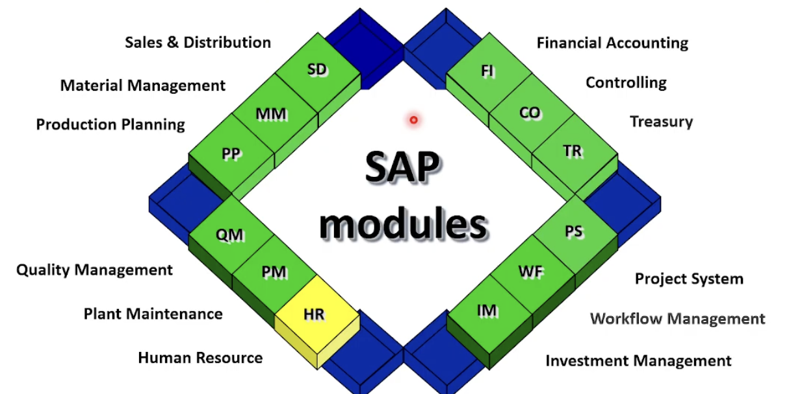

# TỔNG QUAN HỆ THỐNG SAP

## 1. Giới thiệu về ERP & SAP

### 1.1. ERP là gì?

**ERP (Enterprise Resource Planning)** không chỉ là một phần mềm, mà là "hệ thần kinh" của doanh nghiệp, giúp:

- Kết nối dữ liệu tập trung từ tất cả các phòng ban
- Loại bỏ sự rời rạc và trùng lặp thông tin
- Tự động hóa quy trình nghiệp vụ xuyên suốt
- Cung cấp thông tin real-time để ra quyết định


### 1.2. SAP là gì?

- **SAP SE**: Là công ty phần mềm lớn nhất châu Âu, cung cấp giải pháp công nghệ doanh nghiệp toàn diện
- **SAP ERP**: Là tên giải pháp ERP hàng đầu thế giới do SAP phát triển
- **Các giải pháp khác**: CRM, SCM, HCM, BW/BI, BTP,...

### 1.3. Các dòng sản phẩm SAP ERP

| Sản phẩm                  | Đối tượng              | Đặc điểm                                                      |
| ------------------------- | ---------------------- | ------------------------------------------------------------- |
| **SAP S/4HANA**           | Tập đoàn lớn           | Database in-memory (HANA), quy trình phức tạp, tích hợp AI/ML |
| **SAP Business One (B1)** | Doanh nghiệp vừa & nhỏ | Triển khai nhanh, chi phí thấp, đơn giản hóa                  |
| **SAP Business ByDesign** | Doanh nghiệp vừa       | Cloud-based, SaaS model                                       |

---

## 2. Kiến trúc Hệ thống SAP

### 2.1. Kiến trúc 3-tier (Three-tier Architecture)

```mermaid
┌─────────────────────────────────────────────────────────┐
│  Presentation Layer (Client Tier)                       │
│  - SAP GUI (SAP Logon)                                  │
│  - SAP Fiori (Web Browser)                              │
│  - Mobile Apps                                          │
└─────────────────────────────────────────────────────────┘
                           ↕
┌─────────────────────────────────────────────────────────┐
│  Application Layer (Server Tier)                        │
│  - Application Server (AS)                              │
│  - ABAP Runtime Environment                             │
│  - Business Logic Processing                            │
└─────────────────────────────────────────────────────────┘
                           ↕
┌─────────────────────────────────────────────────────────┐
│  Database Layer (Data Tier)                             │
│  - SAP HANA / Oracle / SQL Server / DB2                 │
│  - Tables, Views, Indexes                               │
└─────────────────────────────────────────────────────────┘
```

---

## 3. Ngôn ngữ ABAP – Trái tim kỹ thuật SAP

### 3.1. ABAP là gì?

**ABAP (Advanced Business Application Programming)** là ngôn ngữ lập trình đặc thù của SAP, được sử dụng để:

- Phát triển và tùy chỉnh hệ thống SAP
- Xây dựng báo cáo, giao diện, workflow
- Mở rộng chức năng chuẩn của SAP
- Tích hợp với hệ thống bên ngoài

### 3.2. Đặc điểm của ABAP

- **Ngôn ngữ bậc cao**: Cú pháp gần với tiếng Anh, dễ đọc
- **Tích hợp sâu với database**: SQL embedded, Open SQL
- **Hướng đối tượng**: ABAP Objects (từ phiên bản SAP NetWeaver)
- **Môi trường phát triển**:
  - **SE80** (ABAP Workbench) - IDE truyền thống trên SAP GUI
  - **ADT** (ABAP Development Tools) - Eclipse-based, hiện đại hơn

---

## 4. Các Phân Hệ Chính (Modules) của SAP

SAP ERP được chia thành nhiều module chức năng, mỗi module phụ trách một lĩnh vực nghiệp vụ cụ thể:

| Module     | Tên đầy đủ               | Chức năng chính                                          |
| ---------- | ------------------------ | -------------------------------------------------------- |
| **MM**     | Material Management      | Quản lý mua hàng, tồn kho, kiểm kê                       |
| **PP**     | Production Planning      | Lập kế hoạch và ghi nhận sản xuất                        |
| **SD**     | Sales & Distribution     | Quản lý bán hàng, giao hàng, thu tiền                    |
| **WM**     | Warehouse Management     | Quản lý kho chi tiết (bin location)                      |
| **FI**     | Financial Accounting     | Kế toán tài chính, sổ cái, báo cáo thuế, BCTC theo chuẩn |
| **CO**     | Controlling              | Kế toán quản trị, phân bổ chi phí, phân tích lợi nhuận   |
| **TR**     | Treasury                 | Quản lý tiền mặt, thanh toán, rủi ro tài chính           |
| **AA**     | Asset Accounting         | Quản lý tài sản cố định, khấu hao                        |
| **QM**     | Quality Management       | Kiểm soát chất lượng vật tư, thành phẩm, quy trình       |
| **PM**     | Plant Maintenance        | Bảo trì bảo dưỡng máy móc, thiết bị                      |
| **PS**     | Project System           | Quản lý vòng đời dự án (xây dựng, IT, R&D)               |
| **HR/HCM** | Human Capital Management | Quản lý nhân sự, lương, tuyển dụng, đào tạo              |



**Tích hợp giữa các Module:**

- Khi tạo **Purchase Order (MM)** → Tự động sinh **Accounting Document (FI)**
- Khi **Delivery (SD)** → Tự động trừ **Inventory (MM)**
- Mọi giao dịch đều có **audit trail** đầy đủ

---

## 5. T-code (Transaction Code) – "Câu lệnh thần chú" trong SAP

### 5.1. Khái niệm T-code

**T-code** là mã lệnh ngắn gọn để truy cập nhanh vào các chức năng trong SAP, thay vì phải điều hướng qua nhiều menu.

**Cách sử dụng:**

- Nhập T-code vào **Command Field** (thanh lệnh) ở góc trên bên trái màn hình SAP GUI
- Nhấn Enter để mở chức năng tương ứng

**Ví dụ:**

- Gõ `VA01` → Tạo Sales Order
- Gõ `ME21N` → Tạo Purchase Order
- Gõ `SE11` → Mở ABAP Dictionary

### 5.2. Phân loại T-code

| Loại                      | Mô tả                                      | Ví dụ                    |
| ------------------------- | ------------------------------------------ | ------------------------ |
| **Report Transaction**    | Chạy chương trình báo cáo (Report Program) | `SE38`, `S_ALR_87012357` |
| **Dialog Transaction**    | Mở màn hình nhập/sửa liệu (Dynpro/Screen)  | `VA01`, `MM01`, `FB01`   |
| **OO Transaction**        | Gọi phương thức của Class ABAP (hiện đại)  | Nhiều T-code Fiori       |
| **Parameter Transaction** | Gọi T-code khác với tham số mặc định       | -                        |

### 5.3. Quy tắc đặt tên T-code

| Ký tự đầu    | Ý nghĩa                                 | Ví dụ                  |
| ------------ | --------------------------------------- | ---------------------- |
| **A → X**    | T-code chuẩn của SAP (Standard)         | `VA01`, `MM01`, `FB01` |
| **Z hoặc Y** | T-code tùy chỉnh (Custom/Z-development) | `ZMM001`, `Y_REPORT`   |

**Quy ước phát triển:**

- Mọi object custom **bắt buộc** bắt đầu bằng `Z` hoặc `Y` để tránh xung đột với SAP standard
- Áp dụng cho: T-code, Program, Table, Function Module, Class,...

### 5.4. T-code quan trọng cho Development

**Development & System:**

- `SE11` - ABAP Dictionary (tạo table, structure, data element)
- `SE38` - ABAP Editor (viết report program)
- `SE80` - Object Navigator (IDE tổng hợp)
- `SE93` - Maintain Transaction (tạo T-code)
- `SE24` - Class Builder (tạo ABAP Objects)
- `SE37` - Function Builder
- `SE51` - Screen Painter
- `SE41` - Menu Painter
- `SMARTFORMS` - SmartForms Designer
- `SCOT/SOST` - SAPconnect (email configuration)
- `SE09/SE10` - Transport Organizer

---

## 6. Triết lý Clean Core trên SAP S/4HANA Cloud

### 6.1. Clean Core là gì?

**Clean Core** là triết lý thiết kế của SAP nhằm:

- Giữ hệ thống core **sạch, chuẩn** (không modify SAP standard code)
- Dễ dàng **upgrade** lên phiên bản mới mà không bị conflict
- Giảm **technical debt** và chi phí bảo trì

### 6.2. Sự khác biệt giữa On-premise và Cloud

| Khía cạnh           | On-premise                          | S/4HANA Cloud (Public)                |
| ------------------- | ----------------------------------- | ------------------------------------- |
| **Modify SAP code** | Cho phép (nhưng không khuyến khích) | **Cấm hoàn toàn**                     |
| **Custom code**     | Z/Y programs thoải mái              | Có giới hạn, phải tuân thủ Clean Core |
| **Enhancement**     | User Exit, Enhancement Point, BAdI  | Chỉ BAdI (Business Add-Ins)           |
| **Extension**       | In-stack (trên cùng server)         | **Side-by-side** (SAP BTP)            |
| **Database access** | Open SQL, Native SQL                | Chỉ CDS Views, không dùng Native SQL  |

### 6.3. Best Practices

✅ **Nên làm:**

- Dùng Standard SAP functionality tối đa trước khi nghĩ đến custom
- Luôn bắt đầu bằng Z/Y cho mọi custom object
- Sử dụng CDS Views thay vì Database Table trực tiếp
- Implement BAdI thay vì modify standard code
- Document rõ ràng mọi customization

❌ **Không nên làm:**

- Modify SAP standard code (đặc biệt trên Cloud)
- Dùng Native SQL trên Cloud
- Hard-code values, nên dùng Customizing Table
- Copy-paste code SAP standard vào Z-program
- Bỏ qua Code Review và Performance Test
