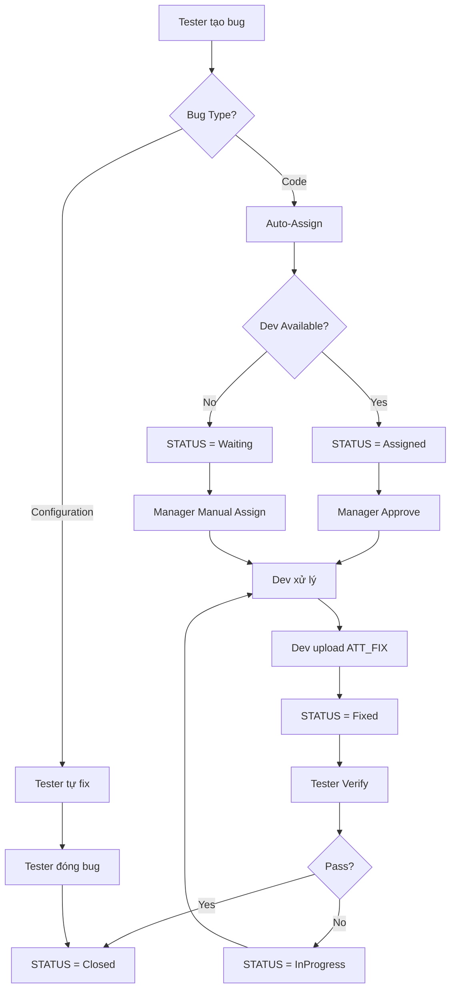
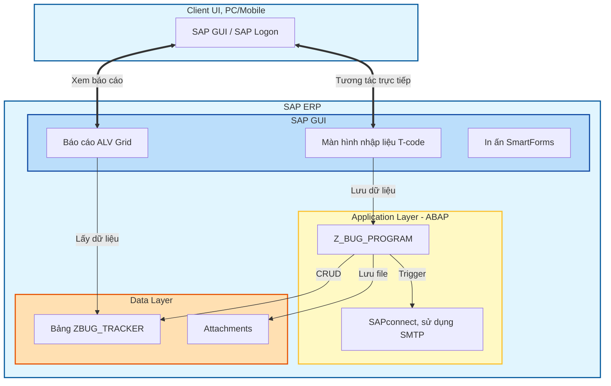
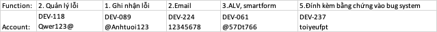

# XÂY DỰNG PHÂN HỆ QUẢN LÝ LỖI (BUG TRACKING) – GIẢI PHÁP ON-STACK

## 1. TỔNG QUAN DỰ ÁN

Phát triển một **Custom Solution (Z-Solution)** chạy trực tiếp trên SAP ERP. Giải pháp tuân thủ kiến trúc kỹ thuật chuẩn của SAP, đảm bảo tính bảo mật, toàn vẹn dữ liệu và khả năng tích hợp sâu (Deep Integration) với quy trình vận hành hiện tại.

### 1.1. Mục Tiêu Chung

Xây dựng hệ thống quản lý lỗi (Bug Tracking) phục vụ nghiệp vụ nội bộ, đảm bảo:

- Quản lý vòng đời lỗi (tạo, xử lý, đóng).
- Dữ liệu tập trung, truy xuất nhanh, có lịch sử.
- Tích hợp với SAP ERP, bảo mật và dễ vận hành.

### 1.2. Phạm Vi Chức Năng (10 Modules)

| #   | Module                     | Mô tả                                       |
| --- | -------------------------- | ------------------------------------------- |
| 1   | Ghi nhận lỗi               | Form nhập liệu, validate, đính kèm evidence |
| 2   | Thông báo Email            | Gửi email tự động khi tạo/cập nhật lỗi      |
| 3   | Báo cáo ALV & SmartForms   | Danh sách lỗi, lọc/sắp xếp, in PDF          |
| 4   | Dashboard thống kê         | Tổng hợp lỗi theo status/priority/module    |
| 5   | Quản lý đính kèm           | 3 files: Report/Fix/Verify (Excel, ≤10MB)   |
| 6   | **User Management**        | Quản lý Tester/Developer/Manager accounts   |
| 7   | **Auto-Assign**            | Tự động phân công theo Module+Workload      |
| 8   | **Role-based Permissions** | Phân quyền theo vai trò                     |
| 9   | **History Log**            | Ghi nhận mọi thay đổi của bug               |
| 10  | **Manager Dashboard**      | Dashboard riêng cho Manager                 |

### 1.3. Quy Trình Nghiệp Vụ (Business Process Flow)

### 1.4. Status Flow với Color-coding

| Status     | Màu       | Mô tả                  |
| ---------- | --------- | ---------------------- |
| New        | 🔵 Blue   | Mới tạo                |
| Waiting    | 🟡 Yellow | Chờ Manager assign     |
| Assigned   | 🟠 Orange | Đã assign, chờ approve |
| InProgress | 🟣 Purple | Dev đang xử lý         |
| Fixed      | 🟢 Green  | Đã fix, chờ verify     |
| Closed     | ⚪ Grey   | Hoàn tất               |

## 2. KIẾN TRÚC KỸ THUẬT

Giải pháp được xây dựng theo mô hình 3 lớp (3-Tier Architecture) của SAP NetWeaver:

- **Lớp Dữ liệu (Data Layer - SE11):** Sử dụng bảng trong suốt tùy chỉnh (**Transparent Table**) nằm trong không gian tên khách hàng (`Z*`), không can thiệp dữ liệu chuẩn (Standard Data).
- **Lớp Ứng dụng (Application Layer - ABAP):** Xử lý logic nghiệp vụ, xác thực dữ liệu và điều phối luồng (Workflow) bằng **ABAP**.
- **Lớp Trình diễn (Presentation Layer - SAP GUI):** Giao diện theo **SAP GUI Guidelines**, dùng **ALV Grid** cho báo cáo và **SmartForms** cho in ấn.

## 3. PHẠM VI CÔNG VIỆC CHI TIẾT

### 3.1. Module Quản trị Dữ liệu (3 Bảng)

#### Bảng 1: ZBUG_TRACKER (Thông tin lỗi)

| Field                | Type      | Mô tả                  |
| -------------------- | --------- | ---------------------- |
| BUG_ID               | CHAR(10)  | Khóa chính             |
| TITLE                | CHAR(100) | Tiêu đề                |
| DESC_TEXT            | STRING    | Mô tả (không giới hạn) |
| MODULE               | CHAR(20)  | MM/SD/FI...            |
| PRIORITY             | CHAR(1)   | H/M/L                  |
| STATUS               | CHAR(1)   | 1/W/2/3/4/5            |
| **BUG_TYPE**         | CHAR(1)   | C=Code, F=Config       |
| **REASONS**          | STRING    | Nguyên nhân            |
| **TESTER_ID**        | CHAR(12)  | Tester báo lỗi         |
| **VERIFY_TESTER_ID** | CHAR(12)  | Tester verify          |
| DEV_ID               | CHAR(12)  | Developer xử lý        |
| **APPROVED_BY**      | CHAR(12)  | Manager duyệt          |
| **ATT_REPORT**       | CHAR(100) | File report            |
| **ATT_FIX**          | CHAR(100) | File fix               |
| **ATT_VERIFY**       | CHAR(100) | File verify            |

#### Bảng 2: ZBUG_USERS (Quản lý tài khoản) - MỚI

| Field            | Type      | Mô tả            |
| ---------------- | --------- | ---------------- |
| USER_ID          | CHAR(12)  | SAP Username     |
| ROLE             | CHAR(1)   | T/D/M            |
| MODULE           | CHAR(20)  | Module phụ trách |
| AVAILABLE_STATUS | CHAR(1)   | A/B/L/W          |
| EMAIL            | CHAR(100) | Email            |

#### Bảng 3: ZBUG_HISTORY (Log thay đổi) - MỚI

| Field       | Type     | Mô tả          |
| ----------- | -------- | -------------- |
| LOG_ID      | NUMC(10) | Log ID         |
| BUG_ID      | CHAR(10) | Bug reference  |
| CHANGED_BY  | CHAR(12) | Người thay đổi |
| ACTION_TYPE | CHAR(2)  | CR/AS/RS/ST    |
| OLD_VALUE   | CHAR(50) | Giá trị cũ     |
| NEW_VALUE   | CHAR(50) | Giá trị mới    |

---

### 3.2. Module Ghi nhận lỗi (T-code `ZBUG_CREATE`)

- Screen 0100: Form nhập liệu với các trường Title, Description, Module, Priority, Bug Type
- Upload ATT_REPORT (Excel, ≤10MB)
- Auto-fill: TESTER_ID = SY-UNAME, CREATED_AT = SY-DATUM
- Validation trước khi Save

---

### 3.3. Module User Management (T-code `ZBUG_USER`) - MỚI

- CRUD trên bảng ZBUG_USERS
- Manager Dashboard để quản lý accounts
- Thay đổi AVAILABLE_STATUS của Developer

---

### 3.4. Module Auto-Assign - MỚI

- Function Module: `Z_BUG_AUTO_ASSIGN`
- Logic: Lấy dev cùng Module → Đếm workload → Chọn dev ít bug nhất
- Fallback: Nếu tất cả dev bận → STATUS = Waiting
- Auto update: Developer AVAILABLE_STATUS = Working

---

### 3.5. Module Phân quyền - MỚI

| Role      | Quyền hạn                                         |
| --------- | ------------------------------------------------- |
| Tester    | Tạo bug, upload Report/Verify, đóng bug tự fix    |
| Developer | Sửa bug assigned, upload Fix, từ chối re-assign   |
| Manager   | Full access, approve, re-assign, quản lý accounts |

---

### 3.6. Module Báo cáo ALV (T-code `ZBUG_REPORT`)

- ALV Grid với color-coded status (6 màu)
- Inline actions: Update status, Manual assign
- Filter/Sort/Export Excel
- Drill-down xem chi tiết

---

### 3.7. Module In ấn SmartForms

- Biểu mẫu `ZBUG_FORM`
- Logo công ty, thông tin lỗi, khu vực ký duyệt
- Xuất PDF hoặc in trực tiếp

## 4. KẾ HOẠCH TRIỂN KHAI CHI TIẾT (8 TUẦN)

**Tổng thời gian thực hiện:** 8 tuần  
**Phương pháp:** Waterfall + Iterative Review

### 4.1. Mapping Documentation Files

| File                                                                                | Vai trò                            | Phase áp dụng |
| ----------------------------------------------------------------------------------- | ---------------------------------- | ------------- |
| [requirements.md](file:///documentation/requirements/requirements.md)               | Yêu cầu tổng hợp (Source of Truth) | All phases    |
| [developer-guide.md](file:///documentation/guides/developer-guide.md)               | Hướng dẫn kỹ thuật chi tiết        | All phases    |
| [techical-proposal.md](file:///documentation/requirements/techical-proposal.md)     | Proposal & Timeline                | Planning      |
| [sap-overview.md](file:///documentation/requirements/sap-overview.md)               | Tổng quan SAP                      | Phase 0-1     |
| [extra-requirements.md](file:///documentation/requirements/extra-requirements.md)   | Yêu cầu bổ sung gốc                | Reference     |
| [stakeholder-answers.md](file:///documentation/requirements/stakeholder-answers.md) | Câu trả lời khách hàng             | Reference     |

---

### 4.2. Timeline Tổng quan (8 Tuần)

| Phase  | Tuần | Nội dung              | Deliverables                       | Tham chiếu                          |
| ------ | ---- | --------------------- | ---------------------------------- | ----------------------------------- |
| **P0** | 0    | Setup môi trường      | SAP GUI, Account ready             | `developer-guide.md` Phase 0        |
| **P1** | 1    | Database Layer        | 3 tables, 6 domains                | `developer-guide.md` Phase 1        |
| **P2** | 2-3  | Business Logic + UI   | T-code ZBUG_CREATE, Email, GOS     | `developer-guide.md` Phase 2-3      |
| **P3** | 4    | User & Permissions    | ZBUG_USERS, Auto-Assign, Roles     | `developer-guide.md` Phase 1.5, 2.5 |
| **P4** | 5-6  | Reporting & Dashboard | ALV, SmartForms, Manager Dashboard | `developer-guide.md` Phase 3.5, 4   |
| **P5** | 7-8  | Testing & Deployment  | UAT, Documentation, Go-live        | `developer-guide.md` Phase 5        |

---

### 4.3. Chi tiết từng tuần

#### Tuần 1: Database Layer

**Ref:** `developer-guide.md` → Phase 1

| Ngày  | Task                                                                       | Output        | Tham chiếu  |
| ----- | -------------------------------------------------------------------------- | ------------- | ----------- |
| T2    | Setup Package ZBUGTRACK, Transport layer                                   | TR created    | Phase 1.1   |
| T3    | Tạo 6 Domains: STATUS, PRIORITY, ROLE, AVAIL_STATUS, BUG_TYPE, ACTION_TYPE | 6 Domains     | Phase 1.2   |
| T4    | Tạo ~15 Data Elements                                                      | All DEs       | Phase 1.3   |
| T5    | Tạo bảng ZBUG_TRACKER (18 fields)                                          | Table active  | Phase 1.4   |
| T6    | Tạo bảng ZBUG_USERS (8 fields)                                             | Table active  | Phase 1.5.3 |
| T7-CN | Tạo bảng ZBUG_HISTORY (10 fields), Number Range ZNRO_BUG                   | 3 Tables + NR | Phase 1.5.4 |

#### Tuần 2: Core Business Logic

**Ref:** `developer-guide.md` → Phase 2

| Ngày  | Task                                    | Output                | Tham chiếu    |
| ----- | --------------------------------------- | --------------------- | ------------- |
| T2-T3 | Lập trình Screen 0100 (Create/Edit Bug) | Screen working        | Phase 3.1-3.3 |
| T4    | PBO/PAI Modules, Field validation       | Validation logic      | Phase 3.4     |
| T5    | Save to ZBUG_TRACKER with Number Range  | CRUD working          | Phase 2.1     |
| T6    | Config SCOT SMTP, Email template        | Email config          | Phase 2.2     |
| T7-CN | Function gửi Email via CL_BCS           | Email trigger on save | Phase 2.2     |

#### Tuần 3: Attachments + Core Functions

**Ref:** `developer-guide.md` → Phase 2

| Ngày  | Task                           | Output           | Tham chiếu |
| ----- | ------------------------------ | ---------------- | ---------- |
| T2-T3 | GOS integration cho ATT_REPORT | Tester upload    | Phase 2.3  |
| T4    | GOS integration cho ATT_FIX    | Developer upload | Phase 2.3  |
| T5    | GOS integration cho ATT_VERIFY | Verifier upload  | Phase 2.3  |
| T6    | T-code ZBUG_CREATE hoàn chỉnh  | T-code ready     | Phase 2.4  |
| T7-CN | Unit test core functions       | All tests pass   | -          |

#### Tuần 4: User Management + Auto-Assign

**Ref:** `developer-guide.md` → Phase 1.5, 2.5

| Ngày  | Task                                                 | Output            | Tham chiếu  |
| ----- | ---------------------------------------------------- | ----------------- | ----------- |
| T2    | CRUD Screen cho ZBUG_USERS                           | T-code ZBUG_USER  | Phase 1.5.3 |
| T3    | Function Z_BUG_AUTO_ASSIGN (by Module)               | Auto-assign logic | Phase 2.5.1 |
| T4    | Workload calculation + Waiting fallback              | STATUS = W        | Phase 2.5.1 |
| T5    | Function Z_BUG_CHECK_PERMISSION                      | Role-based access | Phase 2.5.2 |
| T6    | Function Z_BUG_LOG_HISTORY                           | History logging   | Phase 2.5.3 |
| T7-CN | Manager approval workflow (APPROVED_BY, APPROVED_AT) | Workflow complete | Phase 2.5   |

#### Tuần 5: ALV Report + Color-coding

**Ref:** `developer-guide.md` → Phase 3.5, 4

| Ngày  | Task                          | Output          | Tham chiếu |
| ----- | ----------------------------- | --------------- | ---------- |
| T2-T3 | ALV Grid với CL_GUI_ALV_GRID  | Basic ALV       | Phase 4.1  |
| T4    | Color-coded status (6 màu)    | Visual status   | Phase 3.5  |
| T5    | Inline actions: Update status | Interactive ALV | Phase 4.2  |
| T6    | Inline actions: Manual assign | Interactive ALV | Phase 4.2  |
| T7-CN | Filter/Sort/Export Excel      | Full ALV        | Phase 4.3  |

#### Tuần 6: SmartForms + Dashboard

**Ref:** `developer-guide.md` → Phase 4

| Ngày  | Task                                      | Output             | Tham chiếu |
| ----- | ----------------------------------------- | ------------------ | ---------- |
| T2-T3 | SmartForms ZBUG_FORM design               | PDF template       | Phase 4.4  |
| T4    | SmartForms data integration               | PDF working        | Phase 4.4  |
| T5    | Manager Dashboard screen layout           | Dashboard UI       | Phase 4.5  |
| T6    | Statistics: Bug by Status/Module/Assignee | Charts/Summary     | Phase 4.5  |
| T7-CN | Waiting bugs list + Quick assign          | Dashboard complete | Phase 4.5  |

#### Tuần 7: Optimization + Integration Test

**Ref:** `developer-guide.md` → Phase 5

| Ngày  | Task                                      | Output         | Tham chiếu |
| ----- | ----------------------------------------- | -------------- | ---------- |
| T2    | Code Inspector cleanup                    | No warnings    | Phase 5.1  |
| T3    | Performance tuning (SELECT optimization)  | Fast queries   | Phase 5.2  |
| T4    | Integration test: Full workflow Tester    | Test passed    | Phase 5.3  |
| T5    | Integration test: Full workflow Developer | Test passed    | Phase 5.3  |
| T6    | Integration test: Full workflow Manager   | Test passed    | Phase 5.3  |
| T7-CN | Bug fixing from tests                     | All bugs fixed | -          |

#### Tuần 8: UAT + Bàn giao

**Ref:** `developer-guide.md` → Phase 5

| Ngày  | Task                                 | Output               | Tham chiếu |
| ----- | ------------------------------------ | -------------------- | ---------- |
| T2-T3 | UAT với end-users (Tester role)      | UAT passed           | Phase 5.4  |
| T4    | UAT với end-users (Developer role)   | UAT passed           | Phase 5.4  |
| T5    | UAT với end-users (Manager role)     | UAT passed           | Phase 5.4  |
| T6    | Viết User Manual, Training materials | Documentation        | Phase 5.5  |
| T7-CN | Bàn giao, Training session, Go-live  | **PROJECT COMPLETE** | Phase 5.6  |

---

### 4.4. Checklist hoàn thành theo Phase

| Phase | T-codes                     | Tables                                 | Functions                                                    | Forms     |
| ----- | --------------------------- | -------------------------------------- | ------------------------------------------------------------ | --------- |
| P1    | -                           | ZBUG_TRACKER, ZBUG_USERS, ZBUG_HISTORY | -                                                            | -         |
| P2-P3 | ZBUG_CREATE                 | -                                      | Z_BUG_SEND_EMAIL                                             | -         |
| P3    | ZBUG_USER                   | -                                      | Z_BUG_AUTO_ASSIGN, Z_BUG_CHECK_PERMISSION, Z_BUG_LOG_HISTORY | -         |
| P4    | ZBUG_REPORT, ZBUG_DASHBOARD | -                                      | -                                                            | ZBUG_FORM |
| P5    | -                           | -                                      | -                                                            | -         |

## 5. TÀI NGUYÊN ĐÃ CÓ & YÊU CẦU BỔ SUNG

### 5.1. Tài nguyên đã được cung cấp ✅

**Hệ thống SAP:**

- **System ID:** S40 (FU - Functional Unit)
- **Application Server:** S40Z
- **Instance Number:** 00
- **SAP Logon Version:** 770
- **Connection Type:** Custom Application Server
- **Connection String:** /H/sapper
- **Network:** EBS_SAP

**Client Code:** 324

**Development Accounts đã cấp:**

- **DEV-118** (Pass: Qwer123@): Quản lý lỗi (Full system access)
- **DEV-089** (Pass: @Anhtuoi123): Ghi nhận lỗi (Z-objects Development)
  - SE11 (ABAP Dictionary - tạo Z-table)
  - SE38/SE80 (ABAP Development Workbench)
  - SE93 (Transaction Code creation)
  - SE24 (Class Builder)
  - SE37 (Function Builder)
- **DEV-242** (Pass: 12345678): Email Configuration
  - SCOT (SAPconnect Configuration)
  - SOST (SAPconnect Administration)
- **DEV-061** (Pass: @57Dt766): Báo cáo & In ấn
  - ALV Grid development (REUSE*ALV*\* function modules)
  - SMARTFORMS Designer & Runtime
- **DEV-237** (Pass: toiyeufpt): Đính kèm file
  - GOS (Generic Object Services)
  - Attachment management & storage

### 5.2. Yêu cầu bổ sung cần xác nhận

**1. Developer Key:**

- Xác nhận các account DEV-* đã được cấp Developer Key
- Cần để unlock ABAP Editor (SE38/SE80)
- Nếu chưa có: Request từ SAP System Administrator

**2. Transport Layer & Package:**

- Package name cho Z-objects (đề xuất: **ZBUGTRACK**)
- Transport layer (đề xuất: **ZBT1**)
- Development class assignment
- Transport route configuration

**3. SMTP Server (nếu SCOT chưa config):**

- SMTP server IP/hostname
- Port (thường 25 hoặc 587)
- Authentication credentials (nếu cần)
- Test email address để verify
- Kiểm tra SCOT status: T-code **SCOT**

**4. SmartForms Template & Branding:**

- Logo công ty (format: BMP/PNG, size phù hợp)
- Corporate identity guidelines
- Standard footer/header format
- Approval signature fields

**5. GOS Configuration:**

- Document storage location (DMS hoặc file system)
- Allowed file types & size limits
- Retention policy
- Access control settings

**6. UAT Environment (Optional):**

- Xác nhận test trên S40 hay có system riêng
- Data refresh policy từ Production → UAT

## 6. CAM KẾT CHẤT LƯỢNG & BẢO HÀNH

- **Tuân thủ Clean Core:** Không sửa đổi mã nguồn chuẩn, an toàn khi nâng cấp SAP.
- **Tiêu chuẩn lập trình:** Tuân thủ quy chuẩn đặt tên SAP, có comment rõ ràng, dễ bảo trì.
- **Hỗ trợ sau triển khai:** Hỗ trợ xử lý lỗi kỹ thuật trong vòng [Số] tuần sau Go-live.

## 7. DELIVERABLES

- Tài liệu thiết kế kỹ thuật (Tech Specs)
- Source code & hướng dẫn triển khai
- Hướng dẫn sử dụng (User Manual)
