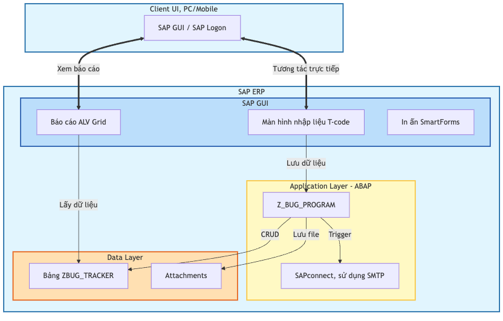
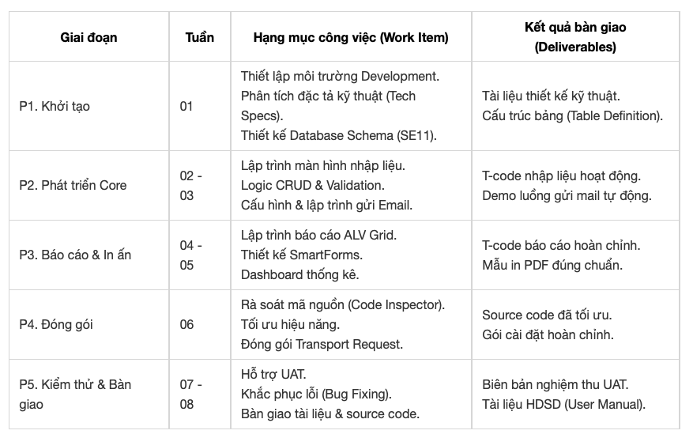
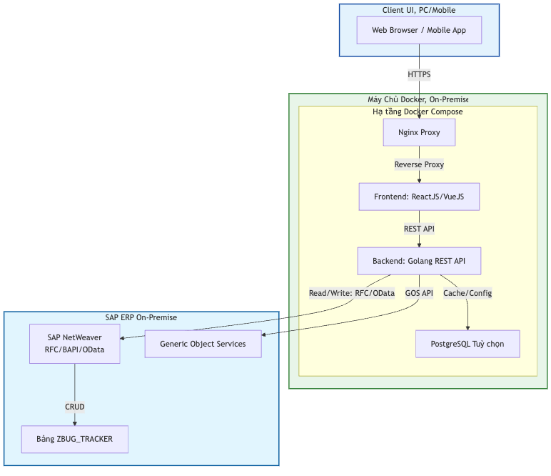
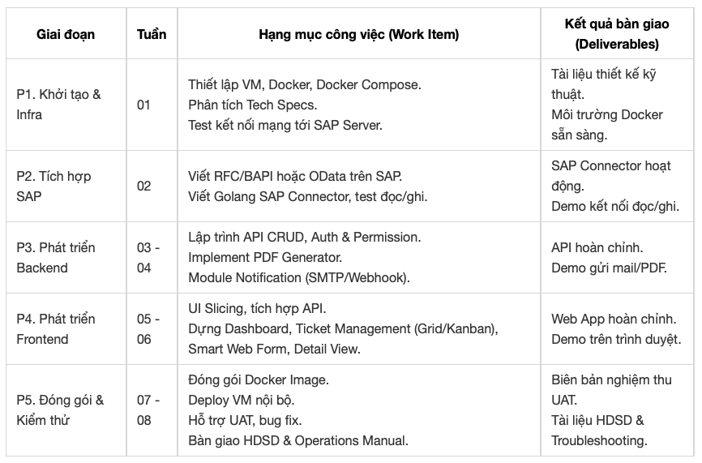
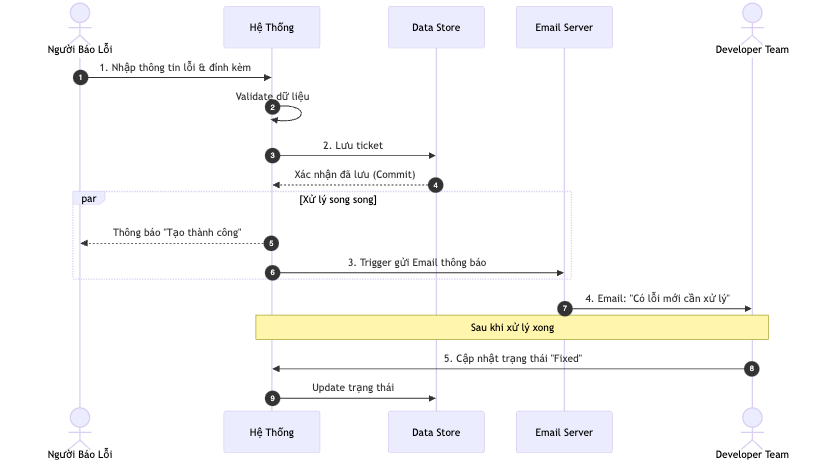

# BUG TRACKING TRÊN SAP

## Đề xuất hướng triển khai

---

## Agenda

- Mô tả đề bài & mục tiêu
- Hai hướng triển khai (2 offers)
- So sánh/trade-off nhanh
- Câu hỏi cần xác nhận để chốt phương án
- Next step

---

## Mô tả đề bài (ánh xạ yêu cầu)

**Đề tài:** Xây dựng **Custom Add-on (Z\*)** trong SAP ERP cho phân hệ Bug Tracking.

Xây dựng hệ thống Bug Tracking với các chức năng bắt buộc:

- **Ghi nhận lỗi trong SAP:** T-code riêng (VD: `ZBUG_CREATE`), form nhập liệu + validation
- **Thông báo tự động:** Gửi email sau khi lưu (SAPconnect/SCOT)
- **Báo cáo danh sách:** ALV Grid (lọc/sắp xếp/drill-down)
- **In ấn:** SmartForms (xuất PDF/in giấy)
- **Thống kê:** Summary trên đầu màn hình ALV (COUNT/GROUP BY Status)
- **Đính kèm:** GOS (ảnh/log đính kèm theo Bug ID)

---

## ERP Context


---

## SAP Modules Cơ Bản


---

## Offer A – On-Stack (ABAP trong SAP GUI)

**Tóm tắt:**  
Xây trực tiếp trong SAP bằng ABAP. SAP GUI + ALV Grid + SmartForms.

**Ngôn ngữ:** ABAP (SE38/SE80)

**Scope chính:**

- T-code nhập liệu (ZBUG_CREATE)
- ALV báo cáo (ZBUG_REPORT)
- SmartForms in ấn (ZBUG_FORM)
- Email qua SCOT
- GOS đính kèm

---

## Offer A – Ví dụ code ABAP

```abap
" Khai báo biến
DATA: lv_title   TYPE string,
      ls_bug     TYPE zbug_tracker,
      lo_send_request TYPE REF TO cl_bcs,
      lo_document     TYPE REF TO cl_document_bcs,
      lo_recipient    TYPE REF TO if_recipient_bcs,
      lv_subject      TYPE so_obj_des.

" Validate và lưu bug
IF lv_title IS INITIAL.
  MESSAGE 'Title is required' TYPE 'E'.
ENDIF.

" Điền dữ liệu
ls_bug-bug_id    = sy-datum && sy-uzeit.
ls_bug-title     = lv_title.
ls_bug-status    = 'OPEN'.
ls_bug-created_by = sy-uname.
ls_bug-created_on = sy-datum.

INSERT zbug_tracker FROM ls_bug.
COMMIT WORK.

" Gửi email thông báo qua CL_BCS
TRY.
    lv_subject = 'New Bug Created: ' && ls_bug-bug_id.
    lo_send_request = cl_bcs=>create_persistent( ).
    lo_document = cl_document_bcs=>create_document(
      i_type    = 'RAW'
      i_text    = VALUE #( ( 'Bug created successfully' ) )
      i_subject = lv_subject ).
    lo_send_request->set_document( lo_document ).
    
    lo_recipient = cl_cam_address_bcs=>create_internet_address( 'dev@example.com' ).
    lo_send_request->add_recipient( lo_recipient ).
    
    lo_send_request->send( ).
    COMMIT WORK.
  CATCH cx_bcs INTO DATA(lx_bcs).
    MESSAGE lx_bcs->get_text( ) TYPE 'E'.
ENDTRY.
```

---

## Offer A – Sơ đồ kiến trúc



---

## Offer A – Ưu/Nhược

**Điểm mạnh**

- Tích hợp sâu (native SAP)
- Không cần hệ thống ngoài SAP
- Phù hợp yêu cầu “đúng chuẩn SAP”

**Cân nhắc**

- UX truyền thống (SAP GUI)
- Phụ thuộc quyền dev trên SAP

---

## Offer A – Kế hoạch triển khai (Plan)



---

## Offer B – Side-by-Side (Web App + SAP Integration)

**Tóm tắt:**  
Web app chạy song song SAP. Backend **Golang hoặc Node.js** + Frontend React, kết nối SAP qua RFC/OData.

**Ngôn ngữ:** Golang / Node.js (Express/Nest)

**Scope chính:**

- Web Dashboard (Grid/Kanban)
- Form nhập lỗi hiện đại
- Export PDF thay SmartForms
- Notification (Email/Webhook)
- SAP Connector (RFC/OData/BAPI)

---

## Offer B – Ví dụ code (Golang / Node.js)

```go
// Golang: ghi bug qua SAP RFC/OData
router.POST("/bugs", func(c *gin.Context) {
  // validate input, call SAP connector, save
})
```

```js
// Node.js: REST API + SAP connector
app.post("/bugs", async (req, res) => {
  // validate input, call SAP connector, save
});
```

---

## Offer B – Sơ đồ kiến trúc



---

## Offer B – Ưu/Nhược

**Điểm mạnh**

- UX hiện đại, đa thiết bị
- Dễ mở rộng tính năng
- Tách rời SAP core (an toàn upgrade)

**Cân nhắc**

- Cần mở kết nối API vào SAP
- Vận hành thêm hạ tầng web (Docker/VM)

---

## Offer B – Kế hoạch triển khai (Plan)



---

## So sánh nhanh (Trade-off)

| Tiêu chí               | On-Stack (SAP GUI)          | Side-by-Side (Web App)    |
| ---------------------- | --------------------------- | ------------------------- |
| Trải nghiệm người dùng | Truyền thống                | Hiện đại, đa thiết bị     |
| Tích hợp SAP           | Native, sâu                 | Qua RFC/OData             |
| Hạ tầng                | Không cần ngoài SAP         | Cần Docker/VM             |
| Tốc độ triển khai      | Nhanh nếu team ABAP mạnh    | Cần full-stack + DevOps   |
| Mở rộng tương lai      | Hạn chế                     | Linh hoạt                 |
| Nâng cấp SAP           | Phụ thuộc nâng cấp SAP      | Tách rời SAP core         |
| Chi phí license        | Không phát sinh             | Không phát sinh           |
| Quyền dev              | Cao                 | Trung bình             |

---

## Quy trình nghiệp vụ (sequence)



---

## Câu hỏi cần xác nhận (để chốt)

1. **Hướng triển khai:** SAP GUI/ALV/SmartForms hay Web hiện đại?
2. **Quyền SAP Dev:** đã cấp đủ quyền chưa?
   - **Nếu có:** xin cấp account + quyền dev để triển khai on‑stack.
   - **Nếu không:** đề xuất bên mình tự dựng container, pull image, dựng SAP riêng để dev.
3. **RFC/OData:** có cho phép gọi từ ngoài vào SAP không?
4. **Báo cáo/In ấn:** SmartForms hay PDF?
5. **Email:** SCOT đã cấu hình chưa?

---

## Quyền SAP Dev tối thiểu (On-Stack)

- Developer Key
- SE11, SE38/SE80, SE93
- SE24 hoặc SE37
- SE51/SE41 (nếu làm màn hình)
- SMARTFORMS (in ấn)
- SCOT/SOST (email)
- SE09/SE10 (transport)

---

## Quy tắc chốt phương án

**Chọn On‑Stack** khi:

- Bắt buộc SAP GUI/ALV/SmartForms
- Có quyền dev đầy đủ

**Chọn Side‑by‑Side** khi:

- Muốn web UX tốt
- Có RFC/OData mở kết nối
- Chấp nhận PDF thay SmartForms

---

## Next Step

- Chốt hướng triển khai (Offer A / Offer B)
- Chốt scope chi tiết (field dữ liệu, flow trạng thái, phân quyền)
- Xác định timeline và tài nguyên cung cấp
- Chuẩn bị Tech Specs theo hướng đã chốt
