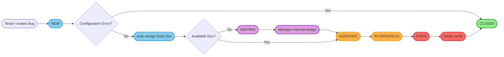

# Bug Lifecycle Diagram — Export as Image

**How to export image from Mermaid (horizontal):**
1. Copy the Mermaid code below
2. Paste it into [Mermaid Live Editor](https://mermaid.live) or Mermaid extension in VS Code
3. Export PNG/SVG → Save to `images/bug-lifecycle.png`

---

## Mermaid Code (horizontal, with color meaning)

### **Color Legend:**
- <b>Blue</b>: New/pending action
- <b>Orange</b>: In progress
- <b>Red</b>: Fixed/waiting for verification
- <b>Green</b>: Closed/completed
- <b>Purple</b>: Waiting for manual assignment

---

**After export:** Place the saved image as `bug-lifecycle.png` inside the `images/` folder so it displays in the slide.
