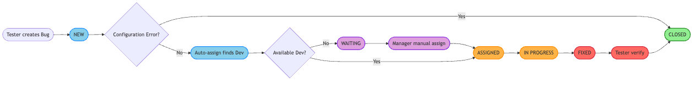

<!-- _paginate: false -->
<!-- _backgroundColor: #003366 -->
<!-- _color: white -->

# Hệ Thống Quản Lý Lỗi SAP

## Bug Tracking Management System

 

**Nền tảng:** SAP ERP — ABAP Programming
**Thời gian thực hiện:** 01/02/2026 – 29/03/2026

---

## Yêu Cầu Đề Án

**Đồ án môn học yêu cầu:** Xây dựng hệ thống quản lý lỗi (Bug Tracking) trên nền tảng SAP ERP.

- Mô phỏng quy trình: Tester ghi nhận lỗi → phân công Developer → sửa → verify → đóng
- Giải pháp **on-stack:** Chạy hoàn toàn trong SAP, không dùng Jira/Redmine bên ngoài
- Tuân thủ kiến trúc 3-tier, công nghệ chuẩn SAP (ALV, SmartForms, SAPconnect)

 

> **Phạm vi đã thực hiện:** Database, business logic, giao diện (6 T-codes), email tự động, phân quyền theo vai trò

---

## Hệ Thống Làm Được Gì

| # | Chức năng | Mô tả |
|---|-----------|-------|
| 1 | **Ghi nhận lỗi** | Form nhập liệu, tự động sinh mã Bug |
| 2 | **Thông báo tự động** | Gửi email alert ngay khi có Bug mới |
| 3 | **Phân công tự động** | Tìm Developer phù hợp, ít việc nhất |
| 4 | **Báo cáo & Dashboard** | Danh sách lỗi theo màu, thống kê tổng hợp |
| 5 | **In biên bản** | Xuất PDF theo mẫu chuẩn |
| 6 | **Đính kèm file** | Upload ảnh chụp màn hình, log lỗi |

---

## 3 Vai Trò Người Dùng

 

| Vai trò | Được làm gì |
|---------|-------------|
| **Tester** | Tạo bug, upload ảnh chứng minh, xác nhận đã sửa xong |
| **Developer** | Nhận bug, sửa lỗi, upload bằng chứng fix, từ chối nếu không phù hợp |
| **Manager** | Xem toàn bộ, phân công thủ công, xem dashboard hiệu suất |

 

> Mỗi người **chỉ làm được đúng việc của mình** — hệ thống tự chặn nếu làm sai

---

## Vòng Đời Của Một Lỗi

 

● Xanh dương — Trạng thái mới/chuẩn bị xử lý  
● Cam — Đang thực thi  
● Đỏ — Đã xử lý/chờ kiểm tra  
● Xanh lá — Đã đóng/kết thúc  
● Tím — Chờ phân công thủ công

---

## Những Gì Đã Xây Dựng

**Database (SE11):**

- 3 bảng dữ liệu: `ZBUG_TRACKER`, `ZBUG_USERS`, `ZBUG_HISTORY`
- 14 domains + 19 data elements + 1 bộ sinh số tự động

**Business Logic (10 Function Modules):**

- Tạo / Cập nhật / Đọc / Xóa bug
- Gửi email, Phân công tự động, Kiểm tra phân quyền
- Ghi lịch sử, Đính kèm file, Re-assign

**Giao diện (6 T-codes):**
`ZBUG_CREATE` · `ZBUG_UPDATE` · `ZBUG_REPORT` · `ZBUG_MANAGER` · `ZBUG_PRINT` · `ZBUG_USERS`

---

## Demo Trực Tiếp

 
 

### Chúng ta sẽ xem qua 4 bước

1. **Tạo một Bug mới** → email tự động gửi đi
2. **Xem danh sách Bug** → ALV Report với màu sắc theo trạng thái
3. **Cập nhật trạng thái** → phân quyền hoạt động
4. **Manager Dashboard** → thống kê tổng quan

---

<!-- _backgroundColor: #e8f4fd -->

## Demo — Bước 1: Tạo Bug Mới

**T-code: `ZBUG_CREATE`**

Điền vào form:

- Tiêu đề lỗi
- Mô tả chi tiết
- Module SAP (MM, SD, FI...)
- Loại lỗi (Code / Cấu hình)
- Độ ưu tiên (High / Medium / Low)

→ **Nhấn Execute** → Hệ thống tự sinh `BUG0000001`, lưu vào database, gửi email thông báo

---

<!-- _backgroundColor: #e8f4fd -->

## Demo — Bước 2: Xem Báo Cáo ALV

**T-code: `ZBUG_REPORT`**

- Danh sách tất cả Bug với màu sắc:
  - 🔵 Xanh nhạt = New
  - 🟠 Cam = Assigned
  - 🟡 Vàng = In Progress
  - 🔴 Đỏ = Fixed (chờ verify)
  - 🟢 Xanh = Closed

- Toolbar tùy chỉnh: Nút **Update Bug** và **Auto Assign**
- Click vào dòng → mở màn hình cập nhật trực tiếp

---

<!-- _backgroundColor: #e8f4fd -->

## Demo — Bước 3: Cập Nhật Bug

**T-code: `ZBUG_UPDATE`**

- Nhập Bug ID → hệ thống tự điền thông tin
- Thay đổi trạng thái theo đúng quyền hạn
- Nhập lý do thay đổi (bắt buộc)
- Lưu → **ghi lịch sử tự động** vào `ZBUG_HISTORY`

---

<!-- _backgroundColor: #e8f4fd -->

## Demo — Bước 4: Manager Dashboard

**T-code: `ZBUG_MANAGER`**

Hiển thị thống kê tổng hợp:

- Tổng số Bug đang có
- Phân loại theo trạng thái
- Bug theo Module
- Danh sách nhân sự và workload

---

## Kết Quả Đạt Được

 

| Hạng mục | Con số |
|----------|--------|
| Database objects | 3 bảng, 14 domains, 19 data elements |
| Function Modules | 10 FMs trong Function Group `ZBUG_FG` |
| T-codes | 6 transaction codes |
| SmartForm | 1 mẫu in PDF (`ZBUG_FORM`) |
| Phân quyền | 3 vai trò, kiểm soát từng thao tác |
| Ghi lịch sử | 100% thay đổi đều được audit trail |

---

## Trạng thái hiện tại & Bước tiếp theo

**Tiến độ:** Phase 0–5 đã hoàn thành
**Đang:** Phase 6 — Testing & Optimization

**Phase 6 đang làm:**

- Kiểm tra code (Code Inspector), fix lỗi cảnh báo
- Test đơn vị: tạo bug, auto-assign, phân quyền, email

---

<!-- _backgroundColor: #003366 -->
<!-- _color: white -->

## Tóm Lại

 

Hệ thống **hoàn toàn tích hợp vào SAP**, không cần phần mềm bên ngoài.

Từ lúc Tester **tạo bug** → Developer **nhận, sửa, nộp bằng chứng** → Tester **verify** → **đóng bug** — toàn bộ quy trình được tự động hóa, phân quyền rõ ràng, có dấu vết đầy đủ.

 

# Cảm ơn đã lắng nghe
