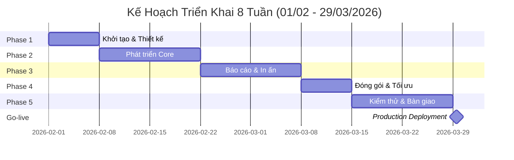
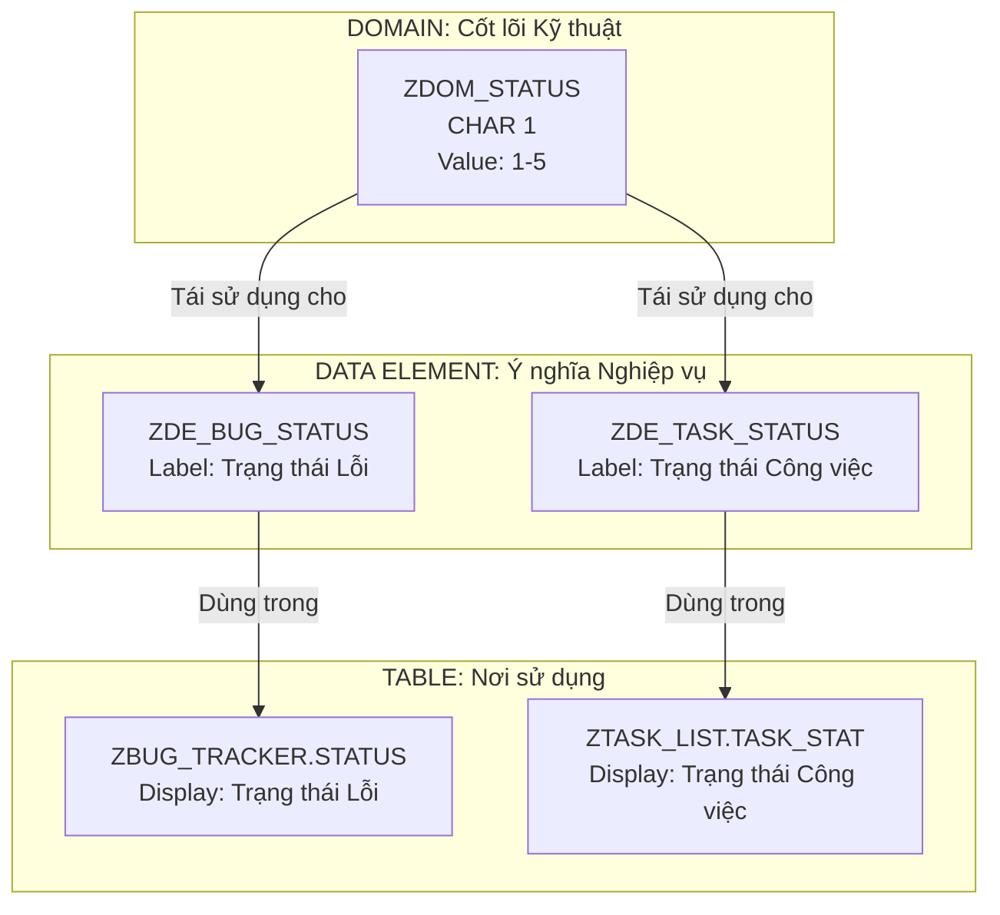
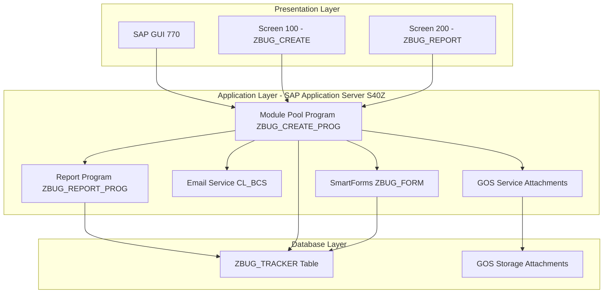

# BÁO CÁO KỸ THUẬT: HỆ THỐNG QUẢN LÝ LỖI SAP

**Dự án:** SAP Bug Tracking Management System  
**Loại:** Báo Cáo Đồ Án (Technical Project Report)  
**Ngày:** 31/01/2026  
**Phiên bản:** 1.0

---

## 1. TỔNG QUAN DỰ ÁN

### 1.1. Mục Tiêu

Xây dựng một hệ thống quản lý lỗi tập trung (Bug Tracking System) chạy trực tiếp trên nền tảng SAP ERP, nhằm:

- Cung cấp công cụ ghi nhận và theo dõi lỗi phần mềm nội bộ
- Tự động hóa quy trình thông báo và xử lý lỗi
- Tích hợp sâu với hệ thống SAP hiện tại
- Đảm bảo tính bảo mật và toàn vẹn dữ liệu

### 1.2. Phạm Vi Chức Năng

| STT | Chức năng          | Mô tả                                        | Công nghệ                         |
| --- | ------------------ | -------------------------------------------- | --------------------------------- |
| 1   | Ghi nhận lỗi       | Form nhập liệu với validation đầy đủ         | Module Pool, T-code `ZBUG_CREATE` |
| 2   | Thông báo tự động  | Gửi email alert cho Developer team           | SAPconnect (SMTP), Class `CL_BCS` |
| 3   | Báo cáo & Thống kê | Danh sách lỗi với filter, sort, export Excel | ALV Grid Display                  |
| 4   | In ấn biên bản     | Xuất PDF theo mẫu chuẩn                      | SmartForms                        |
| 5   | Đính kèm file      | Upload screenshot, log file                  | GOS (Generic Object Services)     |

### 1.3. Tài Nguyên Hệ Thống Đã Có

**Hệ thống SAP:**

- **System ID:** S40 (FU - Functional Unit)
- **Application Server:** S40Z
- **Instance:** 00
- **SAP Logon:** 770
- **Network:** EBS_SAP

**Client:** 324

**Development Accounts đã cấp:**

- **DEV-118** (Pass: Qwer123@): Quản lý lỗi
- **DEV-089** (Pass: @Anhtuoi123): Ghi nhận lỗi (SE11, SE38, SE80, SE93)
- **DEV-242** (Pass: 12345678): Email configuration (SCOT, SOST)
- **DEV-061** (Pass: @57Dt766): ALV Grid & SmartForms
- **DEV-237** (Pass: toiyeufpt): GOS attachments

**Yêu cầu cần xác nhận:**

- Developer Key cho các account DEV-*
- Package name (đề xuất: ZBUGTRACK)
- Transport layer (đề xuất: ZBT1)
- SMTP server configuration status

### 1.4. Giới Hạn Phạm Vi (Out of Scope)

> **Lưu ý:** Để đảm bảo tiến độ dự án trong 8 tuần, các hạng mục sau sẽ **KHÔNG** nằm trong phạm vi triển khai giai đoạn 1.

**Không triển khai:**

- **Giao diện Web/Mobile:** Không phát triển SAP Fiori/UI5 (chỉ dùng SAP GUI)
- **Migration dữ liệu cũ:** Không chuyển đổi từ Excel/Jira/Trello (tạo data test mới)
- **Đa ngôn ngữ:** Chỉ hỗ trợ Tiếng Việt/Anh (không hỗ trợ ngôn ngữ khác)
- **Workflow approval:** Không có quy trình phê duyệt nhiều cấp (developer tự xử lý trực tiếp)

---

## 2. KẾ HOẠCH TRIỂN KHAI CHI TIẾT

### 2.1. Timeline Tổng Quan

**Tổng thời gian:** 8 tuần (56 ngày)  
**Phương pháp:** Waterfall với weekly milestones  
**Kickoff dự kiến:** 01/02/2026 (Thứ 7)  
**Go-live dự kiến:** 29/03/2026 (Thứ 7) - **Demo Day & Final Presentation**

### 2.2. Phân Chia Giai Đoạn

**Timeline Chi Tiết:**

| Phase       | Giai đoạn           | Thời gian  | Ngày bắt đầu   | Ngày kết thúc | Duration |
| ----------- | ------------------- | ---------- | -------------- | ------------- | -------- |
| P1          | Khởi tạo & Thiết kế | Tuần 1     | 01/02/2026     | 07/02/2026    | 7 ngày   |
| P2          | Phát triển Core     | Tuần 2-3   | 08/02/2026     | 21/02/2026    | 14 ngày  |
| P3          | Báo cáo & In ấn     | Tuần 4-5   | 22/02/2026     | 07/03/2026    | 14 ngày  |
| P4          | Đóng gói & Tối ưu   | Tuần 6     | 08/03/2026     | 14/03/2026    | 7 ngày   |
| P5          | Kiểm thử & Bàn giao | Tuần 7-8   | 15/03/2026     | 28/03/2026    | 14 ngày  |
| **Go-live** | **Production**      | **Tuần 9** | **29/03/2026** | -             | -        |



### 2.3. Chi Tiết Từng Giai Đoạn

#### **Phase 1: Khởi Tạo & Thiết Kế (Tuần 1: 01/02 - 07/02)**

**Mục tiêu:** Thiết lập nền tảng kỹ thuật và hoàn thiện thiết kế database

| Công việc                    | Deliverable                      | Mô tả chi tiết                                                  | File/Artifact                                    |
| ---------------------------- | -------------------------------- | --------------------------------------------------------------- | ------------------------------------------------ |
| Setup môi trường Development | Package `ZBUGTRACK` được tạo     | Tạo package, transport layer ZBT1, development class trong SE80 | - Screenshot SE80<br>- Package setup doc         |
| Thiết kế Database Schema     | Bảng `ZBUG_TRACKER` hoàn chỉnh   | 11 fields với domains/data elements, primary key, indexes       | - SE11 table definition<br>- ER diagram          |
| Tạo Data Dictionary          | Domains & Data Elements          | 9 domains + 10 data elements với validation rules chi tiết      | - Domain list (Excel)<br>- DE documentation      |
| Phân tích đặc tả kỹ thuật    | Technical Specification Document | Chi tiết kiến trúc, API specs, workflow, security design        | - Tech Spec v1.0 (Word/PDF)<br>- Review sign-off |
| Confirm requirements         | Kickoff meeting minutes          | Developer Key, SMTP config, SmartForms template confirmed       | - Meeting notes<br>- Action items list           |

**Milestone Criteria:**

- Bảng `ZBUG_TRACKER` activated trong SE11, có thể insert test data
- Package `ZBUGTRACK` visible trong SE80, ready for development
- Tech Spec approved bởi stakeholders
- Developer có developer key, có thể modify Z-objects

**Output Files:**

1. `ZBUGTRACK_Package_Setup.pdf` - Package configuration
2. `ZBUG_TRACKER_Table_Design.xlsx` - Database schema
3. `Technical_Specification_v1.0.docx` - Full tech specs
4. `Kickoff_Meeting_Minutes_20260201.pdf` - Confirmed requirements

---

#### **Phase 2: Phát Triển Core (Tuần 2-3: 08/02 - 21/02)**

**Mục tiêu:** Xây dựng chức năng ghi nhận lỗi và gửi email

| Công việc                    | Deliverable                       | Mô tả chi tiết                                                        | File/Artifact                                                            |
| ---------------------------- | --------------------------------- | --------------------------------------------------------------------- | ------------------------------------------------------------------------ |
| Lập trình màn hình nhập liệu | Screen 100 + T-code `ZBUG_CREATE` | Module Pool với PBO/PAI, F4 help cho MODULE field, validation logic   | - Program `ZBUG_CREATE_PROG`<br>- Screen 100 layout<br>- Flow logic code |
| Implement CRUD logic         | Function Group `ZBUG_FG`          | 4 function modules: CREATE, READ, UPDATE, DELETE bug records          | - Function Group `ZBUG_FG`<br>- FM documentation                         |
| Validation rules             | Check functions                   | Mandatory field check, format validation, duplicate check             | - Validation FM list<br>- Test cases                                     |
| Cấu hình SMTP                | SCOT setup hoàn tất               | SCOT configuration, test email send, troubleshoot connectivity        | - SCOT config screenshot<br>- Test email log                             |
| Lập trình gửi email          | Email notification function       | Class `CL_BCS` implementation, email template, dynamic recipient list | - Program `ZBUG_EMAIL_SEND`<br>- Email template HTML                     |
| Tích hợp GOS                 | Attachment functionality          | GOS service integration, file upload/download, link to BUG_ID         | - GOS configuration doc<br>- Attachment test screenshots                 |

**Milestone Criteria:**

- User có thể mở T-code `ZBUG_CREATE`, nhập đầy đủ fields, save thành công
- Data xuất hiện trong bảng `ZBUG_TRACKER` (verify qua SE16)
- **Email/Notification tự động gửi sau khi save bug:**
  - **Plan A:** SMTP email đến developer team (best case)
  - **Plan B:** SAP Inbox notification hoặc Popup display (fallback)
  - **Nội dung chứa:** BUG_ID, Title, Priority, Reporter, Link to detail
- User có thể attach file (screenshot, log) vào bug record
- Validation reject invalid data (title < 10 chars, empty fields, etc.)

**Output Files:**

1. `ZBUG_CREATE_PROG.abap` - Main program source code
2. `ZBUG_FG_Documentation.pdf` - Function module specs
3. `Email_Template_Bug_Notification.html` - Email design
4. `Phase2_Demo_Video.mp4` - End-to-end demo recording

---

#### **Phase 3: Báo Cáo & In Ấn (Tuần 4-5: 22/02 - 07/03)**

**Mục tiêu:** Xây dựng reporting và printing capabilities

| Công việc                | Deliverable                           | Mô tả chi tiết                                                      | File/Artifact                                             |
| ------------------------ | ------------------------------------- | ------------------------------------------------------------------- | --------------------------------------------------------- |
| Lập trình ALV Grid       | Report program + T-code `ZBUG_REPORT` | ALV Grid với REUSE_ALV_GRID_DISPLAY, field catalog, layout setup    | - Program `ZBUG_REPORT_PROG`<br>- ALV config code         |
| Implement Filter/Sort    | ALV features                          | Dynamic filter by STATUS/PRIORITY/MODULE, sort by date, subtotals   | - Filter logic implementation<br>- User guide screenshots |
| Dashboard thống kê       | Summary header                        | SQL aggregation (COUNT GROUP BY STATUS), display on ALV top-of-page | - Summary calculation FM<br>- Dashboard mockup            |
| Drill-down functionality | Detail screen                         | Clickable BUG_ID → detail popup, edit capability, history log       | - Detail screen 200<br>- Navigation code                  |
| Thiết kế SmartForm       | Form `ZBUG_FORM`                      | Logo, header, bug details table, signature section, page numbering  | - SmartForm `ZBUG_FORM`<br>- PDF sample output            |
| Print function           | PDF export                            | Call SmartForm from ALV, generate PDF, email/download options       | - Print program wrapper<br>- Integration test log         |

**Milestone Criteria:**

- ALV report hiển thị đầy đủ bugs với pagination
- Filter/Sort hoạt động, user có thể xuất Excel
- Dashboard header hiển thị: X New, Y In Progress, Z Fixed bugs
- Click BUG_ID mở detail screen với full info
- SmartForm generate PDF đúng format, có logo công ty
- PDF có thể email hoặc save local

**Output Files:**

1. `ZBUG_REPORT_PROG.abap` - Report program
2. `ZBUG_FORM_Design.pdf` - SmartForm layout spec
3. `ALV_User_Guide.pdf` - End-user report guide
4. `Sample_Bug_Report.pdf` - PDF output example

---

#### **Phase 4: Đóng Gói & Tối Ưu (Tuần 6: 08/03 - 14/03)**

**Mục tiêu:** Code quality và performance optimization

| Công việc           | Deliverable           | Mô tả chi tiết                                                                     | File/Artifact                                      |
| ------------------- | --------------------- | ---------------------------------------------------------------------------------- | -------------------------------------------------- |
| Code review         | Code Inspector report | Chạy Code Inspector (SCI), fix critical/serious errors, refactor warnings          | - SCI report PDF<br>- Fix commit log               |
| Performance testing | Performance analysis  | Load test với 10K records, measure response time, optimize slow queries            | - Performance test report<br>- ST05 trace analysis |
| Security audit      | Authorization objects | Tạo authorization objects Z_BUG_ACT, Z_BUG_STA, test role assignments              | - Auth object definitions<br>- Role config guide   |
| Transport Request   | TR package            | Package all Z-objects vào TR, export, ready cho import to QA                       | - TR number & contents list<br>- Export log        |
| Documentation       | Technical docs        | ABAP code comments, function module docs, integration specs, troubleshooting guide | - API documentation PDF<br>- Developer handbook    |

**Milestone Criteria:**

- Code Inspector: 0 critical errors, < 5 warnings
- Performance: ALV report load < 2s with 5000 records
- Security: Authorization check hoạt động, unauthorized user bị reject
- Transport Request: Exported thành công, verified completeness
- Documentation: 100% function modules có description, all T-codes documented

**Output Files:**

1. `Code_Inspector_Report_Final.pdf` - SCI clean report
2. `Performance_Test_Results.xlsx` - Response time metrics
3. `Transport_Request_K900XXXX.zip` - TR export file
4. `Technical_Documentation_v1.0.pdf` - Complete API docs

---

#### **Phase 5: Kiểm Thử & Bàn Giao (Tuần 7-8: 15/03 - 28/03)**

**Mục tiêu:** UAT và knowledge transfer

| Công việc       | Deliverable              | Mô tả chi tiết                                                           | File/Artifact                                                        |
| --------------- | ------------------------ | ------------------------------------------------------------------------ | -------------------------------------------------------------------- |
| UAT support     | Test scenarios           | 50+ test cases (create, edit, delete, report, print), execute with users | - UAT test case list Excel<br>- Test execution log                   |
| Bug fixing      | Bug fix log              | Track all UAT bugs in Jira/Excel, prioritize, fix, re-test, sign-off     | - Bug tracking sheet<br>- Fix changelog                              |
| User training   | Training materials       | 2-hour workshop, hands-on practice, Q&A session, record video            | - Training slides PDF<br>- Training video MP4<br>- Exercise workbook |
| Documentation   | User Manual (Vietnamese) | Step-by-step guide với screenshots, FAQ, troubleshooting tips            | - User Manual v1.0 PDF (Vietnamese)<br>- Quick reference card        |
| Go-live support | Production deployment    | Import TR to production, smoke test, monitor first day, on-call support  | - Go-live checklist<br>- Deployment log<br>- Issue log (if any)      |

**Milestone Criteria:**

- 100% UAT test cases passed (all critical scenarios working)
- 0 high-priority bugs remaining (all UAT bugs resolved or postponed to Phase 2)
- Key users trained (attendance sheet signed)
- User Manual approved by stakeholders
- System stable in production for 48 hours post go-live
- Handover complete (knowledge transfer doc signed)

**Output Files:**

1. `UAT_Test_Results_Summary.xlsx` - All test case results
2. `Bug_Fix_Log_Phase5.xlsx` - Bug tracking sheet
3. `User_Training_Materials_vn.pdf` - Complete training pack
4. `User_Manual_Bug_Tracking_v1.0.pdf` - End-user guide (Vietnamese)
5. `Go_Live_Report_20260329.pdf` - Deployment summary & sign-off

---

## 3. THIẾT KẾ DATABASE CHI TIẾT

> **LƯU Ý QUAN TRỌNG:**  
> Schema database dưới đây là **thiết kế ban đầu (baseline)** dựa trên phân tích requirements. Trong quá trình triển khai thực tế:
>
> - Các field có thể được **thêm/bớt/điều chỉnh** tuỳ theo feedback từ UAT và business needs.
> - Data types và validation rules có thể **thay đổi** để phù hợp với SAP system cụ thể (S40).
> - Index strategy sẽ được **optimize** dựa trên performance testing với data thực tế.
> - Tất cả thay đổi sẽ được **document** trong change log và phải được approve trước khi implement.

### 3.1. Tổng Quan Kiến Trúc Dữ Liệu

Hệ thống sử dụng **1 bảng chính** (`ZBUG_TRACKER`) để lưu trữ toàn bộ thông tin vòng đời của bug. Thiết kế tuân thủ nguyên tắc:

- **Normalization**: Tránh dữ liệu trùng lặp
- **SAP Standards**: Tuân thủ naming convention và data types
- **Scalability**: Hỗ trợ mở rộng trong tương lai
- **Performance**: Index được thiết kế tối ưu cho query

**Các field BẮT BUỘC (mandatory):**

- `MANDT`, `BUG_ID` (primary key)
- `TITLE`, `DESC_TEXT`, `MODULE`, `PRIORITY`, `STATUS` (business critical)
- `REPORTER`, `CREATED_AT` (audit trail)

**Các field TUỲ CHỌN (optional - có thể thêm sau):**

- `DEV_ID` (optional khi STATUS = New)
- `CLOSED_AT` (only when STATUS = Closed)
- Các field mở rộng: `SEVERITY`, `ENVIRONMENT`, `AFFECTED_VERSION`, etc. (if needed)

### 3.2. Bảng ZBUG_TRACKER - Chi Tiết Từng Field

#### **Cấu Trúc Bảng**

| Field Name       | Data Element     | Domain        | Type   | Length | Key | Description          | Validation Rules                                    |
| ---------------- | ---------------- | ------------- | ------ | ------ | --- | -------------------- | --------------------------------------------------- |
| **MANDT**        | MANDT            | MANDT         | CLNT   | 3      | ✓   | Client ID            | Tự động từ hệ thống                                 |
| **BUG_ID**       | ZDE_BUG_ID       | ZDOM_BUG_ID   | CHAR   | 10     | ✓   | Mã lỗi (Primary Key) | Format: BUG + 7 digits (e.g., BUG0000001)           |
| **TITLE**        | ZDE_BUG_TITLE    | ZDOM_TITLE    | CHAR   | 100    |     | Tiêu đề lỗi          | Mandatory, min 10 chars                             |
| **DESC_TEXT**    | ZDE_BUG_DESC     | ZDOM_LONGTEXT | STRING |        |     | Mô tả chi tiết       | Mandatory, min 20 chars                             |
| **MODULE**       | ZDE_SAP_MODULE   | ZDOM_MODULE   | CHAR   | 20     |     | Phân hệ SAP          | Values: MM, SD, FI, CO, PP, etc.                    |
| **PRIORITY**     | ZDE_PRIORITY     | ZDOM_PRIORITY | CHAR   | 1      |     | Độ ưu tiên           | H=High, M=Medium, L=Low                             |
| **STATUS**       | ZDE_BUG_STATUS   | ZDOM_STATUS   | CHAR   | 1      |     | Trạng thái           | 1=New, 2=Assigned, 3=In Progress, 4=Fixed, 5=Closed |
| **REPORTER**     | ZDE_USERNAME     | ZDOM_USER     | CHAR   | 12     |     | Người báo lỗi        | Tự động từ SY-UNAME                                 |
| **DEV_ID**       | ZDE_USERNAME     | ZDOM_USER     | CHAR   | 12     |     | Developer xử lý      | Lookup từ user master                               |
| **CREATED_AT**   | ZDE_CREATED_DATE | ZDOM_DATE     | DATS   | 8      |     | Ngày tạo             | Tự động từ SY-DATUM                                 |
| **CREATED_TIME** | ZDE_CREATED_TIME | ZDOM_TIME     | TIMS   | 6      |     | Giờ tạo              | Tự động từ SY-UZEIT                                 |
| **CLOSED_AT**    | ZDE_CLOSED_DATE  | ZDOM_DATE     | DATS   | 8      |     | Ngày đóng            | Tự động khi STATUS = 5                              |

---

#### **⚠️ LƯU Ý KỸ THUẬT: Field DESC_TEXT (STRING type)**

**Vấn đề:** SAP ALV Grid không hiển thị trực tiếp field kiểu `STRING` trong cột table (sẽ hiển thị `*String` thay vì nội dung).

**Giải pháp:**

**Option 1 (Đơn giản - cho người mới):**

- Đổi `DESC_TEXT` sang `CHAR(255)` nếu mô tả ngắn đủ dùng
- **Ưu điểm:** ALV Grid hiển thị bình thường
- **Nhược điểm:** Giới hạn 255 ký tự

**Option 2 (Chuẩn Enterprise - RECOMMENDED):**

- Giữ `DESC_TEXT` là `STRING` (support long text không giới hạn)
- Trong ALV Grid: Hiển thị 50 ký tự đầu tiên + "..." (dùng CONCATENATE)
- Implement Drill-down: Click BUG_ID → Popup detail screen → Hiển thị full DESC_TEXT trong Text Editor control

**Code snippet for ALV (Option 2):**

```abap
DATA: lv_short_desc TYPE string.

" Cắt chuỗi 50 ký tự đầu
IF strlen( wa_bug-desc_text ) > 50.
  lv_short_desc = wa_bug-desc_text+0(50).
  CONCATENATE lv_short_desc '...' INTO wa_alv-short_desc.
ELSE.
  wa_alv-short_desc = wa_bug-desc_text.
ENDIF.
```

**Decision:** Chúng ta chọn **Option 2** để học SAP best practice và xử lý long text đúng cách.

---

#### **Giải Thích Chi Tiết Các Field**

**1. MANDT (Client ID)**

- **Mục đích**: Phân biệt dữ liệu giữa các client trong SAP
- **Bắt buộc**: Có (SAP standard requirement)
- **Tự động**: Hệ thống tự điền

**2. BUG_ID (Mã Lỗi)**

- **Mục đích**: Primary key duy nhất cho mỗi bug
- **Format**: BUG + 7 số (VD: BUG0000001, BUG0000123)
- **Auto-generate**: Yes (dùng Number Range Object)

**3. TITLE (Tiêu Đề)**

- **Mục đích**: Mô tả ngắn gọn vấn đề
- **Validation**: Minimum 10 ký tự, maximum 100 ký tự
- **UI**: Input field, mandatory

**4. DESC_TEXT (Mô Tả Chi Tiết)**

- **Mục đích**: Mô tả đầy đủ bug, steps to reproduce, expected vs actual
- **Type**: STRING (unlimited length)
- **UI**: Text Editor (multi-line)
- **Note**: Xem phần ⚠️ LƯU Ý KỸ THUẬT ở trên về cách hiển thị trong ALV

**5. MODULE (Phân Hệ SAP)**

- **Mục đích**: Phân loại bug theo module SAP
- **Values**: MM, SD, FI, CO, PP, QM, PM, WM, HR
- **UI**: Dropdown (F4 help)

**6. PRIORITY (Độ Ưu Tiên)**

- **Mục đích**: Phân loại mức độ quan trọng
- **Values**:
  - `H` = High (Ưu tiên cao, cần xử lý gấp)
  - `M` = Medium (Ưu tiên trung bình)
  - `L` = Low (Ưu tiên thấp, có thể xử lý sau)
- **UI**: Radio button hoặc dropdown

**7. STATUS (Trạng Thái)**

- **Mục đích**: Theo dõi vòng đời xử lý lỗi
- **Values**:
  - `1` = New (Mới tạo, chưa assign)
  - `2` = Assigned (Đã giao cho developer)
  - `3` = In Progress (Đang xử lý)
  - `4` = Fixed (Đã sửa, chờ verify)
  - `5` = Closed (Đã đóng, hoàn tất)
- **Default**: 1
- **Workflow**: 1 → 2 → 3 → 4 → 5

**8. REPORTER (Người Báo Lỗi)**

- **Mục đích**: Ghi nhận ai là người phát hiện lỗi
- **Auto-fill**: Từ `SY-UNAME` (user đang login)
- **Read-only**: Yes (không cho sửa)

**9. DEV_ID (Developer Xử Lý)**

- **Mục đích**: Assign bug cho developer cụ thể
- **UI**: F4 help lookup từ user master
- **Optional**: Yes (có thể để trống khi STATUS = 1)

**10. CREATED_AT & CREATED_TIME (Ngày Giờ Tạo)**

- **Mục đích**: Audit trail, tracking timeline
- **Auto-fill**: Từ `SY-DATUM` và `SY-UZEIT`
- **Read-only**: Yes

**11. CLOSED_AT (Ngày Đóng)**

- **Mục đích**: Tính toán thời gian xử lý (SLA)
- **Auto-fill**: Khi STATUS chuyển sang 5 (Closed)
- **Calculation**: `CLOSED_AT - CREATED_AT` = Resolution time

### 3.3. Kiến Trúc Dữ Liệu 2 Lớp (Data Dictionary Architecture)

> **Giải thích SAP Data Dictionary:**  
> SAP sử dụng kiến trúc **2 lớp** để định nghĩa dữ liệu, tách biệt giữa **Đặc tính Kỹ thuật** (Domain) và **Ý nghĩa Nghiệp vụ** (Data Element). Điều này giúp đảm bảo tính nhất quán và tái sử dụng trên toàn hệ thống.

#### **Nguyên lý "Chiếc Hộp và Nhãn Dán"**

Để hiểu cách SAP thiết kế Data Dictionary, hãy hình dung quy tắc này như **"Chiếc Hộp và Nhãn Dán"**:

**1. DOMAIN (Chiếc Hộp - Kỹ thuật):**

- Là **cái vỏ hộp rỗng**. Nó chỉ quy định cái hộp này chứa được cái gì và to bao nhiêu.
- **Ví dụ:** Hộp `ZDOM_CODE` quy định: _"Tôi chứa được 10 ký tự chữ cái"_
- Nó **không quan tâm** bên trong là Mã Lỗi, Mã Nhân Viên hay Mã Phòng Ban. Nó chỉ biết là "10 ký tự CHAR".
- **Vai trò:** Đảm bảo **máy tính** hiểu cách lưu trữ dữ liệu.

**2. DATA ELEMENT (Nhãn Dán - Nghiệp vụ):**

- Là **cái tem nhãn** dán lên chiếc hộp để người dùng hiểu cái hộp đó đựng gì.
- Nó quy định: Tên hiển thị trên màn hình (Label), mô tả ý nghĩa (Documentation), trợ giúp (F4 Help).
- **Ví dụ:**
  - Dán nhãn _"Mã Lỗi"_ lên hộp `ZDOM_CODE` → Ta có Data Element `ZDE_BUG_ID`
  - Dán nhãn _"Mã Dự Án"_ lên hộp `ZDOM_CODE` → Ta có Data Element `ZDE_PROJ_ID`
- **Vai trò:** Đảm bảo **người dùng** hiểu mình đang nhập cái gì.

**3. TABLE FIELD (Vị trí đặt hộp):**

- Là việc **đặt cái hộp đã dán nhãn** vào một cái kệ cụ thể (Bảng Database).
- **Ví dụ:** Đặt Data Element `ZDE_BUG_ID` vào field `BUG_ID` của bảng `ZBUG_TRACKER`.

---

#### **Sơ đồ minh họa (Visualization)**



**Giải thích diagram:**

- **1 Domain** (`ZDOM_STATUS`) được dùng cho **2 Data Elements** khác nhau
- Mỗi Data Element gắn ý nghĩa khác nhau: "Trạng thái Lỗi" vs "Trạng thái Công việc"
- Cùng cấu trúc kỹ thuật (CHAR 1, value 1-5) nhưng khác ngữ nghĩa nghiệp vụ

---

#### **Bảng so sánh: Domain vs Data Element**

| Đặc điểm               | DOMAIN (Kỹ thuật)                                                                                  | DATA ELEMENT (Nghiệp vụ)                                                                                          |
| ---------------------- | -------------------------------------------------------------------------------------------------- | ----------------------------------------------------------------------------------------------------------------- |
| **Định nghĩa cái gì?** | **Kiểu dữ liệu:** CHAR, INT, DATS...<br>**Độ dài:** 10, 20, 100...<br>**Value range:** 1-5, A-Z... | **Nhãn hiển thị:** "Mã Lỗi", "Bug ID"...<br>**Trợ giúp (F4):** List giá trị gợi ý<br>**Documentation:** Help text |
| **Vai trò**            | Đảm bảo máy tính hiểu cách lưu trữ                                                                 | Đảm bảo người dùng hiểu mình đang nhập gì                                                                         |
| **Ví dụ thực tế**      | "Một đoạn mã 10 ký tự"                                                                             | Lúc là "Mã Lỗi", lúc là "Mã Phòng Ban"                                                                            |
| **Lợi ích chính**      | Nếu muốn tăng độ dài từ 10 → 15, chỉ sửa Domain 1 lần, tất cả bảng auto-update                     | Việt hóa/đa ngôn ngữ dễ dàng (Label tiếng Việt/Anh)                                                               |

---

#### **A. Domains (SE11) - Tầng 1: Technical Constraints**

**Vai trò:** Domain định nghĩa **technical attributes** (data type, length, value range) mà không quan tâm đến business meaning.

**Tại sao cần Domain?**

- **Reusability**: 1 domain có thể dùng cho nhiều data elements (VD: `ZDOM_USER` cho cả REPORTER và DEV_ID)
- **Centralized validation**: Thay đổi 1 chỗ, apply cho tất cả fields dùng domain đó
- **Consistency**: Đảm bảo cùng 1 loại dữ liệu luôn có format giống nhau

| Domain Name     | Data Type | Length | Value Range                        | Description     | Ví dụ sử dụng                  |
| --------------- | --------- | ------ | ---------------------------------- | --------------- | ------------------------------ |
| `ZDOM_BUG_ID`   | CHAR      | 10     | BUG0000001-BUG9999999              | Bug ID format   | Field BUG_ID                   |
| `ZDOM_TITLE`    | CHAR      | 100    | -                                  | Short text      | Field TITLE                    |
| `ZDOM_LONGTEXT` | STRING    | -      | -                                  | Long text       | Field DESC_TEXT                |
| `ZDOM_MODULE`   | CHAR      | 20     | MM, SD, FI, CO, PP, QM, PM, WM, HR | SAP modules     | Field MODULE (với value table) |
| `ZDOM_PRIORITY` | CHAR      | 1      | H, M, L                            | Priority levels | Field PRIORITY                 |
| `ZDOM_STATUS`   | CHAR      | 1      | 1, 2, 3, 4, 5                      | Bug status      | Field STATUS                   |
| `ZDOM_USER`     | CHAR      | 12     | -                                  | SAP username    | REPORTER, DEV_ID (reuse!)      |
| `ZDOM_DATE`     | DATS      | 8      | -                                  | Date            | CREATED_AT, CLOSED_AT          |
| `ZDOM_TIME`     | TIMS      | 6      | -                                  | Time            | CREATED_TIME                   |

---

#### **B. Data Elements (SE11) - Tầng 2: Semantic Layer**

**Vai trò:** Data Element gắn **business meaning** (field labels, documentation, search help) cho domain.

**Tại sao cần Data Element?**

- **Field labels**: Hiển thị tên field trên UI (Short/Medium/Long variants)
- **F4 help**: Gắn search help (VD: `ZDE_SAP_MODULE` có F4 help list modules)
- **Documentation**: Giải thích field này dùng để làm gì
- **Multiple semantic meanings**: Cùng domain `ZDOM_USER` nhưng có 2 data elements: `ZDE_USERNAME` (for REPORTER) và có thể tạo `ZDE_DEVELOPER` (for DEV_ID)

| Data Element       | Domain        | Field Label (Short) | Field Label (Medium) | Field Label (Long)   | Dùng cho field   |
| ------------------ | ------------- | ------------------- | -------------------- | -------------------- | ---------------- |
| `ZDE_BUG_ID`       | ZDOM_BUG_ID   | Bug ID              | Bug ID               | Bug Tracking ID      | BUG_ID           |
| `ZDE_BUG_TITLE`    | ZDOM_TITLE    | Title               | Bug Title            | Bug Title            | TITLE            |
| `ZDE_BUG_DESC`     | ZDOM_LONGTEXT | Description         | Bug Description      | Detailed Description | DESC_TEXT        |
| `ZDE_SAP_MODULE`   | ZDOM_MODULE   | Module              | SAP Module           | SAP Module           | MODULE           |
| `ZDE_PRIORITY`     | ZDOM_PRIORITY | Priority            | Priority             | Priority Level       | PRIORITY         |
| `ZDE_BUG_STATUS`   | ZDOM_STATUS   | Status              | Bug Status           | Bug Status           | STATUS           |
| `ZDE_USERNAME`     | ZDOM_USER     | User                | Username             | SAP Username         | REPORTER, DEV_ID |
| `ZDE_CREATED_DATE` | ZDOM_DATE     | Created             | Created Date         | Created Date         | CREATED_AT       |
| `ZDE_CREATED_TIME` | ZDOM_TIME     | Time                | Created Time         | Created Time         | CREATED_TIME     |
| `ZDE_CLOSED_DATE`  | ZDOM_DATE     | Closed              | Closed Date          | Closed Date          | CLOSED_AT        |

**Ví dụ minh họa về tính tái sử dụng:**

```
Domain: ZDOM_USER (CHAR 12)
    ↓
Data Element: ZDE_USERNAME
    → Label: "Người báo lỗi"
    → Used in: ZBUG_TRACKER.REPORTER
    ↓
Data Element: ZDE_DEVELOPER (có thể tạo thêm)
    → Label: "Developer xử lý"
    → Used in: ZBUG_TRACKER.DEV_ID
```

**→ Cùng 1 Domain, nhưng 2 ý nghĩa nghiệp vụ khác nhau!**

---

#### **C. Quy Trình Áp Dụng: Domain → Data Element → Table Field**

> **Tóm tắt quy trình "Hộp và Nhãn":**
>
> 1. Chọn Hộp (Domain) → 2. Dán Nhãn (Data Element) → 3. Đặt lên Kệ (Table Field)

##### **4 Lợi ích cụ thể của 2-layer architecture:**

**1. Reusability (Tái sử dụng) - "Một hộp, nhiều nhãn":**

- 1 domain → nhiều data elements → nhiều fields
- **Ví dụ thực tế:**

  ```
  📦 ZDOM_USER (CHAR 12) - Cái hộp
    ├─ 🏷️ ZDE_USERNAME → REPORTER field (Nhãn: "Người báo lỗi")
    ├─ 🏷️ ZDE_DEVELOPER → DEV_ID field (Nhãn: "Developer xử lý")
    └─ 🏷️ ZDE_APPROVER → APPROVER field (Nhãn: "Người phê duyệt")

  → Cùng 1 hộp (CHAR 12), nhưng 3 nhãn nghiệp vụ khác nhau!
  ```

**2. Centralized Change Management - "Sửa hộp 1 lần, update toàn bộ":**

- Thay đổi Domain 1 lần → Tất cả fields sử dụng domain đó tự động update
- **Ví dụ:** Tăng BUG_ID từ CHAR(10) → CHAR(15)
  - Chỉ cần sửa domain ZDOM_BUG_ID
  - SAP tự động update: table field, screen field, validation, ALV column width
  - Traditional SQL: Phải ALTER TABLE từng chỗ, dễ bỏ sót

**3. Consistency Enforcement - "Cùng hộp = Cùng quy chuẩn":**

- Cùng domain → Guarantee same validation rules trên toàn hệ thống
- **Ví dụ:** `ZDOM_STATUS` với value range 1-5
  - Mọi fields dùng domain này đều **bắt buộc** chỉ accept 1-5
  - Không thể có field STATUS nào accept 1-10 (avoid human error)

**4. Field Help & Documentation - "Nhãn dán chứa thông tin hướng dẫn":**

- Data Element (nhãn) carries:
  - F4 help (dropdown list)
  - Field labels (Short/Medium/Long cho responsive UI)
  - Documentation text (Help)
- **Lợi ích:** Không cần hardcode trong screen programming → Centralized UX

---

**Best Practice Summary:**

- **Domain (Hộp):** Focus on **what data type** (CHAR, INT, DATE, etc.) và **technical rules**
- **Data Element (Nhãn):** Focus on **what business meaning** (User, Date, Status, etc.) và **UI labels**
- **Table Field (Vị trí):** Use Data Element, inherit everything automatically

**Kết luận về "Hộp và Nhãn":**

2-layer architecture là **investment ban đầu** (phải tạo domain → DE → field), nhưng **save massive time** trong maintenance và **guarantee consistency** across entire enterprise system. Đây là yếu tố giúp SAP scale từ startup đến Fortune 500 mà vẫn maintain được quality.

### 3.4. Indexes & Performance

#### **Primary Index**

- **Fields**: MANDT + BUG_ID
- **Type**: Unique
- **Auto-created**: Yes (by SAP)

**Performance Note:**

> Với data volume dự kiến < 100 records (test data), primary index (MANDT + BUG_ID) là đủ. Secondary indexes chỉ cần thiết khi data > 10,000 records trong môi trường production thực tế.

---

## 4. KIẾN TRÚC KỸ THUẬT

### 4.1. 3-Tier Architecture

Hệ thống tuân thủ kiến trúc 3 tầng chuẩn của SAP:



**Chi tiết từng tầng:**

**1. Presentation Layer (Tầng trình bày):**

- SAP GUI 770 (SAP Logon client)
- Custom screens (ZBUG_CREATE, ZBUG_REPORT)
- User interaction & input validation

**2. Application Layer (Tầng xử lý):**

- ABAP programs (Module Pool, Report)
- Business logic & data processing
- Integration services (Email, GOS, SmartForms)

**3. Database Layer (Tầng dữ liệu):**

- ZBUG_TRACKER table (main data storage)
- GOS storage (file attachments)

### 4.2. Component Breakdown

| Component          | Technology                    | Purpose                  |
| ------------------ | ----------------------------- | ------------------------ |
| **Input Form**     | Module Pool (Dynpro)          | Nhập liệu bug mới        |
| **Report Display** | ALV Grid                      | Hiển thị danh sách bugs  |
| **Email Service**  | SAPconnect (SCOT) + CL_BCS    | Gửi notification tự động |
| **Attachment**     | GOS (Generic Object Services) | Lưu trữ file đính kèm    |
| **Print Form**     | SmartForms                    | Generate PDF             |
| **Database**       | Transparent Table             | Persistent storage       |

### 4.3. Integration Points

**Email Integration:**

- SCOT (T-code) configured với SMTP server
- Class `CL_BCS` để gửi email programmatically
- Template HTML cho email body

**File Attachment (GOS):**

- GOS service link files với business object (BUG_ID)
- Support upload: JPG, PNG, PDF, TXT, LOG files
- Max file size: Tuỳ SAP system config (thường 10-25MB)

**SmartForms:**

- Design form layout trong T-code SMARTFORMS
- Generate PDF runtime với data từ ZBUG_TRACKER
- Support logo, header, footer, page numbering

### 4.4. Security & Authorization

> **Lưu ý:** Đồ án sử dụng quyền mặc định của các SAP user (DEV-*), không implement custom authorization objects hoặc roles (đây là tính năng enterprise, nằm ngoài phạm vi đồ án).

**Phân quyền đơn giản:**

- User có quyền DEV-083 → Có thể tạo/sửa Z-objects
- User có quyền trên account → Có thể sử dụng toàn bộ chức năng hệ thống

---

## 5. CÂU HỎI CẦN XÁC NHẬN TRONG KICKOFF MEETING

> **Mục đích:** Đảm bảo tất cả prerequisites được confirm trước khi bắt đầu Phase 1 development.

### 5.1. Technical Prerequisites (CRITICAL - Must have)

> **Lưu ý:** Chỉ list câu hỏi cần confirm với **stakeholders bên ngoài**. Các quyết định nội bộ Development Team sẽ tự xử lý.

| #   | Câu hỏi                                                             | Nếu chưa có / Cách kiểm tra                                                                                                      | Người cung cấp thông tin    |
| --- | ------------------------------------------------------------------- | -------------------------------------------------------------------------------------------------------------------------------- | --------------------------- |
| 1   | **Developer Key:** Các account DEV-* đã được cấp Developer Key chưa? | **Pre-check:** Vào SE38, tạo program `ZTEST`. Nếu tạo được = có key rồi.<br>**Nếu chưa có:** Request từ SAP Admin (cần 1-3 ngày) | SAP Basis Team / Giảng viên |
| 2   | **Transport Layer:** Transport layer nào?                           | Config transport route (10 phút)                                                                                                 | SAP Basis Team              |
| 3   | **SMTP Configuration:** SCOT đã config SMTP server chưa?            | Setup SMTP trong Week 1 (1-2 ngày)                                                                                               | SAP Basis Team              |

**Package Name:** Development Team sẽ tự quyết định và tạo package `ZBUGTRACK` trong SE80.

### 5.2. Business Requirements (HIGH - Ảnh hưởng design)

| #   | Câu hỏi                                                          | Tác động nếu không có                | Người cung cấp thông tin |
| --- | ---------------------------------------------------------------- | ------------------------------------ | ------------------------ |
| 4   | **UAT Environment:** Test trên S40 hay có system riêng (DEV/QA)? | Có thể test trên S40 nếu không có QA | SAP Basis Team           |

---

## 6. DELIVERABLES

### 6.1. Technical Deliverables

**ABAP Source Code:**

- Module Pool Program: `ZBUG_CREATE_PROG` (input form với screens)
- Report Program: `ZBUG_REPORT_PROG` (ALV Grid display)
- SmartForm: `ZBUG_FORM` (PDF generation template)

**Database Objects:**

- Transparent Table: `ZBUG_TRACKER` (1 table)
- Domains: 8 objects (ZDOM_BUG_ID, ZDOM_TITLE, ZDOM_LONGTEXT, ZDOM_MODULE, ZDOM_PRIORITY, ZDOM_STATUS, ZDOM_USER, ZDOM_DATE, ZDOM_TIME)
- Data Elements: 10 objects (ZDE_BUG_ID, ZDE_BUG_TITLE, ZDE_BUG_DESC, ZDE_SAP_MODULE, ZDE_PRIORITY, ZDE_BUG_STATUS, ZDE_USERNAME, ZDE_CREATED_DATE, ZDE_CREATED_TIME, ZDE_CLOSED_DATE)

**Package & Transport:**

- Package: `ZBUGTRACK` (chứa toàn bộ objects)
- Transport Request: 1 TR (để deploy sang system khác)

**Documentation:**

- Technical Specification: File này (client-report.md)
- Developer Guide: Hướng dẫn cài đặt và maintain

### 6.2. User Deliverables

- **User Manual (Vietnamese):** PDF, 10-15 pages, screenshot từng bước
- **Training Materials:** Slide PowerPoint cho workshop
- **Quick Reference Card:** 1-page cheat sheet (T-codes, common tasks)

### 6.3. Project Management

- **Weekly Status Reports:** Email update mỗi tuần (progress, blockers, next steps)
- **UAT Test Cases:** Excel file với 15-20 test scenarios
- **Demo Day Checklist:** Preparation checklist cho final presentation

---

## 7. KẾT LUẬN

Hệ thống SAP Bug Tracking Management được thiết kế với kiến trúc vững chắc, tuân thủ best practices của SAP. Với timeline 8 tuần (01/02 - 29/03/2026) và database schema chi tiết, dự án sẵn sàng để triển khai.

**Critical Success Factors:**

1. Confirm Developer Key trong kickoff meeting
2. SMTP setup hoàn tất trong Week 1
3. Weekly progress review để track milestone
4. UAT testing kỹ lưỡng trước go-live

**Next Steps:**

| Step | Action                                  | Người thực hiện          | Due Date   |
| ---- | --------------------------------------- | ------------------------ | ---------- |
| 1    | Review thiết kế với Giảng viên          | Sinh viên + GV hướng dẫn | 31/01/2026 |
| 2    | Setup môi trường SAP (Dev Key, Package) | Sinh viên (Development)  | 01/02/2026 |
| 3    | Kickoff Phase 1 - Database design       | Sinh viên (Development)  | 01/02/2026 |

---

## PHỤ LỤC A: GLOSSARY - THUẬT NGỮ SAP

> **Mục đích:** Giải thích các thuật ngữ và công nghệ SAP được sử dụng trong document này.

### A.1. Transaction Codes (T-codes)

| T-code         | Tên đầy đủ                 | Giải thích                                                    | Vai trò trong dự án                               |
| -------------- | -------------------------- | ------------------------------------------------------------- | ------------------------------------------------- |
| **SE11**       | ABAP Dictionary            | Tool để tạo database objects (tables, domains, data elements) | Tạo ZBUG_TRACKER table và Data Dictionary objects |
| **SE38**       | ABAP Editor                | Editor để viết ABAP programs                                  | Viết report programs (ZBUG_REPORT)                |
| **SE80**       | Object Navigator           | IDE tổng hợp cho ABAP development                             | Development workspace chính                       |
| **SE93**       | Maintain Transaction Codes | Tool để tạo custom T-codes                                    | Tạo ZBUG_CREATE, ZBUG_REPORT T-codes              |
| **SE24**       | Class Builder              | Tool để tạo ABAP classes                                      | Tạo utility classes nếu cần                       |
| **SE37**       | Function Builder           | Tool để tạo function modules                                  | Tạo reusable functions                            |
| **SCOT**       | SAPconnect Configuration   | T-code config SMTP server                                     | Setup email server cho notification               |
| **SOST**       | SAPconnect Administration  | T-code monitor email queue                                    | Troubleshoot email sending issues                 |
| **SMARTFORMS** | SmartForms Designer        | Tool thiết kế forms in ấn                                     | Tạo bug report printout template                  |

### A.2. SAP Technical Components

| Thuật ngữ       | Tên đầy đủ                                 | Giải thích                                                  | Nguồn gốc / Vai trò                               |
| --------------- | ------------------------------------------ | ----------------------------------------------------------- | ------------------------------------------------- |
| **GOS**         | Generic Object Services                    | SAP service để attach files vào business objects            | Standard SAP service, dùng cho attachment feature |
| **ALV Grid**    | SAP List Viewer                            | Standard SAP component để display interactive tables        | Dùng cho bug report display với sort/filter       |
| **CL_BCS**      | Business Communication Services            | ABAP class để gửi email programmatically                    | Core class cho email notification feature         |
| **SAPconnect**  | -                                          | SAP component cho external communications (email, fax, SMS) | Infrastructure cho email feature                  |
| **Module Pool** | -                                          | ABAP program type cho custom screens/dialogs                | Type program cho ZBUG_CREATE screen               |
| **BAPI**        | Business Application Programming Interface | SAP's standard API cho business objects                     | Interface để integrate với external systems       |
| **RFC**         | Remote Function Call                       | SAP's proprietary protocol cho remote function execution    | Dùng cho system integration nếu cần               |
| **OData**       | Open Data Protocol                         | REST-based protocol cho API                                 | Alternative cho RFC trong modern integrations     |

### A.3. SAP Data Dictionary Concepts

| Thuật ngữ             | Giải thích                                                       | Vai trò                                                           | Ví dụ trong dự án                         |
| --------------------- | ---------------------------------------------------------------- | ----------------------------------------------------------------- | ----------------------------------------- |
| **Domain**            | Định nghĩa technical attributes (data type, length, value range) | Layer 1: Technical constraints                                    | ZDOM_BUG_ID (CHAR 10)                     |
| **Data Element**      | Gắn business meaning (labels, F4 help) cho domain                | Layer 2: Semantic layer                                           | ZDE_BUG_ID (label: "Bug ID")              |
| **Transparent Table** | SAP table type map 1:1 với database table                        | Storage cho business data                                         | ZBUG_TRACKER                              |
| **MANDT**             | Client field (Mandant in German)                                 | Mandatory first field trong mọi SAP table, isolate data by client | ZBUG_TRACKER-MANDT                        |
| **Search Help**       | F4 help dropdown cho input fields                                | User experience enhancement                                       | Module field có F4 list: MM, SD, FI...    |
| **Value Table**       | Reference table cho foreign key validation                       | Data integrity enforcement                                        | ZBUG_TRACKER-MODULE → Value table T-codes |

### A.4. Development & Naming Conventions

| Thuật ngữ             | Giải thích                                   | Quy tắc                                        | Ví dụ                                |
| --------------------- | -------------------------------------------- | ---------------------------------------------- | ------------------------------------ |
| **Z-objects**         | Custom objects trong SAP (start with Z or Y) | SAP reserve A-X namespace, customers use Z/Y   | ZBUG_TRACKER, ZBUG_CREATE            |
| **Package**           | Container nhóm related development objects   | Organize code, transport management            | ZBUGTRACK package                    |
| **Transport Request** | Change management mechanism trong SAP        | Move code giữa DEV → QA → PROD                 | TR số DEVK9xxxxx                     |
| **Developer Key**     | License key cần có để tạo/modify objects     | SAP Basis cấp, unique per developer per system | Request cho các account DEV-*        |
| **Activation**        | Compile và deploy code trong SAP             | 2-step: Save (inactive) → Activate (runtime)   | Activate ZBUG_TRACKER sau khi create |

### A.5. Authorization & Security

| Thuật ngữ                | Giải thích                          | Vai trò                                              | Ví dụ                               |
| ------------------------ | ----------------------------------- | ---------------------------------------------------- | ----------------------------------- |
| **Authorization Object** | SAP security object control access  | Define what users can do                             | Z_BUG_ACT (Create, Change, Display) |
| **Role**                 | Collection of authorization objects | Assign to users                                      | Z_BUG_USER, Z_BUG_ADMIN             |
| **ACTVT**                | Activity field trong auth objects   | Standard SAP field: 01=Create, 02=Change, 03=Display | Z_BUG_ACT-ACTVT = 01                |

### A.6. Quản Lý Rủi Ro (Risk Management)

> **Mục đích:** Dự phòng các rủi ro kỹ thuật phổ biến khi làm đồ án SAP, đảm bảo project vẫn hoàn thành được ngay cả khi gặp khó khăn hạ tầng.

| Rủi Ro                                                                            | Mức độ        | Tác động                                          | Biện pháp giảm thiểu (Mitigation)                                                              | Contingency Plan                                                                                                                                                 |
| --------------------------------------------------------------------------------- | ------------- | ------------------------------------------------- | ---------------------------------------------------------------------------------------------- | ---------------------------------------------------------------------------------------------------------------------------------------------------------------- |
| **SMTP Blocked:** Server không cho phép gửi mail ra ngoài (firewall/port blocked) | 🔴 CAO        | Email notification feature không hoạt động        | Test SMTP trong Week 1, request admin mở port 587/465 nếu cần                                  | **Plan B:** Chuyển sang SAP Inbox (T-code SBWP) dùng FM `SO_NEW_DOCUMENT_SEND_API1`, hoặc hiển thị Popup notification, hoặc log email vào table `ZBUG_EMAIL_LOG` |
| **Developer Key chưa có:** Account chưa được cấp developer key                    | 🟡 TRUNG BÌNH | Không thể tạo/modify Z-objects (SE11, SE38, SE80) | **Pre-check:** Vào SE38, tạo program `ZTEST`. Nếu tạo được = có key rồi                        | Request admin cấp key (1-3 ngày) hoặc dùng account khác đã có key để development                                                                                 |
| **Quyền hạn hạn chế:** Không được tạo T-code (SE93) hoặc Package                  | 🟡 TRUNG BÌNH | Phải chạy program qua SE38/SA38 thay vì T-code    | Document rõ trong User Manual cách chạy bằng SE38                                              | Vẫn pass được đồ án, chỉ mất UX của T-code. Có thể demo bằng SE38 hoặc SE80                                                                                      |
| **Performance issue:** ALV report chậm khi query >1000 records                    | 🟢 THẤP       | User experience không mượt, load time >5s         | Implement secondary indexes (ZBUG_IDX1, ZBUG_IDX2), optimize SELECT statement với WHERE clause | Thêm pagination (500 records/page), hoặc thêm selection screen để filter data trước khi query                                                                    |
| **GOS Service không hoạt động:** GOS chưa được config trong system                | 🟢 THẤP       | Không attach được file (screenshot, log)          | Test GOS trong Phase 2 Week 1, request admin enable nếu cần                                    | Skip attachment feature, focus vào core CRUD + Report. Mention trong limitation                                                                                  |
| **SmartForms thiếu assets:** Không có company logo hoặc template                  | 🟢 THẤP       | PDF output không đẹp, thiếu branding              | Request logo từ stakeholder hoặc dùng placeholder                                              | Vẫn generate được PDF structure đầy đủ, chỉ thiếu logo. Dùng text "COMPANY LOGO HERE"                                                                            |
| **SAP System downtime:** Server maintenance hoặc crash                            | 🟡 TRUNG BÌNH | Không code được, delay progress                   | Backup source code hàng ngày vào Git, có local copy                                            | Làm documentation, design, planning trong lúc chờ server up. Inform mentor/giảng viên ngay                                                                       |

**Document Control:**

- **Prepared by:** Development Team
- **Date:** 31/01/2026
- **Version:** 1.0 - Technical Kickoff Document
- **Change Log:** See CHANGELOG.md for version history
