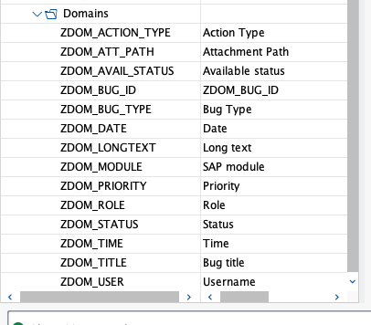
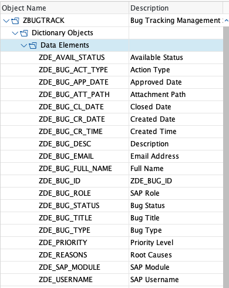
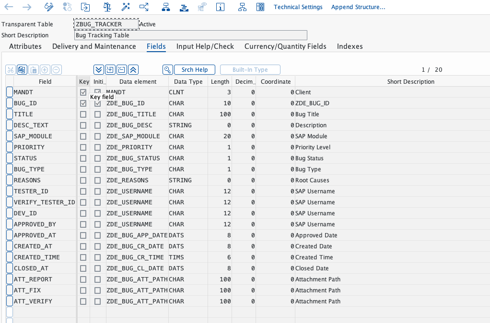
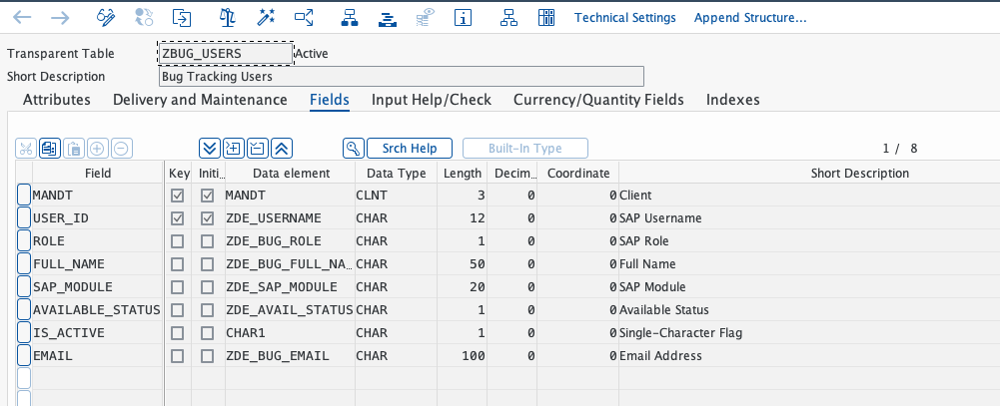
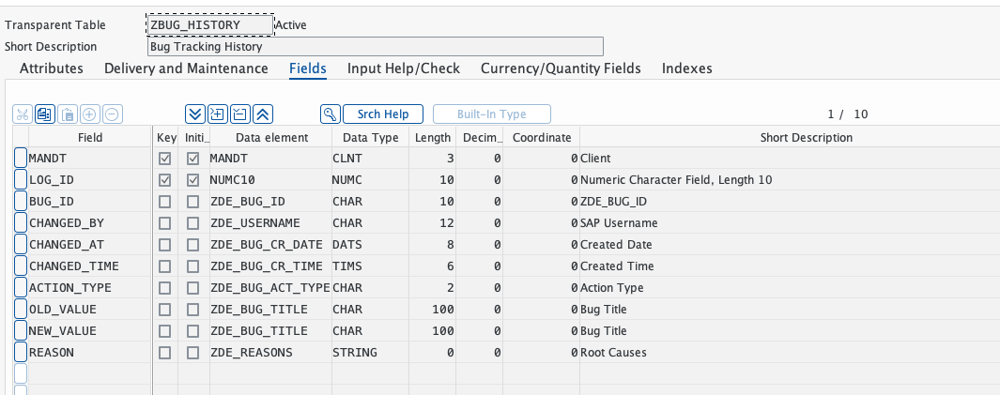
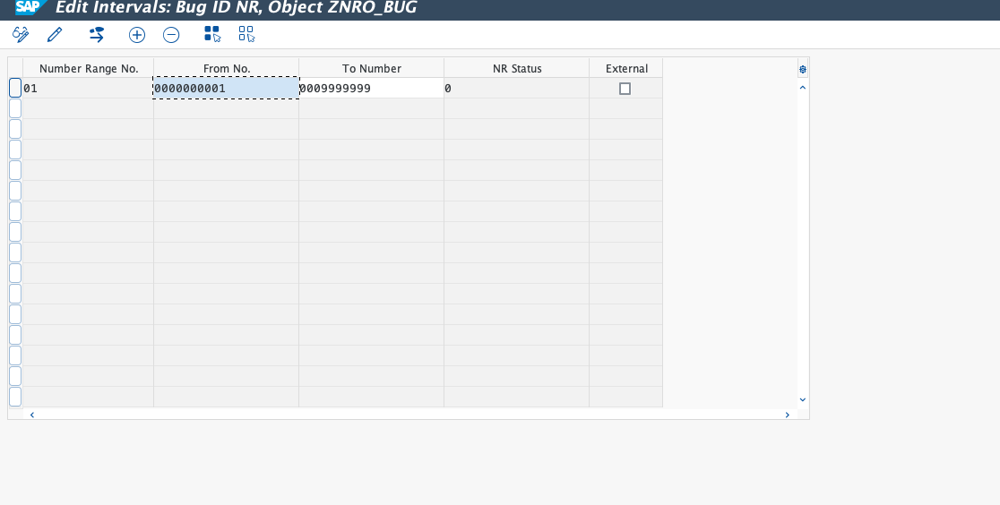
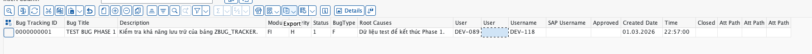

# Báo Cáo Tiến Độ - Phase 1 (Database Layer)

**Ngày báo cáo:** 01/03/2026
**Giai đoạn:** Phase 1 - Database Layer (Data Dictionary, Tables & Number Range)
**Trạng thái:** 100%

---

## 1. Mục đích báo cáo

Báo cáo này liệt kê các hạng mục nền tảng (Data Dictionary) đã được hoàn thành trong Phase 1 của dự án SAP Bug Tracking Management System.

## 2. Các mục đã hoàn thành

* **Tạo mới và Kích hoạt 14 Domains:**
  * *Giá trị nghiệp vụ:* Domain kiểm soát chặt chẽ tính toàn vẹn của dữ liệu (Data Integrity). Bằng cách giới hạn các giá trị được phép nhập (Ví dụ: Độ ưu tiên chỉ nhận H/M/L) và kiểm soát định dạng, hệ thống sẽ tự động ngăn chặn các rủi ro từ người dùng nhập sai dữ liệu ngay ở tầng dưới cùng.
* **Tạo mới và Kích hoạt 19 Data Elements:**
  * *Giá trị nghiệp vụ:* Định nghĩa rõ ràng ngữ nghĩa của từng trường dữ liệu (Ví dụ: "Người tạo", "Mô tả lỗi"). Đảm bảo sự đồng nhất về thuật ngữ trên tất cả các màn hình, báo cáo và biểu mẫu in ấn sau này của người dùng.
* **Xây dựng & Kích hoạt các Bảng Database Cốt lõi (3 Bảng):**
  * *Giá trị nghiệp vụ:* Thiết lập hệ khung lưu trữ dữ liệu an toàn, hiệu quả với quan hệ chặt chẽ giữa các đối tượng (Bug - User - History). Đã tối ưu hóa Technical Settings (Data Class/Size Category) để đảm bảo hiệu suất vận hành lâu dài.
* **Cấu hình Number Range Object (`ZNRO_BUG`):**
  * *Giá trị nghiệp vụ:* Hệ thống tự động sinh ID duy nhất cho từng lỗi được báo cáo. Đảm bảo tính nhất quán, không trùng lặp và chuyên nghiệp trong việc quản lý hồ sơ Bug.

> **Ghi chú kỹ thuật:** Quá trình phát triển đã ghi nhận và xử lý thành công các xung đột về Naming Convention trên môi trường dùng chung, thiết lập tiền tố tiêu chuẩn `BUG_` để duy trì sự độc lập của dự án.

---

## 3. Hướng dẫn nghiệm thu hệ thống (UAT Verification)

Quản lý dự án có thể thực hiện theo các bước sau để tự nghiệm thu các đối tượng đã được tạo trên hệ thống SAP:

### Bước 3.1: Đăng nhập hệ thống

Sử dụng tài khoản Developer được cấp để truy cập vào hệ thống:

* **System Server:** S40 (hoặc chọn SAProuter string: `/H/saprouter.hcc.in.tum.de/S/3298`)
* **Client:** 324
* **User ID:** `DEV-089`
* **Password:** `@Anhtuoi123`

### Bước 3.2: Truy cập kho dữ liệu (SE80)

1. Đăng nhập thành công, tại thanh công cụ Command ở góc trên bên trái, nhập mã Transaction **`SE80`** và nhấn **Enter**.
2. Ở cột điều hướng bên trái, mở menu Dropdown (thường mặc định là Repository Browser), và chọn **Package**.
3. Nhập mã Package dự án: **`ZBUGTRACK`** và nhấn biểu tượng **Hiển thị** (Kính lúp/Enter).
4. Mở rộng cây thư mục: `Dictionary Objects`.

### Bước 3.3: Đối chiếu kết quả

Tại đây, các thư mục `Domains`, `Data Elements` và `Database Tables` chứa toàn bộ các đối tượng đã phát triển. Trạng thái của tất cả đều là Active.

### Bước 3.4: Hình ảnh đối chứng (System Snapshots)

**A. Nền tảng Data Dictionary:**

*Gồm toàn bộ Domains và Data Elements đã được kích hoạt:*

**B. Các Bảng Database (Core Tables):**

1. **Bảng `ZBUG_TRACKER` (Quản lý Bug):**
   * Chứa 20 trường dữ liệu, đã đổi tên field `SAP_MODULE` để tránh conflict hệ thống.
   

2. **Bảng `ZBUG_USERS` (Quản lý User/Role):**
   * Quản lý danh sách Tester/Developer và Module phụ trách.
   

3. **Bảng `ZBUG_HISTORY` (Lưu vết thay đổi):**
   * Tự động lưu vết log mỗi khi Bug có sự thay đổi trạng thái hoặc thông tin.
   

4. **Number Range Object (`ZNRO_BUG`):**
   * Đã cấu hình Interval `01` (From `1` to `9.999.999`).
   

5. **Kiểm tra kết nối Database (SE16N Test):**
   * Đã thực hiện nạp dữ liệu mẫu thành công vào bảng `ZBUG_TRACKER`. Xác nhận các cơ chế lưu trữ, kiểu dữ liệu và ràng buộc hoạt động hoàn hảo.
   

---

## 4. Kết luận & Kế hoạch Phase 2

Toàn bộ tầng Database Layer đã được xây dựng. Hệ thống đã sẵn sàng cho các bước xử lý nghiệp vụ phức tạp hơn.

**🎯 Kế hoạch tiếp theo:**

1. Khởi động **Phase 2: Business Logic**.
2. Xây dựng Function Group `ZBUG_FG`.
3. Viết các Function Modules CRUD (Create, Read, Update, Delete) cho Bug.
