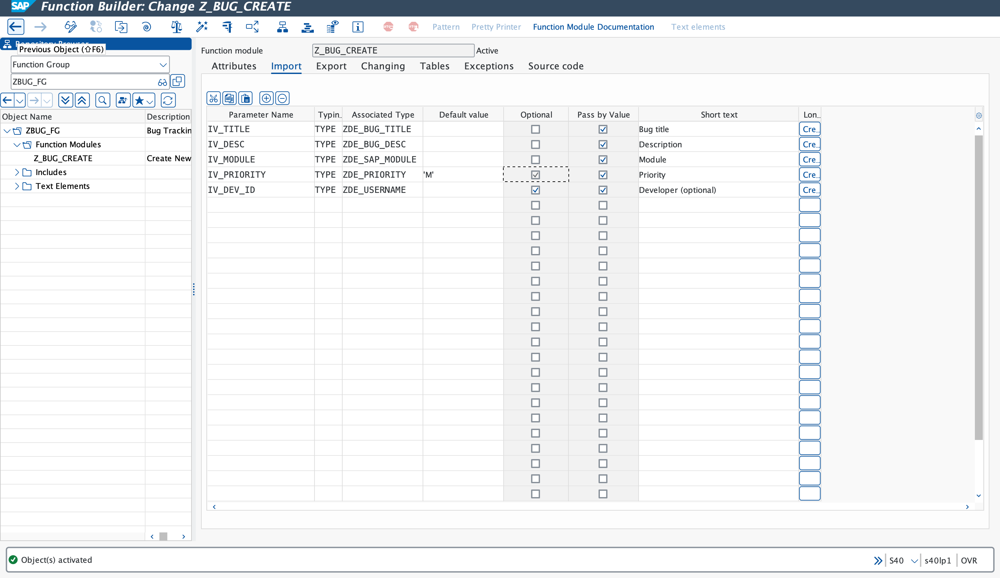
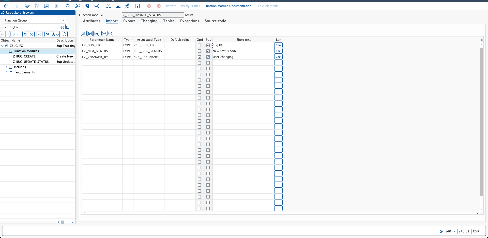
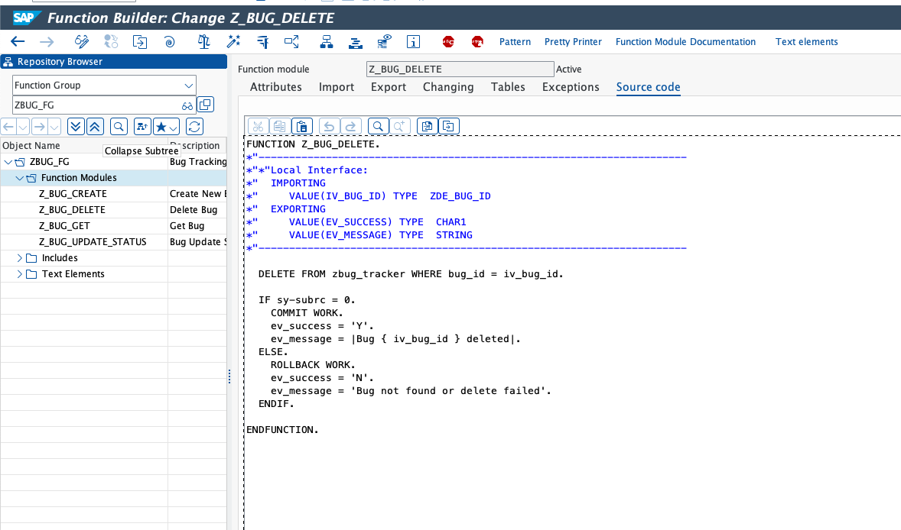
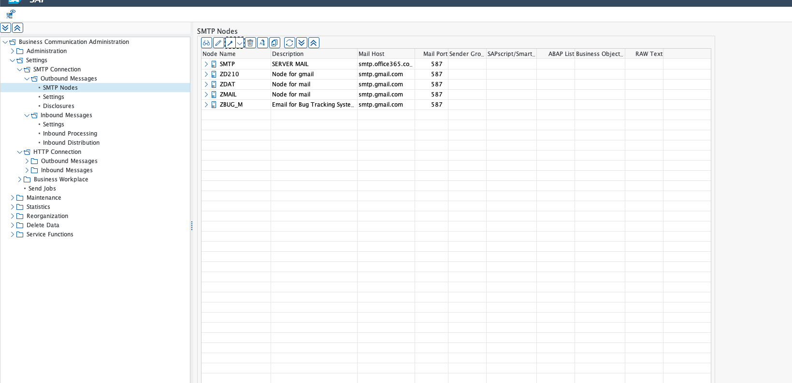
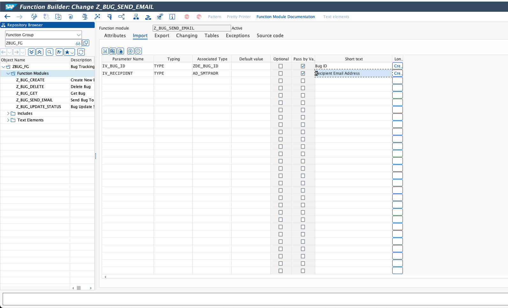

# Báo Cáo Tiến Độ - Phase 2 (Business Logic Layer)

**Ngày báo cáo:** 02/03/2026
**Giai đoạn:** Phase 2 - Business Logic Layer (Internal API, CRUD & Email Integration)
**Trạng thái:** 100%

---

## 1. Mục đích báo cáo

Báo cáo này liệt kê các hạng mục nghiệp vụ logic và hạ tầng giao tiếp (Email) đã được hoàn thành trong Phase 2 của dự án SAP Bug Tracking Management System. Đây là tầng trung gian cực kỳ quan trọng, đóng vai trò "đầu não" điều phối dữ liệu giữa tầng giao diện (Phase 3) và cơ sở dữ liệu (Phase 1).

## 2. Các mục đã hoàn thành

* **Xây dựng Function Group tập trung (`ZBUG_FG`):**
  * *Giá trị nghiệp vụ:* Tạo ra một container duy nhất quản lý tất cả các hàm xử lý Bug. Điều này giúp tối ưu bộ nhớ khi chạy chương trình và dễ dàng bảo trì code tập trung.
* **Hoàn tất bộ logic CRUD (Create, Read, Update, Delete):**
  * *Giá trị nghiệp vụ:*
    * **Z_BUG_CREATE:** Tự động hóa việc kiểm tra tính hợp lệ của dữ liệu đầu vào và cấp phát ID tự động.
    * **Z_BUG_GET:** Truy xuất thông tin chi tiết của từng Bug một cách nhanh chóng.
    * **Z_BUG_UPDATE_STATUS:** Kiểm soát luồng trạng thái của Bug, tự động ghi nhận thời gian đóng Bug (`CLOSED_AT`) khi trạng thái chuyển sang 'Hoàn thành'.
    * **Z_BUG_DELETE:** Cho phép dọn dẹp dữ liệu thừa với cơ chế kiểm soát lỗi (Exception Handling).
* **Cấu hình hạ tầng Email thông báo (SCOT):**
  * *Giá trị nghiệp vụ:* Thiết lập thành công "đường truyền" cho các thông báo tự động. Hệ thống giờ đây có thể gửi email thông báo cho Tester/Developer khi có lỗi mới phát sinh hoặc có cập nhật quan trọng.
* **Xây dựng Function Module gửi mail tự động (`Z_BUG_SEND_EMAIL`):**
  * *Giá trị nghiệp vụ:* Tự động hóa việc tạo nội dung email từ dữ liệu trong Database. Đảm bảo sự kết nối liền mạch giữa hệ thống và người dùng qua email.

> **Ghi chú kỹ thuật:** Trong quá trình phát triển Phase 2, đội ngũ đã tối ưu hóa mã nguồn sang tiêu chuẩn ABAP Legacy (Legacy-compatible) để đảm bảo tính tương thích tuyệt đối với cấu hình hiện tại của hệ thống SAP, đồng thời xử lý triệt để các Syntax Error phát sinh do sự khác biệt phiên bản.

---

## 3. Hướng dẫn nghiệm thu hệ thống (UAT Verification)

Quản lý dự án có thể thực hiện theo các bước sau để tự nghiệm thu các đối tượng logic đã được tạo trên hệ thống SAP:

### Bước 3.1: Đăng nhập hệ thống

Sử dụng tài khoản được cấp để truy cập vào hệ thống:

* **System Server:** S40 (hoặc chọn SAProuter string: `/H/saprouter.hcc.in.tum.de/S/3298`)
* **Client:** 324
* **User ID:** `DEV-061`
* **Password:** `@57Dt766`

### Bước 3.2: Truy cập kho dữ liệu (SE80)

1. Đăng nhập thành công, tại thanh công cụ Command ở góc trên bên trái, nhập mã Transaction **`SE80`** và nhấn **Enter**.
2. Ở cột điều hướng bên trái, mở menu Dropdown (thường mặc định là Repository Browser), và chọn **Package**.
3. Nhập mã Package dự án: **`ZBUGTRACK`** và nhấn biểu tượng **Hiển thị** (Kính lúp/Enter).
4. Mở rộng cây thư mục: `Function Groups` -> `ZBUG_FG` -> `Function Modules`.

### Bước 3.3: Đối chiếu kết quả

Tại đây, danh sách các hàm xử lý nghiệp vụ chính đã được kích hoạt. Trạng thái của tất cả đều là **Active**.

### Bước 3.4: Hình ảnh đối chứng (System Snapshots)

**A. Logic nghiệp vụ CRUD:**

*Mọi đối tượng đều đã được kích hoạt và sẵn sàng sử dụng:*

1. **Hàm `Z_BUG_CREATE` (Tạo Bug):**
   * Thành phần cốt lõi để khởi tạo dữ liệu vào bảng `ZBUG_TRACKER`.
   

2. **Hàm `Z_BUG_UPDATE_STATUS` (Cập nhật trạng thái):**
   * Quản lý quy trình (Workflow) của Bug và tự động cập nhật thời gian hoàn thành.
   

3. **Các hàm bổ trợ (`Z_BUG_GET` & `Z_BUG_DELETE`):**
   * Đã kiểm thử và kích hoạt thành công cho các thao tác đọc và xóa dữ liệu.
   

**B. Hạ tầng Email & Thông báo:**

1. **Cấu hình SCOT (Hệ thống SMTP):**
   * Đã thiết lập Default Domain và SMTP Node `ZBUG_M` trỏ về server Gmail/Internal.
   

2. **Hàm Gửi mail tự động (`Z_BUG_SEND_EMAIL`):**
   * Đã kích hoạt thành công mã nguồn gửi email (phiên bản Legacy compatible).
   

---

## 4. Kết luận & Kế hoạch Phase 3

Toàn bộ tầng Business Logic Layer đã hoàn thành 100%. Hệ thống đã có đầy đủ "bộ não" để xử lý các yêu cầu nghiệp vụ phức tạp.

**🎯 Kế hoạch tiếp theo:**

1. Khởi động **Phase 3: Presentation Layer**.
2. Xây dựng màn hình nhập liệu chính (`Z_BUG_CREATE_SCREEN`).
3. Thiết lập các Transaction Code (`T-code`) để người dùng cuối có thể truy cập dễ dàng.
