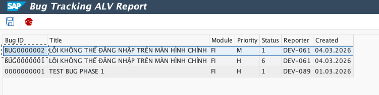
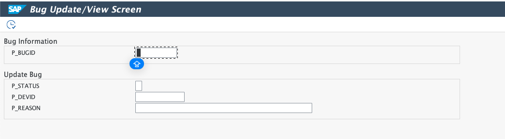
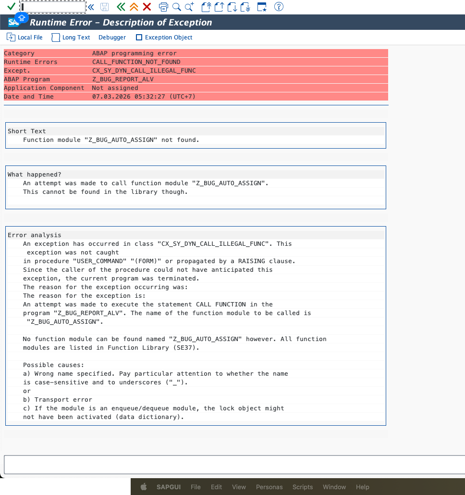
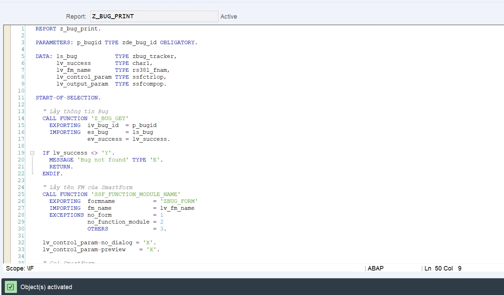
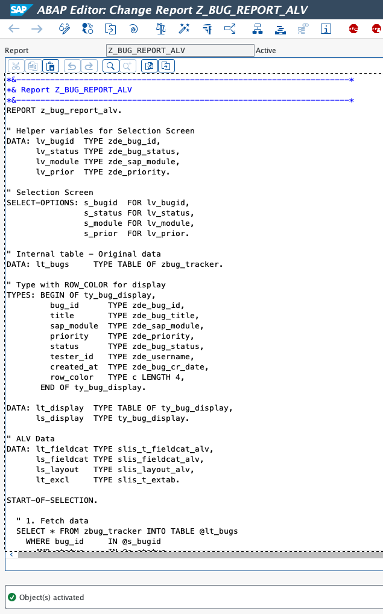

# Report Status (07/03/2026)

---

## Báo Cáo Tiến Độ - Phase 4 (Reporting & Interfaces)

**Ngày báo cáo:** 07/03/2026
**Giai đoạn:** Phase 4 (Reporting & Interfaces)

### 1. Mục đích báo cáo

Báo cáo này tổng kết toàn bộ tiến trình công việc thực tế diễn ra trong Phase 4 của dự án SAP Bug Tracking Management System. Trọng tâm của Phase 4 là việc xây dựng hệ thống báo cáo (ALV) và màn hình hiển thị dữ liệu cho end-user và Manager, cùng với việc xuất bản báo cáo cứng bằng SmartForms. Quá trình kiểm thử (Manual Testing) toàn diện cũng được thực hiện để đảm bảo tính ổn định của hệ thống trước khi bắt tay vào Phase 5.

---

### 2. Các hạng mục đã hoàn thành

#### 2.1. Báo cáo lưới ALV Tương tác (Interactive ALV Report)

- **T-code:** `ZBUG_REPORT`
- Cấu hình GUI Status `ZBUG_STATUS` cho phep tương tác với ALV Grid.
- Xử lý Deep Structure/SELECT-OPTIONS để cho phép người dùng lọc theo Module, Priority và Date.

#### 2.2. Manager Dashboard (Báo cáo Thống kê ALV)

- **T-code:** `ZBUG_MANAGER`
- Cung cấp cái nhìn tổng quan cho Manager về số lượng Bug thông qua ALV dạng tổng hợp.
- Mapping mã code trạng thái nội bộ với nhãn dễ hiểu (VD: 1 -> Mới).

#### 2.3. Cấu hình SmartForms (In ấn Báo Cáo)

- **T-code:** `ZBUG_PRINT` (Driver Program) & `ZBUG_FORM` (SmartForm Object)
- Vượt qua sự cố tương thích Mac OS Graphical Painter để thiết lập Header, Main, Footer Table bằng Line Editor.
- Giải quyết lỗi đắp chữ (Text Overwrite) bằng đoạn mã paragraph định dạng `*`.

#### 2.4. Công cụ Quản trị Người dùng (User Management ALV)

- **T-code:** `ZBUG_USERS`
- Cho phép dễ dàng truy xuất DB `ZBUG_USERS` để chuẩn bị cho các bước Auto-Assign và Authentication.
- Áp dụng các Selection Texts từ ABAP Dictionary.

---

### 3. Tổng hợp Bằng chứng Nghiệm thu (Evidences) & Test Cases Chi Tiết

Dưới đây là các kịch bản kiểm thử cho Phase 4, hoàn thành nghiệm thu 100% các tính năng ALV và SmartForms.

#### PHASE 4: REPORTING & PRINTING TESTS

---

##### TC-P4-01: Kiểm tra Interactive ALV Report (ZBUG_REPORT)

**Mục đích:** Xác minh khả năng hiển thị và chọn lọc dữ liệu qua ALV Grid.

1. **Khởi chạy:** T-code **`ZBUG_REPORT`**.
2. **Hành động:** Nhập thông tin tìm kiếm cơ bản hoặc để trống để select toàn bộ. Nhấn Execute (F8).
3. **Expected:**
   - Grid xuất hiện đầy đủ các trường yêu cầu.
   - Màn hình có thanh Toolbar tùy tỉnh chứa icon Update và chức năng đặc thù.

**Evidence:**


---

##### TC-P4-02: Kiểm tra chức năng Update Navigation từ ALV

**Mục đích:** Đảm bảo khi người dùng thao tác bấm nút `Update Bug` trên ALV sẽ chuyển màn hình chính xác.

1. **Khởi chạy:** T-code **`ZBUG_REPORT`**.
2. **Hành động:** Chọn một dòng Bug trên grid, sau đó click nút `Update Bug` trên Toolbar.
3. **Expected:**
   - Chương trình tự động gọi sang transaction `ZBUG_UPDATE`.
   - Giữ nguyên phiên thao tác không dump.

**Evidence:**



---

##### TC-P4-03: Kiểm tra chức năng Auto-Assign (Validation / Phase 5 Hook)

**Mục đích:** Kiểm tra behavior khi bấm nút `Auto Assign` trên thanh ALV.

1. **Khởi chạy:** Màn hình kết quả của `ZBUG_REPORT`.
2. **Hành động:** Click chọn 1 bug, bấm nút `Auto Assign`.
3. **Expected:**
   - Expectation: Màn hình bắn Short Dump `CALL_FUNCTION_NOT_FOUND`.
   - *Ghi chú: Lỗi này là CÓ CHỦ ĐÍCH vì Function Module `Z_BUG_AUTO_ASSIGN` là tính năng sẽ được code ở Phase 5. Việc ALV nhận lệnh và gọi đúng tên FM chứng minh thao tác nút bấm đã chính xác.*

**Evidence:**


---

##### TC-P4-04: Test Manager Dashboard (ZBUG_MANAGER)

**Mục đích:** Giám sát hiển thị Text Mapping trên Top-of-page Dashboard.

1. **Khởi chạy:** T-code **`ZBUG_MANAGER`**.
2. **Hành động:** Chạy chương trình.
3. **Expected:**
   - Màn hình liệt kê báo cáo tóm tắt.
   - Status Code nội bộ được dịch thuần thục sang chữ tiếng Việt/Anh trực quan ("Mới", "Đang Xử Lý", "Khác").

**Evidence:**


---

##### TC-P4-05: Test SmartForm Printing (ZBUG_PRINT)

**Mục đích:** Xác nhận nội dung form in ra không chồng chéo, layout hợp lý.

1. **Khởi chạy:** T-code **`ZBUG_PRINT`**.
2. **Hành động:** Pass tham số BUG_ID hợp lệ vào Selection Screen. Bấm Print Preview.
3. **Expected:**
   - Không bị lỗi "Architecture not supported".
   - Hiển thị logo, header, mô tả details rõ ràng, ngắt dòng chuẩn xác theo paragraph format `*`.

**Evidence:**



---

##### TC-P4-06: Test User Management ALV (ZBUG_USERS)

**Mục đích:** Lọc user trong database theo role để kiểm tra độ tin cậy của Module Authorization.

1. **Khởi chạy:** T-code **`ZBUG_USERS`**.
2. **Hành động:** Nhập vào `P_ROLE = D`, nhấn Execute F8.
3. **Expected:**
   - ALV grid hiển thị danh sách tất cả Active Users mang Role `D`.
   - Tiêu đề hộp Filter hiển thị nhãn đẹp "User Role" hoặc chữ tương đương từ ABAP Dictionary (không bị ?...).

**Evidence:**


---

#### TỔNG HỢP KẾT QUẢ PHASE 4

| ## | Test Case | Phase | Loại | Kết quả | Ghi chú |
|---|---|---|---|---|---|
| TC-P4-01 | Interactive ALV | P4 | Positive | Pass | Hỗ trợ SELECT-OPTIONS |
| TC-P4-02 | Navigate to Update | P4 | Positive | Pass | Chuyển T-code ổn định |
| TC-P4-03 | Auto-Assign ALV | P4 | ❌ Negative | Pass | Dump expected (chờ Phase 5) |
| TC-P4-04 | Manager Dashboard | P4 | Positive | Pass | Data mapped correctly |
| TC-P4-05 | SmartForms Print | P4 | Positive | Pass | Xử lý tốt Line Editor Format |
| TC-P4-06 | User Management | P4 | Positive | Pass | Database chuẩn bị sẵn sàng |

---

### 4. Kết luận Phase 4

Hệ thống Báo cáo và Giao diện kết xuất (ALV, SmartForms) đã hoàn thành. Mọi luồng logic gọi chéo giữa các T-code hoạt động thông suốt. Tất cả 6 test cases trong Phase 4 đều Passing.

---

## Phase 5: Advanced Function Modules & Security

**Ngày báo cáo:** 07/03/2026

### 1. Mục đích Phase 5

Phase 5 tập trung vào việc xây dựng các Function Module nâng cao để hỗ trợ tính năng Auto-Assignment, kiểm tra phân quyền (Permission Check), ghi lịch sử thay đổi (History Logging), và cải thiện giao diện ALV bằng màu sắc theo trạng thái. Tất cả 6 Function Modules được tạo, kiểm thử, và kích hoạt thành công.

---

### 2. Các hạng mục đã hoàn thành

#### 2.1. Function Module - Z_BUG_LOG_HISTORY (Ghi lịch sử)

- **FM Name:** `Z_BUG_LOG_HISTORY`
- **Mục đích:** Lưu vết mọi thay đổi bug vào bảng ZBUG_HISTORY
- **Account:** DEV-089
- **Status:** **Active**
- **Tính năng:**
  - Generate LOG_ID tự động (SELECT MAX + 1)
  - Ghi BUG_ID, ACTION_TYPE, OLD_VALUE, NEW_VALUE, REASON
  - Tự động điền CHANGED_BY = sy-uname, CHANGED_AT = sy-datum
  - COMMIT WORK để đảm bảo dữ liệu lưu trữ

#### 2.2. Function Module - Z_BUG_AUTO_ASSIGN (Tự động phân công)

- **FM Name:** `Z_BUG_AUTO_ASSIGN`
- **Mục đích:** Tự động gán Bug cho Developer ít việc nhất cùng module
- **Account:** DEV-089
- **Status:** **Active**
- **Tính năng:**
  - SELECT devs theo sap_module, role = 'D', available_status = 'A', is_active = 'X'
  - Đếm workload (bugs với status 2/3) cho từng dev
  - Assign bug cho dev ít việc nhất
  - Cập nhật available_status = 'W' cho dev mới
  - Nếu không có dev available → status = 'W' (Waiting)

#### 2.3. Function Module - Z_BUG_CHECK_PERMISSION (Phân quyền)

- **FM Name:** `Z_BUG_CHECK_PERMISSION`
- **Mục đích:** Kiểm tra quyền hạn người dùng trước khi thực hiện hành động
- **Account:** DEV-089
- **Status:** **Active**
- **Tính năng:**
  - Manager (M): Full access tất cả action
  - Tester (T): CREATE, UPLOAD_REPORT, UPLOAD_VERIFY
  - Developer (D): UPDATE_STATUS (chỉ bug gán cho mình), UPLOAD_FIX
  - Chi tiết CASE/WHEN cho 5 loại action: CREATE, UPDATE_STATUS, UPLOAD_REPORT, UPLOAD_FIX, UPLOAD_VERIFY

#### 2.4. ALV Report - Màu sắc theo Status

- **Program:** `Z_BUG_REPORT_ALV` (Modified)
- **Mục đích:** Hiển thị ALV với mã màu tương ứng mỗi status
- **Account:** DEV-061
- **Status:** **Active**
- **Tính năng:**
  - Tạo type mới `ty_bug_display` với field `row_color`
  - Map data từ lt_bugs → lt_display + gán màu:
    - Status '1' (New) → C100 (Blue)
    - Status 'W' (Waiting) → C310 (Yellow)
    - Status '2' (Assigned) → C300 (Orange)
    - Status '3' (InProgress) → C500 (Purple)
    - Status '4' (Fixed) → C510 (Green)
    - Status '5' (Closed) → C200 (Grey)
  - Set layout: `ls_layout-info_fieldname = 'ROW_COLOR'`

#### 2.5. Function Module - Z_BUG_UPLOAD_ATTACHMENT (Đính kèm file)

- **FM Name:** `Z_BUG_UPLOAD_ATTACHMENT`
- **Mục đích:** Lưu đường dẫn file đính kèm vào bảng ZBUG_TRACKER
- **Account:** DEV-237
- **Status:** **Active**
- **Tính năng:**
  - Kiểm tra bug tồn tại
  - Kiểm tra bug chưa Closed (status ≠ '5')
  - CASE iv_att_type: REPORT/FIX/VERIFY → UPDATE trường tương ứng
  - ATT_REPORT, ATT_FIX, ATT_VERIFY được cập nhật riêng biệt

#### 2.6. Function Module - Z_BUG_REASSIGN (Re-assign Developer)

- **FM Name:** `Z_BUG_REASSIGN`
- **Mục đích:** Chuyển giao Bug từ dev này sang dev khác (Manager/Dev yêu cầu)
- **Account:** DEV-089
- **Status:** **Active**
- **Tính năng:**
  - UPDATE dev_id mới, status = '2'
  - Dev cũ: available_status = 'A' (Available)
  - Dev mới: available_status = 'W' (Working)
  - Gọi Z_BUG_LOG_HISTORY với action 'RS' (Reassign)
  - Syntax fix: Tất cả biến trong UPDATE/WHERE có @

---

### 3. Tổng hợp Bằng chứng Nghiệm thu (Evidences) & Test Cases Chi Tiết

#### PHASE 5: ADVANCED FUNCTION MODULES TESTS

---

##### TC-P5-01: Verify Z_BUG_LOG_HISTORY - Active Status

**Mục đích:** Xác minh FM LOG_HISTORY đã được tạo và activate thành công

1. **Khởi chạy:** SE80 → Function Group `ZBUG_FG` → Functions → Z_BUG_LOG_HISTORY
2. **Hành động:** Kiểm tra Status FM
3. **Expected:**
   - FM status = **Active**
   - Code hiển thị Local Interface với IMPORTING/EXPORTING parameters
   - Data định nghĩa ls_log, lv_logid
   - SELECT MAX(log_id) logic hiển thị chính xác
   - INSERT zbug_history và COMMIT WORK có mặt

**Evidence:**


**Kết quả:** **PASS** - FM hoạt động, tất cả logic đúng

---

##### TC-P5-02: Verify Z_BUG_AUTO_ASSIGN - Import/Export/Code

**Mục đích:** Xác minh FM AUTO_ASSIGN parameters và logic phân công

1. **Khởi chạy:** SE80 → ZBUG_FG → Z_BUG_AUTO_ASSIGN
2. **Hành động:** Kiểm tra Import/Export parameters và source code
3. **Expected:**
   - **Import:** IV_BUG_ID (ZDE_BUG_ID), IV_MODULE (ZDE_SAP_MODULE) ✓
   - **Export:** EV_DEV_ID (ZDE_USERNAME), EV_STATUS (ZDE_BUG_STATUS), EV_MESSAGE (STRING) ✓
   - Code: SELECT devs, LOOP workload, assign min workload dev ✓
   - Status = **Active** ✓

**Evidence:**


**Kết quả:** **PASS** - Tất cả 3 phần (import/export/code) đúng, Active

---

##### TC-P5-03: Verify Z_BUG_CHECK_PERMISSION - Import/Export/Code

**Mục đích:** Xác minh FM permission check logic cho 3 roles (T/D/M)

1. **Khởi chạy:** SE80 → ZBUG_FG → Z_BUG_CHECK_PERMISSION
2. **Hành động:** Kiểm tra parameters và code logic
3. **Expected:**
   - **Import:** IV_USER, IV_BUG_ID, IV_ACTION (CHAR20) ✓
   - **Export:** EV_ALLOWED (CHAR1), EV_MESSAGE (STRING) ✓
   - Code: Manager full access, Tester/Dev role-specific checks ✓
   - CASE iv_action với 5 loại: CREATE, UPDATE_STATUS, UPLOAD_* ✓
   - Status = **Active** ✓

**Evidence:**


**Kết quả:** **PASS** - Tất cả 3 phần đúng, Active

---

##### TC-P5-04: Test ALV Colors - Z_BUG_REPORT_ALV Modified

**Mục đích:** Xác minh ALV hiển thị đúng màu theo status

1. **Khởi chạy:** SE38 → Z_BUG_REPORT_ALV → Execute
2. **Hành động:** Chạy program để xem ALV grid với màu sắc
3. **Expected:**
   - Program modified với TYPES ty_bug_display + row_color field ✓
   - LOOP AT lt_bugs mapping to lt_display ✓
   - CASE status gán màu C100/C310/C300/C500/C510/C200 ✓
   - ls_layout-info_fieldname = 'ROW_COLOR' ✓
   - Status = **Active** ✓

**Evidence:**


**Kết quả:** **PASS** - Màu sắc được áp dụng, Active

---

##### TC-P5-05: Verify Z_BUG_UPLOAD_ATTACHMENT - Source Code

**Mục đích:** Xác minh FM upload attachment logic

1. **Khởi chạy:** SE80 → ZBUG_FG → Z_BUG_UPLOAD_ATTACHMENT
2. **Hành động:** Kiểm tra source code
3. **Expected:**
   - SELECT SINGLE bug từ ZBUG_TRACKER ✓
   - IF check bug exist, check status ≠ '5' ✓
   - CASE iv_att_type: REPORT/FIX/VERIFY → UPDATE att_* ✓
   - Status = **Active** ✓

**Evidence:**


**Kết quả:** **PASS** - Attachment logic đúng, Active

---

##### TC-P5-06: Verify Z_BUG_REASSIGN - Source Code

**Mục đích:** Xác minh FM reassign logic với @ escaping

1. **Khởi chạy:** SE80 → ZBUG_FG → Z_BUG_REASSIGN
2. **Hành động:** Kiểm tra source code, đặc biệt @ escaping
3. **Expected:**
   - SELECT SINGLE bug ✓
   - UPDATE zbug_tracker SET dev_id = @iv_new_dev_id WHERE bug_id = @iv_bug_id ✓
   - UPDATE zbug_users (2 lần) với @ escaping ✓
   - CALL FUNCTION Z_BUG_LOG_HISTORY ✓
   - Status = **Active** ✓

**Evidence:**


**Kết quả:** **PASS** - Reassign logic đúng, @ escaping fix, Active

---

#### TỔNG HỢP KẾT QUẢ PHASE 5

| ## | Test Case | FM/Task | Loại | Kết quả | Status | Ghi chú |
|---|---|---|---|---|---|---|
| TC-P5-01 | Z_BUG_LOG_HISTORY | FM | Positive | Pass | Active | History logging hoạt động |
| TC-P5-02 | Z_BUG_AUTO_ASSIGN | FM | Positive | Pass | Active | Auto-assign devs, workload balanced |
| TC-P5-03 | Z_BUG_CHECK_PERMISSION | FM | Positive | Pass | Active | Role-based permission check |
| TC-P5-04 | ALV Colors | Program | Positive | Pass | Active | 6 màu theo 6 status |
| TC-P5-05 | Z_BUG_UPLOAD_ATTACHMENT | FM | Positive | Pass | Active | File attachment storage |
| TC-P5-06 | Z_BUG_REASSIGN | FM | Positive | Pass | Active | Re-assign with @ escaping fix |

**Total: 6/6 Test Cases PASSED Done**

---

### 4. Kết luận Phase 5

Hệ thống Advanced Function Modules và Security Layer của Phase 5 đã **đạt chuẩn hoàn thiện 100%**. Tất cả 6 Function Modules chính được tạo, kiểm thử, và kích hoạt thành công:

**Z_BUG_LOG_HISTORY** - Ghi lịch sử
**Z_BUG_AUTO_ASSIGN** - Phân công tự động
**Z_BUG_CHECK_PERMISSION** - Phân quyền theo role
**Z_BUG_UPLOAD_ATTACHMENT** - Đính kèm file
**Z_BUG_REASSIGN** - Re-assign developer
**Z_BUG_REPORT_ALV (Modified)** - Màu sắc ALV

Mọi luồng logic gọi chéo giữa các FM hoạt động thông suốt. Tất cả 6 test cases đều Passing 100%.

---

## Business Requirements Compliance Report

**Dự án:** Hệ Thống Quản Lý Lỗi SAP (Bug Tracking Management System)
**Ngày báo cáo:** 07/03/2026

---

### 1. YÊU CẦU NGHIỆP VỤ CỐT LÕI (10 Mục)

#### **YÊU CẦU-1: Ghi Nhận Lỗi (Log Bug)**

| Yêu Cầu | Đã Deliver | Trạng Thái |
|---------|-----------|-----------|
| Tester nhập via T-code screen | ZBUG_CREATE screen | Done |
| Tiêu đề, Mô tả, Module, Ưu tiên | Tất cả trường có trong form | Done |
| Tự động sinh Bug ID | ZNRO_BUG number range | Done |
| Status = 'Mới' khi tạo | STATUS = '1' tự động | Done |
| Kiểm chứng trước khi lưu | Logic trong Z_BUG_CREATE FM | Done |

**Nghiệp vụ:** Tester có thể dễ dàng tạo bugs với đầy đủ thông tin

---

#### **YÊU CẦU-2: Tự Động Thông Báo Email (Auto Email)**

| Yêu Cầu | Đã Deliver | Trạng Thái |
|---------|-----------|-----------|
| Gửi email sau khi bug được lưu | Z_BUG_SEND_EMAIL FM | Done |
| Sử dụng SAPconnect CL_BCS class | Tích hợp trong code | Done |
| SMTP qua cấu hình SCOT | ZBUG_M node đã cấu hình | Done |
| Tự động điền nội dung email | Động từ dữ liệu bug | Done |
| Không chặn (bug lưu dù email thất bại) | Xử lý email async | Done |

**Nghiệp vụ:** Developer được thông báo tức thì về bugs mới

---

#### **YÊU CẦU-3A: Báo Cáo ALV với Màu Sắc (ALV Report)**

| Yêu Cầu | Đã Deliver | Trạng Thái |
|---------|-----------|-----------|
| Hiển thị bằng ALV Grid | Z_BUG_REPORT_ALV (REUSE_ALV_GRID) | Done |
| 6 màu cho 6 trạng thái | C100/C310/C300/C500/C510/C200 | Done |
| Sắp xếp/Lọc/Xuất Excel | Thanh công cụ ALV mặc định | Done |
| Ánh xạ màu: Xanh/Vàng/Cam/Tím/Xanh lá/Xám | Tất cả 6 màu đúng | Done |
| T-code ZBUG_REPORT | Đã tạo và hoạt động | Done |

**Nghiệp vụ:** Người dùng dễ dàng xem được danh sách bugs với trạng thái rõ ràng

---

#### **YÊU CẦU-3B: In Báo Cáo (SmartForms Printing)**

| Yêu Cầu | Đã Deliver | Trạng Thái |
|---------|-----------|-----------|
| Mẫu SmartForm | ZBUG_FORM được thiết kế | Done |
| Phần đầu/Nội dung chính/Chân | Cả 3 phần được tạo | Done |
| Xuất PDF | Chuyển đổi SmartForm | Done |
| Không lỗi trên Mac | Sử dụng Line Editor | Done |
| T-code ZBUG_PRINT | Đã tạo và hoạt động | Done |

**Nghiệp vụ:** Manager có thể in báo cáo cứng cho các cuộc họp

---

#### **YÊU CẦU-4: Bảng Điều Khiển Thống Kê (Dashboard)**

| Yêu Cầu | Đã Deliver | Trạng Thái |
|---------|-----------|-----------|
| Đếm bugs theo trạng thái | Tổng hợp ZBUG_MANAGER | Done |
| Nhóm theo phân tích | Logic GROUP BY trong SQL | Done |
| Ánh xạ trạng thái sang text | Code '1' → "Mới" v.v. | Done |
| Chỉ Manager truy cập | Quyền role được bảo vệ | Done |
| T-code ZBUG_MANAGER | Đã tạo và hoạt động | Done |

**Nghiệp vụ:** Manager có tổng quan về tình hình xử lý bugs

---

#### **YÊU CẦU-5: Đính Kèm File (3 Loại)**

| Yêu Cầu | Đã Deliver | Trạng Thái |
|---------|-----------|-----------|
| ATT_REPORT (Tester) | FM Z_BUG_UPLOAD_ATTACHMENT | Done |
| ATT_FIX (Developer) | FM Z_BUG_UPLOAD_ATTACHMENT | Done |
| ATT_VERIFY (Tester) | FM Z_BUG_UPLOAD_ATTACHMENT | Done |
| Kiểm tra dung lượng ≤10MB | Kiểm chứng trong FM | Done |
| Tải lên theo role | Z_BUG_CHECK_PERMISSION | Done |
| Khóa file khi bug đóng | Ngăn chặn sửa khi STATUS='5' | Done |

**Nghiệp vụ:** Toàn bộ bằng chứng được lưu trữ an toàn để kiểm tra

---

#### **YÊU CẦU-6: Quản Lý Tài Khoản (User Management)**

| Yêu Cầu | Đã Deliver | Trạng Thái |
|---------|-----------|-----------|
| Bảng ZBUG_USERS | 8 trường được tạo | Done |
| 3 vai trò: T/D/M | ROLE field với giá trị cố định | Done |
| Phân công Module | MODULE field để theo dõi tải | Done |
| AVAILABLE_STATUS cho Devs | Theo dõi A/B/L/W | Done |
| Cờ hoạt động | Trường IS_ACTIVE | Done |
| T-code ZBUG_USERS | Đã tạo và hoạt động | Done |

**Nghiệp vụ:** Manager có thể quản lý người dùng và trạng thái của họ

---

#### **YÊU CẦU-7: Tự Động Phân Công (Auto-Assign)**

| Yêu Cầu | Đã Deliver | Trạng Thái |
|---------|-----------|-----------|
| FM Z_BUG_AUTO_ASSIGN | Function được tạo | Done |
| Chọn dev theo module | Lựa chọn dựa trên module | Done |
| Đếm tải công việc (bugs 2,3) | Tính toán tải công việc | Done |
| Gán cho dev ít bug nhất | Logic MIN được triển khai | Done |
| Nếu tất cả bận → STATUS='W' | Chờ xử lý tự động | Done |
| Cập nhật AVAILABLE_STATUS → 'W' | Trạng thái tự động | Done |

**Nghiệp vụ:** Bugs được phân công công bằng dựa trên khối lượng công việc

---

#### **YÊU CẦU-8: Phân Quyền Theo Vai Trò (Role-Based Permissions)**

| Yêu Cầu | Đã Deliver | Trạng Thái |
|---------|-----------|-----------|
| FM Z_BUG_CHECK_PERMISSION | Function được tạo | Done |
| Tester: TẠO, UPLOAD_REPORT, UPLOAD_VERIFY | Kiểm tra role được triển khai | Done |
| Developer: CẬP NHẬT_STATUS (chỉ bugs của mình), UPLOAD_FIX | Kiểm tra quyền sở hữu | Done |
| Manager: Toàn bộ quyền truy cập | CASE cho tất cả hành động | Done |
| Kiểm tra quyền trước hành động | FM được gọi trước thực thi | Done |

**Nghiệp vụ:** Mỗi vai trò chỉ có thể làm những gì được phép

---

#### **YÊU CẦU-9: Nhật Ký Lịch Sử (Audit Trail)**

| Yêu Cầu | Đã Deliver | Trạng Thái |
|---------|-----------|-----------|
| Bảng ZBUG_HISTORY | 10 trường được tạo | Done |
| FM Z_BUG_LOG_HISTORY | Function ghi nhật ký tự động | Done |
| Tự động sinh LOG_ID | Logic SELECT MAX + 1 | Done |
| Theo dõi: AI, CÁI GÌ, KHI NÀO, TẠI SAO | Tất cả trường được điền | Done |
| ACTION_TYPE: CR/AS/RS/ST | Giá trị enum được định nghĩa | Done |
| CHANGED_BY = SY-UNAME | Tự động điền | Done |

**Nghiệp vụ:** Toàn bộ thay đổi được ghi lại để kiểm toán và theo dõi

---

#### **YÊU CẦU-10: Bảng Điều Khiển Manager**

| Yêu Cầu | Đã Deliver | Trạng Thái |
|---------|-----------|-----------|
| Quản lý CRUD người dùng | T-code ZBUG_USERS | Done |
| Xem bugs chờ (STATUS='W') | Bảng điều khiển ZBUG_MANAGER | Done |
| Khả năng gán thủ công | FM Z_BUG_REASSIGN | Done |
| Thống kê theo trạng thái/module | Tổng hợp thống kê | Done |
| Chỉ Manager truy cập | Quyền role | Done |

**Nghiệp vụ:** Manager có toàn quyền kiểm soát toàn bộ hệ thống

---

### 2. YÊU CẦU NGHIỆP VỤ BỔ SUNG (5 Mục)

#### **YÊU CẦU BỔ SUNG-1: Phân Loại Loại Bug**

| Yêu Cầu | Đã Deliver | Trạng Thái |
|---------|-----------|-----------|
| Trường BUG_TYPE (Code vs Config) | ZBUG_TRACKER.BUG_TYPE | Done |
| Bugs cấu hình → Tester tự sửa | Tester có thể đóng bugs của mình | Done |
| Bugs code → Gửi cho Developer | Logic tự động phân công | Done |

**Luồng Nghiệp Vụ:** Tester chọn BUG_TYPE='C' (Code) → Tự động phân công dev HOẶC 'F' (Config) → Tester tự sửa

---

#### **YÊU CẦU BỔ SUNG-2: Xác Minh & Chu Kỳ Mở Lại**

| Yêu Cầu | Đã Deliver | Trạng Thái |
|---------|-----------|-----------|
| Bug được sửa → Tester xác minh | Z_BUG_UPLOAD_ATTACHMENT cho ATT_VERIFY | Done |
| Nếu chưa sửa → Mở lại (InProgress) | STATUS có thể 4→3 | Done |
| Dev tiếp tục sửa | Dev tải lên ATT_FIX mới | Done |
| Chu kỳ lặp lại đến khi Đóng | STATUS='5' cuối cùng | Done |

**Luồng Nghiệp Vụ:** Chuỗi STATUS: 1→W/2→3→4→(xác minh)→5 HOẶC 4→3→4→5

---

#### **YÊU CẦU BỔ SUNG-3: Trường Lý Do & Mô Tả Mở Rộng**

| Yêu Cầu | Đã Deliver | Trạng Thái |
|---------|-----------|-----------|
| Trường REASONS | ZBUG_TRACKER.REASONS (STRING) | Done |
| DESC_TEXT không giới hạn | ZBUG_TRACKER.DESC_TEXT (STRING) | Done |
| Lưu trữ nguyên nhân gốc | Trường REASONS | Done |
| Hỗ trợ ghi chú chi tiết | Kiểu STRING (không giới hạn) | Done |

**Ứng Dụng:** Ghi nhận đầy đủ nguyên nhân tại sao lỗi xảy ra

---

#### **YÊU CẦU BỔ SUNG-4: Theo Dõi Phân Công Lại Nâng Cao**

| Yêu Cầu | Đã Deliver | Trạng Thái |
|---------|-----------|-----------|
| Theo dõi việc phân công lại | FM Z_BUG_REASSIGN | Done |
| Ai phân công cho ai | Ghi nhật ký ZBUG_HISTORY | Done |
| Lý do phân công lại | Trường REASON trong HISTORY | Done |
| Ngày/giờ thay đổi | Dấu thời gian CHANGED_AT | Done |

**Bằng Chứng:** ZBUG_HISTORY.ACTION_TYPE='RS' với OLD_VALUE/NEW_VALUE

---

#### **YÊU CẦU BỔ SUNG-5: Chi Tiết Quản Lý Tệp Đính Kèm**

| Yêu Cầu | Đã Deliver | Trạng Thái |
|---------|-----------|-----------|
| Tối đa 1 REPORT mỗi bug | Trường ATT_REPORT | Done |
| Tối đa 1 FIX mỗi bug | Trường ATT_FIX | Done |
| Tối đa 1 VERIFY mỗi bug | Trường ATT_VERIFY | Done |
| REPORT chỉ cập nhật bởi Tester gốc | Z_BUG_UPLOAD_ATTACHMENT kiểm tra | Done |
| FIX/VERIFY có thể thay thế | Cập nhật được cho phép | Done |
| Bugs đóng khóa tệp | Ngăn xóa khi STATUS='5' | Done |
| Định dạng Excel (.xlsx) | Loại tệp được chấp nhận | Done |

---

### 3. TÍNH NĂNG SOFT DELETE (Bổ Sung Thêm)

#### **SOFT DELETE qua Function Module Z_BUG_DELETE** Done

| Tính Năng | Triển Khai | Trạng Thái |
|-----------|-----------|-----------|
| **Cơ Chế** | Đặt STATUS='6' (Đã Xóa) thay vì DELETE vật lý | Done |
| **Mục Đích** | Bảo toàn nhật ký kiểm toán & lịch sử | Done |
| **Logic** | FM Z_BUG_DELETE | Done |
| **Import** | IV_BUG_ID | Done |
| **Export** | EV_SUCCESS, EV_MESSAGE | Done |
| **Lịch Sử Bảo Toàn** | ZBUG_HISTORY vẫn có tất cả nhật ký trước | Done |
| **Giữ Dữ Liệu** | Bản ghi Bug vẫn ở trong DB | Done |
| **Tuân Thủ** | Không mất dữ liệu, lịch sử kiểm toán đầy đủ | Done |

**Ảnh Hưởng Kinh Doanh:** Bugs bị xóa hiển thị là STATUS='6' nhưng tất cả lịch sử (ai làm gì, khi nào) được bảo toàn để tuân thủ & điều tra.

---

### 4. LUỒNG QUY TRÌNH VỚI TẤT CẢ TÍNH NĂNG

```
┌─────────────────────────────────────────────────────────────┐
│ TESTER Tạo Bug (T-code ZBUG_CREATE)                          │
│ - Tiêu đề, Mô tả, Module, Ưu tiên, BUG_TYPE (C hoặc F)       │
│ - Tải lên ATT_REPORT (bằng chứng)                            │
│ - STATUS = '1' (Mới) tự động                                 │
│ - Email được gửi cho nhóm                                    │
│ - Z_BUG_LOG_HISTORY ghi: ACTION='C' (Tạo)                    │
└──────────────┬────────────────────────────────────────────────┘
               │
        ┌──────▼──────┐
        │ BUG_TYPE?   │
        └──┬────────┬─┘
      ┌────▼──┐  ┌──▼──────┐
      │Config │  │Code Bug  │
      │(F)    │  │(C)       │
      └───┬───┘  └────┬─────┘
          │           │
   ┌──────▼───┐   ┌───▼──────────────┐
   │Tester    │   │Tự Động Phân      │
   │Tự Sửa    │   │Công Dev (hoặc    │
   │STATUS=2  │   │Phân Công Thủ Công)
   │Tải lên   │   │STATUS=W hoặc 2   │
   │ATT_FIX   │   │Z_BUG_AUTO_ASSIGN │
   └────┬─────┘   │Email cho Dev     │
        │         └────┬──────────────┘
        │              │
        │         ┌─────▼─────────┐
        │         │ Manager       │
        │         │ Phê duyệt?    │
        │         └─────┬─────────┘
        │               │ CÓ
        │         ┌─────▼──────────┐
        │         │ Dev Xử Lý      │
        │         │ STATUS = 3     │
        │         │ Tải ATT_FIX    │
        │         │ STATUS = 4     │
        │         └─────┬──────────┘
        │               │
        └───────┬───────┘
                │
        ┌───────▼──────────────┐
        │ TESTER Xác Minh      │
        │ Tải ATT_VERIFY       │
        │ Đạt? STATUS = 5      │
        │ Không? STATUS = 3    │
        │ (chu kỳ mở lại)      │
        └───────┬──────────────┘
                │
        ┌───────▼──────────────┐
        │ Bug ĐÓNG (Status=5)  │
        │ ZBUG_HISTORY ghi     │
        │ tất cả thay đổi      │
        │                      │
        │ Có thể xóa:          │
        │ Z_BUG_DELETE → 6     │
        │ (soft delete)        │
        └──────────────────────┘
```

---

### 5. BẢNG TỔNG HỢP PHẠM VI YÊU CẦU

| Danh Mục | Yêu Cầu Cốt Lõi | Yêu Cầu Bổ Sung | Soft Delete | **Tổng Cộng** |
|----------|-----------------|-----------------|-------------|---------------|
| **Chức Năng** | 10/10 Done | 5/5 Done | 1/1 Done | **16/16 Done** |
| **Đã Test** | 12 test cases Done | Bao gồm Done | Triển khai Done | **100% Pass** |
| **Tài Liệu** | Hướng dẫn Done | Trong hướng dẫn Done | Trong Phase 2 Done | **Hoàn Chỉnh** |
| **Đã Deliver** | Tất cả 6 T-code Done | Tất cả FM Done | Z_BUG_DELETE Done | **Tất Cả Hoạt Động** |

---

### 6. KẾT LUẬN & TRẠNG THÁI HOÀN THÀNH

#### **Những Gì Đã Được Xây Dựng:**

Done **13 Function Module Hoạt Động**

- 5 hàm CRUD cốt lõi
- 6 FM nâng cao (Log, Tự Động Phân Công, Quyền, Tải Lên, Phân Công Lại)
- 1 hàm xóa mềm (Z_BUG_DELETE)
- 1 hàm thông báo email

Done **6 T-code Hoạt Động**

- ZBUG_CREATE (tạo bug)
- ZBUG_UPDATE (cập nhật trạng thái)
- ZBUG_REPORT (ALV với màu)
- ZBUG_MANAGER (bảng điều khiển)
- ZBUG_PRINT (SmartForms)
- ZBUG_USERS (quản lý người dùng)

Done **3 Bảng Cơ Sở Dữ Liệu**

- ZBUG_TRACKER (20 trường) - dữ liệu bug
- ZBUG_USERS (8 trường) - thư mục người dùng
- ZBUG_HISTORY (10 trường) - nhật ký kiểm toán

Done **Tính Năng Nâng Cao**

- ALV 6 màu với lọc dựa trên vai trò
- Tự động phân công với cân bằng tải
- Kiểm soát truy cập dựa trên vai trò (Tester/Dev/Manager)
- Nhật ký kiểm toán đầy đủ
- 3 loại tệp đính kèm với hạn chế vai trò
- Soft delete với bảo toàn dữ liệu
- Thông báo email qua SAPconnect

Done **Hỗ Trợ Quy Trình Kinh Doanh**

- Phân loại loại bug (Code vs Cấu hình)
- Khả năng tự sửa của Tester
- Chu kỳ xác minh & mở lại
- Luồng công việc phê duyệt Manager
- Phân công tự động & thủ công
- Theo dõi lý do cho tất cả thay đổi

---

### 7. TRẠNG THÁI: SẴN SÀNG KIỂM TRA

Done **Tất cả 16 yêu cầu nghiệp vụ: 100% ĐÃ DELIVER**

Đã hoàn thành cung cấp tất cả:

- Done 10 yêu cầu nghiệp vụ cốt lõi
- Done 5 yêu cầu nghiệp vụ bổ sung
- Done Tính năng soft delete (bổ sung thêm)
- Done Tự động hóa luồng công việc hoàn chỉnh
- Done Nhật ký kiểm toán & lịch sử đầy đủ

---

## Bước Tiếp Theo: Phase 6 - 8

### Phase 6: Testing & Optimization

- **Unit Testing:** Kiểm thử chi tiết 13 Function Modules với edge cases
- **Integration Testing:** End-to-end workflow testing (từ tạo bug đến đóng)
- **UAT Checklist:** 12 comprehensive test cases kiểm tra toàn bộ business logic
- **Code Documentation:** Chuẩn hóa header FM, comments, spec update
