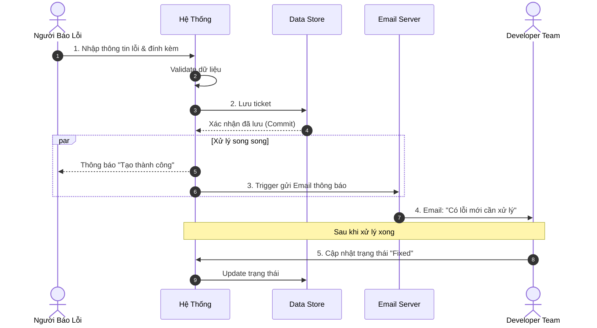

# BỘ ĐỀ XUẤT KỸ THUẬT – HỆ THỐNG BUG TRACKING

## 1. MỤC TIÊU CHUNG

Xây dựng hệ thống quản lý lỗi (Bug Tracking) phục vụ nghiệp vụ nội bộ, đảm bảo:

- Quản lý vòng đời lỗi (tạo, xử lý, đóng).
- Dữ liệu tập trung, truy xuất nhanh, có lịch sử.
- Tích hợp với SAP ERP, bảo mật và dễ vận hành.

## 2. PHẠM VI CHUNG (SHARED SCOPE)

Các hạng mục sau xuất hiện ở cả hai phương án:

- **Quản trị dữ liệu lỗi:** Lưu trữ ticket, trạng thái, ưu tiên, người tạo/được giao.
- **Ghi nhận lỗi:** Form nhập liệu chuẩn, validate dữ liệu, đính kèm ảnh/log.
- **Báo cáo & theo dõi:** Danh sách lỗi, lọc/sắp xếp, drill-down xem chi tiết.
- **Thông báo:** Gửi email khi tạo/cập nhật lỗi.
- **In ấn / xuất báo cáo:** Tạo file xuất ra PDF theo mẫu.

## 3. QUY TRÌNH NGHIỆP VỤ CHUNG (SEQUENCE)

## 4. DELIVERABLES CHUNG

- Tài liệu thiết kế kỹ thuật (Tech Specs)
- Source code & hướng dẫn triển khai
- Hướng dẫn sử dụng (User Manual)
- Biên bản UAT và bàn giao

## 5. SO SÁNH CHI TIẾT & TRADE-OFF

| Tiêu chí                   | On-Stack (SAP GUI)             | Side-by-Side (Web App)                | Trade-off                        |
| -------------------------- | ------------------------------ | ------------------------------------- | -------------------------------- |
| **Trải nghiệm người dùng** | Giao diện SAP GUI truyền thống | Web hiện đại, đa thiết bị             | Side-by-Side thắng UX            |
| **Tích hợp quy trình SAP** | Deep integration, native SAP   | Tích hợp qua RFC/OData                | On-Stack mạnh hơn                |
| **Chi phí hạ tầng**        | Không cần VM ngoài SAP         | Cần VM + Docker                       | On-Stack tiết kiệm hạ tầng       |
| **Tốc độ triển khai**      | Nhanh nếu team ABAP mạnh       | Cần full-stack + DevOps               | On-Stack nhanh hơn nếu scope nhỏ |
| **Khả năng mở rộng**       | Hạn chế theo SAP GUI           | Dễ mở rộng web/app mới                | Side-by-Side linh hoạt hơn       |
| **Nâng cấp SAP**           | Phụ thuộc nâng cấp SAP         | Tách rời SAP core                     | Side-by-Side an toàn upgrade     |
| **Chi phí license**        | Không phát sinh                | Không phát sinh                       | Hoà                              |
| **Kỹ năng đội ngũ**        | ABAP + SAP GUI                 | Golang/React/DevOps + SAP integration | Tuỳ năng lực team                |

## 6. KHUYẾN NGHỊ LỰA CHỌN

**Ưu tiên On-Stack nếu:**

- Quy trình cần tích hợp sâu với SAP (transaction native, workflow nội bộ).
- Đội ngũ mạnh về ABAP, không muốn vận hành hạ tầng Web riêng.
- Yêu cầu UX không quá cao, ưu tiên tốc độ triển khai nhanh.

**Ưu tiên Side-by-Side nếu:**

- Muốn UX hiện đại, đa thiết bị (mobile/tablet).
- Muốn mở rộng tương lai (tích hợp AI, chat, analytics).
- Chấp nhận triển khai thêm hạ tầng Docker/VM để đổi lấy linh hoạt.
