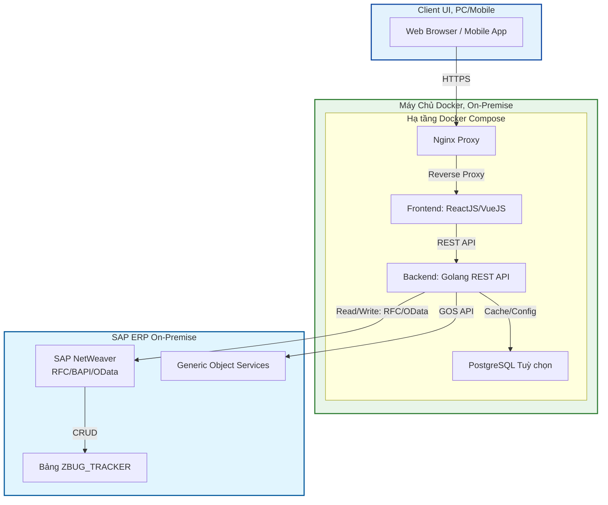

# XÂY DỰNG PHÂN HỆ QUẢN LÝ LỖI (BUG TRACKING) – GIẢI PHÁP SIDE-BY-SIDE

Tham chiếu phần chung và so sánh: `techical-proposal-main.md`.

## 1. TỔNG QUAN DỰ ÁN

Phát triển hệ thống **Bug Tracking** chạy song song với SAP (Side-by-Side Extension) trên nền tảng Web hiện đại. Giải pháp triển khai On-Premise, sử dụng **Golang**, **Docker**, **ReactJS**, kết nối SAP ERP qua OData/RFC, mang lại UX vượt trội so với SAP GUI truyền thống mà không phụ thuộc SAP BTP/Cloud.

## 2. KIẾN TRÚC KỸ THUẬT

Giải pháp được triển khai theo mô hình **On-Premise Side-by-Side**:

- **Lớp Trình diễn (Presentation Layer – Web):** **Web Dashboard** (ReactJS/VueJS), Responsive, không cần cài SAP Logon.
- **Lớp Ứng dụng (Application Layer – Golang):** Backend **RESTful API**, xác thực dữ liệu; **SAP Connector** (go-rfc/REST Client) giao tiếp hai chiều với SAP Server qua cổng nội bộ.
- **Lớp Dữ liệu (Data Layer):** Dữ liệu chính lưu trên SAP (bảng Z-Table); **PostgreSQL (Optional)** để cache hoặc lưu cấu hình giao diện.
- **Hạ tầng (Infrastructure):** **Docker Compose** quản lý container (BE/FE/DB); **Nginx** Reverse Proxy; cơ chế Auto-restart đảm bảo High Availability.

## 3. PHẠM VI CÔNG VIỆC CHI TIẾT

Hệ thống bao gồm các hạng mục chính sau:

### 3.1. Hạ tầng & DevOps (Infrastructure)

- **Thiết lập Docker:** Cài Docker Engine trên Linux VM, cấu hình Docker Compose cho Backend/Frontend/Database.
- **Cấu hình Nginx:** Reverse Proxy cho traffic nội bộ, không đi qua Internet.
- **Auto-restart:** Tự khởi động lại khi service lỗi.

### 3.2. Backend Development (Golang)

- **RESTful API:** CRUD Bug Ticket, Auth, Permission.
- **SAP Connector:** _Read_ danh sách User/Project; _Write_ log bug vào Z-Table trên SAP.
- **Notification:** Email SMTP hoặc Webhook (Slack/Telegram/Teams).
- **PDF Generation:** Render HTML-to-PDF thay SmartForms.

### 3.3. Frontend Development (Web App)

- **Dashboard:** Chart thống kê theo trạng thái và mức ưu tiên.
- **Ticket Management:** **Interactive Data Grid** hoặc **Kanban Board**; sort/filter/search.
- **Smart Web Form:** Drag & Drop ảnh, Paste ảnh, Rich Text Editor.
- **Detail View:** Xem chi tiết lỗi, lịch sử thay đổi, bình luận.

### 3.4. Tích hợp SAP

- **Mở cổng dữ liệu:** RFC/BAPI hoặc OData Service trong không gian Z\*.
- **Bảng Z-Table:** ZBUG_TRACKER (lưu bug, user, project), không can thiệp dữ liệu chuẩn.

## 4. KẾ HOẠCH TRIỂN KHAI

**Tổng thời gian thực hiện:** 08 tuần.  
**Phương pháp:** Waterfall (Phân tích → Thiết kế → Lập trình → Kiểm thử).

| Giai đoạn               | Tuần    | Hạng mục công việc (Work Item)                                                                             | Kết quả bàn giao (Deliverables)                              |
| ----------------------- | ------- | ---------------------------------------------------------------------------------------------------------- | ------------------------------------------------------------ |
| P1. Khởi tạo & Infra    | 01      | Thiết lập VM, Docker, Docker Compose. Phân tích Tech Specs. Test kết nối mạng tới SAP Server.        | Tài liệu thiết kế kỹ thuật. Môi trường Docker sẵn sàng.   |
| P2. Tích hợp SAP        | 02      | Viết RFC/BAPI hoặc OData trên SAP. Viết Golang SAP Connector, test đọc/ghi.                             | SAP Connector hoạt động. Demo kết nối đọc/ghi.            |
| P3. Phát triển Backend  | 03 - 04 | Lập trình API CRUD, Auth & Permission. Implement PDF Generator. Module Notification (SMTP/Webhook).  | API hoàn chỉnh. Demo gửi mail/PDF.                        |
| P4. Phát triển Frontend | 05 - 06 | UI Slicing, tích hợp API. Dựng Dashboard, Ticket Management (Grid/Kanban), Smart Web Form, Detail View. | Web App hoàn chỉnh. Demo trên trình duyệt.                |
| P5. Đóng gói & Kiểm thử | 07 - 08 | Đóng gói Docker Image. Deploy VM nội bộ. Hỗ trợ UAT, bug fix. Bàn giao HDSD & Operations Manual.  | Biên bản nghiệm thu UAT. Tài liệu HDSD & Troubleshooting. |

## 5. YÊU CẦU TÀI NGUYÊN

Để đảm bảo tiến độ dự án, Đội dự án cần được cung cấp:

1. **Hệ thống:** 01 VM nội bộ – OS: Ubuntu Server LTS/CentOS 7+; tối thiểu 2 vCPU, 4GB RAM, 20GB SSD; thông mạng tới SAP Server.
2. **SAP:** Tài khoản SAP Service User có quyền gọi RFC/BAPI.
3. **Cấu hình (Optional):** Tên miền nội bộ (VD: `bugtracker.internal`), thông tin SMTP/Webhook nếu dùng thông báo.

## 6. CAM KẾT CHẤT LƯỢNG & BẢO HÀNH

- **Tuân thủ Clean Core:** Chạy ngoài SAP, không sửa mã nguồn chuẩn; đồng bộ dữ liệu qua RFC/OData.
- **Trải nghiệm hiện đại:** Giao diện Web, đa thiết bị, thao tác nhanh hơn ALV/SmartForms.
- **Vận hành đơn giản:** Đóng gói container, `docker start/stop`, có tài liệu Troubleshooting.
- **Hỗ trợ sau triển khai:** Hỗ trợ xử lý lỗi kỹ thuật trong vòng [Số] tuần sau Go-live.
