# Nội dung trích từ testfile1.docx

## Các vấn đề đã ghi nhận

1. Sửa lại UI display thông số cho đẹp hơn.
2. Header đang bị hiện cái title của 1 bug trong chương trình, dù đây là trang bug list. Đề xuất đổi sang title cố định.
3. Tài khoản **dev-061** (role dev) nhấn vào search help của new status không có giá trị.
4. Thử đổi status sang 5 (Fixed) mà không upload evidence:
    - Không thực hiện được
    - Không hiện message lỗi
5. Nút upload evidence không chạy, không thoát được màn hình đổi status, đang bị soft lock. Không thực hiện được thao tác gì khác, phải tắt cả SAP mới thoát được.
6. Màn hình detail có nút "change status" nhưng khi nhấn lại báo phải chuyển sang "change mode".
    - Đề xuất: Xóa nút "change status" ở màn hình detail.
7. Không đọc được note, không lưu được note.
8. Tạo bug mới nhưng cũng không save được note.
9. Đã thêm 1 dev test vào project nhưng trong detail project không hiện dev mới được thêm vào.
    - Chức năng add user hoạt động tốt nhưng không hiển thị.

---

## Hình ảnh minh họa

| STT | Ảnh                                  |
|-----|--------------------------------------|
|  1  | 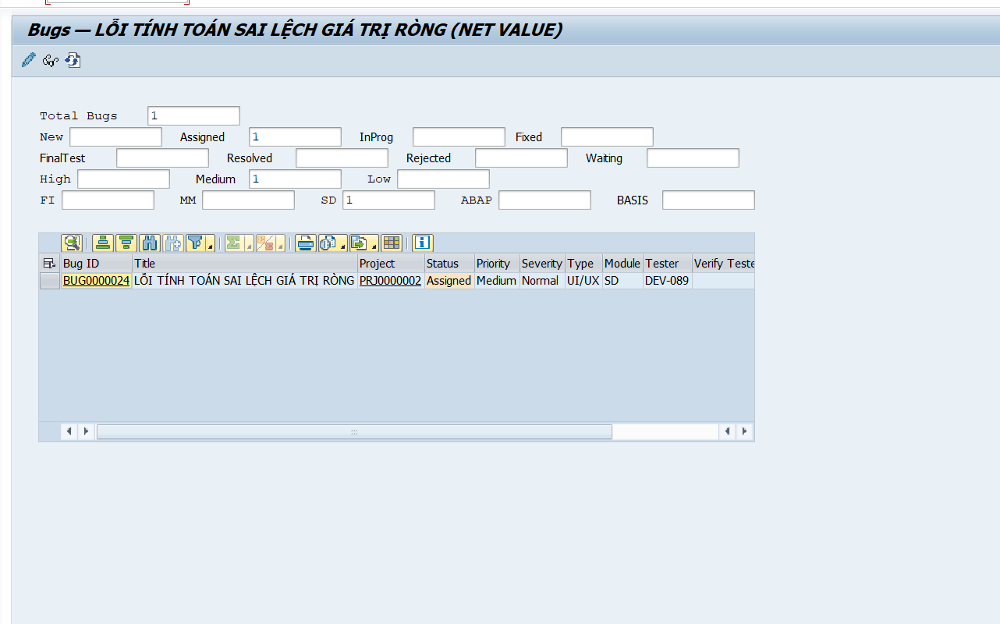   |
|  2  | 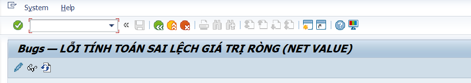   |
|  3  |    |
|  4  | 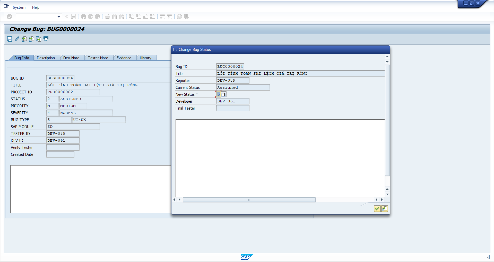   |
|  5  | 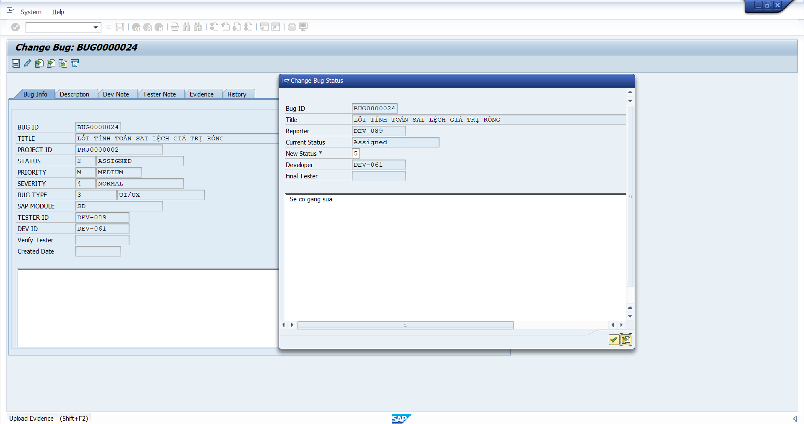   |
|  6  | 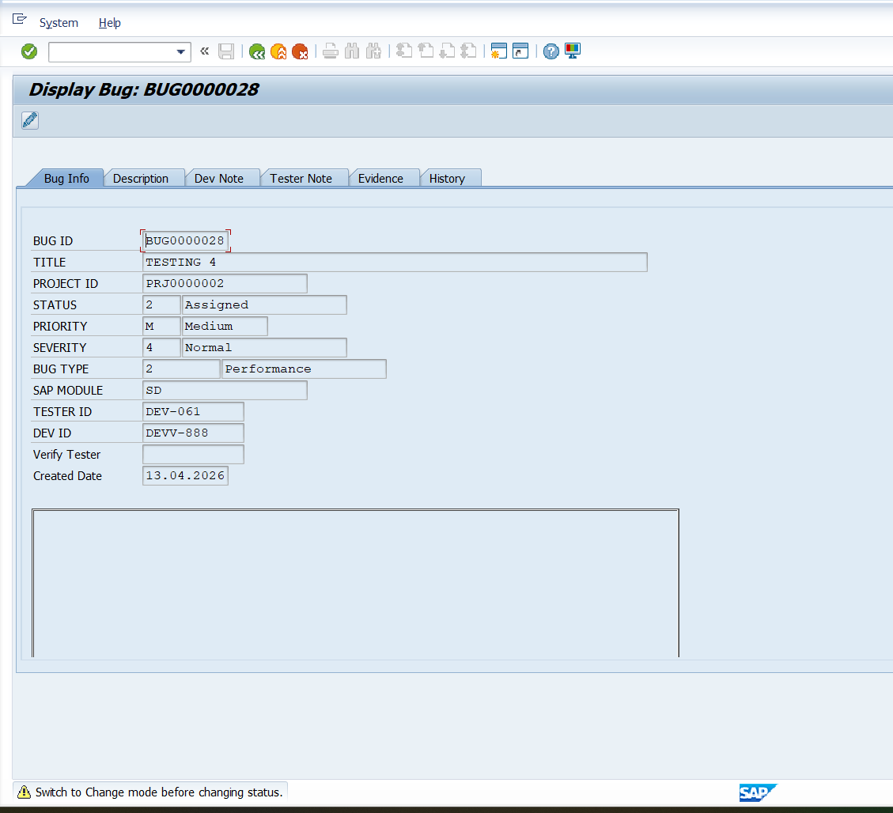   |
|  7  | 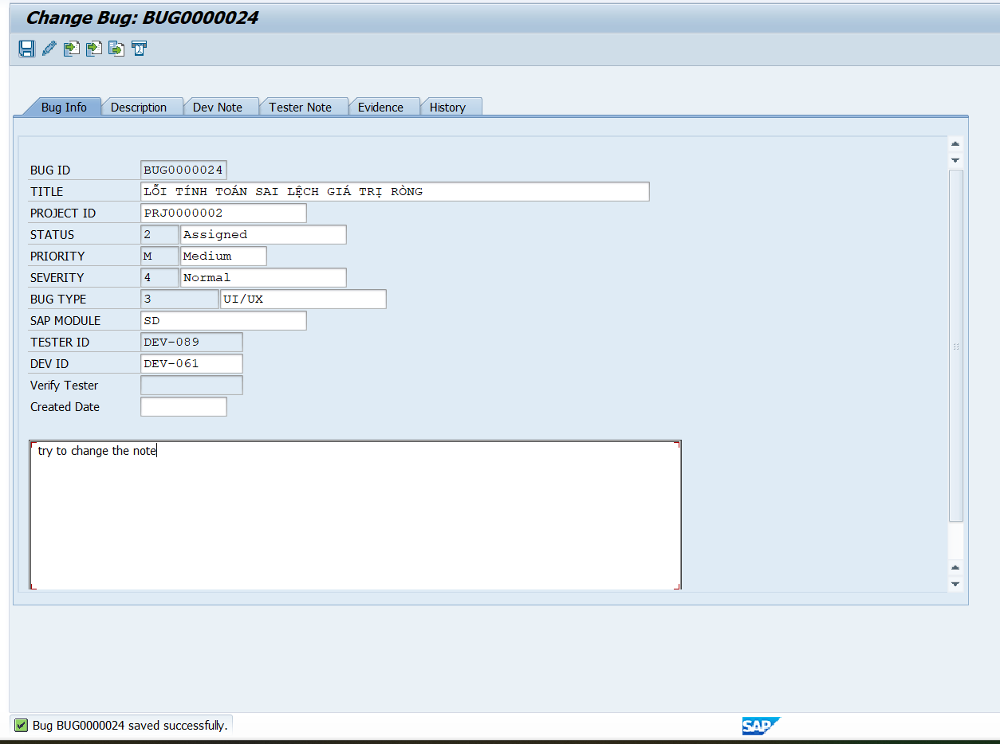   |
|  8  | 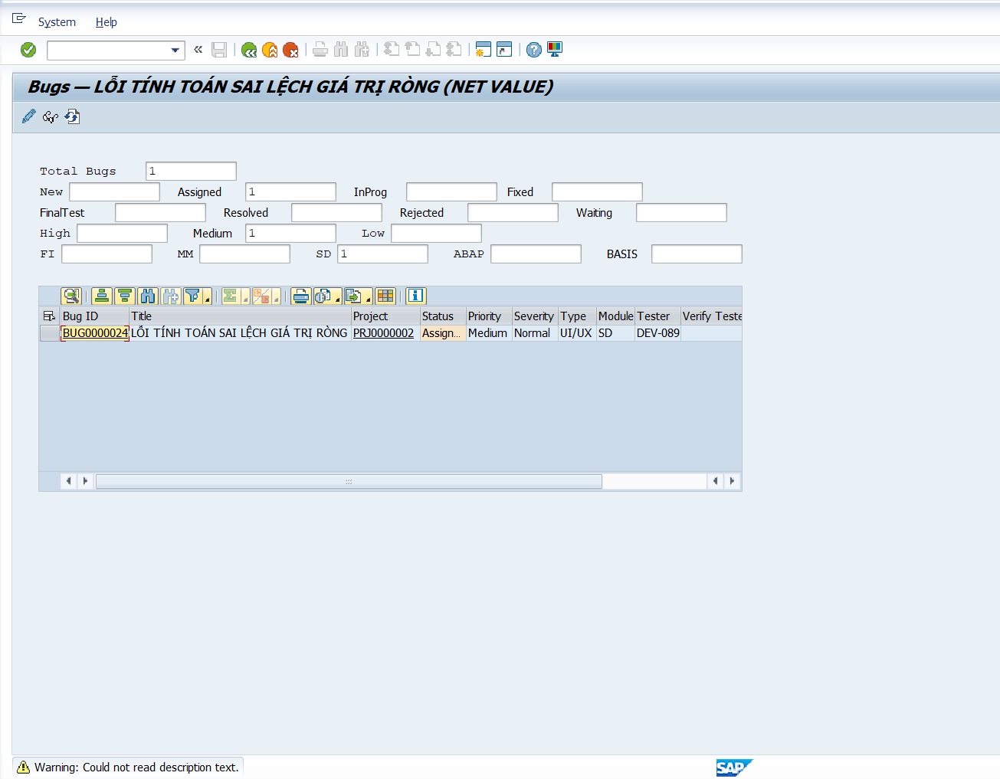   |
|  9  | 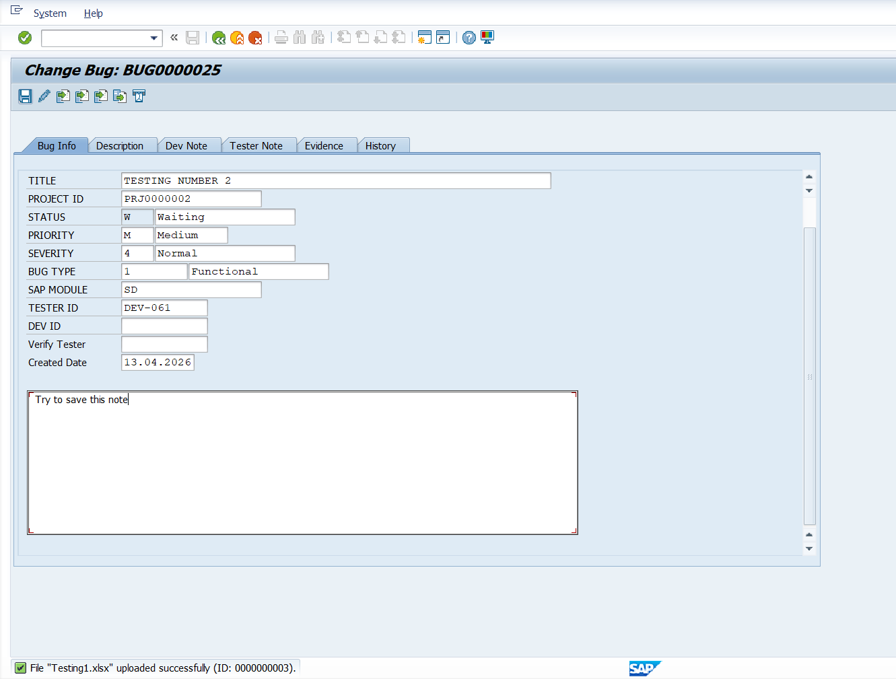   |
| 10  | 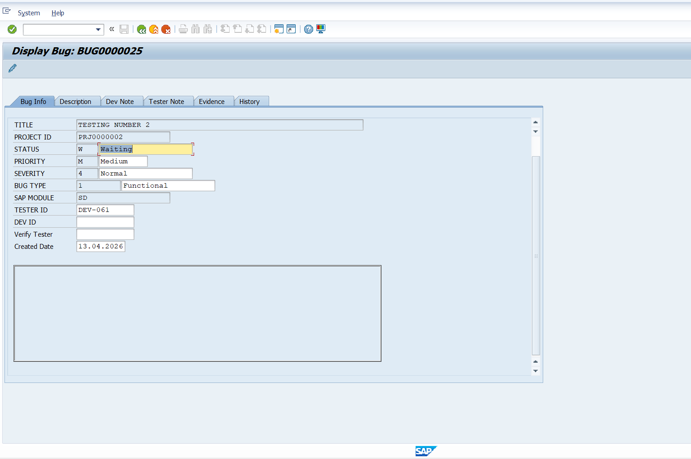 |
| 11  | 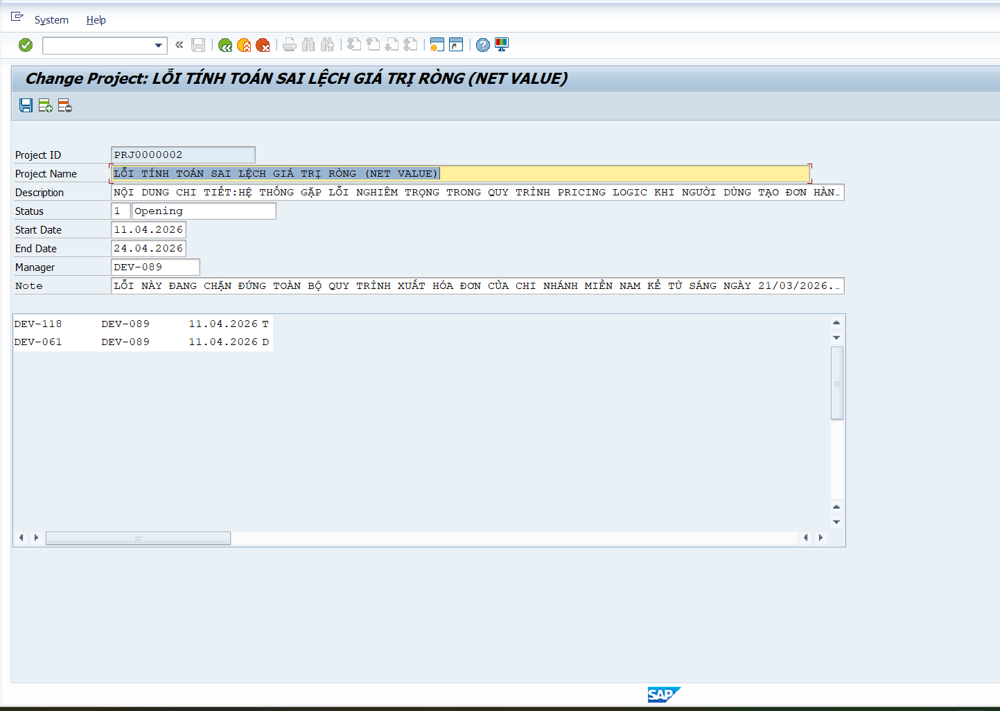 |
| 12  | 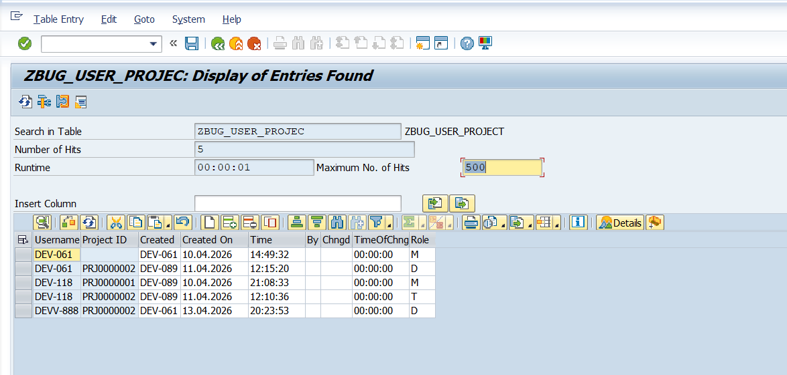 |
