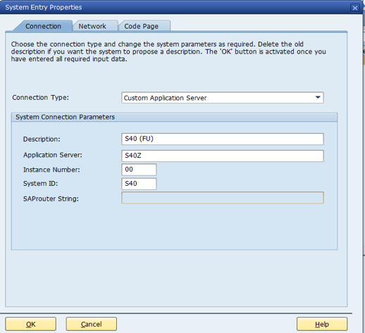

# Phân Tích Yêu Cầu: SAP BUG TRACKING MANAGEMENT

## 1. Tổng quan yêu cầu

Xây dựng một Phân hệ quản lý lỗi tùy chỉnh (Custom Add-on) nằm trong hệ thống SAP ERP. Mục tiêu là cung cấp một công cụ tập trung (Centralized Tool) để người dùng nội bộ ghi nhận, theo dõi và báo cáo lỗi phần mềm mà không cần sử dụng phần mềm bên thứ 3.

Giải pháp phải tuân thủ kiến trúc 3-tier của SAP và sử dụng các công nghệ hiển thị tiêu chuẩn (ALV, SmartForms).

## 2. Phân tích yêu cầu chi tiết

### Chức năng 1: Allow user log bug in SAP System (Ghi nhận lỗi)

**Phân tích nghiệp vụ:** Người dùng cần một giao diện nhập liệu (Input Screen) để khai báo các thông tin chi tiết về lỗi.

**Giải pháp kỹ thuật:**

- Tạo **Transaction Code (T-code)** riêng (ví dụ: `ZBUG_CREATE`) để mở màn hình này.
- Sử dụng **Selection Screen** hoặc **Module Pool (Screen Painter)** để vẽ form nhập liệu.
- Cơ chế Validation: Kiểm tra tính hợp lệ của dữ liệu (ví dụ: `User ID` có tồn tại không, `Module` có đúng danh mục không) trước khi lưu vào Database.

### Chức năng 2: Send Email to Developer team (Tự động thông báo)

**Phân tích nghiệp vụ:** Ngay sau khi lỗi được lưu (Saved), hệ thống phải tự động gửi email thông báo đến nhóm phát triển để xử lý kịp thời.

**Giải pháp kỹ thuật:**

- Sử dụng Business Logic kích hoạt tại sự kiện `AFTER SAVE`.
- Gọi thư viện SAPconnect (Class `CL_BCS` hoặc Function `SO_NEW_DOCUMENT_ATT_SEND_API1`) để gửi email qua SMTP Server đã cấu hình trong SAP (`T-code SCOT`).
- Nội dung email: Tự động lấy từ dữ liệu vừa nhập (`Bug ID`, `Title`, `Description`).

### Chức năng 3: Show list bug in ALV and SmartForm (Báo cáo & In ấn)

**Đây là yêu cầu kép, cần tách thành 2 phần riêng biệt:**

- **A. Hiển thị danh sách (ALV Grid):**
  - Mục đích: Xem nhanh, thao tác trên màn hình, xuất Excel.
  - Kỹ thuật: Sử dụng `REUSE_ALV_GRID_DISPLAY`. Đây là công cụ mạnh nhất của SAP GUI để hiển thị bảng dữ liệu với các tính năng có sẵn: Sort (Sắp xếp), Filter (Lọc theo Status/Priority), Sum (Tính tổng).
- **B. Biểu mẫu in ấn (SmartForms):**
  - Mục đích: Tạo văn bản pháp lý hoặc biên bản bàn giao lỗi (Hard-copy).
  - Kỹ thuật: Sử dụng `T-code SMARTFORMS` để vẽ mẫu in (Logo công ty, Khung viền, Chữ ký). Chương trình sẽ đẩy dữ liệu lỗi vào form này để xuất ra PDF hoặc in giấy.

### Chức năng 4: Statistics of bugs (Dashboard thống kê)

**Phân tích nghiệp vụ:** Người quản lý cần cái nhìn tổng quan về tình hình lỗi (Bao nhiêu lỗi đã sửa, bao nhiêu đang chờ).

**Giải pháp kỹ thuật:**

- Thực hiện các câu lệnh SQL Aggregation (COUNT, GROUP BY Status) trên bảng dữ liệu Z.
- Hiển thị kết quả dưới dạng một bảng nhỏ (Summary Table) ngay trên đầu màn hình ALV báo cáo.

### Chức năng 5: Attach evidence (Quản lý đính kèm)

**Phân tích nghiệp vụ:** Lỗi phần mềm cần bằng chứng (Screenshot, Log file).

**Giải pháp kỹ thuật:**

- Sử dụng dịch vụ GOS (Generic Object Services) của SAP.
- Cho phép upload file từ PC local và lưu trữ liên kết với Bug ID trong Database.

**Quy định đính kèm (Confirmed):**

| File       | Người upload    | Format        | Dung lượng | Ghi chú                            |
| ---------- | --------------- | ------------- | ---------- | ---------------------------------- |
| ATT_REPORT | Tester (Report) | Excel (.xlsx) | ≤10MB      | Chỉ tester ban đầu mới được update |
| ATT_FIX    | Developer       | Excel (.xlsx) | ≤10MB      | Dev đang assigned mới được upload  |
| ATT_VERIFY | Tester (Verify) | Excel (.xlsx) | ≤10MB      | Tester verify sau cùng upload      |

> [!IMPORTANT]
> Khi bug đã `STATUS = Closed`, **KHÔNG được phép xóa** các file đính kèm.

---

### Chức năng 6: Quản lý tài khoản người dùng (User Management)

**Phân tích nghiệp vụ:** Hệ thống cần quản lý 3 loại user: Tester, Developer, Manager với các quyền hạn khác nhau.

**Giải pháp kỹ thuật:**

- Tạo bảng riêng `ZBUG_USERS` để quản lý thông tin user.
- Developer có thêm trường `AVAILABLE_STATUS` (Available/Busy/Leave/Working).
- Manager có dashboard riêng để quản lý accounts.

---

### Chức năng 7: Phân công tự động (Auto-Assign)

**Phân tích nghiệp vụ:** Bug mới có thể được tự động phân công cho Developer dựa trên Module và Workload.

**Giải pháp kỹ thuật:**

- Logic: Lấy dev cùng Module → Đếm workload (bugs đang xử lý) → Chọn dev ít bug nhất.
- Nếu tất cả dev bận → Bug chuyển sang `STATUS = Waiting` để Manager assign thủ công.
- Sau khi assign → `AVAILABLE_STATUS` của dev tự động đổi sang `Working`.

---

### Chức năng 8: Phân quyền theo vai trò (Role-based Permissions)

**Phân tích nghiệp vụ:** Mỗi vai trò có quyền hạn khác nhau trong hệ thống.

| Vai trò       | Quyền hạn                                                               |
| ------------- | ----------------------------------------------------------------------- |
| **Tester**    | Tạo bug, upload Report/Verify, sửa bug chưa assign, **đóng bug tự fix** |
| **Developer** | Sửa bug được assign, upload Fix, từ chối & yêu cầu re-assign            |
| **Manager**   | Full access, approve assign, re-assign, quản lý accounts                |

**Workflow Approval:** Tester chuyển bug cho Developer cần Manager approve.

---

### Chức năng 9: Lịch sử thay đổi (History Log)

**Phân tích nghiệp vụ:** Ghi nhận mọi thay đổi của bug để audit và tracking.

**Giải pháp kỹ thuật:**

- Tạo bảng `ZBUG_HISTORY` ghi nhận: ai thay đổi, thay đổi gì, lý do, thời gian.
- Action types: Create, Assign, Reassign, Status change.

---

### Chức năng 10: Dashboard quản lý (Manager Dashboard)

**Phân tích nghiệp vụ:** Manager cần dashboard riêng để quản lý hệ thống.

**Các tính năng:**

- Quản lý danh sách Users (CRUD trên `ZBUG_USERS`).
- Thay đổi `AVAILABLE_STATUS` của Developer.
- Xem bugs đang `STATUS = Waiting` để assign thủ công.
- Thống kê hiệu suất Tester/Developer.

## 3. TÀI NGUYÊN HỆ THỐNG ĐÃ CÓ

### 3.1. SAP System Information

**Hệ thống Production/Development:**

- **System ID:** S40 (FU - Functional Unit)
- **Application Server:** S40Z
- **Instance Number:** 00
- **SAP Logon Version:** 770
- **Connection Type:** Custom Application Server
- **Network:** EBS_SAP
- **SAProuter String:** /H/sapper



### 3.2. Development Account & Permissions

**Main Account:** Qwer123@

**Permission Mapping theo Chức Năng:**

| Permission ID | T-code / Module Access             | Chức năng trong dự án                | Ánh xạ vào Requirements                                |
| ------------- | ---------------------------------- | ------------------------------------ | ------------------------------------------------------ |
| **DEV-083**   | SE11, SE38, SE80, SE93, SE24, SE37 | Ghi nhận lỗi (Z-objects development) | Chức năng 1: T-code `ZBUG_CREATE`, bảng `ZBUG_TRACKER` |
| **DEV-224**   | SCOT, SOST                         | Email configuration                  | Chức năng 2: Send Email via SAPconnect                 |
| **12345678**  | ALV Grid APIs, SMARTFORMS          | Báo cáo & In ấn                      | Chức năng 3: ALV Grid & SmartForms                     |
| **DEV-237**   | GOS (Generic Object Services)      | Đính kèm file                        | Chức năng 5: Attach evidence                           |


**Chi tiết quyền theo Function:**

1. **Function 1 - Log Bug (DEV-083):**
   - SE11: Tạo Z-table `ZBUG_TRACKER`
   - SE38/SE80: Viết ABAP program xử lý logic
   - SE93: Tạo T-code `ZBUG_CREATE`, `ZBUG_REPORT`
   - SE24: Tạo class xử lý (nếu cần OOP)

2. **Function 2 - Send Email (DEV-224):**
   - SCOT: Cấu hình SMTP server
   - SOST: Monitor email queue
   - Access `CL_BCS` class để gửi email

3. **Function 3 - ALV & SmartForms (12345678):**
   - REUSE*ALV*\* function modules
   - SMARTFORMS transaction để design form
   - SSF_FUNCTION_MODULE_NAME để generate form

4. **Function 4 - Statistics (DEV-083):**
   - SQL aggregation trên `ZBUG_TRACKER`
   - Display summary trong ALV header

5. **Function 5 - Attach Evidence (DEV-237):**
   - GOS API để attach/detach files
   - Link files với Bug ID

### 3.3. Network & Access

- **Connection Method:** SAP GUI (SAP Logon 770)
- **Network Access:** Internal corporate network (EBS_SAP)
- **Remote Access:** VPN (nếu cần work from home)
- **Firewall:** No restrictions for internal SAP connections

### 3.4. Yêu cầu Bổ Sung Cần Xác Nhận

**Cần xác nhận trong kickoff meeting:**

1. **Developer Key:**
   - Account Qwer123@ đã có developer key chưa?
   - Nếu chưa: Request unlock từ SAP Admin

2. **Package & Transport:**
   - Package name: **ZBUGTRACK** (đề xuất)
   - Transport layer: **ZBT1** (đề xuất)
   - Development class assignment

3. **SMTP Configuration:**
   - T-code SCOT đã config SMTP chưa?
   - Nếu chưa: SMTP server IP, Port, credentials
   - Test email address

4. **SmartForms Assets:**
   - Logo công ty (BMP/PNG format)
   - Corporate identity guidelines
   - Standard header/footer template

5. **GOS Storage:**
   - Document storage location (DMS vs File System)
   - File type restrictions & size limits
   - Retention policy

6. **UAT Environment:**
   - Test trên S40 hay có system riêng?
   - Data refresh policy

## 4. Kiến trúc hệ thống

### 4.1. Kiến trúc 3-tier

- **Tier 1: User Interface (GUI):**
  - Sử dụng SAP GUI (SAP Screen Painter) để vẽ giao diện nhập liệu.
  - Sử dụng ALV Grid để hiển thị danh sách lỗi.
  - Sử dụng SmartForms để vẽ mẫu in ấn.

- **Tier 2: Business Logic (ABAP):**
  - Sử dụng Business Logic kích hoạt tại sự kiện `AFTER SAVE`.
  - Sử dụng dịch vụ GOS (Generic Object Services) của SAP.

- **Tier 3: Database:**
  - Bảng `ZBUG_TRACKER` lưu trữ dữ liệu lỗi.
  - Bảng `ZBUG_USERS` quản lý tài khoản.
  - Bảng `ZBUG_HISTORY` ghi log thay đổi.
  - **Number Range Object:** `ZNRO_BUG` để tự động sinh Bug ID.

### 4.2. Kiến trúc dữ liệu

Để hiện thực hóa các chức năng trên, chúng ta cần thiết kế một bảng dữ liệu tùy chỉnh (Z-Table) trong ABAP Dictionary (SE11). Cấu trúc dự kiến như sau:

### Bảng 1: ZBUG_TRACKER (Bảng chứa thông tin lỗi)

| Tên trường (Field)   | Kiểu dữ liệu | Mô tả (Description) | Ghi chú                                                       |
| -------------------- | ------------ | ------------------- | ------------------------------------------------------------- |
| MANDT                | CLNT (3)     | Client ID           | Bắt buộc trong SAP                                            |
| BUG_ID               | CHAR (10)    | Mã lỗi              | Khóa chính (Primary Key)                                      |
| TITLE                | CHAR (100)   | Tiêu đề lỗi         |                                                               |
| DESC_TEXT            | STRING       | Mô tả chi tiết      | **Không giới hạn ký tự**                                      |
| MODULE               | CHAR (20)    | Phân hệ (MM, SD...) |                                                               |
| PRIORITY             | CHAR (1)     | Độ ưu tiên          | H=High, M=Medium, L=Low                                       |
| STATUS               | CHAR (1)     | Trạng thái          | 1=New, W=Waiting, 2=Assigned, 3=InProgress, 4=Fixed, 5=Closed |
| **BUG_TYPE**         | CHAR (1)     | Loại lỗi            | C=Code (chuyển Dev), F=Configuration (Tester tự fix)          |
| **REASONS**          | STRING       | Nguyên nhân         | **Không giới hạn ký tự**                                      |
| **TESTER_ID**        | CHAR (12)    | Tester báo lỗi      | Tester tạo bug ban đầu                                        |
| **VERIFY_TESTER_ID** | CHAR (12)    | Tester verify       | Tester kiểm tra sau cùng                                      |
| DEV_ID               | CHAR (12)    | Developer xử lý     |                                                               |
| **APPROVED_BY**      | CHAR (12)    | Manager duyệt       | Manager approve assign                                        |
| **APPROVED_AT**      | DATS         | Ngày duyệt          |                                                               |
| CREATED_AT           | DATS         | Ngày tạo            |                                                               |
| CREATED_TIME         | TIMS         | Giờ tạo             |                                                               |
| CLOSED_AT            | DATS         | Ngày đóng           |                                                               |
| **ATT_REPORT**       | CHAR (100)   | File report         | Tester upload                                                 |
| **ATT_FIX**          | CHAR (100)   | File fix evidence   | Developer upload                                              |
| **ATT_VERIFY**       | CHAR (100)   | File verify         | Tester verify upload                                          |

---

### Bảng 2: ZBUG_USERS (Bảng quản lý tài khoản) - MỚI

| Tên trường (Field) | Kiểu dữ liệu | Mô tả (Description) | Ghi chú                                 |
| ------------------ | ------------ | ------------------- | --------------------------------------- |
| MANDT              | CLNT (3)     | Client ID           |                                         |
| USER_ID            | CHAR (12)    | SAP Username        | Khóa chính                              |
| ROLE               | CHAR (1)     | Vai trò             | T=Tester, D=Developer, M=Manager        |
| FULL_NAME          | CHAR (50)    | Họ tên              |                                         |
| MODULE             | CHAR (20)    | Module phụ trách    |                                         |
| AVAILABLE_STATUS   | CHAR (1)     | Trạng thái          | A=Available, B=Busy, L=Leave, W=Working |
| IS_ACTIVE          | CHAR (1)     | Hoạt động           | X=Active                                |
| EMAIL              | CHAR (100)   | Email               |                                         |

---

### Bảng 3: ZBUG_HISTORY (Bảng log thay đổi) - MỚI

| Tên trường (Field) | Kiểu dữ liệu | Mô tả (Description) | Ghi chú                                      |
| ------------------ | ------------ | ------------------- | -------------------------------------------- |
| MANDT              | CLNT (3)     | Client ID           |                                              |
| LOG_ID             | NUMC (10)    | Log ID              | Khóa chính                                   |
| BUG_ID             | CHAR (10)    | Bug ID              | Foreign Key                                  |
| CHANGED_BY         | CHAR (12)    | Người thay đổi      |                                              |
| CHANGED_AT         | DATS         | Ngày thay đổi       |                                              |
| CHANGED_TIME       | TIMS         | Giờ thay đổi        |                                              |
| ACTION_TYPE        | CHAR (2)     | Loại action         | CR=Create, AS=Assign, RS=Reassign, ST=Status |
| OLD_VALUE          | CHAR (50)    | Giá trị cũ          |                                              |
| NEW_VALUE          | CHAR (50)    | Giá trị mới         |                                              |
| REASON             | STRING       | Lý do               |                                              |

## 5. LUỒNG NGHIỆP VỤ (PROCESS FLOW)

### 5.1. Luồng tạo và xử lý bug

```text
Tester tạo bug → STATUS = New → Auto-assign hoặc Manual assign
                                    ↓
              ┌─────────────────────┴─────────────────────┐
              ↓                                           ↓
      Có dev available                            Tất cả dev bận
              ↓                                           ↓
      STATUS = Assigned                          STATUS = Waiting
              ↓                                           ↓
      Manager approve                         Manager assign thủ công
              ↓                                           ↓
      Dev xử lý bug ←─────────────────────────────────────┘
              ↓
      Dev upload ATT_FIX → STATUS = Fixed
              ↓
      Tester verify → Upload ATT_VERIFY
              ↓
      STATUS = Closed
```

### 5.2. Quy trình chi tiết

1. **Tạo bug (Tester)**
   - Tester nhập T-code `ZBUG_CREATE`.
   - Điền thông tin: Title, Description, Module, Priority, Bug Type.
   - Upload ATT_REPORT (Excel, ≤10MB).
   - Nhấn Save → `STATUS = New`.

2. **Phân công (Auto/Manual)**
   - Nếu có dev available cùng Module → Auto-assign cho dev có ít bug nhất.
   - Nếu tất cả dev bận → `STATUS = Waiting` cho Manager assign.
   - Manager approve assign → `STATUS = Assigned`.

3. **Xử lý (Developer)**
   - Dev nhận bug, `AVAILABLE_STATUS = Working`.
   - Dev fix bug, upload ATT_FIX.
   - `STATUS = Fixed` → Bug chuyển cho Tester verify.

4. **Verify (Tester)**
   - Tester (có thể khác tester ban đầu) verify bug.
   - Upload ATT_VERIFY.
   - Nếu OK → `STATUS = Closed`.
   - Nếu **chưa OK** → `STATUS = InProgress`, Dev sửa tiếp (re-open cycle).

### 5.3. ALV Display - Color-coded Status

| Status     | Màu       | Mô tả                  |
| ---------- | --------- | ---------------------- |
| New        | 🔵 Blue   | Mới tạo                |
| Waiting    | 🟡 Yellow | Chờ Manager assign     |
| Assigned   | 🟠 Orange | Đã assign, chờ approve |
| InProgress | 🟣 Purple | Dev đang xử lý         |
| Fixed      | 🟢 Green  | Đã fix, chờ verify     |
| Closed     | ⚪ Grey   | Hoàn tất               |
