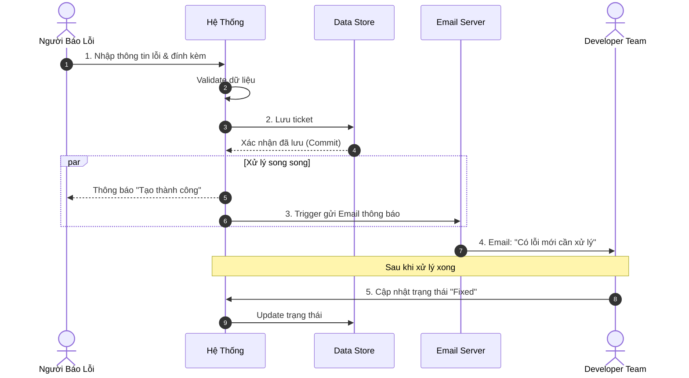
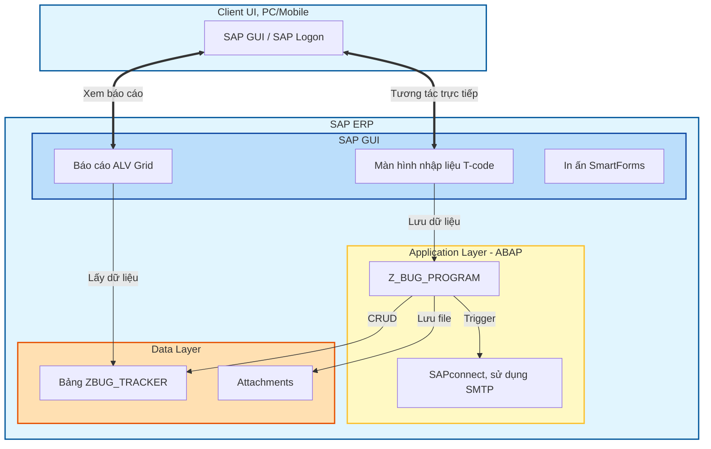
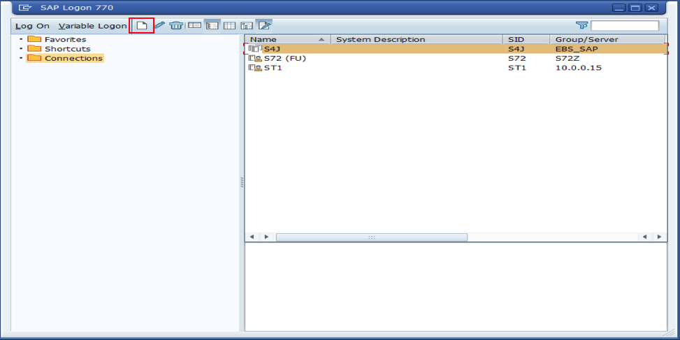

# XÂY DỰNG PHÂN HỆ QUẢN LÝ LỖI (BUG TRACKING) – GIẢI PHÁP ON-STACK

## 1. TỔNG QUAN DỰ ÁN

Phát triển một **Custom Solution (Z-Solution)** chạy trực tiếp trên SAP ERP. Giải pháp tuân thủ kiến trúc kỹ thuật chuẩn của SAP, đảm bảo tính bảo mật, toàn vẹn dữ liệu và khả năng tích hợp sâu (Deep Integration) với quy trình vận hành hiện tại.

### 1.1. Mục Tiêu Chung

Xây dựng hệ thống quản lý lỗi (Bug Tracking) phục vụ nghiệp vụ nội bộ, đảm bảo:

- Quản lý vòng đời lỗi (tạo, xử lý, đóng).
- Dữ liệu tập trung, truy xuất nhanh, có lịch sử.
- Tích hợp với SAP ERP, bảo mật và dễ vận hành.

### 1.2. Phạm Vi Chức Năng

- **Quản trị dữ liệu lỗi:** Lưu trữ ticket, trạng thái, ưu tiên, người tạo/được giao.
- **Ghi nhận lỗi:** Form nhập liệu chuẩn, validate dữ liệu, đính kèm ảnh/log.
- **Báo cáo & theo dõi:** Danh sách lỗi, lọc/sắp xếp, drill-down xem chi tiết.
- **Thông báo:** Gửi email khi tạo/cập nhật lỗi.
- **In ấn / xuất báo cáo:** Tạo file xuất ra PDF theo mẫu.

### 1.3. Quy Trình Nghiệp Vụ (Business Process Flow)

## 2. KIẾN TRÚC KỸ THUẬT

Giải pháp được xây dựng theo mô hình 3 lớp (3-Tier Architecture) của SAP NetWeaver:

- **Lớp Dữ liệu (Data Layer - SE11):** Sử dụng bảng trong suốt tùy chỉnh (**Transparent Table**) nằm trong không gian tên khách hàng (`Z*`), không can thiệp dữ liệu chuẩn (Standard Data).
- **Lớp Ứng dụng (Application Layer - ABAP):** Xử lý logic nghiệp vụ, xác thực dữ liệu và điều phối luồng (Workflow) bằng **ABAP**.
- **Lớp Trình diễn (Presentation Layer - SAP GUI):** Giao diện theo **SAP GUI Guidelines**, dùng **ALV Grid** cho báo cáo và **SmartForms** cho in ấn.

## 3. PHẠM VI CÔNG VIỆC CHI TIẾT

Hệ thống bao gồm các module chức năng chính:

### 3.1. Module Quản trị Dữ liệu

- **Thiết kế bảng `ZBUG_TRACKER`:** Lưu trữ toàn bộ thông tin vòng đời của lỗi.
- _Trường chính:_ Ticket ID (Key), Title, Description, Module (MM/SD/FI...), Priority, Status, Reporter, Assignee, Created Date, Closed Date.
- **Định nghĩa Data Element & Domain:** Chuẩn hóa các giá trị nhập liệu (VD: Status chỉ được phép New/Processing/Fixed).

### 3.2. Module Ghi nhận lỗi

- **Giao diện nhập liệu (T-code `ZBUG_CREATE`):** Selection Screen thân thiện, tự động lấy `SY-UNAME` và thời gian hệ thống.
- **Validation:** Kiểm tra tính hợp lệ của dữ liệu trước khi lưu.
- **Quản lý đính kèm:** Tích hợp **Generic Object Services (GOS)** để đính kèm ảnh/log lỗi.
- **Tự động hóa:** Tích hợp **SAPconnect (SMTP)** để gửi email thông báo khi tạo/cập nhật lỗi.

### 3.3. Module Báo cáo & Theo dõi

- **Báo cáo danh sách (T-code `ZBUG_REPORT`):** **ALV Grid**, hỗ trợ Sort/Filter/Aggregation, xuất Excel.
- **Drill-down:** Click mã lỗi để xem chi tiết hoặc cập nhật trạng thái.
- **Dashboard thống kê:** Tổng hợp lỗi theo trạng thái (Open/Closed) và mức độ ưu tiên.

### 3.4. Module In ấn

- **Biểu mẫu `ZBUG_FORM`:** Thiết kế bằng **SmartForms**.
- Bao gồm: Logo công ty, thông tin lỗi, khu vực ký duyệt.
- Hỗ trợ xuất PDF hoặc in trực tiếp qua máy in SAP.

## 4. KẾ HOẠCH TRIỂN KHAI

**Tổng thời gian thực hiện:** 08 tuần.  
**Phương pháp:** Waterfall (Phân tích → Thiết kế → Lập trình → Kiểm thử).

| Giai đoạn               | Tuần    | Hạng mục công việc (Work Item)                                                                                   | Kết quả bàn giao (Deliverables)                                  |
| ----------------------- | ------- | ---------------------------------------------------------------------------------------------------------------- | ---------------------------------------------------------------- |
| P1. Khởi tạo            | 01      | Thiết lập môi trường Development. Phân tích đặc tả kỹ thuật (Tech Specs). Thiết kế Database Schema (SE11). | Tài liệu thiết kế kỹ thuật. Cấu trúc bảng (Table Definition). |
| P2. Phát triển Core     | 02 - 03 | Lập trình màn hình nhập liệu. Logic CRUD & Validation. Cấu hình & lập trình gửi Email.                     | T-code nhập liệu hoạt động. Demo luồng gửi mail tự động.      |
| P3. Báo cáo & In ấn     | 04 - 05 | Lập trình báo cáo ALV Grid. Thiết kế SmartForms. Dashboard thống kê.                                       | T-code báo cáo hoàn chỉnh. Mẫu in PDF đúng chuẩn.             |
| P4. Đóng gói            | 06      | Rà soát mã nguồn (Code Inspector). Tối ưu hiệu năng. Đóng gói Transport Request.                           | Source code đã tối ưu. Gói cài đặt hoàn chỉnh.                |
| P5. Kiểm thử & Bàn giao | 07 - 08 | Hỗ trợ UAT. Khắc phục lỗi (Bug Fixing). Bàn giao tài liệu & source code.                                   | Biên bản nghiệm thu UAT. Tài liệu HDSD (User Manual).         |

## 5. TÀI NGUYÊN ĐÃ CÓ & YÊU CẦU BỔ SUNG

### 5.1. Tài nguyên đã được cung cấp ✅

**Hệ thống SAP:**

- **System ID:** S40 (FU - Functional Unit)
- **Application Server:** S40Z
- **Instance Number:** 00
- **SAP Logon Version:** 770
- **Connection Type:** Custom Application Server
- **Connection String:** /H/sapper
- **Network:** EBS_SAP

**Development Account:**

- **Main Account:** Qwer123@
- **Quyền đã cấp:**
  - ✅ **DEV-083** - Ghi nhận lỗi (Z-objects Development)
    - SE11 (ABAP Dictionary - tạo Z-table)
    - SE38/SE80 (ABAP Development Workbench)
    - SE93 (Transaction Code creation)
    - SE24 (Class Builder)
    - SE37 (Function Builder)
  - ✅ **DEV-224** - Email Configuration
    - SCOT (SAPconnect Configuration)
    - SOST (SAPconnect Administration)
  - ✅ **12345678** - Báo cáo & In ấn
    - ALV Grid development (REUSE*ALV*\* function modules)
    - SMARTFORMS Designer & Runtime
  - ✅ **DEV-237** - Đính kèm file
    - GOS (Generic Object Services)
    - Attachment management & storage

### 5.2. Yêu cầu bổ sung cần xác nhận

**1. Developer Key:**

- Xác nhận account Qwer123@ đã được cấp Developer Key
- Cần để unlock ABAP Editor (SE38/SE80)
- Nếu chưa có: Request từ SAP System Administrator

**2. Transport Layer & Package:**

- Package name cho Z-objects (đề xuất: **ZBUGTRACK**)
- Transport layer (đề xuất: **ZBT1**)
- Development class assignment
- Transport route configuration

**3. SMTP Server (nếu SCOT chưa config):**

- SMTP server IP/hostname
- Port (thường 25 hoặc 587)
- Authentication credentials (nếu cần)
- Test email address để verify
- Kiểm tra SCOT status: T-code **SCOT**

**4. SmartForms Template & Branding:**

- Logo công ty (format: BMP/PNG, size phù hợp)
- Corporate identity guidelines
- Standard footer/header format
- Approval signature fields

**5. GOS Configuration:**

- Document storage location (DMS hoặc file system)
- Allowed file types & size limits
- Retention policy
- Access control settings

**6. UAT Environment (Optional):**

- Xác nhận test trên S40 hay có system riêng
- Data refresh policy từ Production → UAT

## 6. CAM KẾT CHẤT LƯỢNG & BẢO HÀNH

- **Tuân thủ Clean Core:** Không sửa đổi mã nguồn chuẩn, an toàn khi nâng cấp SAP.
- **Tiêu chuẩn lập trình:** Tuân thủ quy chuẩn đặt tên SAP, có comment rõ ràng, dễ bảo trì.
- **Hỗ trợ sau triển khai:** Hỗ trợ xử lý lỗi kỹ thuật trong vòng [Số] tuần sau Go-live.

## 7. DELIVERABLES

- Tài liệu thiết kế kỹ thuật (Tech Specs)
- Source code & hướng dẫn triển khai
- Hướng dẫn sử dụng (User Manual)
