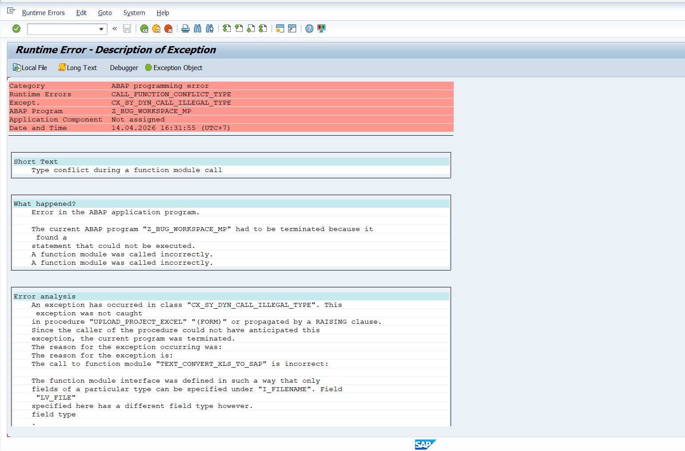
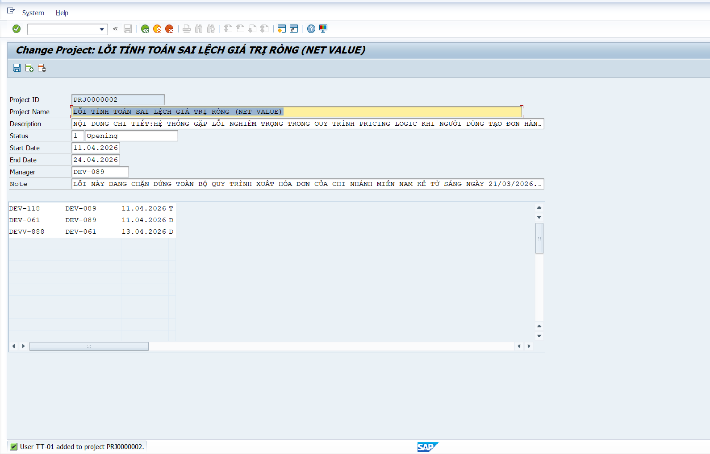
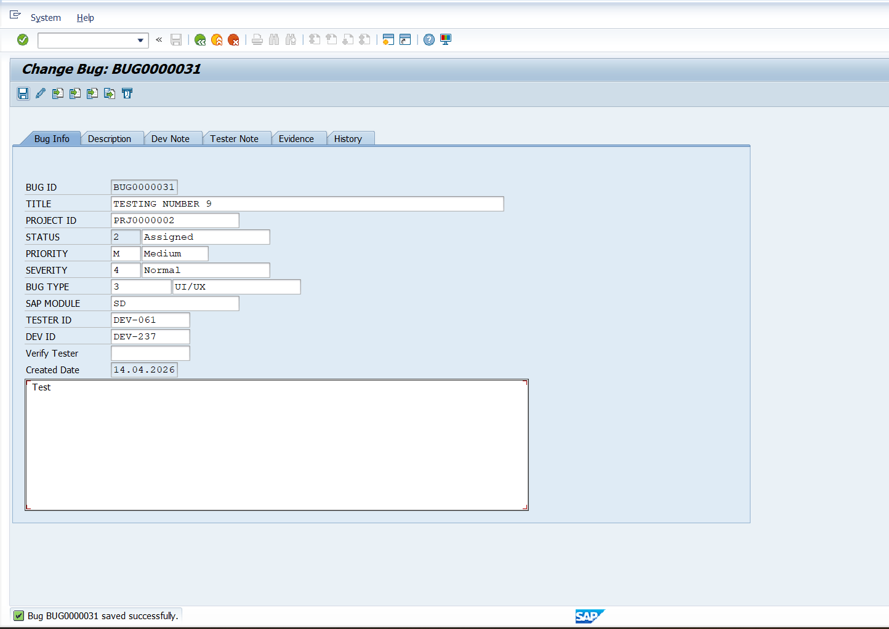
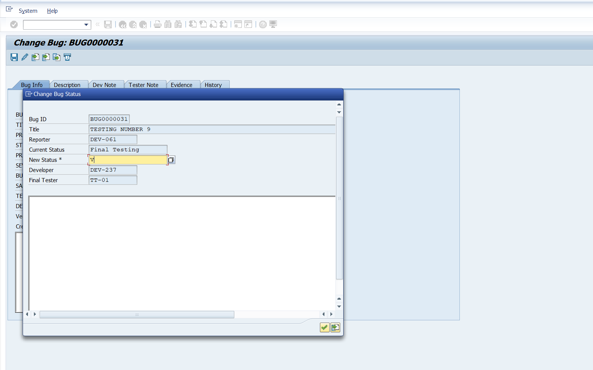
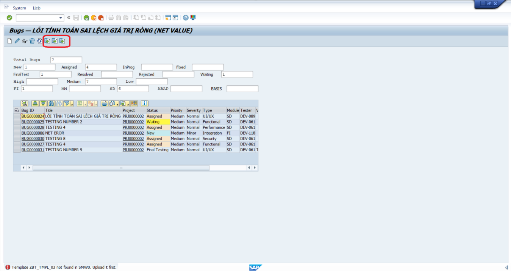
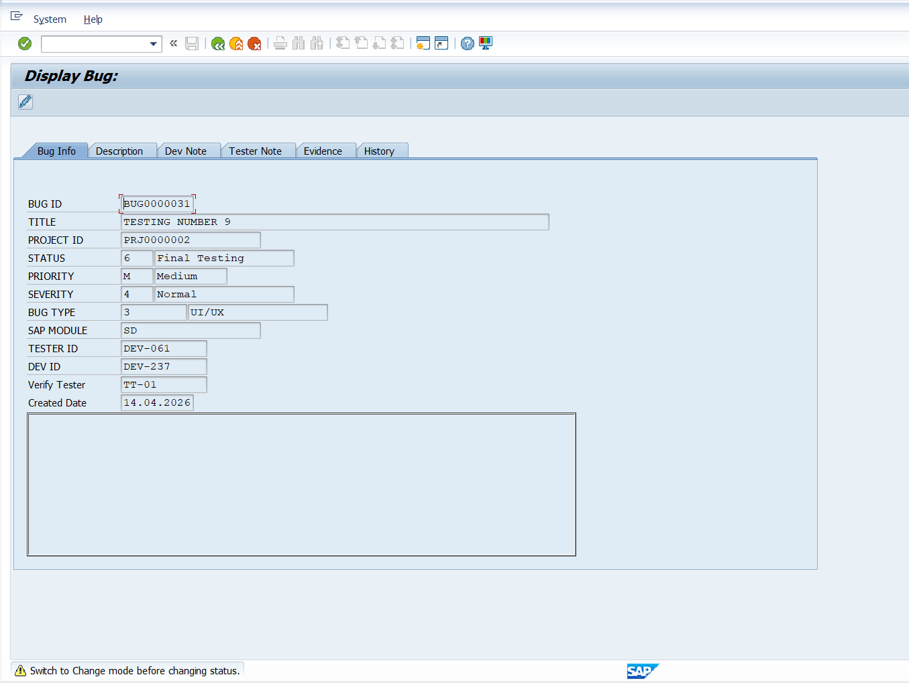
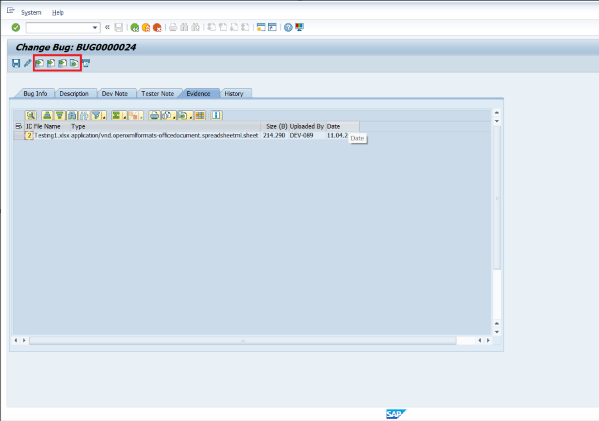
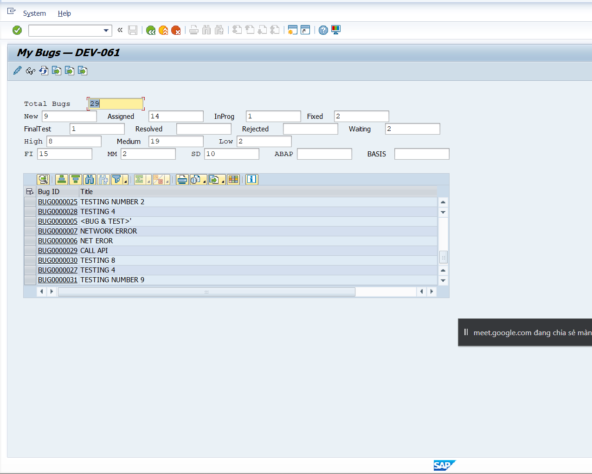

# Bugs merged từ testfile2.pdf (map bằng ảnh raw trong `images/`)

- Nguồn: `problems/testfile2.pdf`
- Ảnh dùng để mô tả bug: `problems/testfile2_extracted/images/`
- Quy tắc: **1 bug = 1 ảnh quan trọng**, hạn chế lặp nội dung chữ trong ảnh

## Bug 1: Upload Excel ở Project List bị dump

**Mô tả:** Nút Upload Excel ở Project List gây dump khi chạy.
**Ảnh minh họa:** `img-004.png`

## Bug 2: Add user xong không hiển thị ngay ở Project Detail

**Mô tả:** Add user thành công nhưng danh sách user không refresh tức thì trong màn Project Detail.
**Ảnh minh họa:** `img-024.png`

## Bug 3: Không lưu được note khi tạo/sửa bug

**Mô tả:** Nội dung note không lưu ổn định ở màn Change Bug; lỗi này xảy ra không chỉ ở Description mà cả các tab note khác (Dev Note, Tester Note).
**Ảnh minh họa:** `img-040.png`

## Bug 4: Popup Change Status bị lock/khó thao tác

**Mô tả:** Popup Change Status cần có nút `X` để thoát nhanh; hiện thiếu đường thoát rõ ràng nên dễ bị kẹt thao tác.
**Ảnh minh họa:** `img-084.png`

## Bug 5: 3 nút download template không hoạt động

**Mô tả:** Nhóm nút download template không tải được file mẫu.
**Ảnh minh họa:** `img-092.png`

## Bug 6: Display Bug vẫn có Change Status dù không nên thao tác

**Mô tả:** Cần remove action `Change` trên thanh action/status bar của màn Display Bug để tránh thao tác sai ngữ cảnh.
**Ảnh minh họa:** `img-100.png`

## Bug 7: Nhóm upload/download evidence đặt tên/chức năng sai

**Mô tả:** Nút evidence có hành vi/label chưa khớp (upload, delete, download gây nhầm).
**Ảnh minh họa:** `img-108.png`

## Bug 8: Filter MY BUG hiển thị sai phạm vi

**Mô tả:** `MY BUG` hiển thị sai scope, có lúc lộ nhiều bug ngoài phạm vi account hiện tại.
**Ảnh minh họa:** `img-116.png`

## Bug 9: Chưa có flow gửi email theo auto-assign

**Mô tả:** Cần bổ sung flow gửi email khi auto-assign:

- Nếu auto-assign tìm được Dev và assign thành công -> gửi mail cho Dev đó.
- Nếu không tìm được Dev -> gửi mail cho Manager.
- Tương tự với luồng assign Tester: tìm được thì gửi cho Tester, không tìm được thì escalate theo rule Manager.
**Ảnh minh họa:** (chưa có ảnh riêng trong bộ `images` hiện tại)
