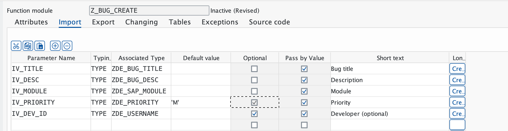

# Báo Cáo Tiến Độ - Phase 2 (Business Logic Layer)

**Ngày báo cáo:** 02/03/2026
**Giai đoạn:** Phase 2 - Business Logic Layer (Function Groups & Function Modules)
**Trạng thái:** Đang thực hiện (35%)

---

## 1. Mục đích báo cáo

Báo cáo này tóm tắt tiến độ xây dựng tầng xử lý nghiệp vụ (Business Logic) cho hệ thống SAP Bug Tracking. Tầng này đóng vai trò "bộ não", kiểm soát mọi luồng dữ liệu CRUD và gửi thông báo.

## 2. Các mục đã hoàn thành

* **Thiết lập Function Group `ZBUG_FG`:**
  * *Giá trị nghiệp vụ:* Tạo không gian lưu trữ tập trung cho toàn bộ các hàm xử lý logic của dự án. Đảm bảo tính đóng gói (Encapsulation) và dễ quản lý.
  * *Trạng thái:* **Active** ✅
* **Phát triển Function Module `Z_BUG_CREATE` (Hàm tạo Bug):**
  * *Giá trị nghiệp vụ:*
    * Tự động kiểm tra tính hợp lệ của dữ liệu đầu vào (Ví dụ: Tiêu đề không được trống, độ dài tối thiểu 10 ký tự).
    * Tự động gọi Number Range để sinh ID duy nhất.
    * Đảm bảo tính toàn vẹn dữ liệu khi ghi vào bảng Database `ZBUG_TRACKER`.
  * *Trạng thái:* **Active** ✅ (Đã cấu hình Pass by Value và Optional Parameters chuẩn xác).

---

## 3. Hướng dẫn nghiệm thu hệ thống (UAT Verification)

Nhà quản lý hoặc Tester có thể thực hiện theo các bước sau để tự nghiệm thu các đối tượng Business Logic đã được tạo trên hệ thống SAP:

### Bước 3.1: Truy cập và Kiểm tra Trạng thái (SE80)

1. Truy cập Transaction **`SE80`**.
2. Chọn Package **`ZBUGTRACK`**.
3. Mở rộng cây thư mục: `Function Groups` -> `ZBUG_FG`.
4. Mở rộng `Function Modules`: Bạn sẽ thấy **`Z_BUG_CREATE`**.
5. Đảm bảo cột **Status** hiển thị chữ **Active** (Xem hình đối chứng A).

### Bước 3.2: Hình ảnh đối chứng (System Snapshots)

A. **Trạng thái đối tượng tại Repository Browser (SE80):**

B. **Cấu hình tham số và thiết lập kỹ thuật (Z_BUG_CREATE):**

---

## 4. Kế hoạch tiếp theo

Dự án sẽ tiếp tục hoàn thiện các hàm xử lý còn lại trong Phase 2:

1. **Step 2.3:** Xây dựng FM `Z_BUG_UPDATE_STATUS` (Cập nhật trạng thái và ngày đóng Bug).
2. **Step 2.4:** Xây dựng FM `Z_BUG_GET` (Lấy thông tin chi tiết một Bug).
3. **Step 2.5:** Xây dựng FM `Z_BUG_DELETE` (Xóa Bug).
4. **Step 2.6:** Cấu hình Email và xây dựng FM `Z_BUG_SEND_EMAIL`.

---
**🎯 Mục tiêu:** Hoàn tất toàn bộ tầng Business Logic trong ngày 02/03/2026.
