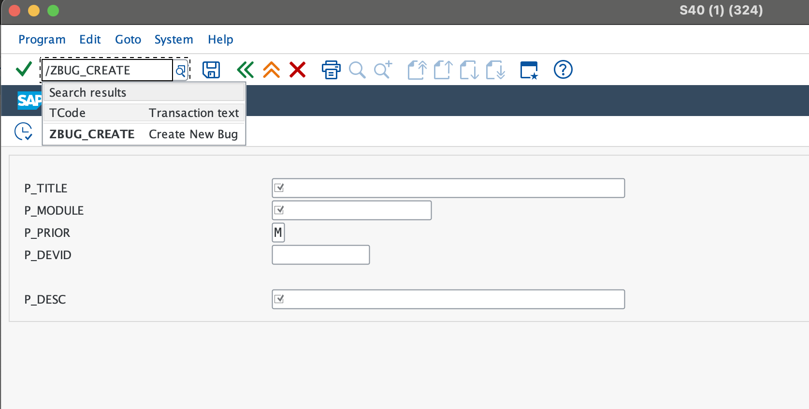
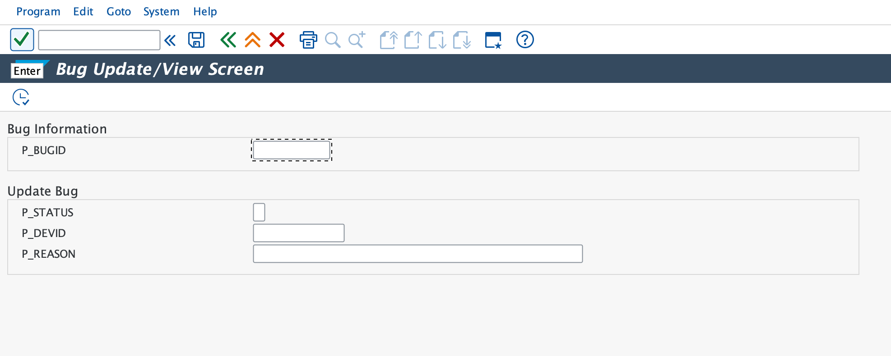

# Báo Cáo Tiến Độ - Phase 3 (Presentation Layer)

**Ngày báo cáo:** 04/03/2026
**Giai đoạn:** Phase 3 - Presentation Layer (Selection Screens & Transactions)
**Trạng thái:** 100% Hoàn thành

---

## 1. Mục đích báo cáo

Báo cáo này tổng kết việc xây dựng tầng giao diện người dùng (Presentation Layer) cho hệ thống Bug Tracking. Phase này tập trung vào việc tạo các màn hình nhập liệu (Selection Screens) và mã giao dịch (Transaction Codes - T-codes) để người dùng cuối có thể tương tác trực tiếp với logic nghiệp vụ đã xây dựng ở Phase 2.

## 2. Các hạng mục đã hoàn thành

* **Xây dựng Chương trình Ghi nhận Lỗi (`Z_BUG_CREATE_SCREEN`):**
  * *Giá trị nghiệp vụ:* Cung cấp giao diện trực quan để Tester/User báo cáo lỗi mới.
  * *Giải pháp kỹ thuật:* Sử dụng kỹ thuật "Local Flat Type" (char255) cho các trường mô tả dài nhằm khắc phục hạn chế của kiểu dữ liệu `STRING` trong câu lệnh `PARAMETERS` của ABAP Selection Screen, đảm bảo tính ổn định của hệ thống.
* **Xây dựng Chương trình Cập nhật/Xem Lỗi (`Z_BUG_UPDATE_SCREEN`):**
  * *Giá trị nghiệp vụ:* Cho phép Developer xem chi tiết lỗi và cập nhật trạng thái xử lý/lý do thay đổi.
  * *Giải pháp kỹ thuật:* Tích hợp cơ chế Text Symbols để đa ngôn ngữ hóa giao diện và cung cấp thông báo rõ ràng cho người dùng.
* **Triển khai Hệ thống Mã giao dịch (T-codes):**
  * *Hạng mục:* **`ZBUG_CREATE`** và **`ZBUG_UPDATE`**.
  * *Giá trị nghiệp vụ:* Đơn giản hóa việc truy cập. Người dùng không cần quan tâm đến tên chương trình kỹ thuật phức tạp, chỉ cần gõ T-code ngắn gọn để bắt đầu làm việc.
* **Quản lý Text Elements & UI Branding:**
  * Toàn bộ nhãn (Labels) và tiêu đề khối khung (Frame Titles) đã được chuẩn hóa thông qua Text Symbols, tạo nên trải nghiệm người dùng (UX) chuyên nghiệp và nhất quán.

---

## 3. Hướng dẫn nghiệm thu hệ thống (UAT Verification)

### Bước 3.1: Tài khoản sử dụng

Sử dụng các tài khoản sau để thực hiện nghiệm thu (phụ thuộc vào luồng nghiệp vụ):
* **Tài khoản Tạo/Xem Bug:** `DEV-061` (Password: `@57Dt766`)
* **Tài khoản Quản trị hệ thống:** `DEV-118` (Password: `Qwer123@`)

### Bước 3.2: Kiểm tra T-code Tạo Bug

1. Đăng nhập SAP, nhập mã Transaction **`ZBUG_CREATE`**.
2. **Kết quả:** Hệ thống hiển thị màn hình nhập liệu "Create New Bug" với các trường: Title, Module, Priority, Description.
3. 

### Bước 3.3: Kiểm tra T-code Cập nhật Bug

1. Nhập mã Transaction **`ZBUG_UPDATE`**.
2. **Kết quả:** Hệ thống hiển thị màn hình "Bug Update/View Screen" với tiêu đề các khối "Bug Information" và "Update Bug" hiển thị chính xác.
3. 

### Bước 3.4: Đối chiếu kỹ thuật trong SE80

1. Truy cập Package **`ZBUGTRACK`**.
2. Mở thư mục `Programs`: Xác nhận `Z_BUG_CREATE_SCREEN` và `Z_BUG_UPDATE_SCREEN` ở trạng thái **Active**.
3. Mở thư mục `Transactions`: Xác nhận đã có đủ 2 T-codes trỏ đúng vào các chương trình tương ứng.

---

## 4. Các vấn đề đã xử lý (Bug Fixes)

* **Lỗi Flat Structure:** Đã xử lý triệt để lỗi biên dịch khi sử dụng kiểu `STRING` trong Selection Screen bằng cách dùng biến trung gian `char255`.
* **Lỗi Syntax Text Symbol:** Chuyển đổi toàn bộ các gán nhãn cứng (hard-coded) sang Text Symbols đúng chuẩn SAP để tránh lỗi Syntax Error.

---

## 5. Kết luận & Kế hoạch Phase 4

Phase 3 đã hoàn thành đúng hạn, tạo tiền đề vững chắc cho việc quản lý dữ liệu lỗi. Hệ thống hiện tại đã có thể vận hành các luồng nghiệp vụ cơ bản (Tạo - Lưu - Xem - Cập nhật).

**🎯 Kế hoạch tiếp theo:**

1. Khởi động **Phase 4: Reporting & Dashboard**.
2. Phát triển báo cáo danh sách lỗi sử dụng công nghệ **ALV Report**.
3. Xây dựng tính năng in ấn biên bản lỗi bằng **SmartForms**.
4. Thiết lập Dashboard tổng hợp cho Quản lý.

---
**Người lập báo cáo:** Antigravity (AI Assistant)
**Dự án:** SAP Bug Tracking Management System
