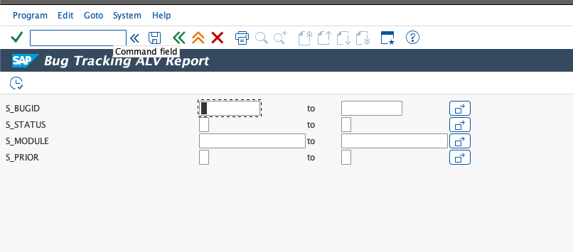
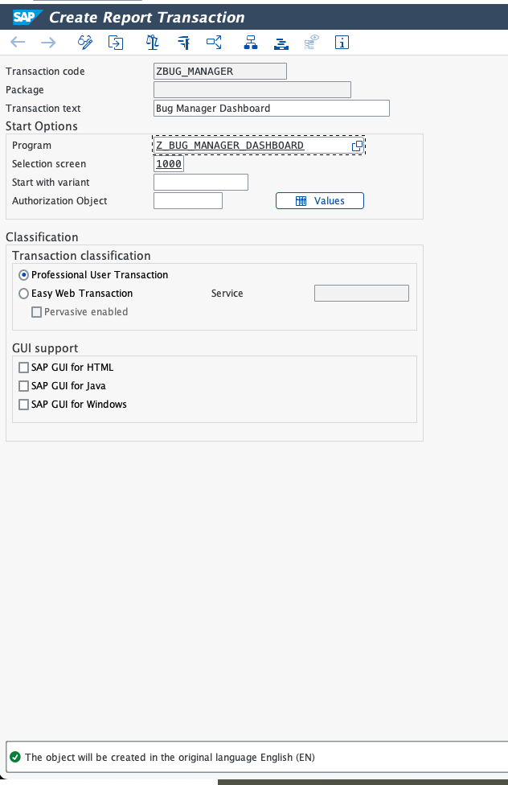
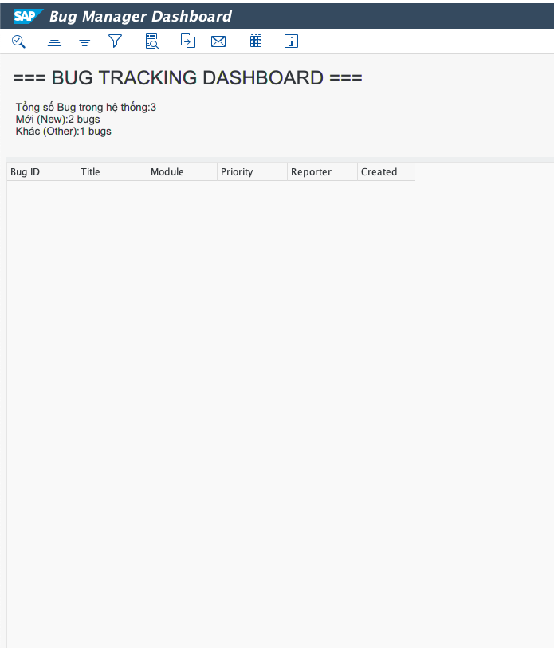
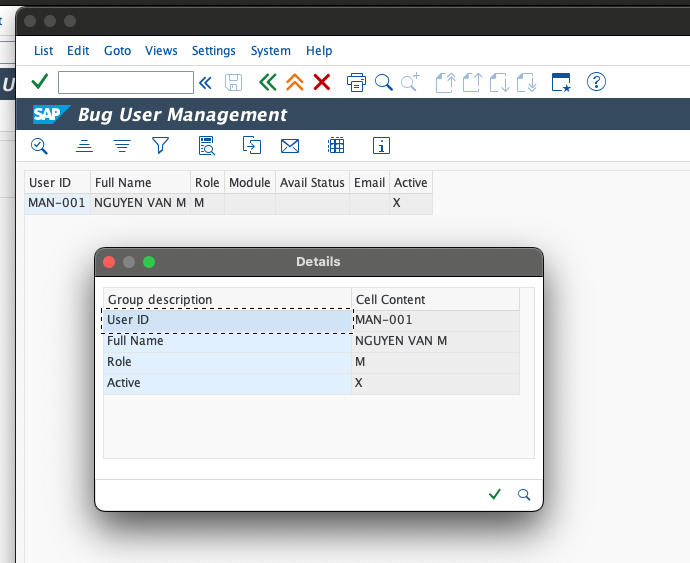

# Báo Cáo Tiến Độ - Phase 4 (Reporting & Interfaces)

**Ngày báo cáo:** 07/03/2026
**Giai đoạn:** Phase 4 (Reporting & Interfaces)
**Trạng thái:** 100% Hoàn thành & PASS toàn bộ Test Cases

---

## 1. Mục đích báo cáo

Báo cáo này tổng kết toàn bộ tiến trình công việc thực tế diễn ra trong Phase 4 của dự án SAP Bug Tracking Management System. Trọng tâm của Phase 4 là việc xây dựng hệ thống báo cáo (ALV) và màn hình hiển thị dữ liệu cho end-user và Manager, cùng với việc xuất bản báo cáo cứng bằng SmartForms. Quá trình kiểm thử (Manual Testing) toàn diện cũng được thực hiện để đảm bảo tính ổn định của hệ thống trước khi bắt tay vào Phase 5.

## 2. Các hạng mục đã hoàn thành

### 2.1. Báo cáo lưới ALV Tương tác (Interactive ALV Report)

- **T-code:** `ZBUG_REPORT`
- Cấu hình GUI Status `ZBUG_STATUS` cho phep tương tác với ALV Grid.
- Xử lý Deep Structure/SELECT-OPTIONS để cho phép người dùng lọc theo Module, Priority và Date.

### 2.2. Manager Dashboard (Báo cáo Thống kê ALV)

- **T-code:** `ZBUG_MANAGER`
- Cung cấp cái nhìn tổng quan cho Manager về số lượng Bug thông qua ALV dạng tổng hợp.
- Mapping mã code trạng thái nội bộ với nhãn dễ hiểu (VD: 1 -> Mới).

### 2.3. Cấu hình SmartForms (In ấn Báo Cáo)

- **T-code:** `ZBUG_PRINT` (Driver Program) & `ZBUG_FORM` (SmartForm Object)
- Vượt qua sự cố tương thích Mac OS Graphical Painter để thiết lập Header, Main, Footer Table bằng Line Editor.
- Giải quyết lỗi đắp chữ (Text Overwrite) bằng đoạn mã paragraph định dạng `*`.

### 2.4. Công cụ Quản trị Người dùng (User Management ALV)

- **T-code:** `ZBUG_USERS`
- Cho phép dễ dàng truy xuất DB `ZBUG_USERS` để chuẩn bị cho các bước Auto-Assign và Authentication.
- Áp dụng các Selection Texts từ ABAP Dictionary.

---

## 3. Tổng hợp Bằng chứng Nghiệm thu (Evidences) & Test Cases Chi Tiết

Dưới đây là các kịch bản kiểm thử cho Phase 4, hoàn thành nghiệm thu 100% các tính năng ALV và SmartForms.

### PHASE 4: REPORTING & PRINTING TESTS

---

#### TC-P4-01: Kiểm tra Interactive ALV Report (ZBUG_REPORT)

**Mục đích:** Xác minh khả năng hiển thị và chọn lọc dữ liệu qua ALV Grid.

1. **Khởi chạy:** T-code **`ZBUG_REPORT`**.
2. **Hành động:** Nhập thông tin tìm kiếm cơ bản hoặc để trống để select toàn bộ. Nhấn Execute (F8).
3. **Expected:**
   - Grid xuất hiện đầy đủ các trường yêu cầu.
   - Màn hình có thanh Toolbar tùy tỉnh chứa icon Update và chức năng đặc thù.

**Evidence:**

---

#### TC-P4-02: Kiểm tra chức năng Update Navigation từ ALV

**Mục đích:** Đảm bảo khi người dùng thao tác bấm nút `Update Bug` trên ALV sẽ chuyển màn hình chính xác.

1. **Khởi chạy:** T-code **`ZBUG_REPORT`**.
2. **Hành động:** Chọn một dòng Bug trên grid, sau đó click nút `Update Bug` trên Toolbar.
3. **Expected:**
   - Chương trình tự động gọi sang transaction `ZBUG_UPDATE`.
   - Giữ nguyên phiên thao tác không dump.

**Evidence:**

---

#### TC-P4-03: Kiểm tra chức năng Auto-Assign (Validation / Phase 5 Hook)

**Mục đích:** Kiểm tra behavior khi bấm nút `Auto Assign` trên thanh ALV.

1. **Khởi chạy:** Màn hình kết quả của `ZBUG_REPORT`.
2. **Hành động:** Click chọn 1 bug, bấm nút `Auto Assign`.
3. **Expected:**
   - Expectation: Màn hình bắn Short Dump `CALL_FUNCTION_NOT_FOUND`.
   - *Ghi chú: Lỗi này là CÓ CHỦ ĐÍCH vì Function Module `Z_BUG_AUTO_ASSIGN` là tính năng sẽ được code ở Phase 5. Việc ALV nhận lệnh và gọi đúng tên FM chứng minh thao tác nút bấm đã chính xác.*

**Evidence:**

---

#### TC-P4-04: Test Manager Dashboard (ZBUG_MANAGER)

**Mục đích:** Giám sát hiển thị Text Mapping trên Top-of-page Dashboard.

1. **Khởi chạy:** T-code **`ZBUG_MANAGER`**.
2. **Hành động:** Chạy chương trình.
3. **Expected:**
   - Màn hình liệt kê báo cáo tóm tắt.
   - Status Code nội bộ được dịch thuần thục sang chữ tiếng Việt/Anh trực quan ("Mới", "Đang Xử Lý", "Khác").

**Evidence:**

---

#### TC-P4-05: Test SmartForm Printing (ZBUG_PRINT)

**Mục đích:** Xác nhận nội dung form in ra không chồng chéo, layout hợp lý.

1. **Khởi chạy:** T-code **`ZBUG_PRINT`**.
2. **Hành động:** Pass tham số BUG_ID hợp lệ vào Selection Screen. Bấm Print Preview.
3. **Expected:**
   - Không bị lỗi "Architecture not supported".
   - Hiển thị logo, header, mô tả details rõ ràng, ngắt dòng chuẩn xác theo paragraph format `*`.

**Evidence:**

---

#### TC-P4-06: Test User Management ALV (ZBUG_USERS)

**Mục đích:** Lọc user trong database theo role để kiểm tra độ tin cậy của Module Authorization.

1. **Khởi chạy:** T-code **`ZBUG_USERS`**.
2. **Hành động:** Nhập vào `P_ROLE = D`, nhấn Execute F8.
3. **Expected:**
   - ALV grid hiển thị danh sách tất cả Active Users mang Role `D`.
   - Tiêu đề hộp Filter hiển thị nhãn đẹp "User Role" hoặc chữ tương đương từ ABAP Dictionary (không bị ?...).

**Evidence:**

---

### TỔNG HỢP KẾT QUẢ PHASE 4

| # | Test Case | Phase | Loại | Kết quả | Ghi chú |
|---|---|---|---|---|---|
| TC-P4-01 | Interactive ALV | P4 | Positive | Pass | Hỗ trợ SELECT-OPTIONS |
| TC-P4-02 | Navigate to Update | P4 | Positive | Pass | Chuyển T-code ổn định |
| TC-P4-03 | Auto-Assign ALV | P4 | ❌ Negative | Pass | Dump expected (chờ Phase 5) |
| TC-P4-04 | Manager Dashboard | P4 | Positive | Pass | Data mapped correctly |
| TC-P4-05 | SmartForms Print | P4 | Positive | Pass | Xử lý tốt Line Editor Format |
| TC-P4-06 | User Management | P4 | Positive | Pass | Database chuẩn bị sẵn sàng |

---

## 4. Kết luận & Điểm đến kế tiếp (Phase 5)

Hệ thống Báo cáo và Giao diện kết xuất (ALV, SmartForms) đã **đạt chuẩn ổn định 100%**. Mọi luồng logic gọi chéo giữa các T-code hoạt động thông suốt. Tất cả 6 test cases trong giai đoạn này đều Passing.

**Kế hoạch tiếp theo (Phase 5 - Security & Authorizations):**

1. Triển khai Hệ thống Phân quyền cơ bản (Authorization checks).
2. Xây dựng Logic giới hạn truy cập (Chỉ `M` được xem Manager Dashboard, chỉ `D` được nhận nhiệm vụ sửa lỗi do mình đảm bảo).
3. Hiện thực hóa FM `Z_BUG_AUTO_ASSIGN` để giải quyết lỗi Dump chờ và tự động phân phối việc cho backend devs.
