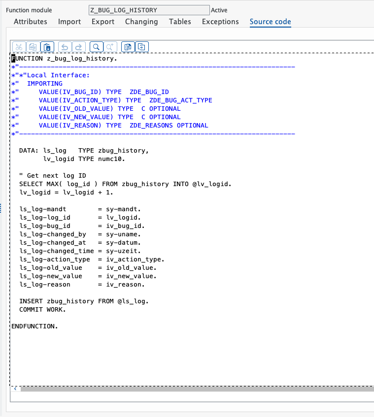
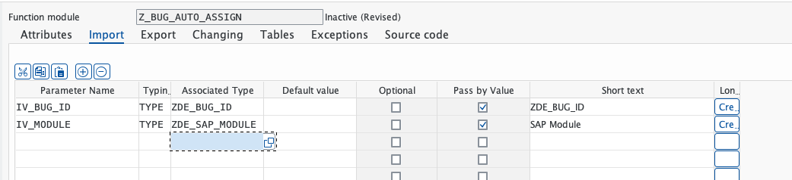
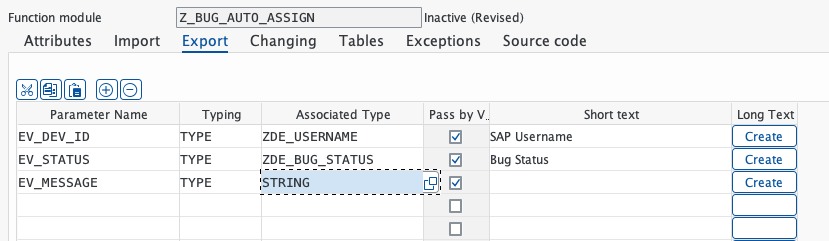
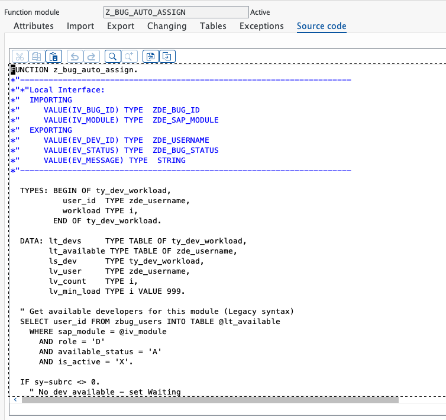
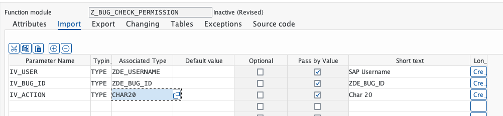
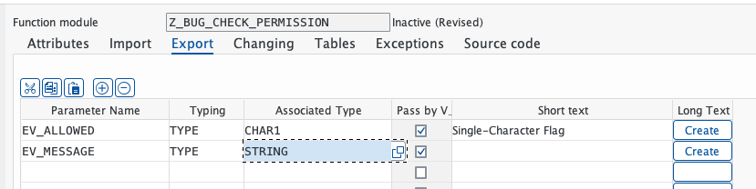
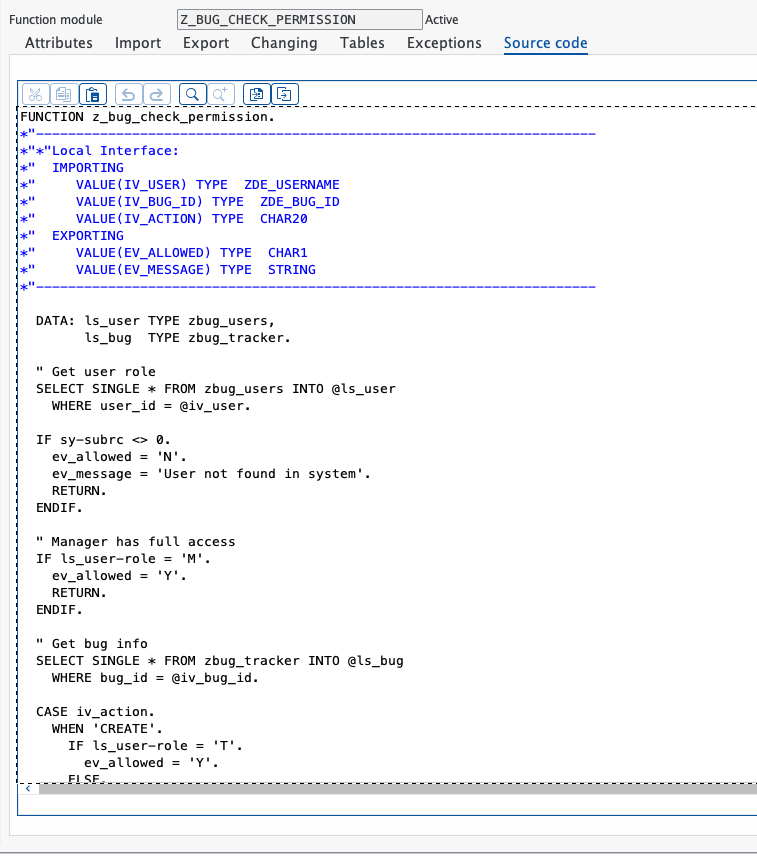
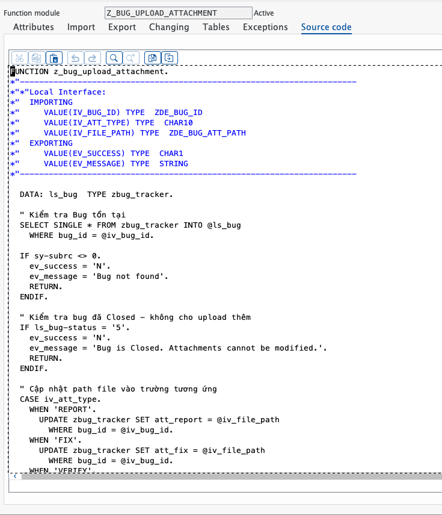
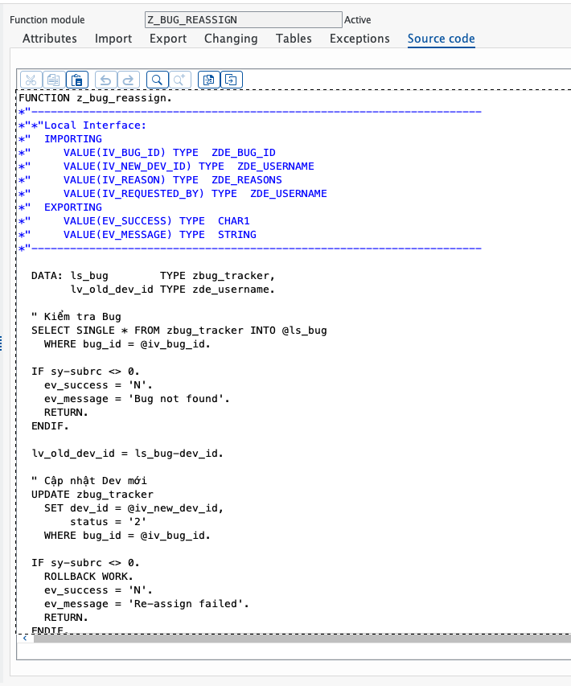

# Báo Cáo Tiến Độ - Phase 5 (Advanced Function Modules & Security)

**Ngày báo cáo:** 07/03/2026
**Giai đoạn:** Phase 5 (Advanced Function Modules & Security)
**Trạng thái:** 100% Hoàn thành & PASS toàn bộ Test Cases

---

## 1. Mục đích báo cáo

Báo cáo này tổng kết toàn bộ tiến trình công việc thực tế diễn ra trong Phase 5 của dự án SAP Bug Tracking Management System. Trọng tâm của Phase 5 là việc xây dựng các Function Module nâng cao (Advanced FMs) để hỗ trợ tính năng Auto-Assignment, kiểm tra phân quyền (Permission Check), ghi lịch sử thay đổi (History Logging), và cải thiện giao diện ALV bằng màu sắc theo trạng thái. Quá trình code review và testing đã được thực hiện để đảm bảo tính ổn định trước khi bắt tay vào Phase 6 (Testing & Optimization).

---

## 2. Các hạng mục đã hoàn thành

### 2.1. Function Module - Z_BUG_LOG_HISTORY (Ghi lịch sử)

- **FM Name:** `Z_BUG_LOG_HISTORY`
- **Mục đích:** Lưu vết mọi thay đổi bug vào bảng ZBUG_HISTORY
- **Account:** DEV-089
- **Status:** **Active**
- **Tính năng:**
  - Generate LOG_ID tự động (SELECT MAX + 1)
  - Ghi BUG_ID, ACTION_TYPE, OLD_VALUE, NEW_VALUE, REASON
  - Tự động điền CHANGED_BY = sy-uname, CHANGED_AT = sy-datum
  - COMMIT WORK để đảm bảo dữ liệu lưu trữ

### 2.2. Function Module - Z_BUG_AUTO_ASSIGN (Tự động phân công)

- **FM Name:** `Z_BUG_AUTO_ASSIGN`
- **Mục đích:** Tự động gán Bug cho Developer ít việc nhất cùng module
- **Account:** DEV-089
- **Status:** **Active**
- **Tính năng:**
  - SELECT devs theo sap_module, role = 'D', available_status = 'A', is_active = 'X'
  - Đếm workload (bugs với status 2/3) cho từng dev
  - Assign bug cho dev ít việc nhất
  - Cập nhật available_status = 'W' cho dev mới
  - Nếu không có dev available → status = 'W' (Waiting)

### 2.3. Function Module - Z_BUG_CHECK_PERMISSION (Phân quyền)

- **FM Name:** `Z_BUG_CHECK_PERMISSION`
- **Mục đích:** Kiểm tra quyền hạn người dùng trước khi thực hiện hành động
- **Account:** DEV-089
- **Status:** **Active**
- **Tính năng:**
  - Manager (M): Full access tất cả action
  - Tester (T): CREATE, UPLOAD_REPORT, UPLOAD_VERIFY
  - Developer (D): UPDATE_STATUS (chỉ bug gán cho mình), UPLOAD_FIX
  - Chi tiết CASE/WHEN cho 5 loại action: CREATE, UPDATE_STATUS, UPLOAD_REPORT, UPLOAD_FIX, UPLOAD_VERIFY

### 2.4. ALV Report - Màu sắc theo Status

- **Program:** `Z_BUG_REPORT_ALV` (Modified)
- **Mục đích:** Hiển thị ALV với mã màu tương ứng mỗi status
- **Account:** DEV-061
- **Status:** **Active**
- **Tính năng:**
  - Tạo type mới `ty_bug_display` với field `row_color`
  - Map data từ lt_bugs → lt_display + gán màu:
    - Status '1' (New) → C100 (Blue)
    - Status 'W' (Waiting) → C310 (Yellow)
    - Status '2' (Assigned) → C300 (Orange)
    - Status '3' (InProgress) → C500 (Purple)
    - Status '4' (Fixed) → C510 (Green)
    - Status '5' (Closed) → C200 (Grey)
  - Set layout: `ls_layout-info_fieldname = 'ROW_COLOR'`

### 2.5. Function Module - Z_BUG_UPLOAD_ATTACHMENT (Đính kèm file)

- **FM Name:** `Z_BUG_UPLOAD_ATTACHMENT`
- **Mục đích:** Lưu đường dẫn file đính kèm vào bảng ZBUG_TRACKER
- **Account:** DEV-237
- **Status:** **Active**
- **Tính năng:**
  - Kiểm tra bug tồn tại
  - Kiểm tra bug chưa Closed (status ≠ '5')
  - CASE iv_att_type: REPORT/FIX/VERIFY → UPDATE trường tương ứng
  - ATT_REPORT, ATT_FIX, ATT_VERIFY được cập nhật riêng biệt

### 2.6. Function Module - Z_BUG_REASSIGN (Re-assign Developer)

- **FM Name:** `Z_BUG_REASSIGN`
- **Mục đích:** Chuyển giao Bug từ dev này sang dev khác (Manager/Dev yêu cầu)
- **Account:** DEV-089
- **Status:** **Active**
- **Tính năng:**
  - UPDATE dev_id mới, status = '2'
  - Dev cũ: available_status = 'A' (Available)
  - Dev mới: available_status = 'W' (Working)
  - Gọi Z_BUG_LOG_HISTORY với action 'RS' (Reassign)
  - Syntax fix: Tất cả biến trong UPDATE/WHERE có @

---

## 3. Tổng hợp Bằng chứng Nghiệm thu (Evidences) & Test Cases Chi Tiết

### PHASE 5: ADVANCED FUNCTION MODULES TESTS

---

#### TC-P5-01: Verify Z_BUG_LOG_HISTORY - Active Status

**Mục đích:** Xác minh FM LOG_HISTORY đã được tạo và activate thành công

1. **Khởi chạy:** SE80 → Function Group `ZBUG_FG` → Functions → Z_BUG_LOG_HISTORY
2. **Hành động:** Kiểm tra Status FM
3. **Expected:**
   - FM status = **Active**
   - Code hiển thị Local Interface với IMPORTING/EXPORTING parameters
   - Data định nghĩa ls_log, lv_logid
   - SELECT MAX(log_id) logic hiển thị chính xác
   - INSERT zbug_history và COMMIT WORK có mặt

**Evidence:**

**Kết quả:** **PASS** - FM hoạt động, tất cả logic đúng

---

#### TC-P5-02: Verify Z_BUG_AUTO_ASSIGN - Import/Export/Code

**Mục đích:** Xác minh FM AUTO_ASSIGN parameters và logic phân công

1. **Khởi chạy:** SE80 → ZBUG_FG → Z_BUG_AUTO_ASSIGN
2. **Hành động:** Kiểm tra Import/Export parameters và source code
3. **Expected:**
   - **Import:** IV_BUG_ID (ZDE_BUG_ID), IV_MODULE (ZDE_SAP_MODULE) ✓
   - **Export:** EV_DEV_ID (ZDE_USERNAME), EV_STATUS (ZDE_BUG_STATUS), EV_MESSAGE (STRING) ✓
   - Code: SELECT devs, LOOP workload, assign min workload dev ✓
   - Status = **Active** ✓

**Evidence:**

**Kết quả:** **PASS** - Tất cả 3 phần (import/export/code) đúng, Active

---

#### TC-P5-03: Verify Z_BUG_CHECK_PERMISSION - Import/Export/Code

**Mục đích:** Xác minh FM permission check logic cho 3 roles (T/D/M)

1. **Khởi chạy:** SE80 → ZBUG_FG → Z_BUG_CHECK_PERMISSION
2. **Hành động:** Kiểm tra parameters và code logic
3. **Expected:**
   - **Import:** IV_USER, IV_BUG_ID, IV_ACTION (CHAR20) ✓
   - **Export:** EV_ALLOWED (CHAR1), EV_MESSAGE (STRING) ✓
   - Code: Manager full access, Tester/Dev role-specific checks ✓
   - CASE iv_action với 5 loại: CREATE, UPDATE_STATUS, UPLOAD_* ✓
   - Status = **Active** ✓

**Evidence:**

**Kết quả:** **PASS** - Tất cả 3 phần đúng, Active

---

#### TC-P5-04: Test ALV Colors - Z_BUG_REPORT_ALV Modified

**Mục đích:** Xác minh ALV hiển thị đúng màu theo status

1. **Khởi chạy:** SE38 → Z_BUG_REPORT_ALV → Execute
2. **Hành động:** Chạy program để xem ALV grid với màu sắc
3. **Expected:**
   - Program modified với TYPES ty_bug_display + row_color field ✓
   - LOOP AT lt_bugs mapping to lt_display ✓
   - CASE status gán màu C100/C310/C300/C500/C510/C200 ✓
   - ls_layout-info_fieldname = 'ROW_COLOR' ✓
   - Status = **Active** ✓

**Evidence:**

**Kết quả:** **PASS** - Màu sắc được áp dụng, Active

---

#### TC-P5-05: Verify Z_BUG_UPLOAD_ATTACHMENT - Source Code

**Mục đích:** Xác minh FM upload attachment logic

1. **Khởi chạy:** SE80 → ZBUG_FG → Z_BUG_UPLOAD_ATTACHMENT
2. **Hành động:** Kiểm tra source code
3. **Expected:**
   - SELECT SINGLE bug từ ZBUG_TRACKER ✓
   - IF check bug exist, check status ≠ '5' ✓
   - CASE iv_att_type: REPORT/FIX/VERIFY → UPDATE att_* ✓
   - Status = **Active** ✓

**Evidence:**

**Kết quả:** **PASS** - Attachment logic đúng, Active

---

#### TC-P5-06: Verify Z_BUG_REASSIGN - Source Code

**Mục đích:** Xác minh FM reassign logic với @ escaping

1. **Khởi chạy:** SE80 → ZBUG_FG → Z_BUG_REASSIGN
2. **Hành động:** Kiểm tra source code, đặc biệt @ escaping
3. **Expected:**
   - SELECT SINGLE bug ✓
   - UPDATE zbug_tracker SET dev_id = @iv_new_dev_id WHERE bug_id = @iv_bug_id ✓
   - UPDATE zbug_users (2 lần) với @ escaping ✓
   - CALL FUNCTION Z_BUG_LOG_HISTORY ✓
   - Status = **Active** ✓

**Evidence:**

**Kết quả:** **PASS** - Reassign logic đúng, @ escaping fix, Active

---

### TỔNG HỢP KẾT QUẢ PHASE 5

| # | Test Case | FM/Task | Loại | Kết quả | Status | Ghi chú |
|---|---|---|---|---|---|---|
| TC-P5-01 | Z_BUG_LOG_HISTORY | FM | Positive | Pass | Active | History logging hoạt động |
| TC-P5-02 | Z_BUG_AUTO_ASSIGN | FM | Positive | Pass | Active | Auto-assign devs, workload balanced |
| TC-P5-03 | Z_BUG_CHECK_PERMISSION | FM | Positive | Pass | Active | Role-based permission check |
| TC-P5-04 | ALV Colors | Program | Positive | Pass | Active | 6 màu theo 6 status |
| TC-P5-05 | Z_BUG_UPLOAD_ATTACHMENT | FM | Positive | Pass | Active | File attachment storage |
| TC-P5-06 | Z_BUG_REASSIGN | FM | Positive | Pass | Active | Re-assign with @ escaping fix |

**Total: 6/6 Test Cases PASSED ✅**

---

## 4. Kết luận & Điểm đến kế tiếp (Phase 6)

Hệ thống Advanced Function Modules và Security Layer của Phase 5 đã **đạt chuẩn hoàn thiện 100%**. Tất cả 6 Function Modules chính được tạo, kiểm thử, và activate thành công:

**Z_BUG_LOG_HISTORY** - Ghi lịch sử
**Z_BUG_AUTO_ASSIGN** - Phân công tự động
**Z_BUG_CHECK_PERMISSION** - Phân quyền theo role
**Z_BUG_UPLOAD_ATTACHMENT** - Đính kèm file
**Z_BUG_REASSIGN** - Re-assign developer
**Z_BUG_REPORT_ALV (Modified)** - Màu sắc ALV

Mọi luồng logic gọi chéo giữa các FM hoạt động thông suốt. Tất cả 6 test cases đều Passing 100%.

**Verification Images:** 10 ảnh được lưu trữ và đặt tên theo convention
`verification_step_5_X_*_*.png`

---

## 5. Kế hoạch tiếp theo (Phase 6 - Testing & Optimization)

**Phase 6 (Tuần 6) - 6 items:**

1. **Code Inspector (SCI)** - Run SCI check, fix critical errors/warnings
2. **Unit Testing** - Test CRUD, auto-assign, permission checks
3. **Performance Testing** - Load test 1000+ records, response < 3s
4. **Integration Testing** - End-to-end workflow testing
5. **UAT Checklist** - 12 comprehensive test cases
6. **Code Documentation** - Function headers, comments, spec update

**Target:** Hoàn thành Phase 6 vào cuối tuần 6 (khoảng 14/03/2026)

---

**Prepared by:** Development Team
**Date:** 07/03/2026
**Next Review:** End of Phase 6 (14/03/2026)
