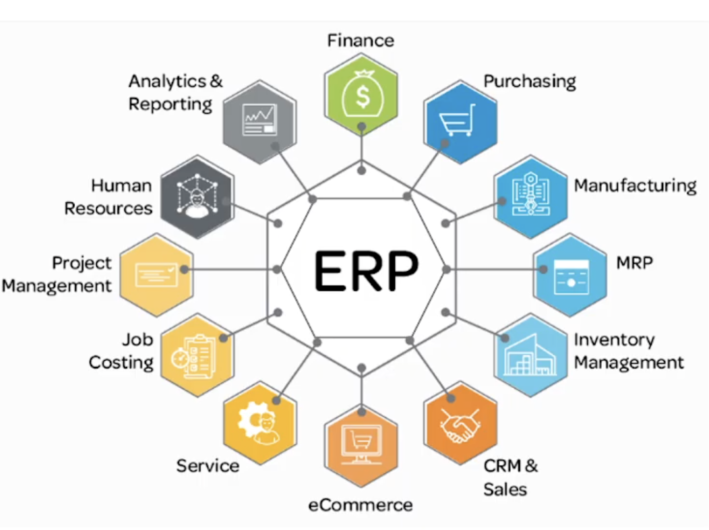

# TỔNG QUAN HỆ THỐNG SAP


## 1. Giới thiệu về ERP & SAP

### 1.1. ERP là gì?

**ERP (Enterprise Resource Planning)** không chỉ là một phần mềm, mà là "hệ thần kinh" của doanh nghiệp, giúp:

- Kết nối dữ liệu tập trung từ tất cả các phòng ban
- Loại bỏ sự rời rạc và trùng lặp thông tin
- Tự động hóa quy trình nghiệp vụ xuyên suốt
- Cung cấp thông tin real-time để ra quyết định



### 1.2. SAP là gì?

- **SAP SE**: Là công ty phần mềm lớn nhất châu Âu, cung cấp giải pháp công nghệ doanh nghiệp toàn diện
- **SAP ERP**: Là tên giải pháp ERP hàng đầu thế giới do SAP phát triển
- **Các giải pháp khác**: CRM, SCM, HCM, BW/BI, BTP,...

### 1.3. Các dòng sản phẩm SAP ERP

| Sản phẩm                  | Đối tượng              | Đặc điểm                                                      |
| ------------------------- | ---------------------- | ------------------------------------------------------------- |
| **SAP S/4HANA**           | Tập đoàn lớn           | Database in-memory (HANA), quy trình phức tạp, tích hợp AI/ML |
| **SAP Business One (B1)** | Doanh nghiệp vừa & nhỏ | Triển khai nhanh, chi phí thấp, đơn giản hóa                  |
| **SAP Business ByDesign** | Doanh nghiệp vừa       | Cloud-based, SaaS model                                       |

### 1.4. Tầm ảnh hưởng của SAP

- 99/100 công ty lớn nhất thế giới là khách hàng của SAP
- Dữ liệu qua hệ thống SAP chiếm 87% tổng thương mại toàn cầu
- Hơn 440,000 khách hàng tại 180 quốc gia
- 300+ triệu người dùng cloud trên toàn thế giới

---

## 2. Kiến trúc Hệ thống SAP

### 2.1. Kiến trúc 3-tier (Three-tier Architecture)

```
┌─────────────────────────────────────────────────────────┐
│  Presentation Layer (Client Tier)                       │
│  - SAP GUI (SAP Logon)                                  │
│  - SAP Fiori (Web Browser)                              │
│  - Mobile Apps                                          │
└─────────────────────────────────────────────────────────┘
                           ↕
┌─────────────────────────────────────────────────────────┐
│  Application Layer (Server Tier)                        │
│  - Application Server (AS)                              │
│  - ABAP Runtime Environment                             │
│  - Business Logic Processing                            │
└─────────────────────────────────────────────────────────┘
                           ↕
┌─────────────────────────────────────────────────────────┐
│  Database Layer (Data Tier)                             │
│  - SAP HANA / Oracle / SQL Server / DB2                 │
│  - Tables, Views, Indexes                               │
└─────────────────────────────────────────────────────────┘
```

### 2.2. Các loại Client (Giao diện người dùng)

| Client                  | Mô tả                          | Ưu điểm                           | Nhược điểm                      |
| ----------------------- | ------------------------------ | --------------------------------- | ------------------------------- |
| **SAP GUI**             | Giao diện desktop truyền thống | Đầy đủ chức năng, ổn định         | Giao diện lỗi thời, cần cài đặt |
| **SAP Fiori**           | Giao diện web hiện đại (HTML5) | UX tốt, responsive, không cần cài | Chưa có đủ tất cả chức năng     |
| **SAP Business Client** | Kết hợp GUI + Fiori            | Linh hoạt                         | Nặng, phức tạp                  |

---

## 3. Ngôn ngữ ABAP – Trái tim kỹ thuật SAP

### 3.1. ABAP là gì?

**ABAP (Advanced Business Application Programming)** là ngôn ngữ lập trình đặc thù của SAP, được sử dụng để:

- Phát triển và tùy chỉnh hệ thống SAP
- Xây dựng báo cáo, giao diện, workflow
- Mở rộng chức năng chuẩn của SAP
- Tích hợp với hệ thống bên ngoài

### 3.2. Đặc điểm của ABAP

- **Ngôn ngữ bậc cao**: Cú pháp gần với tiếng Anh, dễ đọc
- **Tích hợp sâu với database**: SQL embedded, Open SQL
- **Hướng đối tượng**: ABAP Objects (từ phiên bản SAP NetWeaver)
- **Môi trường phát triển**:
  - **SE80** (ABAP Workbench) - IDE truyền thống trên SAP GUI
  - **ADT** (ABAP Development Tools) - Eclipse-based, hiện đại hơn

### 3.3. Vai trò của ABAP Developer

- **Technical Consultant**: Phát triển các giải pháp kỹ thuật, custom development
- **ABAP Developer**: Lập trình reports, forms, interfaces, enhancements
- **ABAP Architect**: Thiết kế giải pháp, performance tuning, best practices

---

## 4. Các Phân Hệ Chính (Modules) của SAP

SAP ERP được chia thành nhiều module chức năng, mỗi module phụ trách một lĩnh vực nghiệp vụ cụ thể:

### 4.1. Nhóm Logistics (Hậu cần)

| Module | Tên đầy đủ           | Chức năng chính                       | Quy trình tiêu biểu                                         |
| ------ | -------------------- | ------------------------------------- | ----------------------------------------------------------- |
| **MM** | Material Management  | Quản lý mua hàng, tồn kho, kiểm kê    | **P2P** (Procure-to-Pay): PR → PO → GR → IR                 |
| **PP** | Production Planning  | Lập kế hoạch và ghi nhận sản xuất     | **OTD** (Order-to-Delivery): Plan → Produce → Confirm       |
| **SD** | Sales & Distribution | Quản lý bán hàng, giao hàng, thu tiền | **OTC** (Order-to-Cash): Quote → Order → Delivery → Invoice |
| **WM** | Warehouse Management | Quản lý kho chi tiết (bin location)   | Inbound → Putaway → Picking → Outbound                      |

### 4.2. Nhóm Financial (Tài chính)

| Module | Tên đầy đủ           | Chức năng chính                                          |
| ------ | -------------------- | -------------------------------------------------------- |
| **FI** | Financial Accounting | Kế toán tài chính, sổ cái, báo cáo thuế, BCTC theo chuẩn |
| **CO** | Controlling          | Kế toán quản trị, phân bổ chi phí, phân tích lợi nhuận   |
| **TR** | Treasury             | Quản lý tiền mặt, thanh toán, rủi ro tài chính           |
| **AA** | Asset Accounting     | Quản lý tài sản cố định, khấu hao                        |

### 4.3. Nhóm Hỗ trợ & Chuyên biệt

| Module     | Tên đầy đủ               | Chức năng chính                                    |
| ---------- | ------------------------ | -------------------------------------------------- |
| **QM**     | Quality Management       | Kiểm soát chất lượng vật tư, thành phẩm, quy trình |
| **PM**     | Plant Maintenance        | Bảo trì bảo dưỡng máy móc, thiết bị                |
| **PS**     | Project System           | Quản lý vòng đời dự án (xây dựng, IT, R&D)         |
| **HR/HCM** | Human Capital Management | Quản lý nhân sự, lương, tuyển dụng, đào tạo        |


### 4.4. Sự tích hợp giữa các Module

Điểm mạnh của SAP là **tích hợp chặt chẽ** giữa các module:

- Khi tạo **Purchase Order (MM)** → Tự động sinh **Accounting Document (FI)**
- Khi **Delivery (SD)** → Tự động trừ **Inventory (MM)**
- Mọi giao dịch đều có **audit trail** đầy đủ

---

## 5. T-code (Transaction Code) – "Câu lệnh thần chú" trong SAP

### 5.1. Khái niệm T-code

**T-code** là mã lệnh ngắn gọn để truy cập nhanh vào các chức năng trong SAP, thay vì phải điều hướng qua nhiều menu.

**Cách sử dụng:**

- Nhập T-code vào **Command Field** (thanh lệnh) ở góc trên bên trái màn hình SAP GUI
- Nhấn Enter để mở chức năng tương ứng

**Ví dụ:**

- Gõ `VA01` → Tạo Sales Order
- Gõ `ME21N` → Tạo Purchase Order
- Gõ `SE11` → Mở ABAP Dictionary

### 5.2. Phân loại T-code

| Loại                      | Mô tả                                      | Ví dụ                    |
| ------------------------- | ------------------------------------------ | ------------------------ |
| **Report Transaction**    | Chạy chương trình báo cáo (Report Program) | `SE38`, `S_ALR_87012357` |
| **Dialog Transaction**    | Mở màn hình nhập/sửa liệu (Dynpro/Screen)  | `VA01`, `MM01`, `FB01`   |
| **OO Transaction**        | Gọi phương thức của Class ABAP (hiện đại)  | Nhiều T-code Fiori       |
| **Parameter Transaction** | Gọi T-code khác với tham số mặc định       | -                        |

### 5.3. Quy tắc đặt tên T-code

| Ký tự đầu    | Ý nghĩa                                 | Ví dụ                  |
| ------------ | --------------------------------------- | ---------------------- |
| **A → X**    | T-code chuẩn của SAP (Standard)         | `VA01`, `MM01`, `FB01` |
| **Z hoặc Y** | T-code tùy chỉnh (Custom/Z-development) | `ZMM001`, `Y_REPORT`   |

**Quy ước phát triển:**

- Mọi object custom **bắt buộc** bắt đầu bằng `Z` hoặc `Y` để tránh xung đột với SAP standard
- Áp dụng cho: T-code, Program, Table, Function Module, Class,...

### 5.4. T-code quan trọng cần biết

#### Development & System

- `SE11` - ABAP Dictionary (tạo table, structure, data element)
- `SE38` - ABAP Editor (viết report program)
- `SE80` - Object Navigator (IDE tổng hợp)
- `SE93` - Maintain Transaction (tạo T-code)
- `SE24` - Class Builder (tạo ABAP Objects)

#### Master Data

- `MM01/MM02/MM03` - Create/Change/Display Material Master
- `XD01/XD02/XD03` - Create/Change/Display Customer Master
- `MK01/MK02/MK03` - Create/Change/Display Vendor Master

#### Logistics

- `ME21N` - Create Purchase Order
- `MIGO` - Goods Movement (PGI, GR, GI)
- `VA01` - Create Sales Order
- `VL01N` - Create Outbound Delivery

#### Finance

- `FB01` - Post Document
- `FB03` - Display Document
- `F-02` - Enter G/L Account Posting

---

## 6. Các bước xây dựng một Custom Add-on trong SAP

Thay vì phát triển "module mới", trong SAP sẽ triển khai các **Custom Solution** hoặc **Add-on** (bắt đầu bằng Z/Y) để đáp ứng nhu cầu đặc thù của doanh nghiệp.

### 6.1. Quy trình phát triển Custom Solution

```
1. Phân tích yêu cầu
   ↓
2. Thiết kế Database (SE11)
   ↓
3. Phát triển Business Logic (SE38/ADT)
   ↓
4. Xây dựng UI (Screen/Fiori)
   ↓
5. Tạo T-code (SE93)
   ↓
6. Unit Test & Integration Test
   ↓
7. Transport & Deploy
```

### 6.2. Các bước chi tiết

#### Bước 1: Thiết kế Database (SE11 - ABAP Dictionary)

- Tạo **Z-Table** hoặc **Y-Table** để lưu dữ liệu custom
- Định nghĩa **Structure**, **Data Element**, **Domain**
- Tạo **Table Type** cho internal table
- Tạo **View** nếu cần join nhiều bảng

**Ví dụ:**

```abap
Table: ZEMPLOYEE
- ZEMPID    (Employee ID)
- ZNAME     (Name)
- ZDEPT     (Department)
- ZSALARY   (Salary)
```

#### Bước 2: Phát triển Business Logic

**Cách truyền thống (SE38):**

- Report Program (executable program)
- Function Module (FM)
- Form Routines

**Cách hiện đại (ADT - ABAP Development Tools):**

- ABAP Objects (Class-based)
- CDS Views (Core Data Services) - chỉ trên S/4HANA
- AMDP (ABAP Managed Database Procedures)

#### Bước 3: Xây dựng User Interface

**Option 1: SAP GUI (truyền thống)**

- Screen Painter (SE51) - tạo màn hình Dynpro
- Menu Painter (SE41) - tạo menu và toolbar
- Flow Logic - xử lý sự kiện màn hình

**Option 2: SAP Fiori (hiện đại)**

- Backend: OData Service (SEGW hoặc CDS + Service Binding)
- Frontend: SAPUI5 (JavaScript framework)
- Deployment: SAP Fiori Launchpad

#### Bước 4: Tạo T-code (SE93)

Tạo mã giao dịch để người dùng truy cập nhanh:

| Loại T-code        | Mô tả              | Ví dụ               |
| ------------------ | ------------------ | ------------------- |
| Report Transaction | Chạy ABAP Report   | `Z_EMPLOYEE_REPORT` |
| Dialog Transaction | Mở màn hình Screen | `Z_EMPLOYEE_MAINT`  |
| OO Transaction     | Gọi Class Method   | `Z_EMPLOYEE_APP`    |

#### Bước 5: Testing & Deployment

- **Unit Test**: Test từng component riêng lẻ (Class Test - SE24)
- **Integration Test**: Test toàn bộ flow end-to-end
- **Transport**: Đóng gói vào Transport Request (SE09/SE10)
- **Deploy**: Move từ DEV → QAS → PRD

---

## 7. Triết lý Clean Core trên SAP S/4HANA Cloud

### 7.1. Clean Core là gì?

**Clean Core** là triết lý thiết kế của SAP nhằm:

- Giữ hệ thống core **sạch, chuẩn** (không modify SAP standard code)
- Dễ dàng **upgrade** lên phiên bản mới mà không bị conflict
- Giảm **technical debt** và chi phí bảo trì

### 7.2. Sự khác biệt giữa On-premise và Cloud

| Khía cạnh           | On-premise                          | S/4HANA Cloud (Public)                |
| ------------------- | ----------------------------------- | ------------------------------------- |
| **Modify SAP code** | Cho phép (nhưng không khuyến khích) | **Cấm hoàn toàn**                     |
| **Custom code**     | Z/Y programs thoải mái              | Có giới hạn, phải tuân thủ Clean Core |
| **Enhancement**     | User Exit, Enhancement Point, BAdI  | Chỉ BAdI (Business Add-Ins)           |
| **Extension**       | In-stack (trên cùng server)         | **Side-by-side** (SAP BTP)            |
| **Database access** | Open SQL, Native SQL                | Chỉ CDS Views, không dùng Native SQL  |

### 7.3. Chiến lược mở rộng & Phân tích đánh đổi (Extension Strategy & Trade-off)

Trong hệ sinh thái SAP S/4HANA hiện đại, việc lựa chọn phương pháp mở rộng phụ thuộc vào sự cân nhắc giữa **Chi phí**, **Độ phức tạp** và **Tính bền vững** (Clean Core).

#### Option 1: In-app Extension (Key User Extensibility)

_Đây là phương pháp "Low-code/No-code" dành cho những thay đổi nhỏ ngay trên giao diện chuẩn._

- **Đối tượng:** Business User, Key User (không yêu cầu kỹ năng lập trình chuyên sâu).
- **Công cụ:** SAP Fiori Key User Tools (ngay trên trình duyệt).
- **Khả năng:**
  - Thêm trường tùy chỉnh (Custom Fields) vào màn hình chuẩn.
  - Thay đổi vị trí, ẩn/hiện các trường dữ liệu.
  - Tạo logic đơn giản (Validation) bằng ngôn ngữ giả lập.
- **Giới hạn:** Chỉ áp dụng cho các Use-case đơn giản, không thể can thiệp vào quy trình xử lý phức tạp.
- **PHÂN TÍCH TRADE-OFF (SỰ ĐÁNH ĐỔI):**
  - **Tốc độ vs. Linh hoạt:** Triển khai cực nhanh (vài phút), chi phí bằng 0, nhưng **hy sinh hoàn toàn sự linh hoạt**. Bạn không thể viết một logic phức tạp như "Gửi email cho sếp nếu giá trị > 1 tỷ".

#### Option 2: Developer Extensibility (On-stack / Classic Extension)

_Đây là phương pháp truyền thống (như dự án Bug Tracking này đang làm), code chạy trực tiếp trên server SAP._

- **Đối tượng:** ABAP Developer.
- **Công cụ:** ADT (ABAP Development Tools) hoặc SE80 (Classic).
- **Cách thức:** Implement BAdI (Business Add-Ins) hoặc phát triển Z-Objects.
- **Ví dụ:** Tạo bảng Z, viết báo cáo ALV, SmartForms, Validate dữ liệu phức tạp.
- **PHÂN TÍCH TRADE-OFF (SỰ ĐÁNH ĐỔI):**
  - **Hiệu năng vs. Sự phụ thuộc (Coupling):**
    - **Được:** Hiệu năng cao nhất vì code và dữ liệu nằm cùng một chỗ (Memory), không có độ trễ mạng. Tận dụng tối đa tài nguyên phần cứng có sẵn.
    - **Mất:** Hệ thống bị "dính chặt" (Tightly Coupled). Nếu code Z viết kém chất lượng, nó có thể làm chậm cả hệ thống chính. Việc nâng cấp version SAP có thể yêu cầu kiểm tra lại code cũ.

#### Option 3: Side-by-side Extension (SAP BTP)

_Đây là phương pháp hiện đại, tách hoàn toàn code ra khỏi lõi SAP, chạy trên Cloud._

- **Đối tượng:** Full-stack Developer (Cloud Native).
- **Nền tảng:** SAP Business Technology Platform (BTP).
- **Ngôn ngữ:** Đa dạng (Node.js, Java, Python, Golang...).
- **Kết nối:** Giao tiếp lỏng lẻo (Decoupled) qua API (OData, REST, Events).
- **Use case:** Xây dựng Mobile App, Tích hợp AI/IoT, hoặc các Portal mở rộng cho đối tác bên ngoài.
- **PHÂN TÍCH TRADE-OFF (SỰ ĐÁNH ĐỔI):**
  - **Clean Core vs. Chi phí & Phức tạp (Complexity):**
    - **Được:** Giữ cho lõi SAP sạch sẽ tuyệt đối (Clean Core), nâng cấp SAP dễ dàng mà không sợ vỡ code. Tự do lựa chọn công nghệ (như Golang, ReactJS).
    - **Mất:** **Chi phí cao** (phải mua license BTP, Cloud Connector). **Độ phức tạp cao** (phải xử lý bảo mật, kết nối mạng, độ trễ API). Không phù hợp cho các tính năng nhỏ cần truy xuất dữ liệu liên tục (High volume transaction).

### 7.4. Best Practices

✅ **Nên làm:**

- Dùng Standard SAP functionality tối đa trước khi nghĩ đến custom
- Luôn bắt đầu bằng Z/Y cho mọi custom object
- Sử dụng CDS Views thay vì Database Table trực tiếp
- Implement BAdI thay vì modify standard code
- Document rõ ràng mọi customization

❌ **Không nên làm:**

- Modify SAP standard code (đặc biệt trên Cloud)
- Dùng Native SQL trên Cloud
- Hard-code values, nên dùng Customizing Table
- Copy-paste code SAP standard vào Z-program
- Bỏ qua Code Review và Performance Test
