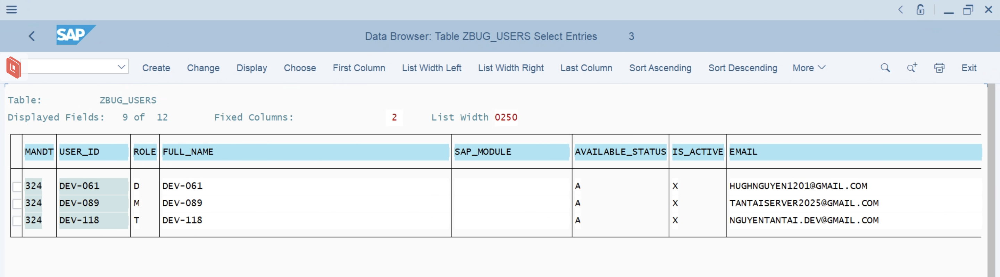
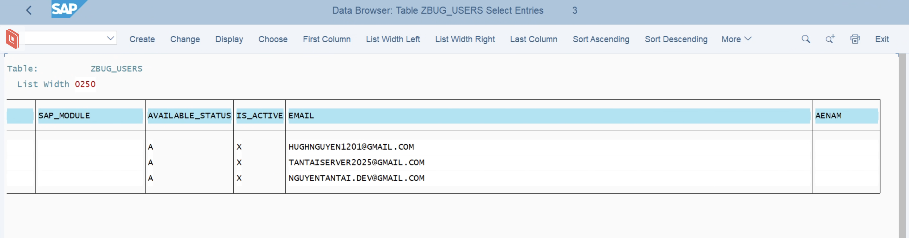

# QC Test Plan — Z_BUG_WORKSPACE_MP v5.0

> **Program:** `Z_BUG_WORKSPACE_MP` (Module Pool, Type M)
> **T-code:** `ZBUG_WS` | **SAP System:** S40 | **Client:** 324
> **Version:** v5.0 | **Updated:** 14/04/2026
>
> **Test accounts:**
>
> | Account | Role | Password |
> |---------|------|----------|
> | `DEV-089` | Manager (M) | `@Anhtuoi123` |
> | `DEV-061` | Developer (D) | `@57Dt766` |
> | `DEV-118` | Tester (T) | `Qwer123@` |
>
> **v5.0 Changes:** Project Search (0410), Dashboard, Bug Search (0210/0220), Status Transition Popup (0370), 10-State Lifecycle, Auto-Assign, Template Rename.
>
> **BREAKING CHANGE:** Status `6` = Final Testing (was Resolved in v4.x). New `V` = Resolved. Old `7` = Closed (legacy).

---

## 0. Prerequisite — Check & Setup ZBUG_USERS

> **BAT BUOC lam truoc khi test.** Role-based access control phu thuoc hoan toan vao bang `ZBUG_USERS`.
> Neu account chua co trong bang hoac role sai → tat ca test lien quan den role se **FAIL**.

### Buoc 1: Check data hien tai

1. Vao **SE16** (hoac SE16N)
2. Table name: **`ZBUG_USERS`** → Enter
3. Man hinh selection: de trong het → **F8** (Execute)
4. Xem ket qua:
   - Tim 3 account `DEV-089`, `DEV-061`, `DEV-118` trong cot `USER_ID`
   - Xem cot `ROLE` cua tung account:
     - `M` = Manager
     - `D` = Developer
     - `T` = Tester
   - Neu khong thay account nao → can them vao (Buoc 2)
   - Neu role sai → can sua (Buoc 2)

### Buoc 2: Them/Sua role (neu can)

> **Muc tieu:** Dam bao dung mapping sau:
>
> | USER_ID | ROLE | Y nghia |
> |---------|------|---------|
> | `DEV-089` | `M` | Manager — full quyen |
> | `DEV-061` | `D` | Developer — xem va sua dev note |
> | `DEV-118` | `T` | Tester — tao bug, sua test note |

**Cach 1: Dung SE16N (nhanh)**

1. Vao **SE16N**
2. Table: `ZBUG_USERS` → Enter
3. Nhap `USER_ID` = `DEV-089` → **F8**
4. Neu co record → bam icon **Edit** (but chi) → sua field `ROLE` = `M` → **Save**
5. Neu KHONG co record → quay lai SE16N, menu **Table Entry → Create Entry**
   - `USER_ID` = `DEV-089`
   - `ROLE` = `M`
   - `USER_NAME` = (ten tuy y, vd `Manager Test`)
   - Cac field khac de trong hoac dien tuy y
   - **Save**
6. Lap lai cho `DEV-061` (role `D`) va `DEV-118` (role `T`)

**Cach 2: Dung SM30 (neu co Table Maintenance Generator)**

1. Vao **SM30**
2. Table/View: `ZBUG_USERS` → **Maintain**
3. Them/sua entries tuong tu

### Buoc 3: Verify lai

1. Quay lai **SE16**, table `ZBUG_USERS`, **F8**
2. Confirm 3 records dung role:
   - `DEV-089` → `M` ✓
   - `DEV-061` → `D` ✓
   - `DEV-118` → `T` ✓
3. **Done** → bat dau test tu TC-01

### Da verified (11/04/2026)

> Data ZBUG_USERS da duoc confirm dung. Screenshots:

| USER_ID | ROLE | IS_ACTIVE | EMAIL | Status |
|---------|------|-----------|-------|--------|
| `DEV-061` | `D` | `X` | HUGHNGUYEN1201@GMAIL.COM | ✓ OK |
| `DEV-089` | `M` | `X` | TANTAISERVER2025@GMAIL.COM | ✓ OK |
| `DEV-118` | `T` | `X` | NGUYENTANTAI.DEV@GMAIL.COM | ✓ OK |

### Buoc 4: Setup Auto-Assign test data (v5.0)

> **De test Auto-Assign** (TC-09), can them mock users vao ZBUG_USERS va ZBUG_USER_PROJEC.
> Chi can cho 1 project test. Xem `docs/requirements.md` Part 7.

---

## Muc luc

1. [Quy uoc ky hieu](#1-quy-uoc-ky-hieu)
2. [TC-01: Navigation Flow](#tc-01-navigation-flow)
3. [TC-02: Screen 0410 — Project Search](#tc-02-screen-0410--project-search)
4. [TC-03: Screen 0400 — Project List](#tc-03-screen-0400--project-list)
5. [TC-04: Screen 0500 — Project Detail](#tc-04-screen-0500--project-detail)
6. [TC-05: Screen 0200 — Bug List + Dashboard](#tc-05-screen-0200--bug-list--dashboard)
7. [TC-06: Screen 0300 — Bug Detail](#tc-06-screen-0300--bug-detail)
8. [TC-07: Tab Strip & Subscreens](#tc-07-tab-strip--subscreens)
9. [TC-08: Status Transition — 10-State + Popup 0370](#tc-08-status-transition--10-state--popup-0370)
10. [TC-09: Auto-Assign System](#tc-09-auto-assign-system)
11. [TC-10: Bug Search — Screen 0210/0220](#tc-10-bug-search--screen-02100220)
12. [TC-11: Dashboard Metrics](#tc-11-dashboard-metrics)
13. [TC-12: Evidence Management](#tc-12-evidence-management)
14. [TC-13: Email Notification](#tc-13-email-notification)
15. [TC-14: Template Download & Upload](#tc-14-template-download--upload)
16. [TC-15: Role-Based Access Control](#tc-15-role-based-access-control)
17. [TC-16: Field Validation & Business Rules](#tc-16-field-validation--business-rules)
18. [TC-17: Unsaved Changes Detection](#tc-17-unsaved-changes-detection)
19. [TC-18: F4 Search Help](#tc-18-f4-search-help)
20. [TC-19: Regression — Fixed Bugs v4.x + v5.0](#tc-19-regression--fixed-bugs-v4x--v50)
21. [TC-20: Edge Cases & Boundary Testing](#tc-20-edge-cases--boundary-testing)
22. [Test Execution Log](#test-execution-log)

---

## 1. Quy uoc ky hieu

| Ky hieu | Y nghia |
|---------|---------|
| **P** | Pass |
| **F** | Fail |
| **B** | Blocked (prerequisite chua xong) |
| **S** | Skipped |
| **NA** | Not Applicable |
| `[M]` | Test voi role Manager |
| `[D]` | Test voi role Developer |
| `[T]` | Test voi role Tester |

---

## TC-01: Navigation Flow

> **Muc dich:** Kiem tra toan bo luong di chuyen giua cac screen (v5.0: 0410 la initial screen).

| # | Test Case | Steps | Expected Result | Role | Status |
|---|-----------|-------|-----------------|------|--------|
| 1.01 | T-code entry → 0410 | Run `/nZBUG_WS` | Screen 0410 (Project Search) hien thi, 3 filter fields, toolbar co Execute/Back/Exit/Cancel | `[M]` | |
| 1.02 | 0410 → 0400 (Execute) | Nhan Execute (F8) de trong het | Screen 0400 (Project List) hien thi, ALV loaded | `[M]` | |
| 1.03 | 0400 → 0200 (click project) | Double-click/hotspot vao 1 project | Screen 0200 hien thi, title co ten project, ALV + Dashboard header | `[M]` | |
| 1.04 | 0400 → 0200 (My Bugs) | Click nut `My Bugs` | Screen 0200 hien thi, title "My Bugs", nut CREATE an di | `[M]` | |
| 1.05 | 0200 → 0300 (Create) | Click `Create` | Screen 0300, mode Create, BUG_ID hien "(Auto)", fields editable | `[T]` | |
| 1.06 | 0200 → 0300 (Change) | Chon 1 bug → click `Change` | Screen 0300, mode Change, data loaded dung | `[M]` | |
| 1.07 | 0200 → 0300 (Display) | Chon 1 bug → click `Display` | Screen 0300, mode Display, ALL fields readonly | `[M]` | |
| 1.08 | 0300 → 0200 (Back) | Click `Back` (F3) | Quay ve Screen 0200, data con nguyen | `[M]` | |
| 1.09 | 0200 → 0400 (Back) | Click `Back` (F3) | Quay ve Screen 0400 | `[M]` | |
| 1.10 | 0400 → 0410 (Back) | Click `Back` (F3) | Quay ve Screen 0410 | `[M]` | |
| 1.11 | 0410 → LEAVE PROGRAM (Back) | Click `Back` (F3) | Thoat chuong trinh, ve SAP Menu | `[M]` | |
| 1.12 | 0400 → 0500 (Create Project) | Click `Create Project` | Screen 0500, mode Create, PROJECT_ID hien "(Auto)" | `[M]` | |
| 1.13 | 0400 → 0500 (Change Project) | Chon project → click `Change` | Screen 0500, mode Change, data loaded | `[M]` | |
| 1.14 | 0500 → 0400 (Back) | Click `Back` (F3) | Quay ve Screen 0400 | `[M]` | |
| 1.15 | 0200 → 0210 (Search) | Click `Search` | Popup 0210 hien thi, 6 search fields | `[M]` | |
| 1.16 | 0210 → 0220 (Execute) | Nhap criteria → Execute | Screen 0220 hien thi ket qua, KHONG co dashboard | `[M]` | |
| 1.17 | 0220 → 0200 (Back) | Click `Back` (F3) | Quay ve Screen 0200 | `[M]` | |
| 1.18 | 0300 → 0370 (Change Status) | Click `Change Status` | Popup 0370 hien thi voi current bug info | `[M]` | |
| 1.19 | Exit tu bat ky screen nao | Click `Exit` (Shift+F3) | LEAVE PROGRAM, ve SAP Menu | `[M]` | |
| 1.20 | Cancel (F12 / Fn+F12 tren Mac) | Nhan Cancel o Screen 0300 | Quay ve Screen 0200 (fcode CANC) | `[M]` | |

---

## TC-02: Screen 0410 — Project Search

> **Muc dich:** Kiem tra initial screen moi — filter projects truoc khi vao list.

### 2A. Hien thi & Filter

| # | Test Case | Steps | Expected Result | Role | Status |
|---|-----------|-------|-----------------|------|--------|
| 2.01 | 0410 la initial screen | Run ZBUG_WS | Screen 0410 hien thi DAU TIEN (khong phai 0400) | `[M]` | |
| 2.02 | 3 filter fields hien thi | Nhin screen 0410 | Co 3 fields: Project ID, Manager, Status | `[M]` | |
| 2.03 | Execute — de trong het | De 3 fields trong → F8 | Screen 0400 hien TAT CA projects user co quyen xem | `[M]` | |
| 2.04 | Execute — filter Project ID | Nhap Project ID cu the → F8 | Screen 0400 chi hien project do | `[M]` | |
| 2.05 | Execute — filter Manager | Nhap Manager ID → F8 | Screen 0400 chi hien projects cua manager do | `[M]` | |
| 2.06 | Execute — filter Status | Nhap Status = 1 → F8 | Screen 0400 chi hien projects co status Opening | `[M]` | |
| 2.07 | Execute — combined filter | Nhap Manager + Status → F8 | Screen 0400 chi hien projects match ca 2 dieu kien | `[M]` | |
| 2.08 | Execute — no match | Nhap Project ID khong ton tai → F8 | Screen 0400 hien ALV trong (hoac message no data) | `[M]` | |

### 2B. Security — Non-Manager

| # | Test Case | Steps | Expected Result | Role | Status |
|---|-----------|-------|-----------------|------|--------|
| 2.09 | Dev chi thay project minh tham gia | Login Dev → de trong het → F8 | Screen 0400 chi hien projects co Dev trong ZBUG_USER_PROJEC | `[D]` | |
| 2.10 | Tester chi thay project minh tham gia | Login Tester → de trong het → F8 | Screen 0400 chi hien projects co Tester trong ZBUG_USER_PROJEC | `[T]` | |
| 2.11 | Manager thay tat ca projects | Login Manager → de trong het → F8 | Screen 0400 hien TAT CA projects (khong filter) | `[M]` | |

### 2C. F4 Search Help — Screen 0410

| # | Test Case | Steps | Expected Result | Role | Status |
|---|-----------|-------|-----------------|------|--------|
| 2.12 | F4 Project ID | Click F4 tren S_PRJ_ID | Popup list projects tu ZBUG_PROJECT | `[M]` | |
| 2.13 | F4 Manager | Click F4 tren S_PRJ_MN | Popup list users (Managers) tu ZBUG_USERS | `[M]` | |
| 2.14 | F4 Project Status | Click F4 tren S_PRJ_ST | Popup: 1=Opening, 2=In Process, 3=Done, 4=Cancelled | `[M]` | |

---

## TC-03: Screen 0400 — Project List

### 3A. Hien thi & ALV

| # | Test Case | Steps | Expected Result | Role | Status |
|---|-----------|-------|-----------------|------|--------|
| 3.01 | ALV hien thi filtered projects | Tu 0410 Execute → 0400 | ALV hien projects theo filter da nhap o 0410 | `[M]` | |
| 3.02 | Soft-deleted projects an | Tao project → soft-delete → Refresh | Project khong hien thi trong ALV | `[M]` | |
| 3.03 | Refresh | Click `Refresh` | ALV reload data moi nhat tu DB | `[M]` | |
| 3.04 | Hotspot click vao PROJECT_ID | Click vao link PROJECT_ID | Navigate toi Screen 0200 voi bugs cua project do | `[M]` | |

### 3B. Project CRUD

| # | Test Case | Steps | Expected Result | Role | Status |
|---|-----------|-------|-----------------|------|--------|
| 3.05 | Create project (Manager) | Click `Create Project` | Navigate to 0500, mode Create | `[M]` | |
| 3.06 | Create project (non-Manager) | Click `Create Project` | Message: "Only managers can create/delete projects." | `[D][T]` | |
| 3.07 | Change project | Chon project → `Change` | Navigate to 0500, mode Change | `[M]` | |
| 3.08 | Change project — no selection | KHONG chon project → `Change` | Message: "Please select a project first." | `[M]` | |
| 3.09 | Display project | Chon project → `Display` | Navigate to 0500, mode Display | `[D]` | |
| 3.10 | Delete project (Manager) | Chon project → `Delete` → Confirm | Project bien mat khoi ALV, DB field `is_del='X'` | `[M]` | |
| 3.11 | Delete project (non-Manager) | Click `Delete` | Message blocked hoac nut khong hien | `[D][T]` | |
| 3.12 | Delete project — no selection | KHONG chon → `Delete` | Message: "Please select a project to delete." | `[M]` | |

---

## TC-04: Screen 0500 — Project Detail

### 4A. Create Project

| # | Test Case | Steps | Expected Result | Role | Status |
|---|-----------|-------|-----------------|------|--------|
| 4.01 | Auto-generate PROJECT_ID | Vao Create mode | PROJECT_ID hien "(Auto)" hoac blank, khong cho edit | `[M]` | |
| 4.02 | Save — thanh cong | Dien name, manager, status → Save | PROJECT_ID auto-gen format `PRJ0000001`, message success, mode chuyen sang Change | `[M]` | |
| 4.03 | Save — thieu PROJECT_NAME | De trong PROJECT_NAME → Save | Message: "Project Name is required." | `[M]` | |
| 4.04 | Default values khi Create | Vao Create mode | Status mac dinh = "1" (Opening), ERNAM = sy-uname, ERDAT = today | `[M]` | |

### 4B. Change Project

| # | Test Case | Steps | Expected Result | Role | Status |
|---|-----------|-------|-----------------|------|--------|
| 4.05 | Change fields & Save | Sua project name → Save | Data cap nhat trong DB, message success | `[M]` | |
| 4.06 | Save trong Display mode | Vao Display mode → click Save | Message: "Switch to Change mode before saving." | `[M]` | |
| 4.07 | Set status = Done (co open bugs) | Doi status = "Done" → Save | Message: "Cannot set project to Done. N bug(s) not yet Resolved/Closed." | `[M]` | |
| 4.08 | Set status = Done (tat ca bugs terminal) | Tat ca bugs la Resolved(V)/Closed(7)/Rejected(R) → Done → Save | Save thanh cong | `[M]` | |

### 4C. User Assignment (TC_USERS)

| # | Test Case | Steps | Expected Result | Role | Status |
|---|-----------|-------|-----------------|------|--------|
| 4.09 | Add user — thanh cong | Click `Add User` → nhap user ID + role | User hien trong Table Control, data saved vao ZBUG_USER_PROJEC | `[M]` | |
| 4.10 | Add user — chua save project | Create mode, chua save → `Add User` | Message: "Save the project first before adding users." | `[M]` | |
| 4.11 | Add user — user khong ton tai | Nhap user ID khong co trong ZBUG_USERS | Message: "User {uid} not found in system." | `[M]` | |
| 4.12 | Add user — duplicate | Add user da co trong project | Message: "User {uid} is already assigned to this project." | `[M]` | |
| 4.13 | Add user — invalid role | Nhap role = "X" (khong phai M/D/T) | Message: "Role must be M (Manager), D (Developer), or T (Tester)." | `[M]` | |
| 4.14 | Remove user — thanh cong | Chon row → `Remove User` → Confirm | User bien mat khoi Table Control, xoa khoi DB | `[M]` | |
| 4.15 | Remove user — no selection | KHONG chon row → `Remove User` | Message: "Please select a user row to remove." | `[M]` | |
| 4.16 | Remove user — co bug assigned | Remove dev co bugs assigned | Message warning hoac block (dep on implementation) | `[M]` | |
| 4.17 | TC_USERS headers hien dung | Vao Screen 0500 | Table Control co cot headers: USER_ID, ROLE, ... | `[M]` | |

### 4D. F4 Help tren Screen 0500

| # | Test Case | Steps | Expected Result | Role | Status |
|---|-----------|-------|-----------------|------|--------|
| 4.18 | F4 Start Date | Click F4 tren field Start Date | Calendar popup hien thi, chon ngay → fill vao field | `[M]` | |
| 4.19 | F4 End Date | Click F4 tren field End Date | Calendar popup hien thi | `[M]` | |
| 4.20 | F4 Project Status | Click F4 tren PROJECT_STATUS | Dropdown: Opening/In Process/Done/Cancelled | `[M]` | |
| 4.21 | F4 Project Manager | Click F4 tren PROJECT_MANAGER | List users tu ZBUG_USERS (active, khong delete) | `[M]` | |

### 4E. Non-Manager Access (Project Detail)

| # | Test Case | Steps | Expected Result | Role | Status |
|---|-----------|-------|-----------------|------|--------|
| 4.22 | Dev/Tester — Display project | Login Dev → chon project → Display | Screen 0500 hien thi, tat ca fields readonly | `[D]` | |
| 4.23 | Dev/Tester — Change project fields | Login Dev → chon project → Change → sua name → Save | Message blocked hoac fields readonly | `[D]` | |
| 4.24 | Dev/Tester — Add User blocked | Login Tester → vao project Change mode → click `Add User` | Message blocked hoac nut khong hien | `[T]` | |
| 4.25 | Dev/Tester — Remove User blocked | Login Dev → vao project → click `Remove User` | Message blocked hoac nut khong hien | `[D]` | |

---

## TC-05: Screen 0200 — Bug List + Dashboard

### 5A. Dual-Mode Data

| # | Test Case | Steps | Expected Result | Role | Status |
|---|-----------|-------|-----------------|------|--------|
| 5.01 | Project mode — show all bugs | Click hotspot project → Screen 0200 | ALV hien TAT CA bugs cua project (khong filter role) | `[M]` | |
| 5.02 | My Bugs — Manager | Click `My Bugs` | Hien TAT CA bugs across projects | `[M]` | |
| 5.03 | My Bugs — Developer | Click `My Bugs` | Chi hien bugs co `dev_id = sy-uname` | `[D]` | |
| 5.04 | My Bugs — Tester | Click `My Bugs` | Chi hien bugs co `tester_id` hoac `verify_tester_id = sy-uname` | `[T]` | |
| 5.05 | Soft-deleted bugs an | Soft-delete 1 bug → Refresh | Bug khong hien thi | `[M]` | |

### 5B. Dashboard Header (v5.0)

| # | Test Case | Steps | Expected Result | Role | Status |
|---|-----------|-------|-----------------|------|--------|
| 5.06 | Dashboard visible | Vao Screen 0200 | Dashboard header hien tren ALV voi 4 blocks: Total, By Status, By Priority, By Module | `[M]` | |
| 5.07 | Total count dung | Dem rows trong ALV | GV_D_TOTAL = so dong trong ALV | `[M]` | |
| 5.08 | Dashboard cap nhat sau Refresh | Doi status 1 bug → Refresh | Dashboard metrics thay doi tuong ung | `[M]` | |
| 5.09 | Dashboard trong My Bugs mode | Click My Bugs → xem dashboard | Dashboard hien metrics cua My Bugs (khong phai tat ca bugs) | `[D]` | |

### 5C. Bug CRUD

| # | Test Case | Steps | Expected Result | Role | Status |
|---|-----------|-------|-----------------|------|--------|
| 5.10 | Create bug (Tester) | Click `Create` | Navigate to Screen 0300 Create mode | `[T]` | |
| 5.11 | Create bug (Developer blocked) | Click `Create` | Message: "Developers cannot create bugs." hoac nut khong hien | `[D]` | |
| 5.12 | Create bug in My Bugs mode | My Bugs mode → `Create` | Nut Create KHONG hien thi | `[T]` | |
| 5.13 | Delete bug (Manager) | Chon bug → `Delete` → Confirm | Bug xoa khoi ALV, DB `is_del='X'` | `[M]` | |
| 5.14 | Delete bug (Developer blocked) | Click `Delete` | Message blocked hoac nut khong hien | `[D]` | |
| 5.15 | Change/Display — no selection | KHONG chon bug → `Change` | Message: "Please select a bug first." | `[M]` | |

### 5D. ALV Formatting

| # | Test Case | Steps | Expected Result | Role | Status |
|---|-----------|-------|-----------------|------|--------|
| 5.16 | Row color — New bug | Tao bug moi, check ALV | Row mau Blue | `[M]` | |
| 5.17 | Row color — Closed bug | Bug status=Closed, check ALV | Row mau Grey | `[M]` | |
| 5.18 | Row color — Rejected bug | Bug status=Rejected, check ALV | Row mau Red | `[M]` | |

---

## TC-06: Screen 0300 — Bug Detail

### 6A. Create Bug

| # | Test Case | Steps | Expected Result | Role | Status |
|---|-----------|-------|-----------------|------|--------|
| 6.01 | Auto-generate BUG_ID | Vao Create mode | BUG_ID hien "(Auto)", field KHONG editable | `[T]` | |
| 6.02 | PROJECT_ID pre-fill + locked | Tao bug tu project context | PROJECT_ID auto-fill tu project, KHONG cho sua (Group PRJ locked) | `[T]` | |
| 6.03 | Save — thanh cong | Dien title, project → Save | BUG_ID auto-gen format `BUG0000001`, status=New hoac Assigned (auto-assign), message success | `[T]` | |
| 6.04 | Save — thieu title | De trong title → Save | Message: "Title is required." | `[T]` | |
| 6.05 | Save — thieu project_id | De trong project_id → Save | Message: "Project ID is required." | `[T]` | |
| 6.06 | Mode chuyen sang Change sau Save | Save thanh cong | Mode tu Create → Change, BUG_ID hien ID thuc | `[T]` | |
| 6.07 | Default values khi Create | Vao Create | Status = New, tester_id = sy-uname, ernam/erdat auto-fill | `[T]` | |

### 6B. Change/Display Bug

| # | Test Case | Steps | Expected Result | Role | Status |
|---|-----------|-------|-----------------|------|--------|
| 6.08 | Display mode — ALL fields readonly | Vao Display mode | Tat ca input fields disabled (khong cho go) | `[M]` | |
| 6.09 | Display mode — Save blocked | Display mode → click Save | Message: "Switch to Change mode before saving." | `[M]` | |
| 6.10 | Change mode — EDT fields editable | Vao Change mode (non-terminal bug) | Title, SAP Module cho phep edit | `[M]` | |
| 6.11 | STATUS field LUON locked | Change mode | STATUS field KHONG cho edit truc tiep (Group STS luon locked). Phai dung popup 0370 | `[M]` | |
| 6.12 | BUG_ID LUON readonly | Change mode | BUG_ID field KHONG cho edit (Group BID luon locked) | `[M]` | |
| 6.13 | Terminal bug (Resolved/Rejected) — fields disabled | Bug status=V hoac R, Change mode | EDT group fields disabled | `[M]` | |
| 6.14 | Title bar hien dung | Vao Display/Change/Create | Title: "Display Bug: BUG0001" / "Change Bug: BUG0001" / "Create Bug" | `[M]` | |

### 6C. Display Text Mapping

| # | Test Case | Steps | Expected Result | Role | Status |
|---|-----------|-------|-----------------|------|--------|
| 6.15 | Status display text (10 states) | Moi status value | "1"→"New", "2"→"Assigned", "3"→"In Progress", "4"→"Pending", "5"→"Fixed", "6"→"Final Testing", "V"→"Resolved", "R"→"Rejected", "W"→"Waiting", "7"→"Closed" | `[M]` | |
| 6.16 | Priority display text | Moi priority value | "H"→"High", "M"→"Medium", "L"→"Low" | `[M]` | |
| 6.17 | Severity display text | Moi severity value | "1"→"Dump/Critical", "2"→"Very High", "3"→"High", "4"→"Normal", "5"→"Minor" | `[M]` | |
| 6.18 | Bug Type display text | Moi bug_type value | "1"→"Functional", "2"→"Performance", "3"→"UI/UX", "4"→"Data", "5"→"Security" | `[M]` | |
| 6.19 | Display text cap nhat khi doi status | Change status tu popup 0370 | Display text thay doi theo gia tri moi ngay lap tuc | `[M]` | |

---

## TC-07: Tab Strip & Subscreens

| # | Test Case | Steps | Expected Result | Role | Status |
|---|-----------|-------|-----------------|------|--------|
| 7.01 | Tab strip 6 tabs hien day du | Vao Screen 0300 | 6 tabs: Bug Info, Description, Dev Note, Tester Note, Evidence, History | `[M]` | |
| 7.02 | Tab switch — Bug Info (0310) | Click tab "Bug Info" | Subscreen 0310 hien thi voi input fields + mini editor | `[M]` | |
| 7.03 | Tab switch — Description (0320) | Click tab "Description" | Subscreen 0320 hien thi voi full text editor (CC_DESC) | `[M]` | |
| 7.04 | Tab switch — Dev Note (0330) | Click tab "Dev Note" | Subscreen 0330 hien thi voi text editor (CC_DEVNOTE) | `[M]` | |
| 7.05 | Tab switch — Tester Note (0340) | Click tab "Tester Note" | Subscreen 0340 hien thi voi text editor (CC_TSTRNOTE) | `[M]` | |
| 7.06 | Tab switch — Evidence (0350) | Click tab "Evidence" | Subscreen 0350 hien thi Evidence ALV (CC_EVIDENCE) | `[M]` | |
| 7.07 | Tab switch — History (0360) | Click tab "History" | Subscreen 0360 hien thi History ALV (CC_HISTORY), readonly | `[M]` | |
| 7.08 | Tab switch KHONG mat data | Nhap text o Description → switch tab → quay lai | Text van con nguyen (khong bi reload) | `[M]` | |
| 7.09 | Tab highlight dung | Click tab "Dev Note" | Tab "Dev Note" duoc highlight (active), cac tab khac khong | `[M]` | |
| 7.10 | Default tab khi vao Detail | Vao Screen 0300 | Tab "Bug Info" duoc active mac dinh | `[M]` | |
| 7.11 | Mini editor (0310) load dung text | Open bug co description | Mini editor hien thi 3-4 dong description | `[M]` | |
| 7.12 | Dev Note — Tester readonly | Login Tester → vao Dev Note tab | Text editor la readonly (khong cho edit) | `[T]` | |
| 7.13 | Tester Note — Dev readonly | Login Dev → vao Tester Note tab | Text editor la readonly (khong cho edit) | `[D]` | |
| 7.14 | History sorted desc | Vao History tab | Records sorted theo date/time giam dan (moi nhat o tren) | `[M]` | |
| 7.15 | Tab switch KHONG crash | Switch qua lai tat ca 6 tabs nhieu lan | Khong co dump/crash (dac biet CALL_FUNCTION_CONFLICT_TYPE) | `[M]` | |

---

## TC-08: Status Transition — 10-State + Popup 0370

> **v5.0:** Status khong sua truc tiep tren Screen 0300. Phai dung nut `Change Status` → popup Screen 0370.
>
> **10-State Lifecycle:**
>
> | Code | Name | Type |
> |------|------|------|
> | `1` | New | Initial |
> | `W` | Waiting | Holding |
> | `2` | Assigned | Active |
> | `3` | In Progress | Active |
> | `4` | Pending | Holding |
> | `5` | Fixed | Milestone |
> | `R` | Rejected | Terminal |
> | `6` | Final Testing | Active |
> | `V` | Resolved | Terminal |
> | `7` | Closed | Legacy Terminal |

### 8A. Popup 0370 UI

| # | Test Case | Steps | Expected Result | Role | Status |
|---|-----------|-------|-----------------|------|--------|
| 8.01 | Popup hien thi | Change mode → `Change Status` | Popup 0370 hien: BUG_ID, TITLE, REPORTER, CURRENT_STATUS (readonly) + input fields | `[M]` | |
| 8.02 | NEW_STATUS dropdown | Click F4 tren NEW_STATUS | Chi hien cac target statuses hop le theo current status + role | `[M]` | |
| 8.03 | Change Status — Create mode blocked | Create mode → `Change Status` | Message: "Save the bug first before changing status." | `[T]` | |
| 8.04 | Change Status — Display mode blocked | Display mode → `Change Status` | Message blocked hoac nut khong hien | `[M]` | |
| 8.05 | Cancel popup | Popup → Cancel (F12) | Popup dong, quay ve Screen 0300, status KHONG doi | `[M]` | |

### 8B. Valid Transitions by Role

> **Legend:** ✓ = should succeed, ✗ = should be blocked

| # | From | To | Who | Condition | Status |
|---|------|----|-----|-----------|--------|
| 8.06 | New (1) | Assigned (2) | Manager | DEV_ID required (auto-assign hoac manual) | |
| 8.07 | New (1) | Waiting (W) | Manager | Khi khong tim duoc Dev phu hop | |
| 8.08 | Waiting (W) | Assigned (2) | Manager | DEV_ID required | |
| 8.09 | Waiting (W) | Final Testing (6) | Manager | FINAL_TESTER_ID required | |
| 8.10 | Assigned (2) | In Progress (3) | Assigned Dev / Manager | — | |
| 8.11 | Assigned (2) | Rejected (R) | Assigned Dev / Manager | TRANS_NOTE required | |
| 8.12 | In Progress (3) | Fixed (5) | Assigned Dev / Manager | Evidence file must exist | |
| 8.13 | In Progress (3) | Pending (4) | Assigned Dev / Manager | — | |
| 8.14 | In Progress (3) | Rejected (R) | Assigned Dev / Manager | TRANS_NOTE required | |
| 8.15 | Pending (4) | Assigned (2) | Manager | DEV_ID required (co the reassign) | |
| 8.16 | Fixed (5) | Final Testing (6) | **Automatic** | Auto-assign Tester; neu khong co → Waiting | |
| 8.17 | Final Testing (6) | Resolved (V) | Final Tester / Manager | TRANS_NOTE required | |
| 8.18 | Final Testing (6) | In Progress (3) | Final Tester / Manager | TRANS_NOTE required (send back) | |

### 8C. Blocked/Invalid Transitions

| # | Test Case | Steps | Expected Result | Role | Status |
|---|-----------|-------|-----------------|------|--------|
| 8.19 | Resolved → Any | Bug status=V → `Change Status` | Message: no valid transitions (terminal state) | `[M]` | |
| 8.20 | Rejected → Any | Bug status=R → `Change Status` | Message: no valid transitions (terminal state) | `[M]` | |
| 8.21 | Closed → Any | Bug status=7 → `Change Status` | Message: no valid transitions (legacy terminal) | `[M]` | |
| 8.22 | Dev khong phai assigned dev | Login Dev khac → bug cua Dev khac → Change Status | Message: khong co quyen (hoac dropdown trong) | `[D]` | |
| 8.23 | Tester khong phai final tester | Login Tester khac → bug status=6 → Change Status | Message: khong co quyen | `[T]` | |
| 8.24 | Fixed → Fixed (skip) | Status=Fixed, khong co transition to Fixed | Dropdown KHONG co "Fixed" | `[D]` | |

### 8D. Transition Conditions

| # | Test Case | Steps | Expected Result | Role | Status |
|---|-----------|-------|-----------------|------|--------|
| 8.25 | In Progress → Fixed — thieu evidence | Bug khong co evidence → Fixed | Message: "Evidence file is required before marking as Fixed." | `[D]` | |
| 8.26 | In Progress → Fixed — co evidence | Upload evidence → Fixed | Transition thanh cong | `[D]` | |
| 8.27 | Assigned → Rejected — thieu TRANS_NOTE | De trong trans_note → Rejected | Message: "Transition note is required for rejection." | `[D]` | |
| 8.28 | Assigned → Rejected — co TRANS_NOTE | Nhap trans_note → Rejected | Transition thanh cong, note saved to Dev Note | `[D]` | |
| 8.29 | New → Assigned — thieu DEV_ID | De trong dev_id → Assigned | Message: "Developer ID is required." hoac auto-assign fill | `[M]` | |
| 8.30 | History record created | Change status thanh cong | Record moi trong ZBUG_HISTORY voi action=ST, old/new status, note | `[M]` | |

---

## TC-09: Auto-Assign System

> **v5.0:** Tu dong assign Developer (Phase A) va Tester (Phase B) dua tren module + workload.
>
> **Prerequisites:** Can co mock users trong ZBUG_USERS + ZBUG_USER_PROJEC voi SAP_MODULE va role phu hop.

### 9A. Phase A — Auto-Assign Developer (Bug Creation)

| # | Test Case | Steps | Expected Result | Role | Status |
|---|-----------|-------|-----------------|------|--------|
| 9.01 | Auto-assign Dev — co Dev phu hop | Tao bug voi module = FI, project co FI Devs | DEV_ID auto-fill, status = Assigned (2) | `[T]` | |
| 9.02 | Auto-assign Dev — khong co Dev | Tao bug voi module khong co Dev nao | DEV_ID trong, status = Waiting (W) | `[T]` | |
| 9.03 | Auto-assign — chon Dev workload thap nhat | Project co 3 FI Devs: A(6 bugs), B(2 bugs), C(4 bugs) | Dev B duoc chon (workload=2, thap nhat < 5) | `[T]` | |
| 9.04 | Auto-assign — tat ca Dev workload >= 5 | Tat ca Devs co >= 5 active bugs | DEV_ID trong, status = Waiting (W) | `[T]` | |
| 9.05 | Module matching | Bug module=MM, project co FI Dev va MM Dev | Chi MM Dev duoc xet, KHONG chon FI Dev | `[T]` | |

### 9B. Phase B — Auto-Assign Tester (Fixed → Final Testing)

| # | Test Case | Steps | Expected Result | Role | Status |
|---|-----------|-------|-----------------|------|--------|
| 9.06 | Auto-assign Tester — co Tester phu hop | Bug status=Fixed, project co Testers cung module | VERIFY_TESTER_ID auto-fill, status = Final Testing (6) | `[D]` | |
| 9.07 | Auto-assign Tester — khong co Tester | Bug status=Fixed, project khong co Tester cung module | status = Waiting (W) | `[D]` | |
| 9.08 | Auto-assign Tester — workload check | Testers: A(5 bugs), B(1 bug) | Tester B duoc chon (workload < 5) | `[D]` | |
| 9.09 | Message hien thi khi auto-assign | Auto-assign thanh cong | Message: "Auto-assigned to DEV_XXX" hoac tuong tu | `[T]` | |

---

## TC-10: Bug Search — Screen 0210/0220

> **v5.0:** Nut `SEARCH` tren Screen 0200 → Popup 0210 (nhap criteria) → Screen 0220 (ket qua).

### 10A. Screen 0210 — Bug Search Input

| # | Test Case | Steps | Expected Result | Role | Status |
|---|-----------|-------|-----------------|------|--------|
| 10.01 | Popup 0210 hien thi | Screen 0200 → click `SEARCH` | Popup 0210 hien 6 search fields | `[M]` | |
| 10.02 | Search by Bug ID | Nhap Bug ID cu the → Execute | Screen 0220 hien bug do | `[M]` | |
| 10.03 | Search by Title (keyword) | Nhap keyword (vd "login") → Execute | Screen 0220 hien bugs co title chua "login" | `[M]` | |
| 10.04 | Search by Title (wildcard) | Nhap "*error*" → Execute | Screen 0220 hien bugs co title match wildcard | `[M]` | |
| 10.05 | Search by Status | Chon Status = "3" (In Progress) → Execute | Screen 0220 chi hien bugs co status In Progress | `[M]` | |
| 10.06 | Search by Priority | Chon Priority = "H" → Execute | Screen 0220 chi hien bugs co priority High | `[M]` | |
| 10.07 | Search by Module | Chon Module = "FI" → Execute | Screen 0220 chi hien bugs module FI | `[M]` | |
| 10.08 | Search combined | Nhap Status + Priority → Execute | Screen 0220 hien bugs match CA HAI dieu kien | `[M]` | |
| 10.09 | Search — no results | Nhap Bug ID khong ton tai → Execute | Screen 0220 hien ALV trong hoac message "No bugs found." | `[M]` | |
| 10.10 | Cancel popup | Popup 0210 → Cancel (F12) | Popup dong, quay ve Screen 0200 | `[M]` | |

### 10B. Screen 0220 — Search Results

| # | Test Case | Steps | Expected Result | Role | Status |
|---|-----------|-------|-----------------|------|--------|
| 10.11 | Results ALV hien thi | Tu 0210 Execute | Screen 0220 hien ALV voi ket qua search | `[M]` | |
| 10.12 | Screen 0220 KHONG co dashboard | Xem Screen 0220 | Chi co ALV, KHONG co dashboard header | `[M]` | |
| 10.13 | Display bug tu 0220 | Chon bug → click `Display` | Screen 0300 hien bug detail (Display mode) | `[M]` | |
| 10.14 | Change bug tu 0220 | Chon bug → click `Change` | Screen 0300 hien bug detail (Change mode) | `[M]` | |
| 10.15 | Back tu 0220 | Click Back (F3) | Quay ve Screen 0200 | `[M]` | |

---

## TC-11: Dashboard Metrics

> **v5.0:** Screen 0200 co Dashboard header voi 4 blocks.

| # | Test Case | Steps | Expected Result | Role | Status |
|---|-----------|-------|-----------------|------|--------|
| 11.01 | Total Bugs count | Vao Screen 0200 | GV_D_TOTAL = tong so bugs trong ALV | `[M]` | |
| 11.02 | By Status — New count | Dem bugs status=1 trong ALV | GV_D_NEW khop | `[M]` | |
| 11.03 | By Status — Assigned count | Dem bugs status=2 | GV_D_ASSIGNED khop | `[M]` | |
| 11.04 | By Status — In Progress count | Dem bugs status=3 | GV_D_INPROG khop | `[M]` | |
| 11.05 | By Status — Fixed count | Dem bugs status=5 | GV_D_FIXED khop | `[M]` | |
| 11.06 | By Status — Pending count | Dem bugs status=4 | GV_D_PENDING khop | `[M]` | |
| 11.07 | By Priority — High count | Dem bugs priority=H | GV_D_HIGH khop | `[M]` | |
| 11.08 | By Priority — Medium count | Dem bugs priority=M | GV_D_MEDIUM khop | `[M]` | |
| 11.09 | By Priority — Low count | Dem bugs priority=L | GV_D_LOW khop | `[M]` | |
| 11.10 | Status sum = Total | Cong tat ca status counts | Sum = GV_D_TOTAL | `[M]` | |
| 11.11 | Priority sum = Total | Cong tat ca priority counts | Sum = GV_D_TOTAL | `[M]` | |
| 11.12 | Dashboard update sau transition | Doi status 1 bug → Refresh | Counts thay doi tuong ung | `[M]` | |

---

## TC-12: Evidence Management

### 12A. Upload Evidence

| # | Test Case | Steps | Expected Result | Role | Status |
|---|-----------|-------|-----------------|------|--------|
| 12.01 | Upload generic evidence | Change mode → `Upload Evidence` → chon file | File luu vao ZBUG_EVIDENCE, hien trong Evidence ALV | `[M]` | |
| 12.02 | Upload report (UP_REP) | Click `Upload Report` → chon file | File luu + field ATT_REPORT cap nhat tren ZBUG_TRACKER | `[T]` | |
| 12.03 | Upload fix (UP_FIX) | Click `Upload Fix` → chon file | File luu + field ATT_FIX cap nhat tren ZBUG_TRACKER | `[D]` | |
| 12.04 | Upload — Create mode blocked | Create mode → `Upload Evidence` | Message: "Save the bug first before uploading evidence." | `[T]` | |
| 12.05 | Upload — Dev cannot Upload Report | Login Dev → click `Upload Report` | Nut `UP_REP` KHONG hien thi hoac blocked | `[D]` | |
| 12.06 | Upload — Tester cannot Upload Fix | Login Tester → click `Upload Fix` | Nut `UP_FIX` KHONG hien thi hoac blocked | `[T]` | |
| 12.07 | EVD_ID auto-increment | Upload 2 files lien tiep | EVD_ID tang tu dong (0001, 0002, ...) | `[M]` | |
| 12.08 | Upload via popup 0370 (UP_TRANS) | Popup 0370 → `Upload Evidence` → chon file | File luu vao ZBUG_EVIDENCE cho bug hien tai | `[D]` | |

### 12B. Download & Delete Evidence

| # | Test Case | Steps | Expected Result | Role | Status |
|---|-----------|-------|-----------------|------|--------|
| 12.09 | Download evidence | Chon row trong Evidence ALV → `Download Evidence` | File save dialog → file duoc download thanh cong | `[M]` | |
| 12.10 | Download — no selection | KHONG chon row → `Download Evidence` | Message yeu cau chon evidence row | `[M]` | |
| 12.11 | Delete evidence | Chon row → `Delete Evidence` → Confirm | Row bien mat, DB record xoa | `[M]` | |
| 12.12 | Evidence ALV columns dung | Vao Evidence tab | Cot: EVD_ID, File Name, MIME Type, File Size, Created By, Created On | `[M]` | |

---

## TC-13: Email Notification

| # | Test Case | Steps | Expected Result | Role | Status |
|---|-----------|-------|-----------------|------|--------|
| 13.01 | Send email — thanh cong | Bug co dev_id + tester_id co email → click `SENDMAIL` | Message: email sent, kiem tra SOST | `[M]` | |
| 13.02 | Send email — khong co recipients | Bug khong co dev_id/tester_id hoac users khong co email | Message: "No recipients with valid email addresses found." | `[M]` | |
| 13.03 | Send email — current user excluded | Bug co tester_id = sy-uname | Current user KHONG nhan email (chi gui cho nguoi khac) | `[T]` | |
| 13.04 | Email content | Kiem tra email trong SOST | Email chua bug summary: BUG_ID, Title, Status, Project | `[M]` | |

---

## TC-14: Template Download & Upload

### 14A. Template Downloads

| # | Test Case | Steps | Expected Result | Role | Status |
|---|-----------|-------|-----------------|------|--------|
| 14.01 | Download Project Template (DN_TMPL) | Screen 0400 → `Download Template` | File download tu SMW0 + auto-open | `[M]` | |
| 14.02 | Download Bug Report Template (DN_TC) | Screen 0200 → `Download Testcase` | File `Bug_report.xlsx` download (ZBT_TMPL_01) | `[M]` | |
| 14.03 | Download Confirm Template (DN_CONF) | Screen 0200 → `Download Confirm` | File `confirm_report.xlsx` download (ZBT_TMPL_03) | `[M]` | |
| 14.04 | Download Fix Report Template (DN_PROOF) | Screen 0200 → `Download Bugproof` | File `fix_report.xlsx` download (ZBT_TMPL_02) | `[M]` | |
| 14.05 | Template khong co trong SMW0 | Template chua upload vao SMW0 | Message: "Template ... not found in SMW0. Upload it first." | `[M]` | |
| 14.06 | Download KHONG can chon bug | Screen 0200, khong chon bug nao → DN_TC | Download thanh cong (template la blank, khong phai bug-specific) | `[M]` | |

### 14B. Excel Upload (Projects)

| # | Test Case | Steps | Expected Result | Role | Status |
|---|-----------|-------|-----------------|------|--------|
| 14.07 | Upload Excel — thanh cong | Screen 0400 → `Upload` → chon file Excel co du lieu hop le | Projects duoc tao, ALV refresh | `[M]` | |
| 14.08 | Upload — duplicate PROJECT_ID | File co PROJECT_ID da ton tai | Record bi skip, message warning | `[M]` | |
| 14.09 | Upload — invalid PROJECT_MANAGER | File co manager khong ton tai trong ZBUG_USERS | Record bi reject | `[M]` | |
| 14.10 | Upload — empty PROJECT_ID | File co row thieu PROJECT_ID | Row bi skip | `[M]` | |
| 14.11 | Upload Excel — non-Manager | Login Dev/Tester → Screen 0400 → click `Upload` | Nut UPLOAD khong hien hoac message blocked | `[D][T]` | |

---

## TC-15: Role-Based Access Control

### 15A. Field Editability by Role

| # | Test Case | Steps | Expected Result | Role | Status |
|---|-----------|-------|-----------------|------|--------|
| 15.01 | Dev — PRIORITY readonly | Login Dev → Change bug | Field PRIORITY khong cho edit (Group FNC disabled) | `[D]` | |
| 15.02 | Dev — SEVERITY readonly | Login Dev → Change bug | Field SEVERITY khong cho edit | `[D]` | |
| 15.03 | Dev — BUG_TYPE readonly | Login Dev → Change bug | Field BUG_TYPE khong cho edit | `[D]` | |
| 15.04 | Dev — TESTER_ID readonly | Login Dev → Change bug | Field TESTER_ID, VERIFY_TESTER_ID khong cho edit (Group TST) | `[D]` | |
| 15.05 | Dev — DEV_ID editable | Login Dev → Change bug | Field DEV_ID cho phep edit | `[D]` | |
| 15.06 | Tester — DEV_ID readonly | Login Tester → Change bug | Field DEV_ID khong cho edit (Group DEV) | `[T]` | |
| 15.07 | Tester — TESTER_ID editable | Login Tester → Change bug | Field TESTER_ID cho phep edit | `[T]` | |
| 15.08 | Tester — FNC fields editable | Login Tester → Change bug | PRIORITY, SEVERITY, BUG_TYPE cho phep edit | `[T]` | |
| 15.09 | Manager — ALL fields editable | Login Manager → Change bug | Tat ca fields cho phep edit (tru BUG_ID va STATUS) | `[M]` | |

### 15B. Button Visibility by Role

| # | Test Case | Steps | Expected Result | Role | Status |
|---|-----------|-------|-----------------|------|--------|
| 15.10 | Dev — Create Bug hidden | Login Dev → Screen 0200 | Nut `CREATE` khong hien | `[D]` | |
| 15.11 | Dev — Delete Bug hidden | Login Dev → Screen 0200 | Nut `DELETE` khong hien | `[D]` | |
| 15.12 | Dev — Upload Report hidden | Login Dev → Screen 0300 | Nut `UP_REP` khong hien | `[D]` | |
| 15.13 | Tester — Upload Fix hidden | Login Tester → Screen 0300 | Nut `UP_FIX` khong hien | `[T]` | |
| 15.14 | Non-Manager — Create Project hidden | Login Dev/Tester → Screen 0400 | Nut `CREA_PRJ` khong hien hoac message khi click | `[D][T]` | |
| 15.15 | Non-Manager — Delete Project hidden | Login Dev/Tester → Screen 0400 | Nut `DEL_PRJ` khong hien hoac message khi click | `[D][T]` | |
| 15.16 | Non-Manager — Upload Excel hidden | Login Dev/Tester → Screen 0400 | Nut `UPLOAD` khong hien hoac message khi click | `[D][T]` | |

---

## TC-16: Field Validation & Business Rules

| # | Test Case | Steps | Expected Result | Role | Status |
|---|-----------|-------|-----------------|------|--------|
| 16.01 | Severity 1 + Priority M | Set Severity=1 (Dump), Priority=M → Save | Message: "Severity Dump/VeryHigh/High requires Priority = High." | `[T]` | |
| 16.02 | Severity 2 + Priority L | Set Severity=2 (VeryHigh), Priority=L → Save | Message: severity/priority validation error | `[T]` | |
| 16.03 | Severity 3 + Priority H | Set Severity=3 (High), Priority=H → Save | Save thanh cong (valid combination) | `[T]` | |
| 16.04 | Severity 4 + Priority L | Set Severity=4 (Normal), Priority=L → Save | Save thanh cong (no restriction for sev 4/5) | `[T]` | |
| 16.05 | Bug thuoc 1 project bat buoc | Tao bug khong chon project → Save | Message: "Project ID is required." | `[T]` | |
| 16.06 | PROJECT_ID pre-fill tu context | Tao bug tu project list | PROJECT_ID auto-fill, locked, KHONG cho doi | `[T]` | |
| 16.07 | Long text save dung | Viet text o Description tab → Save → reopen bug | Text van con nguyen | `[M]` | |
| 16.08 | History ghi log dung | Create bug → change fields → save | History co record CR (Created), UP (Updated) | `[M]` | |
| 16.09 | Error message KHONG lock fields | Validation fail (vd thieu title) → message error | Fields VAN editable sau error (TYPE 'S' DISPLAY LIKE 'E', khong TYPE 'E') | `[T]` | |

---

## TC-17: Unsaved Changes Detection

| # | Test Case | Steps | Expected Result | Role | Status |
|---|-----------|-------|-----------------|------|--------|
| 17.01 | Bug Detail — co thay doi → Back | Sua title → click Back | Popup: "Save / Discard / Cancel" | `[M]` | |
| 17.02 | Bug Detail — chon Save | Popup → chon Save | Data saved, navigate back | `[M]` | |
| 17.03 | Bug Detail — chon Discard | Popup → chon Discard | Data KHONG save, navigate back | `[M]` | |
| 17.04 | Bug Detail — chon Cancel | Popup → chon Cancel | O lai Screen 0300, khong navigate | `[M]` | |
| 17.05 | Bug Detail — khong co thay doi → Back | Khong sua gi → click Back | Navigate back KHONG popup | `[M]` | |
| 17.06 | Bug Detail — Display mode → Back | Display mode → click Back | Navigate back KHONG popup (Display khong check unsaved) | `[M]` | |
| 17.07 | Project Detail — co thay doi → Back | Sua project name → click Back | Popup: "Save / Discard / Cancel" | `[M]` | |
| 17.08 | Mini editor text thay doi | Sua text trong mini editor (0310) → Back | Popup hien (editor text duoc sync truoc khi compare) | `[M]` | |
| 17.09 | Snapshot update sau Save | Save thanh cong → tiep tuc sua → Back | Popup chi so sanh voi state SAU lan save cuoi | `[M]` | |

---

## TC-18: F4 Search Help

### 18A. Screen 0300 (Bug Detail)

| # | Test Case | Steps | Expected Result | Role | Status |
|---|-----------|-------|-----------------|------|--------|
| 18.01 | F4 Status | Click F4 tren STATUS field | Dropdown 10 values: New, Waiting, Assigned, In Progress, Pending, Fixed, Rejected, Final Testing, Resolved, Closed | `[M]` | |
| 18.02 | F4 Priority | Click F4 tren PRIORITY field | Dropdown 3 values: H-High, M-Medium, L-Low | `[T]` | |
| 18.03 | F4 Severity | Click F4 tren SEVERITY field | Dropdown 5 values: 1-Dump/Critical, 2-VeryHigh, 3-High, 4-Normal, 5-Minor | `[T]` | |
| 18.04 | F4 Bug Type | Click F4 tren BUG_TYPE field | Dropdown 5 values: 1-Functional, 2-Performance, 3-UI/UX, 4-Data, 5-Security | `[T]` | |
| 18.05 | F4 SAP Module | Click F4 tren SAP_MODULE field | Dropdown: FI, MM, SD, ABAP, Basis | `[T]` | |
| 18.06 | F4 Project ID | Click F4 tren PROJECT_ID field | List projects tu DB (active, khong delete) | `[T]` | |
| 18.07 | F4 Tester ID | Click F4 tren TESTER_ID field | List users tu ZBUG_USERS (active, khong delete) | `[M]` | |
| 18.08 | F4 Developer ID | Click F4 tren DEV_ID field | List users tu ZBUG_USERS | `[M]` | |
| 18.09 | F4 Verify Tester | Click F4 tren VERIFY_TESTER_ID | List users tu ZBUG_USERS | `[M]` | |
| 18.10 | F4 chon value → fill vao field | Chon 1 row tu F4 popup | Value duoc dien vao field tuong ung | `[M]` | |

### 18B. Screen 0410 (Project Search)

| # | Test Case | Steps | Expected Result | Role | Status |
|---|-----------|-------|-----------------|------|--------|
| 18.11 | F4 S_PRJ_ID | Click F4 tren S_PRJ_ID | Popup list projects | `[M]` | |
| 18.12 | F4 S_PRJ_MN | Click F4 tren S_PRJ_MN | Popup list managers | `[M]` | |
| 18.13 | F4 S_PRJ_ST | Click F4 tren S_PRJ_ST | Popup: 1=Opening, 2=In Process, 3=Done, 4=Cancelled | `[M]` | |

### 18C. Screen 0370 (Status Transition Popup)

| # | Test Case | Steps | Expected Result | Role | Status |
|---|-----------|-------|-----------------|------|--------|
| 18.14 | F4 NEW_STATUS | Click F4 tren NEW_STATUS | Chi hien valid targets (filtered by current status + role) | `[M]` | |
| 18.15 | F4 DEVELOPER_ID | Click F4 tren DEVELOPER_ID (popup) | List devs tu ZBUG_USERS | `[M]` | |
| 18.16 | F4 FINAL_TESTER_ID | Click F4 tren FINAL_TESTER_ID (popup) | List testers tu ZBUG_USERS | `[M]` | |

---

## TC-19: Regression — Fixed Bugs v4.x + v5.0

> **Muc dich:** Dam bao cac bugs da fix KHONG tai phat.

### 19A. v4.x Bugs

| # | Bug Ref | Test Case | Steps | Expected Result | Status |
|---|---------|-----------|-------|-----------------|--------|
| 19.01 | Bug #1 | Project Create — Auto-ID | Create project → Save | PROJECT_ID auto-gen `PRJ0000001` (khong bi blank) | |
| 19.02 | Bug #2 (v4.2) | Add User — ROLE field popup | Screen 0500 → Add User → F4 tren Role | Popup hien value list M/D/T (KHONG crash) | |
| 19.03 | Bug #3 | TC_USERS headers | Vao Screen 0500 | Table Control co cot headers (khong blank) | |
| 19.04 | Bug #3 | PROJECT_ID locked in Change | Screen 0500 Change mode | PROJECT_ID field khong cho sua | |
| 19.05 | Bug #4 | Upload Excel — no crash | Screen 0400 → Upload Excel | Khong bi CALL_FUNCTION_CONFLICT_TYPE dump | |
| 19.06 | Bug #5 | Create Bug — Auto-ID | Create bug → Save | BUG_ID auto-gen `BUG0000001` | |
| 19.07 | Bug #5 | Create Bug — F4 Help | F4 tren STATUS, PRIORITY, ... fields | F4 popup hoat dong dung | |
| 19.08 | Bug #6 | Create Bug — Save khong crash | Create bug → dien data → Save | Save thanh cong, KHONG bi POTENTIAL_DATA_LOSS dump | |

### 19B. v5.0 Bugs (11 bugs from UAT)

| # | Bug Ref | Test Case | Steps | Expected Result | Status |
|---|---------|-----------|-------|-----------------|--------|
| 19.09 | UAT #1 | Tab switch khong crash | Switch qua lai 6 tabs nhieu lan | KHONG bi CALL_FUNCTION_CONFLICT_TYPE dump | |
| 19.10 | UAT #2 | Description field visible | Vao Bug Info tab | DESC_TEXT KHONG dat tren layout (dung mini editor thay the) | |
| 19.11 | UAT #3 | All fields visible on 0310 | Vao Bug Info tab | SAP_MODULE, DEV_ID, VERIFY_TESTER_ID, ATT_REPORT, ATT_FIX deu hien thi | |
| 19.12 | UAT #4 | Remove User — validate | Remove user co bugs assigned | Message warning hoac validation check, KHONG xoa thang | |
| 19.13 | UAT #5 | Create Bug — default values | Vao Create mode | Status=New, Priority=Medium, Severity=Normal dung default | |
| 19.14 | UAT #6 | F4 SAP Module | F4 tren SAP_MODULE | Popup hien list modules (FI, MM, SD, ABAP, Basis) | |
| 19.15 | UAT #7 | Error message khong lock fields | Validation fail → message | Fields VAN editable sau error (TYPE 'S' DISPLAY LIKE 'E') | |
| 19.16 | UAT #8 | Description text luu dung | Nhap description → Save → reopen | Text con nguyen, KHONG bi mat | |
| 19.17 | UAT #9 | Backward transition blocked | Bug status=Fixed → chon "In Progress" | KHONG cho (Fixed chi → Final Testing) | |
| 19.18 | UAT #10 | Evidence required for Fixed | In Progress → Fixed, khong co evidence | Message yeu cau upload evidence truoc | |
| 19.19 | UAT #11 | Status bypass blocked | Attempt skip trang thai (vd New → Fixed) | Dropdown chi hien valid targets, khong cho skip | |

---

## TC-20: Edge Cases & Boundary Testing

| # | Test Case | Steps | Expected Result | Role | Status |
|---|-----------|-------|-----------------|------|--------|
| 20.01 | First bug ever (empty table) | DB khong co bug nao → Create bug → Save | BUG_ID = `BUG0000001` (MAX + 1 tu empty) | `[T]` | |
| 20.02 | First project ever | DB khong co project nao → Create → Save | PROJECT_ID = `PRJ0000001` | `[M]` | |
| 20.03 | Bug voi Title 100 chars | Nhap title dai 100 ky tu → Save | Save thanh cong, khong bi truncate | `[T]` | |
| 20.04 | Upload file lon (>1MB) | Upload evidence file >1MB | Upload thanh cong, CONTENT stored as RAWSTRING | `[M]` | |
| 20.05 | Upload file nho (1 byte) | Upload file 1 byte | Upload thanh cong | `[M]` | |
| 20.06 | Special characters in filename | Upload file ten co dau tieng Viet, spaces | Upload thanh cong, filename stored dung | `[M]` | |
| 20.07 | Multiple concurrent tab switches | Click tab nhanh lien tuc 10 lan | Khong crash, hien dung subscreen cuoi cung | `[M]` | |
| 20.08 | Back → re-enter same bug | View bug → Back → re-open bug | Data load dung (editors freed + re-created) | `[M]` | |
| 20.09 | Two bugs lien tiep | Open Bug A → Back → Open Bug B | Bug B data hien, KHONG con data cua Bug A | `[M]` | |
| 20.10 | Empty Evidence ALV | Bug khong co evidence → Evidence tab | ALV hien thi empty (khong crash) | `[M]` | |
| 20.11 | Empty History ALV | Bug moi tao → History tab | ALV hien record CR (Created) | `[M]` | |
| 20.12 | My Bugs — user khong assign bug nao | Dev khong co bug nao → My Bugs | ALV hien empty list (khong crash) | `[D]` | |
| 20.13 | Project khong co bug nao | Click project moi → Screen 0200 | ALV hien empty list, dashboard = all zeros | `[M]` | |
| 20.14 | MIME type detection | Upload .xlsx, .pdf, .png, .txt files | MIME type hien dung: application/vnd.openxml..., application/pdf, image/png, text/plain | `[M]` | |
| 20.15 | GUI controls freed on Back | Open bug → Back nhieu lan | Khong bi memory leak, controls freed dung | `[M]` | |
| 20.16 | User KHONG co trong ZBUG_USERS | Login account khong nam trong ZBUG_USERS → run ZBUG_WS | Message: "User not registered..." → LEAVE PROGRAM. KHONG crash | *(other)* | |
| 20.17 | User IS_ACTIVE = blank | Deactivate user → run ZBUG_WS | Chuong trinh block hoac thong bao user inactive | *(other)* | |
| 20.18 | Project Search — all 3 fields filled | Nhap tat ca 3 filter fields → F8 | Filter ket hop dung, AND logic | `[M]` | |
| 20.19 | Bug Search — all 6 fields filled | Nhap tat ca 6 search fields → Execute | Filter ket hop dung, AND logic | `[M]` | |
| 20.20 | Status Migration data (6→V) | Bugs cu co status=6 (old Resolved) | Da migrate sang status=V (new Resolved). Status "6" = Final Testing | `[M]` | |

---

## Test Execution Log

| Session | Date | Tester | Environment | Total | Pass | Fail | Blocked | Notes |
|---------|------|--------|-------------|-------|------|------|---------|-------|
| 1 | ___/___/2026 | ________ | S40 / 324 | _____ | ____ | ____ | _______ | |
| 2 | ___/___/2026 | ________ | S40 / 324 | _____ | ____ | ____ | _______ | |
| 3 | ___/___/2026 | ________ | S40 / 324 | _____ | ____ | ____ | _______ | |

---

> **Tong: ~210 test cases** across 20 categories.
>
> **Priority order khi test:**
> 1. TC-19 (Regression) — Dam bao bugs da fix khong quay lai
> 2. TC-01 (Navigation) — Luong co ban phai work, dac biet 0410 → 0400
> 3. TC-08 (Status Transition) — Business logic phuc tap nhat, 10-state + popup 0370
> 4. TC-09 (Auto-Assign) — Logic moi, can verify module matching + workload
> 5. TC-06 (Bug Detail) — Core functionality, STATUS locked
> 6. TC-15 (Role-Based) — Security/permission
> 7. TC-11 (Dashboard) — Metrics accuracy
> 8. TC-10 (Bug Search) — New feature
> 9. TC-02 (Project Search) — New initial screen
> 10. Cac TC con lai

---

*Generated by OpenCode agent — 14/04/2026*
