## Các lỗi còn tồn tại

1. Khi vào phần chi tiết Bug, nhấn vào các nút Description, Dev Note, Tester Note thì bị short dump.

   *Minh họa: dump `CALL_FUNCTION_CONFLICT_TYPE` / `READ_TEXT` / `LOAD_LONG_TEXT` (Z_BUG_WORKSPACE_MP).*

   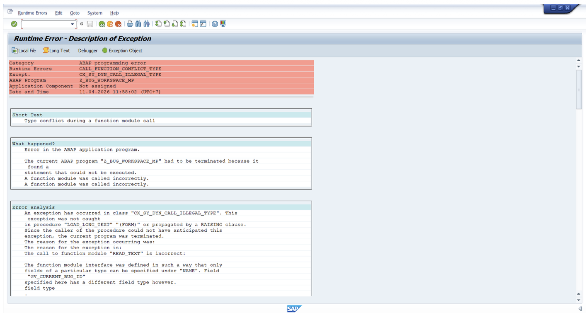

2. Ô nhập Description cần là một box lớn, riêng biệt.

   *Minh họa: màn Create Bug — nội dung mô tả nằm chung khu vực Bug Info thay vì ô/tab Description riêng.*

   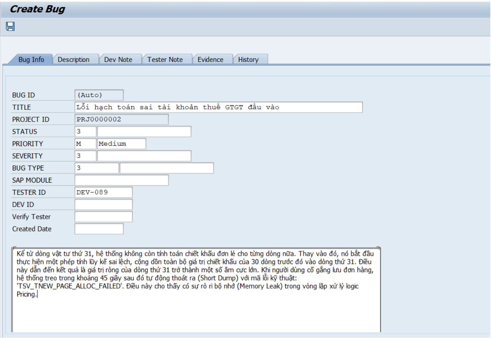

   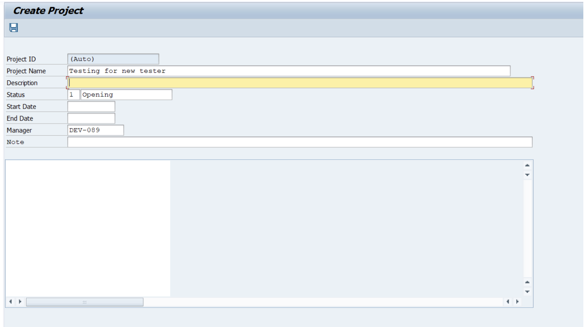

3. Description đang bị giới hạn số lượng ký tự cho phép nhập.

   *Minh họa: form project với đoạn mô tả dài (ZBUG_HOME, đơn hàng lớn…).*

   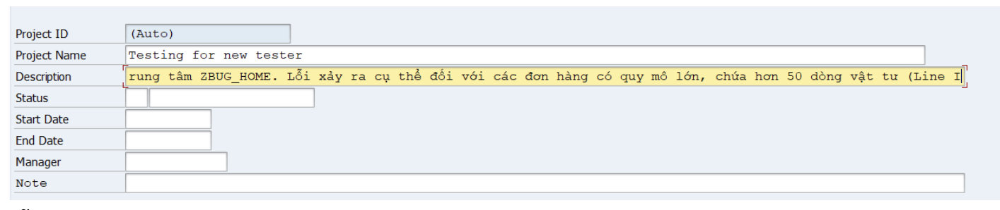

4. Hiển thị chữ bị thiếu ở một số trường.

   *Minh họa: Display Bug BUG0000023 — một số trường trống (SAP Module, Severity, Created Date…).*

   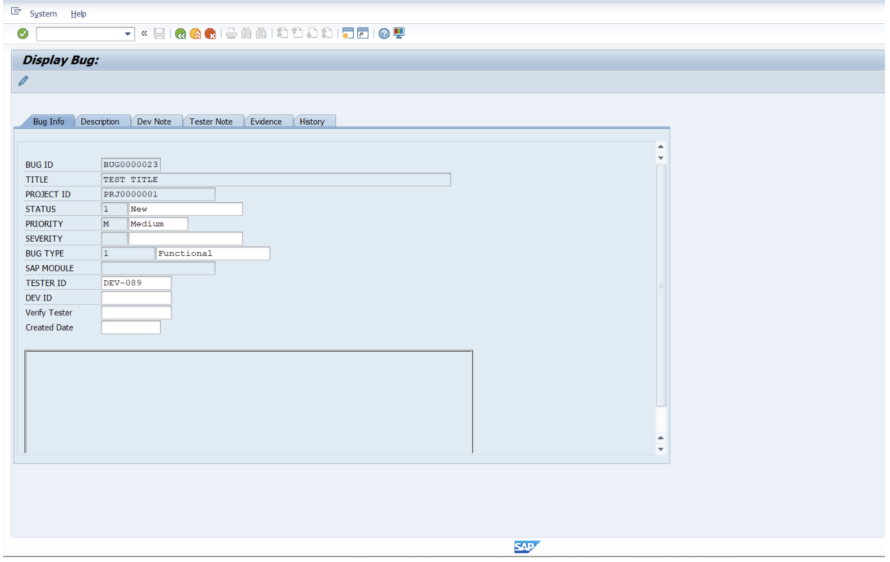

5. Khi không chọn user nào nhưng lại nhấn "Remove User" thì vẫn thực hiện xóa user.

   *Minh họa: luồng Remove user trên Change Project (popup xác nhận xóa DEV-061); popup gán user.*

   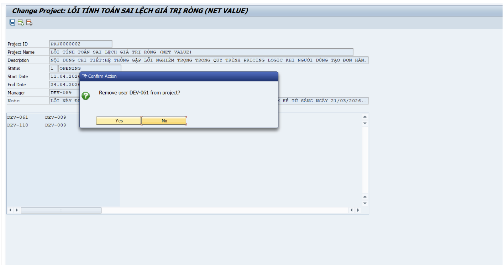

   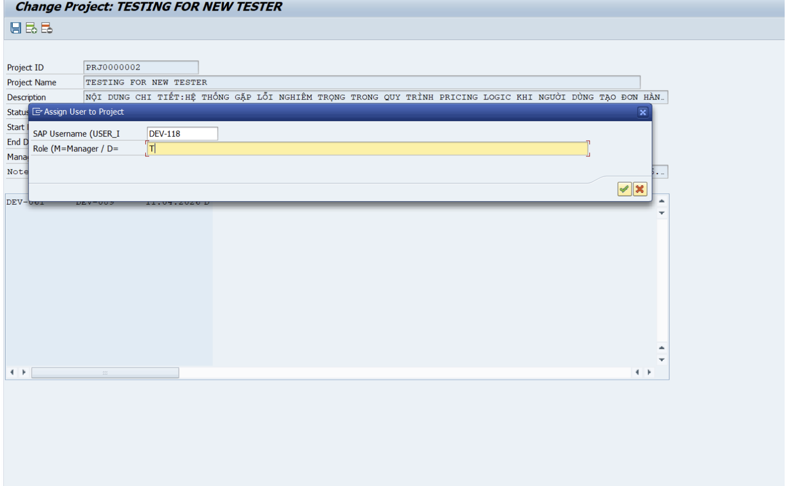

6. Tại màn hình tạo bug:
   - Trường Status luôn phải là 1, người dùng không được phép chọn giá trị khác.
   - SAP Module cần có Search Help.
   - Phải có nút "Upload Evidence 1" ngay tại màn hình tạo bug.
   - Ngày tạo (Create date) tự động sinh, không cho người dùng nhập.

   *Minh họa: Status = 3, SAP Module trống / sau điền MM, Created Date trống, không thấy Upload Evidence trên Bug Info.*

   

   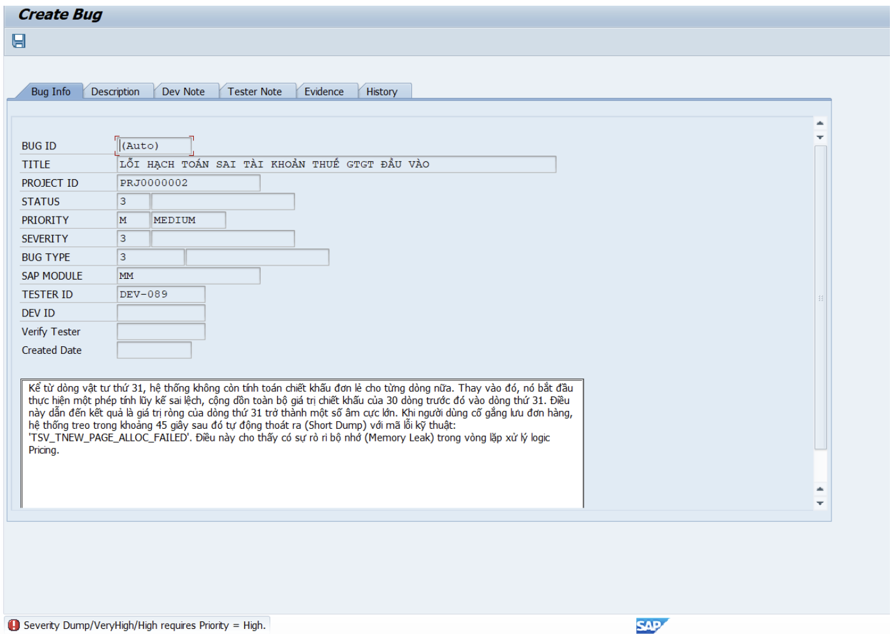

7. Sau khi nhập liệu bị lỗi, các trường nhập liệu đều bị khóa hoàn toàn, người dùng không thể sửa lại.

   *Minh họa: cùng màn Create Bug sau khi có thông báo lỗi ở status bar.*

   

8. Dữ liệu Description biến mất khi vào xem chi tiết bug.

   *Minh họa: Display Bug — vùng text lớn trống; BUG0000024 Bug Info.*

   

   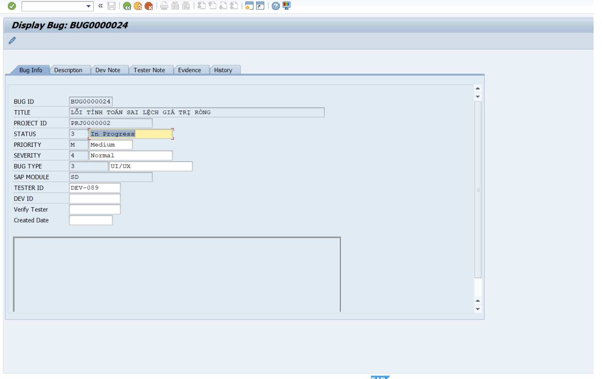

9. Ở màn hình Change Bug:
    - Các nút Description, Dev Note, Tester Note đều bị lỗi short dump.
    - Riêng ở màn hình Create Bug thì nhấn vào các nút này không bị lỗi nhưng cũng không hiện nội dung gì.

   *Minh họa: dump khi tải long text (thời điểm 12:33); Create Bug chỉ có tab, nội dung tab chưa thấy trong ảnh Bug Info.*

   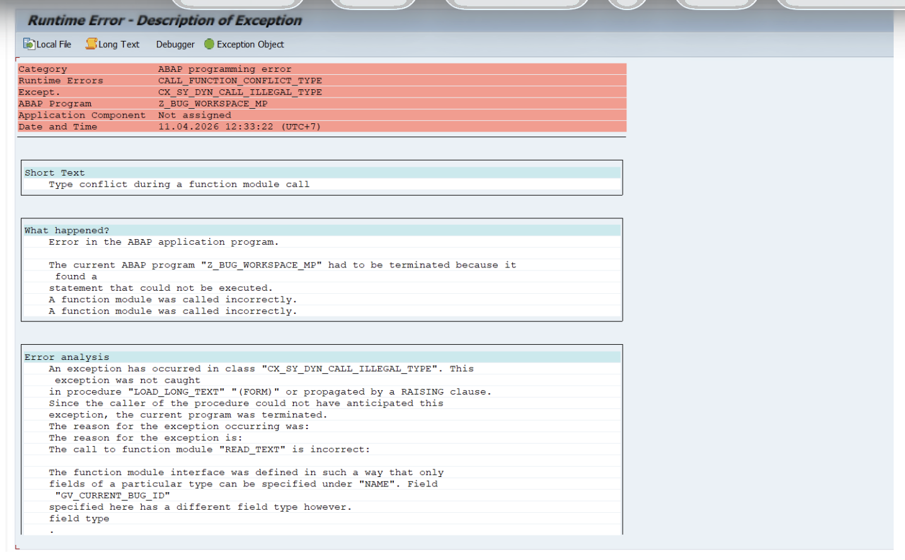

   

10. Có thể chuyển Bug Status từ 3 về 1 mà không có thông báo lỗi.

    *Minh họa: BUG0000024 trước đó In Progress (3), sau lưu thành New (1).*

    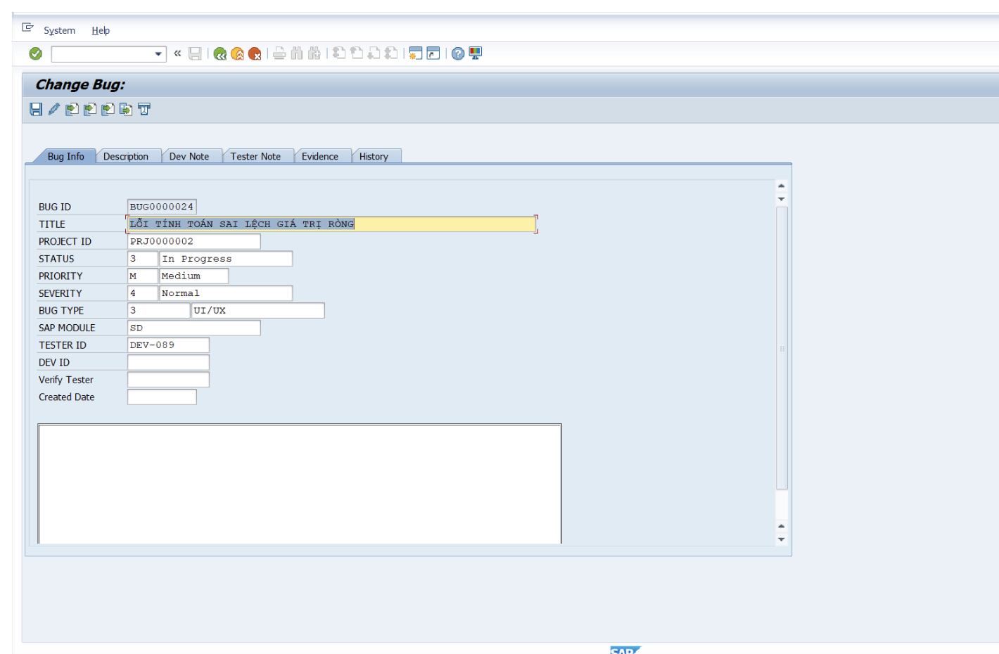

    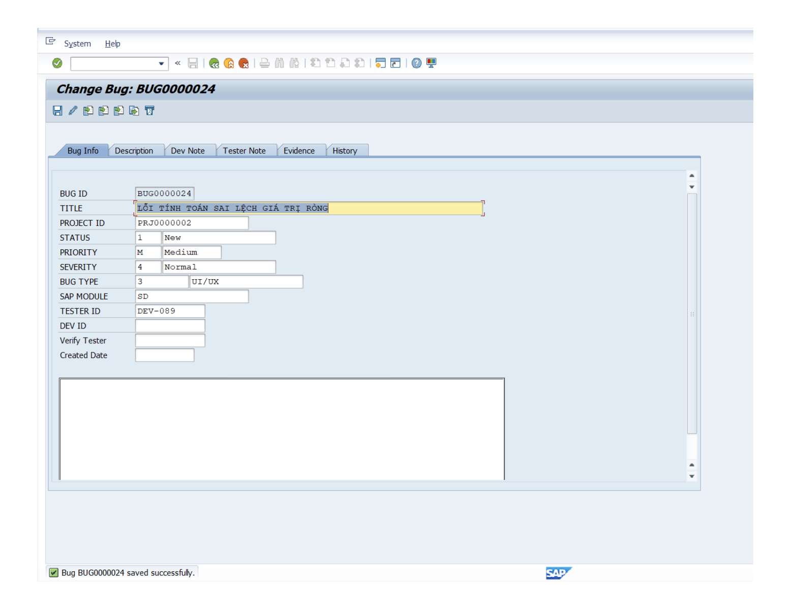

    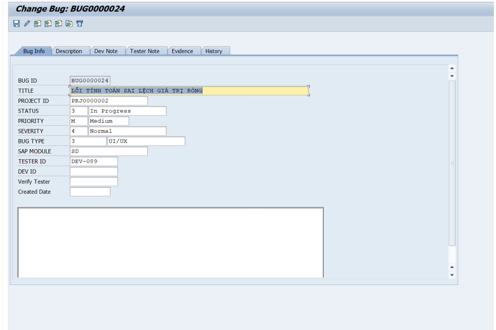

11. Bug có thể chuyển từ trạng thái này sang trạng thái khác mà không cần evidence hoặc cảnh báo lỗi, sai logic.

    *Minh họa: BUG0000024 chuyển sang Fixed (5) và lưu thành công.*

    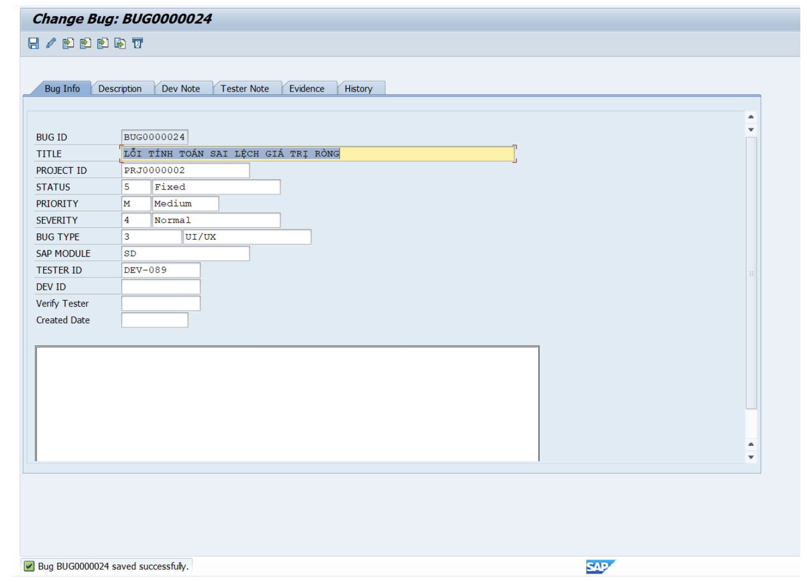
